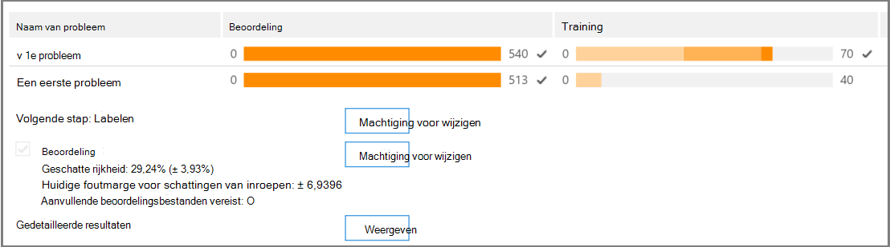
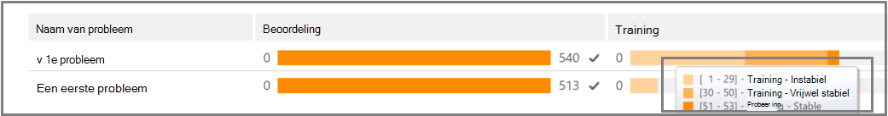
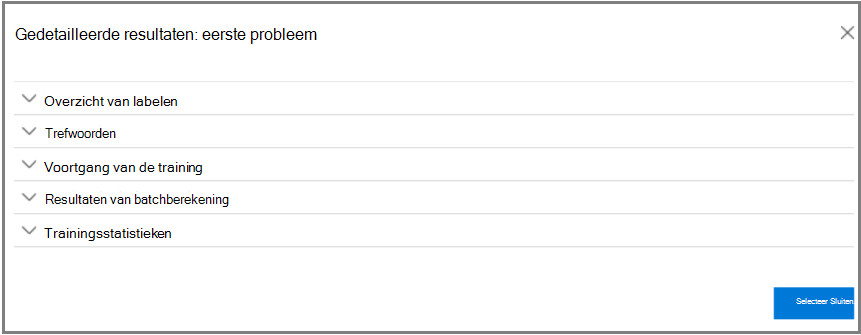
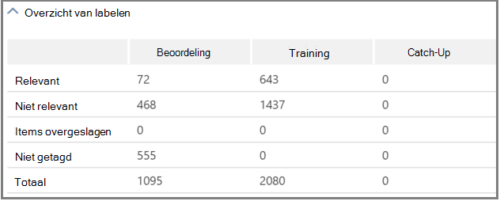
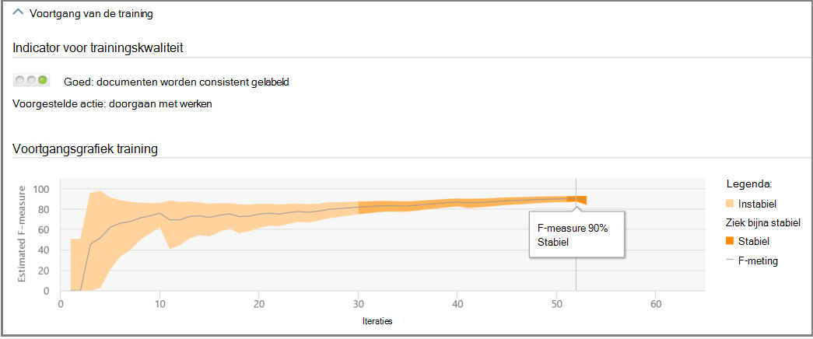
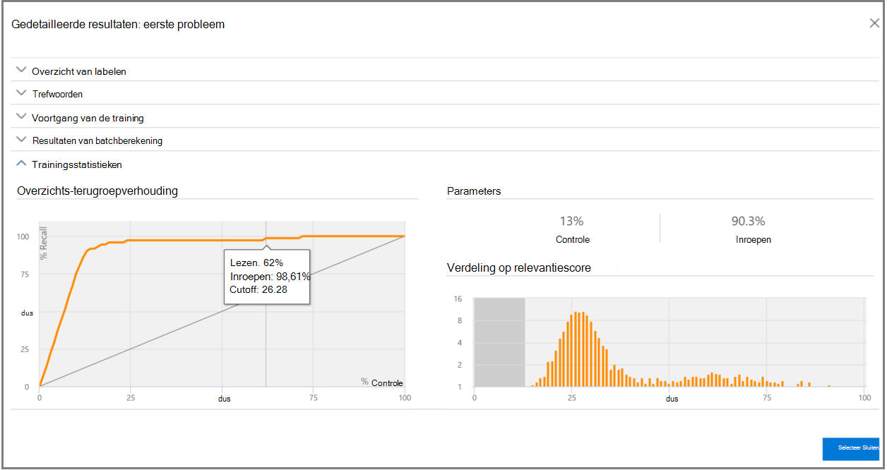

# Relevantieanalyse bijhouden in Advanced eDiscovery
  
Op Advanced eDiscovery tabblad Relevantie bijhouden wordt de berekende geldigheid weergegeven van de relevantietraining die wordt uitgevoerd op het tabblad Tag en wordt de volgende stap aangegeven in het iteratieve trainingsproces in Relevantie. 
  
## Trainingsstatus relevantie bijhouden

1. Bekijk de volgende details in Relevantie bijhouden voor de problemen met de zaak, zoals wordt weergegeven in het volgende voorbeeld van het dialoogvenster **Naam** van probleem hieronder.

   - **Beoordeling:** Deze voortgangsindicator geeft aan in welke mate de relevantietraining die tot nu toe is uitgevoerd, het beoordelingsdoel heeft bereikt in termen van foutmarge. De rijkheid van de resultaten van de relevantietraining wordt ook weergegeven.

   - **Training:** Met deze indicator voor de voortgang met kleurcode en de knoptip worden de stabiliteit van de relevantietrainingsresultaten en een numerieke schaal aangegeven met het aantal relevantietrainingsvoorbeelden dat voor elk probleem is gemarkeerd. De expert houdt de voortgang van het iteratieve trainingsproces relevantie bij. 
  
   - **Batchberekening:** Deze voortgangsindicator bevat informatie over de voltooiing van batchberekening.
  
   - **Volgende stap:** geeft de aanbeveling weer voor de volgende stap die moet worden uitgevoerd. 
  
    In het voorbeeld wordt een voltooide evaluatie voor een probleem weergegeven, aangegeven met de indicator voltooide kleurvergang en het vinkje. Tagging is aan de gang, maar de zaak wordt nog steeds als instabiel beschouwd (stabiliteitsstatus wordt ook weergegeven in een tool-tip). De volgende stapaanbeveling is 'Training'. 
  
    
  
    In de uit uitgebreide weergave worden extra informatie en opties weergegeven. De weergegeven huidige foutmarge is de foutmarge van het inroepen in de huidige beoordelingstoestand, gezien de bestaande (al gelabelde) beoordelingsbestanden.
  
    > [!NOTE]
    >  De evaluatiefase kan worden overgeslagen door het **selectievakje** Beoordeling per probleem uit te wissen en vervolgens voor 'alle problemen'. Hierdoor zijn er echter geen statistieken voor dit probleem. > Het selectievakje **Beoordeling** wissen kan alleen worden uitgevoerd voordat de evaluatie wordt uitgevoerd. Als er meerdere problemen zijn in een zaak, wordt de beoordeling alleen overgeslagen als het selectievakje voor elk probleem is gewist 
  
    Wanneer de beoordeling niet is voltooid met de eerste voorbeeldset bestanden, is beoordeling mogelijk de volgende stap voor het labelen van meer bestanden.
  
    In **Relevantie** bijhouden geven de indicator voor de voortgang van de training en de tool-tip het geschatte aantal extra steekproeven aan dat nodig is om de stabiliteit te \> bereiken. Deze schatting bevat een richtlijn voor de benodigde aanvullende training.
  
    
  
2. Wanneer u klaar bent met labelen en als u de training wilt voortzetten, klikt u op **Training.** Een andere voorbeeldset met bestanden wordt gegenereerd uit de geladen bestandsset voor extra training. Vervolgens keert u terug naar het tabblad Tag om meer bestanden te taggen en te trainen.

### Stabiele trainingsniveaus bereiken

Nadat de beoordelingsbestanden een stabiel trainingsniveau hebben bereikt, is Advanced eDiscovery klaar voor batchberekening.
  
> [!NOTE]
> Meestal is de volgende stap na drie stabiele trainingsvoorbeelden 'Batchberekening'. Er kunnen uitzonderingen zijn, bijvoorbeeld wanneer er wijzigingen zijn aangebracht in het labelen van bestanden uit eerdere steekproeven of wanneer seedbestanden zijn toegevoegd. 
  
### Batchberekening uitvoeren

Batchberekening wordt uitgevoerd als de volgende stap nadat de training is voltooid (wanneer een stabiele trainingsstatus wordt weergegeven door de voortgangsbalk, een vinkje en een stabiele status in de tool-tip.) Batchberekening past de kennis die tijdens de relevantietraining is verkregen toe op de hele bestandspopulatie, om de relevantie van de bestanden te beoordelen en relevantiescores toe te wijzen.
  
Wanneer er meer dan één probleem is, wordt batchberekening per probleem uitgevoerd. Tijdens batchberekening wordt de voortgang bij het verwerken van alle bestanden gecontroleerd. 
  
Hier is de aanbevolen volgende stap 'Geen', wat aangeeft dat er op dit moment geen extra iteratieve relevantietraining nodig is. De volgende fase is het **tabblad \> Relevantie** bepalen. 
  
Als u nieuwe bestanden wilt importeren na batchberekening, kan de beheerder de geïmporteerde bestanden toevoegen aan een nieuwe belasting.
  
> [!NOTE]
> Als u op **Annuleren klikt** tijdens de berekening van batch, wordt in het proces op slaat wat al is uitgevoerd op. Als u batchberekening opnieuw uitwerkt, wordt het proces voortgezet vanaf het laatst uitgevoerde punt. 
  
### Labelconsistentie beoordelen

Als er inconsistenties zijn in het labelen van bestanden, kan dit van invloed zijn op de analyse. De Advanced eDiscovery kan worden gebruikt wanneer de resultaten niet optimaal zijn of als de consistentie in twijfel wordt 2019. Er wordt een lijst met mogelijk inconsistent gelabelde bestanden geretourneerd en deze kunnen zo nodig worden gecontroleerd en opnieuw getagd.
  
> [!NOTE]
> Na zeven of meer trainingsronden na de evaluatie kan de consistentie van labels worden bekeken in **Relevant** \> **Track** \> **Issue** \> **Gedetailleerde resultaten** Trainings \> **voortgang.** Deze beoordeling wordt voor één probleem tegelijk uitgevoerd.
  
1. Vouw **in \> Relevantie bijhouden** de rij van een probleem uit.
  
2. Klik rechts van **Volgende stap** op **Wijzigen.**
  
3. Selecteer **Inconsistenties taggen** als **de optie Volgende stap,** na zeven trainingsvoorbeelden en klik op **OK.**
  
4. Selecteer **Inconsistenties met tags.** Het **tabblad Tag** wordt geopend met een lijst met inconsistenties die zo nodig opnieuw moeten worden weergegeven.
  
5. Klik **op Berekenen** om de wijzigingen in te dienen. De volgende stap na het labelen van inconsistenties is 'Training'. 
  
## Relevantieresultaten weergeven en gebruiken

Vouw op het tabblad **\> Relevantie** bijhouden de rij van een probleem uit en klik naast **Gedetailleerde resultaten** op **Weergave.** De deelvensters Gedetailleerde resultaten worden weergegeven, zoals hieronder wordt weergegeven en beschreven.
  

  
### Overzicht van labelen

 In het onderstaande voorbeeld worden in de samenvatting **Labelen** totalen weergegeven voor elk van de processen voor beoordeling, training en bijvangstbestandslabels.
  

  
### Trefwoorden

Een trefwoord is een unieke tekenreeks, woord, woordgroep of reeks woorden in een bestand dat is geïdentificeerd door Advanced eDiscovery als een significante indicator voor de vraag of een bestand relevant is. Het trefwoord 'Kolommen opnemen' en de gewichten in bestanden die zijn gemarkeerd als Relevant, en de kolommen 'Uitsluiten' bevatten trefwoorden en gewichten in bestanden die zijn gemarkeerd als Niet relevant.
  
Advanced eDiscovery wijst negatieve of positieve trefwoordgewichtswaarden toe. Hoe hoger het gewicht, hoe groter de kans dat een bestand waarin het trefwoord wordt weergegeven, een hogere relevantiescore krijgt toegewezen tijdens de berekening van batch.
  
De Advanced eDiscovery lijst met trefwoorden kan worden gebruikt om een lijst aan te vullen die is gemaakt door een expert of als een indirecte sanity-controle op elk moment in het proces voor bestandscontrole.
  
### Voortgang van de training

Het **deelvenster Trainings voortgang** bevat een grafiek van de trainings voortgang en een kwaliteitsindicator, zoals wordt weergegeven in het onderstaande voorbeeld.
  

  
**Indicator voor trainingskwaliteit:** geeft als volgt de beoordeling van de labelconsistentie weer:
  
- **Goed:** Bestanden worden consistent gelabeld. (Groen licht weergegeven)
  
- **Medium:** Sommige bestanden kunnen inconsistent zijn gelabeld. (Geel licht weergegeven)

- **Waarschuwing:** Veel bestanden kunnen inconsistent zijn gelabeld. (Rood licht weergegeven)

**Trainingsverloopgrafiek:** geeft de mate van relevantietrainingsstabiliteit weer na veel relevantietrainingscyclussen in vergelijking met de F-metingswaarde. Als we van links naar rechts over de grafiek gaan, wordt het betrouwbaarheidsinterval smaller en wordt het gebruikt, samen met de F-meting, door Advanced eDiscovery Relevantie om de stabiliteit te bepalen wanneer de relevantietrainingsresultaten zijn geoptimaliseerd.
  
> [!NOTE]
> Relevantie maakt gebruik van F2, een F-metingsmetrische waarde waarbij Inroepen tweemaal zoveel gewicht krijgt als Precisie. Voor gevallen met een hoge rijkheid (meer dan 25%) wordt gebruikgemaakt van F1 (verhouding 1:1). De verhouding F-meting kan worden geconfigureerd in **De relevantie-instelling** \> **Geavanceerde instellingen.**
  
### Resultaten van batchberekening

Het **deelvenster Resultaten van batchberekening** bevat het aantal bestanden dat is gescored voor Relevantie, als volgt: 
  
- **Succes**
  
- **Leeg:** bevat geen tekst, bijvoorbeeld alleen spaties/tabbladen
  
- **Mislukt:** Vanwege een te grote grootte of omdat deze niet kan worden gelezen
  
- **Genegeerd:** Vanwege de te grote grootte
  
- **Nevelig:** bevat betekenisloze tekst of geen functies die relevant zijn voor het probleem
  
> [!NOTE]
> Leeg, Mislukt, Genegeerd of Nebulous ontvangt een relevantiescore van -1.
  
### Trainingsstatistieken

In **het deelvenster Trainingsstatistieken** worden statistieken en grafieken weergegeven op basis van resultaten Advanced eDiscovery Relevantietraining. 
  

  
In deze weergave ziet u het volgende:
  
- **Beoordelings-terugroepverhouding:** Vergelijking van resultaten op basis van relevantiescores in een hypothetisch lineair overzicht. Inroepen wordt geschat, gezien de grootteset voor revisiesets.
  
- **Parameters:** Cumulatieve berekende statistieken met betrekking tot de revisieset ten opzichte van de bestandspopulatie voor het hele geval.
  
- **Controleren:** Percentage bestanden dat u wilt controleren op basis van deze cutoff.
  
- **Inroepen:** Percentage relevante bestanden in de revisieset. 
  
- **Verdeling op relevantiescore:** Bestanden in de donkergrijse weergave aan de linkerkant staan onder de cutoffscore. Met een knoptip worden de relevantiescore en het gerelateerde percentage bestanden weergegeven in het revisiebestand dat is ingesteld ten opzichte van het totale aantal bestanden.
