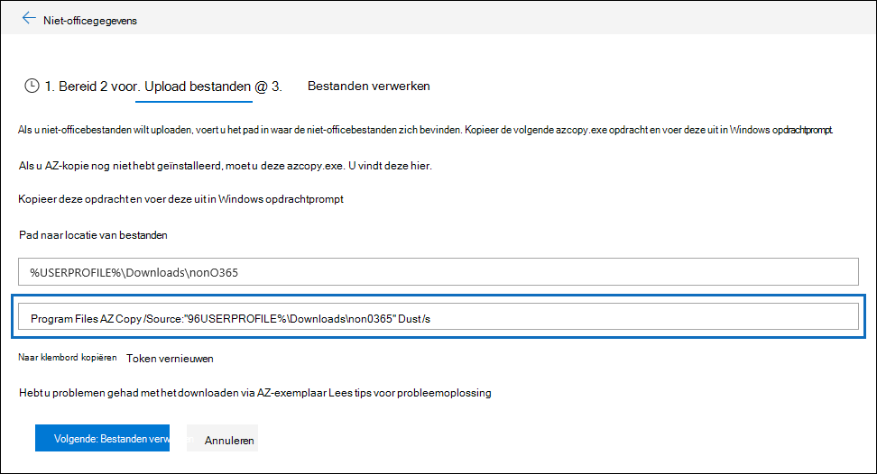

# Problemen met AzCopy oplossen in Advanced eDiscoveryTroubleshoot AzCopy in Advanced eDiscovery

Wanneer u niet-Microsoft 365-gegevens of documenten laadt voor foutsanering in Advanced eDiscovery, levert de gebruikersinterface een Azure AzCopy-opdracht die parameters bevat met de locatie waar de bestanden die u wilt uploaden zijn opgeslagen en de Azure-opslaglocatie waar de bestanden naar worden geüpload.When loading non-Microsoft 365 data or documents for error remediation in Advanced eDiscovery, the user interface supplies an Azure AzCopy command that contains parameters with the location of where the files that you want to upload are stored and the Azure storage location that the files will be uploaded to. Als u uw documenten wilt uploaden, kopieert u deze opdracht en voer u deze uit in een opdrachtprompt op uw lokale computer.To upload your documents, you copy this command and then run it in a Command Prompt on your local computer.  In de volgende schermafbeelding ziet u een voorbeeld van een AzCopy-opdracht:The follow screenshot shows an example of an AzCopy command:

Meestal werkt de opdracht die wordt geleverd wanneer u deze uitwerkt.Usually the command that's provided works when you run it. Er kunnen echter gevallen zijn waarin de weergegeven opdracht niet wordt uitgevoerd.However, there may be cases when the command that's displayed will not run successfully. Hier zijn een paar mogelijke redenen.Here's a few possible reasons.

## De ondersteunde versie van AzCopy is niet geïnstalleerd op de lokale computerThe supported version of AzCopy isn't installed on the local computer

Op dit moment moet u AzCopy v8.1 gebruiken om niet-Microsoft 365 gegevens in Advanced eDiscovery.At this time, you must use AzCopy v8.1 to load non-Microsoft 365 data in Advanced eDiscovery. De opdracht AzCopy die wordt weergegeven op de **pagina Upload** bestanden die in de vorige schermafbeelding wordt weergegeven, geeft een fout als u AzCopy v8.1 niet gebruikt.The AzCopy command that's displayed on the **Upload files** page shown in the previous screenshot returns an error if you're not using AzCopy v8.1. Zie Gegevens overbrengen met [de AzCopy v8.1](/previous-versions/azure/storage/storage-use-azcopy)op Windows .To install this version, see [Transfer data with the AzCopy v8.1 on Windows](/previous-versions/azure/storage/storage-use-azcopy).

## AzCopy is niet geïnstalleerd op de lokale computer of niet op de standaardlocatieAzCopy isn't installed on the local computer or it's not installed in the default location

Als AzCopy niet is geïnstalleerd of is geïnstalleerd op een andere locatie dan de standaardlocatie voor installeren (dat wil zeggen), wordt mogelijk de volgende fout weergegeven wanneer u de `%ProgramFiles(x86)%` opdracht AzCopy uit te voeren:If AzCopy isn't installed or it's installed in a location other than the default install location (which is `%ProgramFiles(x86)%`), you may receive the following error when you run the AzCopy command:

> Het systeem kan het opgegeven pad niet vinden.The system cannot find the path specified.

Als AzCopy niet is geïnstalleerd op de lokale computer, vindt u installatiegegevens in Gegevens overbrengen met [de AzCopy v8.1](/previous-versions/azure/storage/storage-use-azcopy)op Windows.If AzCopy isn't installed on the local computer, you can find installation information in [Transfer data with the AzCopy v8.1 on Windows](/previous-versions/azure/storage/storage-use-azcopy). Installeer deze op de standaardlocatie.Be sure to install it in the default location.

Als AzCopy is geïnstalleerd, maar deze is geïnstalleerd op een andere locatie dan de standaardlocatie, kunt u de opdracht kopiëren, plakken in een tekstbestand en vervolgens het pad wijzigen naar de locatie waar AzCopy is geïnstalleerd.If AzCopy is installed, but it's installed in a location different than the default location, you can copy the command, paste it to a text file, and then change the path to the location where AzCopy is installed. Als Azcopy zich bijvoorbeeld in bevindt, kunt u het eerste deel van de `%ProgramFiles%` opdracht wijzigen in `%ProgramFiles(x86)%\Microsoft SDKs\Azure\AzCopy.exe` `%ProgramFiles%\Microsoft SDKs\Azure\AzCopy` .For example, if Azcopy is located in `%ProgramFiles%`, then you can change the first part of the command from `%ProgramFiles(x86)%\Microsoft SDKs\Azure\AzCopy.exe` to `%ProgramFiles%\Microsoft SDKs\Azure\AzCopy`. Nadat u deze wijziging hebt gemaakt, kopieert u deze uit het tekstbestand en voer u de opdrachtprompt uit.After you make this change, copy it from the text file and then run it a Command Prompt.

> [!TIP]
> Als AzCopy is geïnstalleerd op een andere locatie dan de standaardinstallatielocatie, kunt u overwegen deze te verwijderen en vervolgens opnieuw te installeren op de standaardlocatie.If AzCopy is installed in a location other then the default install location, consider uninstalling it and then re-installing it in the default location. Dit helpt dit probleem in de toekomst te voorkomen.This will help prevent this issue in the future.