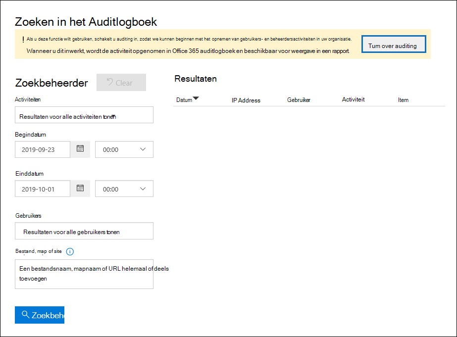

# <a name="turn-audit-log-search-on-or-off"></a><span data-ttu-id="ac026-103">Zoeken in auditlogboeken in- of uitschakelen</span><span class="sxs-lookup"><span data-stu-id="ac026-103">Turn audit log search on or off</span></span>

<span data-ttu-id="ac026-104">Auditregistratie is standaard ingeschakeld voor Microsoft 365 en Office 365 bedrijfsorganisaties.</span><span class="sxs-lookup"><span data-stu-id="ac026-104">Audit logging is turned on by default for Microsoft 365 and Office 365 enterprise organizations.</span></span> <span data-ttu-id="ac026-105">Dit geldt ook voor organisaties met E3/G3- of E5/G5-abonnementen.</span><span class="sxs-lookup"><span data-stu-id="ac026-105">This includes organizations with E3/G3 or E5/G5 subscriptions.</span></span> <span data-ttu-id="ac026-106">Wanneer het zoeken in het auditlogboek in het compliancecentrum is ingeschakeld, worden activiteiten van gebruikers en beheerders van uw organisatie opgenomen in het auditlogboek en bewaard voor 90 dagen en maximaal één jaar, afhankelijk van de licentie die aan gebruikers is toegewezen.</span><span class="sxs-lookup"><span data-stu-id="ac026-106">When audit log search in the compliance center is turned on, user and admin activity from your organization is recorded in the audit log and retained for 90 days, and up to one year depending on the license assigned to users.</span></span> <span data-ttu-id="ac026-107">Het is echter mogelijk dat uw organisatie redenen heeft om geen controlelogboekgegevens op te nemen en te bewaren.</span><span class="sxs-lookup"><span data-stu-id="ac026-107">However, your organization may have reasons for not wanting to record and retain audit log data.</span></span> <span data-ttu-id="ac026-108">In die gevallen kan een globale beheerder besluiten de controle in de Microsoft 365.</span><span class="sxs-lookup"><span data-stu-id="ac026-108">In those cases, a global admin may decide to turn off auditing in Microsoft 365.</span></span>

> [!IMPORTANT]
> <span data-ttu-id="ac026-109">Als u zoeken in auditlogboek in Microsoft 365 uit schakelen, kunt u de Office 365 Management Activity API of Azure Sentinel niet gebruiken om toegang te krijgen tot controlegegevens voor uw organisatie.</span><span class="sxs-lookup"><span data-stu-id="ac026-109">If you turn off audit log search in Microsoft 365, you can't use the Office 365 Management Activity API or Azure Sentinel to access auditing data for your organization.</span></span> <span data-ttu-id="ac026-110">Als u het zoeken naar auditlogboek uit wilt schakelen door de stappen in dit artikel uit te voeren, betekent dit dat er geen resultaten worden geretourneerd wanneer u in het auditlogboek zoekt met behulp van het Beveiligings- & Compliancecentrum of wanneer u de cmdlet **Search-UnifiedAuditLog** in Exchange Online PowerShell gebruikt.</span><span class="sxs-lookup"><span data-stu-id="ac026-110">Turning off audit log search by following the steps in this article means that no results will be returned when you search the audit log using the Security & Compliance Center or when you run the **Search-UnifiedAuditLog** cmdlet in Exchange Online PowerShell.</span></span> <span data-ttu-id="ac026-111">Dit betekent ook dat auditlogboeken niet beschikbaar zijn via de Office 365 Management Activity API of Azure Sentinel.</span><span class="sxs-lookup"><span data-stu-id="ac026-111">This also means that audit logs won't be available through the Office 365 Management Activity API or Azure Sentinel.</span></span>
  
## <a name="before-you-turn-audit-log-search-on-or-off"></a><span data-ttu-id="ac026-112">Voordat u de zoekfunctie voor auditlogboek in- of uitschakelen</span><span class="sxs-lookup"><span data-stu-id="ac026-112">Before you turn audit log search on or off</span></span>

- <span data-ttu-id="ac026-113">U moet de rol Auditlogboeken in Exchange Online toegewezen krijgen om de zoekopdracht in het auditlogboek in of uit te schakelen in uw Microsoft 365 organisatie.</span><span class="sxs-lookup"><span data-stu-id="ac026-113">You have to be assigned the Audit Logs role in Exchange Online to turn audit log search on or off in your Microsoft 365 organization.</span></span> <span data-ttu-id="ac026-114">Deze rol is standaard toegewezen aan de rollengroepen Compliancebeheer  en Organisatiebeheer op de pagina Machtigingen in het Exchange beheercentrum.</span><span class="sxs-lookup"><span data-stu-id="ac026-114">By default, this role is assigned to the Compliance Management and Organization Management role groups on the **Permissions** page in the Exchange admin center.</span></span> <span data-ttu-id="ac026-115">Globale beheerders in Microsoft 365 zijn lid van de rollengroep Organisatiebeheer in Exchange Online.</span><span class="sxs-lookup"><span data-stu-id="ac026-115">Global admins in Microsoft 365 are members of the Organization Management role group in Exchange Online.</span></span> 
    
    > [!NOTE]
    > <span data-ttu-id="ac026-116">Gebruikers moeten machtigingen krijgen toegewezen in Exchange Online om de zoekfunctie voor auditlogboek in of uit te schakelen.</span><span class="sxs-lookup"><span data-stu-id="ac026-116">Users have to be assigned permissions in Exchange Online to turn audit log search on or off.</span></span> <span data-ttu-id="ac026-117">Als u gebruikers de rol Auditlogboeken **toewijst** op de pagina Machtigingen in het Beveiligings- & Compliancecentrum, kunnen ze de zoekfunctie voor auditlogboeken niet in- of uitschakelen.</span><span class="sxs-lookup"><span data-stu-id="ac026-117">If you assign users the Audit Logs role on the **Permissions** page in the Security & Compliance Center, they won't be able to turn audit log search on or off.</span></span> <span data-ttu-id="ac026-118">De onderliggende cmdlet is namelijk een Exchange Online PowerShell-cmdlet.</span><span class="sxs-lookup"><span data-stu-id="ac026-118">This is because the underlying cmdlet is an Exchange Online PowerShell cmdlet.</span></span> 
    
- <span data-ttu-id="ac026-119">Zie Het auditlogboek doorzoeken in het beveiligings- & compliancecentrum voor stapsgewijse instructies over het [doorzoeken van het auditlogboek.](search-the-audit-log-in-security-and-compliance.md)</span><span class="sxs-lookup"><span data-stu-id="ac026-119">For step-by-step instructions on searching the audit log, see [Search the audit log in the Security & Compliance Center](search-the-audit-log-in-security-and-compliance.md).</span></span> <span data-ttu-id="ac026-120">Zie Aan de slag met Microsoft 365 Management [API's](/office/office-365-management-api/get-started-with-office-365-management-apis)voor meer informatie over Microsoft 365 Management Activity API.</span><span class="sxs-lookup"><span data-stu-id="ac026-120">For more information about the Microsoft 365 Management Activity API, see [Get started with Microsoft 365 Management APIs](/office/office-365-management-api/get-started-with-office-365-management-apis).</span></span>

- <span data-ttu-id="ac026-121">Als u wilt controleren of zoeken in het auditlogboek is ingeschakeld, kunt u de volgende opdracht uitvoeren in Exchange Online PowerShell:</span><span class="sxs-lookup"><span data-stu-id="ac026-121">To verify that audit log search is turned on, you can run the following command in Exchange Online PowerShell:</span></span>

    ```powershell
    Get-AdminAuditLogConfig | FL UnifiedAuditLogIngestionEnabled
    ```

    <span data-ttu-id="ac026-122">De waarde van  `True` voor de  _eigenschap UnifiedAuditLogIngestionEnabled_ geeft aan dat de zoekfunctie voor auditlogboek is ingeschakeld.</span><span class="sxs-lookup"><span data-stu-id="ac026-122">The value of  `True` for the  _UnifiedAuditLogIngestionEnabled_ property indicates that audit log search is turned on.</span></span> 
    
## <a name="turn-on-audit-log-search"></a><span data-ttu-id="ac026-123">Zoeken in auditlogboek in- en uit-</span><span class="sxs-lookup"><span data-stu-id="ac026-123">Turn on audit log search</span></span>

<span data-ttu-id="ac026-124">Als zoeken in auditlogboek niet is ingeschakeld voor uw organisatie, kunt u het in het compliancecentrum in- of Exchange Online PowerShell.</span><span class="sxs-lookup"><span data-stu-id="ac026-124">If audit log search is not turned on for your organization, you can turn it on in the compliance center or by using Exchange Online PowerShell.</span></span> <span data-ttu-id="ac026-125">Het kan enkele uren duren voordat u de zoekresultaten in het auditlogboek kunt retourneren.</span><span class="sxs-lookup"><span data-stu-id="ac026-125">It may take several hours after you turn on audit log search before you can return results when you search the audit log.</span></span>
  
### <a name="use-the-compliance-center-to-turn-on-audit-log-search"></a><span data-ttu-id="ac026-126">Het compliancecentrum gebruiken om zoeken in auditlogboek in te zetten</span><span class="sxs-lookup"><span data-stu-id="ac026-126">Use the compliance center to turn on audit log search</span></span>

1. <span data-ttu-id="ac026-127">[Ga naar het compliancecentrum](https://protection.office.com) en meld u aan.</span><span class="sxs-lookup"><span data-stu-id="ac026-127">[Go to the compliance center](https://protection.office.com) and sign in.</span></span>

2. <span data-ttu-id="ac026-128">Ga in het compliancecentrum naar **Search**  >  **Audit log search**.</span><span class="sxs-lookup"><span data-stu-id="ac026-128">In the compliance center, go to **Search** > **Audit log search**.</span></span>

   <span data-ttu-id="ac026-129">Als zoeken in auditlogboek niet is ingeschakeld voor uw organisatie, wordt er een banner weergegeven met de tekst dat auditing moet worden ingeschakeld om gebruikers- en beheerdersactiviteiten op te nemen.</span><span class="sxs-lookup"><span data-stu-id="ac026-129">If audit log search is not turned on for your organization, a banner is displayed saying that auditing has to be turned on to record user and admin activity.</span></span>

3. <span data-ttu-id="ac026-130">Klik **op Controle in- en uit-**</span><span class="sxs-lookup"><span data-stu-id="ac026-130">Click **Turn on auditing**.</span></span>

    
  
    <span data-ttu-id="ac026-132">De banner wordt bijgewerkt om te zeggen dat het auditlogboek wordt voorbereid en dat u binnen een paar uur kunt zoeken naar activiteiten van gebruikers en beheerders.</span><span class="sxs-lookup"><span data-stu-id="ac026-132">The banner is updated to say the audit log is being prepared and that you can search for user and admin activity in a few hours.</span></span>

### <a name="use-powershell-to-turn-on-audit-log-search"></a><span data-ttu-id="ac026-133">PowerShell gebruiken om zoeken in auditlogboek in te zetten</span><span class="sxs-lookup"><span data-stu-id="ac026-133">Use PowerShell to turn on audit log search</span></span>

1. [<span data-ttu-id="ac026-134">Verbinding maken powershell Exchange Online gebruiken</span><span class="sxs-lookup"><span data-stu-id="ac026-134">Connect to Exchange Online PowerShell</span></span>](/powershell/exchange/connect-to-exchange-online-powershell)

2. <span data-ttu-id="ac026-135">Voer de volgende PowerShell-opdracht uit om zoeken in auditlogboek in te Office 365.</span><span class="sxs-lookup"><span data-stu-id="ac026-135">Run the following PowerShell command to turn on audit log search in Office 365.</span></span>

    ```powershell
    Set-AdminAuditLogConfig -UnifiedAuditLogIngestionEnabled $true
    ```

    <span data-ttu-id="ac026-136">Er wordt een bericht weergegeven met de melding dat het tot 60 minuten kan duren voordat de wijziging van kracht wordt.</span><span class="sxs-lookup"><span data-stu-id="ac026-136">A message is displayed saying that it may take up to 60 minutes for the change to take effect.</span></span>
  
## <a name="turn-off-audit-log-search"></a><span data-ttu-id="ac026-137">Zoeken in auditlogboek uitschakelen</span><span class="sxs-lookup"><span data-stu-id="ac026-137">Turn off audit log search</span></span>

<span data-ttu-id="ac026-138">U moet powershell Exchange Online gebruiken om het zoeken naar auditlogboek uit te schakelen.</span><span class="sxs-lookup"><span data-stu-id="ac026-138">You have to use Exchange Online PowerShell to turn off audit log search.</span></span>
  
1. [<span data-ttu-id="ac026-139">Verbinding maken powershell Exchange Online gebruiken</span><span class="sxs-lookup"><span data-stu-id="ac026-139">Connect to Exchange Online PowerShell</span></span>](/powershell/exchange/connect-to-exchange-online-powershell)

2. <span data-ttu-id="ac026-140">Voer de volgende PowerShell-opdracht uit om het zoeken naar auditlogboek uit te schakelen.</span><span class="sxs-lookup"><span data-stu-id="ac026-140">Run the following PowerShell command to turn off audit log search.</span></span>

    ```powershell
    Set-AdminAuditLogConfig -UnifiedAuditLogIngestionEnabled $false
    ```

3. <span data-ttu-id="ac026-141">Controleer na een tijdje of de zoekopdracht in het auditlogboek is uitgeschakeld (uitgeschakeld).</span><span class="sxs-lookup"><span data-stu-id="ac026-141">After a while, verify that audit log search is turned off (disabled).</span></span> <span data-ttu-id="ac026-142">U kunt dit op twee manieren doen:</span><span class="sxs-lookup"><span data-stu-id="ac026-142">There are two ways to do this:</span></span>

    - <span data-ttu-id="ac026-143">Voer Exchange Online PowerShell de volgende opdracht uit:</span><span class="sxs-lookup"><span data-stu-id="ac026-143">In Exchange Online PowerShell, run the following command:</span></span>

      ```powershell
      Get-AdminAuditLogConfig | FL UnifiedAuditLogIngestionEnabled
      ```

      <span data-ttu-id="ac026-144">De waarde van  `False` voor de  _eigenschap UnifiedAuditLogIngestionEnabled_ geeft aan dat zoeken in auditlogboek is uitgeschakeld.</span><span class="sxs-lookup"><span data-stu-id="ac026-144">The value of  `False` for the  _UnifiedAuditLogIngestionEnabled_ property indicates that audit log search is turned off.</span></span> 

    - <span data-ttu-id="ac026-145">Ga in [het compliancecentrum](https://protection.office.com)naar **Search** \> **Audit log search**.</span><span class="sxs-lookup"><span data-stu-id="ac026-145">In the [compliance center](https://protection.office.com), go to **Search** \> **Audit log search**.</span></span>

      <span data-ttu-id="ac026-146">Er wordt een banner weergegeven waarin wordt gezegd dat auditing moet worden ingeschakeld om gebruikers- en beheerdersactiviteit op te nemen.</span><span class="sxs-lookup"><span data-stu-id="ac026-146">A banner is displayed saying that auditing has to be turned on in order to record user and admin activity.</span></span>