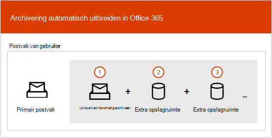
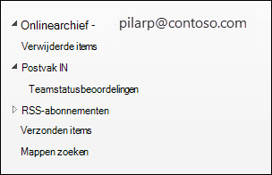
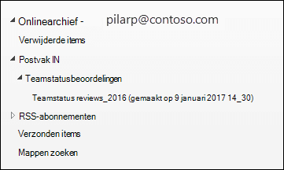

# Overzicht van onbeperkte archivering

In Office 365 archiefpostvakken bieden gebruikers extra opslagruimte voor postvakken. Nadat het archiefpostvak van een gebruiker is ingeschakeld, is er maximaal 100 GB extra opslagruimte beschikbaar. In het verleden, toen het opslagquotum van 100 GB werd bereikt, moesten organisaties contact opnemen met Microsoft om extra opslagruimte voor een archiefpostvak aan te vragen. Dat is niet meer het geval.

De onbeperkte archiveringsfunctie in Microsoft 365 (automatisch uitbreidende *archivering* genoemd) biedt extra opslagruimte in archiefpostvakken. Wanneer het opslagquotum in het archiefpostvak is bereikt, wordt de grootte van het archief automatisch vergroot door Microsoft 365, wat betekent dat gebruikers geen opslagruimte meer nodig hebben en beheerders geen extra opslagruimte voor archiefpostvakken moeten aanvragen.

Zie Onbeperkt archiveren inschakelen voor stapsgewijze instructies voor het inschakelen van automatisch uitbreidende [archivering.](enable-unlimited-archiving.md)

> [!NOTE]
> Het automatisch uitbreiden van archivering ondersteunt ook gedeelde postvakken. Als u het archief voor een gedeeld postvak wilt inschakelen, is een Exchange Online Abonnement 2-licentie of een Exchange Online Abonnement 1-licentie met een Exchange Online Archiving licentie vereist.

## Hoe automatisch archiveren werkt

Zoals eerder uitgelegd, wordt extra opslagruimte voor postvakken gemaakt wanneer het archiefpostvak van een gebruiker is ingeschakeld. Wanneer automatisch archiveren is ingeschakeld, Microsoft 365 regelmatig de grootte van het archiefpostvak gecontroleerd. Wanneer een archiefpostvak dicht bij de opslaglimiet komt, Microsoft 365 automatisch extra opslagruimte voor het archief. Als de gebruiker deze extra opslagruimte niet meer heeft, Microsoft 365 meer opslagruimte toegevoegd aan het archief van de gebruiker. Dit proces gebeurt automatisch, wat betekent dat beheerders geen extra archiefopslag hoeven aan te vragen of het automatisch uitbreiden van archivering hoeven te beheren.

Hier is een kort overzicht van het proces.

1. Archiveren is ingeschakeld voor een gebruikerspostvak of een gedeeld postvak. Er wordt een archiefpostvak met 100 GB opslagruimte gemaakt en het waarschuwingsquotum voor het archiefpostvak is ingesteld op 90 GB.

2. Een beheerder schakelt automatisch archiveren voor het postvak in. Wanneer het archiefpostvak (inclusief de map Herstelbare items) 90 GB bedraagt, wordt het geconverteerd naar een automatisch uitvuwbaar archief en wordt Microsoft 365 opslagruimte toegevoegd aan het archief. Het kan tot 30 dagen duren voordat de extra opslagruimte is ingericht.

   > [!NOTE]
   > Als een postvak in bewaring wordt geplaatst of is toegewezen aan een bewaarbeleid, wordt het opslagquotum voor het archiefpostvak verhoogd tot 110 GB wanneer automatisch archiveren is ingeschakeld. Op dezelfde manier wordt het waarschuwingsquotum voor het archief verhoogd tot 100 GB.

3. Microsoft 365 automatisch meer opslagruimte toevoegt wanneer dat nodig is.

> [!IMPORTANT]
> Automatisch uitbreiden van archief wordt alleen ondersteund voor postvakken die worden gebruikt voor afzonderlijke gebruikers (of gedeelde postvakken) met een groeipercentage dat niet groter is dan 1 GB per dag. Het archiefpostvak van een gebruiker is alleen bedoeld voor die gebruiker. Het is niet toegestaan logboekregels, transportregels of regels voor automatisch doorsturen te gebruiken om berichten naar een archiefpostvak te kopiëren. Microsoft behoudt zich het recht voor om onbeperkt archiveren te weigeren in gevallen waarin het archiefpostvak van een gebruiker wordt gebruikt voor het opslaan van archiefgegevens voor andere gebruikers of in andere gevallen van ongepast gebruik.

## Wat wordt verplaatst naar de extra archiefopslagruimte?

Als u efficiënt gebruik wilt maken van het automatisch uitbreiden van archiefopslag, kunnen mappen worden verplaatst. Microsoft 365 bepaalt welke mappen worden verplaatst wanneer extra opslagruimte aan het archief wordt toegevoegd. Wanneer een map wordt verplaatst, worden er automatisch een of meer submappen gemaakt en worden items uit de oorspronkelijke map naar deze mappen verdeeld om het verplaatsen te vergemakkelijken. Wanneer u het archiefgedeelte van de mappenlijst in Outlook bekijkt, worden deze submappen weergegeven onder de oorspronkelijke map.  De naamgevingsconventie die Microsoft 365 gebruikt om deze submappen een naam te geven, is **\<folder name\> _yyyy (Gemaakt op mmm dd, yyyy h_mm)**, waarbij:

- **yyyy** is het jaar waarin de berichten in de map zijn ontvangen.

- **mmm dd, yyyy h_m** is de datum en tijd die de submap is gemaakt door Office 365, in UTC-indeling, op basis van de tijdzone en de regionale instellingen van de gebruiker in Outlook.

In de volgende schermafbeeldingen wordt een mappenlijst weergegeven voor en nadat berichten zijn verplaatst naar een automatisch uit te vouwen archief.

 **Voordat extra opslagruimte wordt toegevoegd**

 **Nadat extra opslagruimte is toegevoegd**

> [!NOTE]
> Zoals eerder beschreven, Microsoft 365 items verplaatst naar submappen (en noemt u deze met behulp van de naamgevingsconventie die hierboven wordt beschreven) om inhoud te distribueren naar een hulparchief. Maar het verplaatsen van items naar submappen is mogelijk niet altijd het geval. Soms wordt een hele map verplaatst naar een hulparchief. In dit geval blijft de oorspronkelijke naam van de map behouden.  Het is niet duidelijk in de mappenlijst in Outlook dat de map is verplaatst naar een hulparchief.

## Outlook voor het openen van items in een automatisch uitv

Als u berichten wilt openen die zijn opgeslagen in een automatisch uitgebouwd archief, moeten gebruikers een van de volgende Outlook gebruiken:

- Outlook 2016 of Outlook 2019 voor Windows

- Webversie van Outlook

- Outlook 2016 of Outlook 2019 voor Mac

Hier zijn enkele dingen waar u rekening mee moet houden wanneer u Outlook of Outlook op internet gebruikt om toegang te krijgen tot berichten die zijn opgeslagen in een automatisch uitgebouwd archief.

- U hebt toegang tot elke map in uw archiefpostvak, inclusief mappen die zijn verplaatst naar het automatisch uitveerde opslaggebied.

- Zoeken naar automatisch uitv uitgebreid archiveren is beschikbaar in Outlook voor het web (OWA). Net als onlinearchief kunt u zoeken naar items die naar een extra opslaggebied zijn verplaatst. Wanneer archief is geselecteerd als zoekbereik in OWA, worden alle archieven (inclusief automatisch uitvijfde archieven) en de bijbehorende submappen gezocht.

- Automatisch uitvuwde archiefzoekfunctie is beschikbaar in Outlook bureaublad in huidig kanaal (voorbeeld). In dit voorbeeld is het bereik Huidig postvak beschikbaar, zodat u in het automatisch uitveerde archief kunt zoeken. Zie How Outlook for Windows connected to Exchange Online gebruikt Microsoft Search voor meer informatie over deze en andere [ondersteuningsfuncties](https://techcommunity.microsoft.com/t5/outlook-global-customer-service/how-outlook-for-windows-connected-to-exchange-online-utilizes/ba-p/1715045)van Microsoft Search. 

- Het aantal items in Outlook en aantal gelezen/ongelezen items (in Outlook en Outlook op het web) in een automatisch uitgebouwd archief is mogelijk niet juist.

- U kunt items in een submap verwijderen die naar een automatisch uitverdedig opslaggebied wijst, maar de map zelf kan niet worden verwijderd.

- U kunt de functie Verwijderde items herstellen niet gebruiken om een item te herstellen dat is verwijderd uit een automatisch uitgebouwd opslaggebied.

## Archivering en andere compliancefuncties automatisch uitbreiden

In deze sectie wordt uitgelegd wat de functionaliteit is tussen automatisch uitbreidende archivering en andere functies voor compliance en gegevensbeheer.

- **eDiscovery:** Wanneer u een eDiscovery-hulpprogramma gebruikt, zoals Zoeken naar inhoud of In-Place eDiscovery, worden ook de extra opslaggebieden in een automatisch uitvijfd archief doorzocht.

- **Bewaring:** Wanneer u een postvak in bewaring zet met behulp van hulpmiddelen zoals Het in bewaring houden van rechtszaken in Exchange Online of eDiscovery-bewaarbeleid in het beveiligings- en compliancecentrum, wordt inhoud in een automatisch uitvijfd archief ook in bewaring geplaatst.

- **Beheer van berichtenrecords (MRM):** Als u mrm-verwijderingsbeleid gebruikt in Exchange Online om verlopen postvakitems definitief te verwijderen, worden verlopen items in het automatisch uitveerde archief ook verwijderd.

- **Importservice:** U kunt de service Office 365 gebruiken om PST-bestanden te importeren in het automatisch uitveerde archief van een gebruiker. U kunt maximaal 100 GB aan gegevens uit PST-bestanden importeren in het archiefpostvak van de gebruiker.

## Meer informatie

Zie voor meer technische details over het automatisch uitbreiden van archivering Microsoft 365: Veelgestelde vragen over automatisch [uitvijven van archieven.](https://techcommunity.microsoft.com/t5/exchange-team-blog/office-365-auto-expanding-archives-faq/ba-p/607784)
