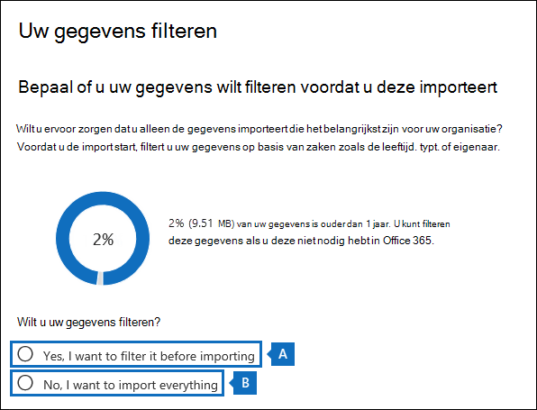

# <a name="use-drive-shipping-to-import-your-organizations-pst-files"></a>Verzendstation gebruiken om de PST-bestanden van uw organisatie te importeren

**Dit artikel is bedoeld voor beheerders. Probeert u PST-bestanden te importeren in uw eigen postvak? Zie [E-mail, contactpersonen en agenda importeren uit een Outlook PST-bestand](https://go.microsoft.com/fwlink/p/?LinkID=785075)**
   
Gebruik de Office 365 Service importeren en verzenden naar bulksgewijs importeren van PST-bestanden in postvakken van gebruikers. Verzenden via station betekent dat u de PST-bestanden kopieert naar een harde schijf en vervolgens de schijf fysiek naar Microsoft verzend. Wanneer Microsoft uw harde schijf ontvangt, kopieert het personeel van het datacenter de gegevens van de harde schijf naar een opslaggebied in de Microsoft-cloud. Vervolgens kunt u de PST-gegevens knippen die in de doelpostvakken worden geïmporteerd door filters in te stellen die bepalen welke gegevens worden geïmporteerd. Nadat u de importklus hebt begonnen, importeert de service De PST-gegevens uit het opslaggebied naar postvakken van gebruikers. Als u schijfzending gebruikt om PST-bestanden te importeren in postvakken van gebruikers, kunt u de e-mail van uw organisatie migreren naar Office 365.
  
Hier volgen de stappen die nodig zijn om schijfzending te gebruiken om PST-bestanden te importeren in Microsoft 365 postvakken:
  
[Stap 1: De veilige opslagsleutel en het hulpprogramma PST-import downloaden](#step-1-download-the-secure-storage-key-and-pst-import-tool)

[Stap 2: De PST-bestanden kopiëren naar de harde schijf](#step-2-copy-the-pst-files-to-the-hard-drive)

[Stap 3: Het toewijzingsbestand voor PST-import maken](#step-3-create-the-pst-import-mapping-file)

[Stap 4: Een PST-import taak maken in Office 365](#step-4-create-a-pst-import-job-in-office-365)

[Stap 5: De harde schijf verzenden naar Microsoft](#step-5-ship-the-hard-drive-to-microsoft)

[Stap 6: filter gegevens en start de PST-importtaak](#step-6-filter-data-and-start-the-pst-import-job)
  
> [!IMPORTANT]
> U moet stap 1 eenmaal uitvoeren om de veilige opslagsleutel en het importhulpmiddel omlaag te laden. Nadat u deze stappen hebt uitvoeren, volgt u stap 2 tot en met stap 6 telkens wanneer u een harde schijf naar Microsoft wilt verzenden. 
  
Zie Veelgestelde vragen over het gebruik van schijfzending voor het importeren van PST-bestanden in Office 365 veelgestelde vragen over het gebruik van schijfzending om [PST-bestanden te importeren.](./faqimporting-pst-files-to-office-365.yml#using-drive-shipping-to-import-pst-files) 
  
## <a name="before-you-import-pst-files"></a>Voordat u PST-bestanden importeert

- U moet de rol Postvak importeren exporteren toegewezen krijgen in Exchange Online om PST-bestanden te kunnen importeren in Microsoft 365-postvakken. Deze rol is standaard niet toegewezen aan een rollengroep in Exchange Online. U kunt de rol Postvak importeren exporteren toevoegen aan de rollengroep Organisatiebeheer. U kunt ook een rollengroep maken, de rol Postvak importeren exporteren daar aan toewijzen, en uzelf als lid toevoegen. Zie de gedeelten Een rol aan een rollengroep toevoegen of Een rollengroep maken in [Rollengroepen beheren](/Exchange/permissions-exo/role-groups) voor meer informatie.
    
    Als u importtaken wilt maken in het Microsoft 365 compliancecentrum, moet een van de volgende gegevens waar zijn:
    
  - De rol van e-mailgeadresseerde moet aan u zijn toegewezen in Exchange Online. Deze rol wordt standaard toegewezen aan de rollengroepen Organisatiebeheer en Recipient Management.
    
    Of
    
  - U moet globale beheerder zijn in uw organisatie.
    
    > [!TIP]
    > U zou een nieuwe rollengroep kunnen maken in Exchange Online die speciaal is bedoeld voor het importeren van PST-bestanden in Office 365. Wijs de rollen Postvak importeren exporteren en E-mailgeadresserde toe aan de nieuwe rollengroep en voeg er vervolgens leden aan toe voor het minimale niveau van machtigingen die zijn vereist voor het importeren van PST-bestanden. 
  
- U moet de PST-bestanden die u wilt kopiëren, opslaan op een harde schijf op een bestandsserver of gedeelde map in uw organisatie. In stap 2 gebruikt u het hulpprogramma Export van Azure Import (WAImportExport.exe) waarmee de PST-bestanden die zijn opgeslagen op deze bestandsserver of gedeelde map naar de harde schijf worden gekopieerd.

- Grote PST-bestanden beïnvloeden mogelijk de prestaties van het PST-importproces. Daarom raden we aan dat elk PST-bestand dat u kopieert naar de harde schijf in stap 2, niet groter mag zijn dan 20 GB.
    
- Alleen 2,5 inch solid-state drives (SSD's) of 2,5-inch of 3,5-inch SATA II/III interne harde schijven worden ondersteund voor gebruik met de Office 365 Import service. U kunt harde schijven gebruiken van maximaal 10 TB. Voor importtaken wordt alleen het eerste gegevensvolume op de harde schijf verwerkt. Het gegevensvolume moet worden geformatteerd met NTFS. Wanneer u gegevens naar een harde schijf kopieert, kunt u deze rechtstreeks aansluiten met een 2,5-inch SSD of 2,5-inch of 3,5-inch SATA II/III-connector of u kunt deze extern koppelen met een externe 2,5-inch SSD of 2,5 inch of 3,5-inch SATA II/III USB-adapter.
    
    > [!IMPORTANT]
    > Externe harde schijven met een ingebouwde USB-adapter worden niet ondersteund door de Office 365-importservice. Bovendien kan de schijf in de behuizing van een externe harde schijf niet worden gebruikt. Verzend geen externe harde schijven. 
  
- De harde schijf waar u de PST-bestanden naar kopieert, moet worden versleuteld met BitLocker. Met WAImportExport.exe hulpprogramma dat u in stap 2 hebt uitgevoerd, kunt u de BitLocker. Het genereert ook een BitLocker-versleutelingssleutel die medewerkers van het Microsoft-datacenter gebruiken om toegang te krijgen tot het station om de PST-bestanden te uploaden naar het Azure Storage in de Microsoft-cloud.
    
- Verzenden via station is beschikbaar via een Microsoft Enterprise Agreement (EA). Verzenden per schijf is niet mogelijk via een Microsoft Products and Services Agreement (MPSA).
    
- De kosten voor het importeren van PST-bestanden in Microsoft 365 postvakken met schijfzending zijn $ 2 USD per GB aan gegevens. Als u bijvoorbeeld een harde schijf verzendt met 1000 GB (1 TB) aan PST-bestanden, dan kost dit 2000 euro. U kunt de importvergoeding met een partner delen. Zie [Een Microsoft-partner of -wederverkoper zoeken](../admin/manage/find-your-partner-or-reseller.md) voor informatie over het vinden van een partner.
    
- U of uw organisatie moet een account hebben bij FedEx of DHL.
    
  - Organisaties in de Verenigde Staten, Brazilië en Europa moeten FedEx-accounts hebben.
    
  - Organisaties in Oost-Azië, Zuidoost-Azië, Japan, Korea en Australië moeten DHL-accounts hebben.
    
    Microsoft gebruikt dit account (en brengt kosten in rekening) om de harde schijf terug te brengen naar u.
    
- De harde schijf die u naar Microsoft verzend, kan internationale grenzen overschrijden. In dit geval bent u verantwoordelijk voor het importeren en/of exporteren van de harde schijf en de gegevens die de harde schijf bevat overeenkomstig de toepasselijke wetgeving. Neem voordat u een harde schijf verzend contact op met uw adviseurs om te controleren of uw schijf en gegevens wettelijk kunnen worden verzonden naar het geïdentificeerde Microsoft-datacenter. Dit helpt ervoor te zorgen dat microsoft op tijd wordt bereikt.
    
- Deze procedure bestaat uit het kopiëren en opslaan van een veilige opslagsleutel en een BitLocker versleutelingssleutel. Zorg ervoor dat u voorzorgsmaatregelen neemt om deze sleutels te beveiligen, zoals wachtwoorden of andere beveiligingsgerelateerde informatie. U kunt ze bijvoorbeeld opslaan in een met een wachtwoord beveiligd Microsoft Word of opslaan op een versleuteld USB-station. Zie de [sectie Meer informatie](#more-information) voor een voorbeeld van deze sleutels. 
    
- Nadat PST-bestanden zijn geïmporteerd in een Microsoft 365 postvak, is de bewaringsinstelling voor het postvak ingeschakeld voor onbepaalde duur. Dit houdt in dat het bewaarbeleid dat is toegepast op het postvak niet wordt verwerkt totdat u de blokkering opheft of een datum opgeeft waarop de blokkering wordt opgeheven. Waarom doen we dit? Als berichten die u importeert in een postvak oud zijn, zouden ze permanent kunnen worden verwijderd als de bewaarperiode, die is geconfigureerd in de instellingen van het bewaarbeleid van het postvak, is verstreken. Door het postvak te blokkeren voor bewaren, heeft de eigenaar de gelegenheid de geïmporteerde berichten te beheren. Daarnaast hebt u de gelegenheid om de instellingen van het bewaarbeleid van het postvak te wijzigen. Zie de [sectie Meer informatie](#more-information) voor suggesties voor het beheren van de bewaring. 
    
- Standaard is de maximale berichtgrootte die kan worden ontvangen door een Microsoft 365-postvak 35 MB. Dat komt omdat de standaardwaarde voor de eigenschap *MaxReceiveSize* voor een postvak is ingesteld op 35 MB. De limiet voor de maximale grootte van het te ontvangen bericht in Microsoft 365 is echter 150 MB. Dus als u een PST-bestand importeert dat een item bevat dat groter is dan 35 MB, wordt door de Office 365-importservice de waarde van de eigenschap *MaxReceiveSize* van het doelpostvak automatisch gewijzigd in 150 MB. Hierdoor kunnen berichten van maximaal 150 MB worden geïmporteerd in postvakken van gebruikers. 
    
    > [!TIP]
    > U kunt deze opdracht uitvoeren in Exchange Online PowerShell om de grootte van het ontvangen bericht van het postvak vast te stellen:  `Get-Mailbox <user mailbox> | FL MaxReceiveSize`. 
  
- U kunt PST-bestanden importeren in een inactief postvak in Office 365. U kunt dit doen door de GUID van het inactieve postvak op te geven in de `Mailbox`-parameter in het toewijzingsbestand van de PST-import. Zie [Stap 3: Het toewijzingsbestand voor PST-import maken](#step-3-create-the-pst-import-mapping-file) voor meer informatie. 
    
- In een hybride Exchange-implementatie kunt u PST-bestanden importeren in een archiefpostvak in de cloud voor een gebruiker waarvan het primaire postvak zich on-premises bevindt. Daarvoor doet u het volgende in het toewijzingsbestand voor de PST-import:
    
  - Geef het e-mailadres op van het on-premises postvak van de gebruiker in de parameter `Mailbox`. 
    
  - Geef de waarde **WAAR** op in de parameter `IsArchive`. 
    
    Zie [Stap 3: Het toewijzingsbestand voor PST-import maken](#step-3-create-the-pst-import-mapping-file) voor meer informatie. 

## <a name="step-1-download-the-secure-storage-key-and-pst-import-tool"></a>Stap 1: De veilige opslagsleutel en het hulpprogramma PST-import downloaden

De eerste stap is het downloaden van de veilige opslagsleutel en het hulpprogramma en dat u in stap 2 gebruikt om PST-bestanden naar de harde schijf te kopiëren.
  
> [!IMPORTANT]
> U moet Azure Import/Export hulpprogramma versie 1 (WAimportExportV1) gebruiken om PST-bestanden te importeren met behulp van de verzendmethode van het station. Versie 2 van het Hulpprogramma Import/Export Azure wordt niet ondersteund en het gebruik ervan resulteert in een onjuiste voorbereiding van de harde schijf voor de importklus. Zorg ervoor dat u het hulpprogramma Azure Import/Export downloaden van het Microsoft 365 compliancecentrum door de procedures in deze stap te volgen. 
  
1. Ga naar <https://compliance.microsoft.com> en meld u aan met de referenties van een beheerdersaccount in uw organisatie.

2. Klik in het linkernavigatiedeelvenster van het Microsoft 365 compliancecentrum op **Informatiebeheer** \> **importeren.**
    
    > [!NOTE]
    > Zoals eerder vermeld, moet u de juiste machtigingen  krijgen voor toegang tot de pagina Importeren in het Microsoft 365 compliancecentrum. 
  
3. Klik op **het tabblad** Importeren op Pictogram toevoegen  **importklus**.
    
4. Typ in de wizard Taak importeren een naam voor de pst-importklus en klik vervolgens op **Volgende**. U kunt kleine letters, getallen, streepjes en onderstrepingstekens gebruiken. U kunt geen hoofdletters of spaties in de naam gebruiken.
    
5. Klik op **de pagina Importeer taaktype** kiezen op Harde schijven verzenden naar een van **onze fysieke locaties** en klik vervolgens op **Volgende.**
    
    
  
6. Doe op de pagina **Gegevens importeren** de volgende twee dingen: 
    
    
  
    a. Klik in stap 2 op **De veilige opslagsleutel tonen.** Nadat de opslagsleutel is weergegeven, klikt u op Kopiëren naar **klembord** en plakt u deze en sla deze op in een bestand, zodat u deze later kunt openen.
    
    b. Download in stap 3 **het hulpprogramma Azure Import/Export om** het hulpprogramma Azure Import/Export (versie 1) te downloaden en te installeren.
    
    - Klik in het pop-upvenster **op** Opslaan opslaan als om het WaImportExportV1.zip op te slaan \>  in een map op uw lokale computer. 
    
    - Haal het WaImportExportV1.zip uit.
    
7. Klik **op Annuleren** om de wizard te sluiten. 
    
    U gaat terug naar de **pagina Importeren** in het Microsoft 365 compliancecentrum wanneer u de importklus maakt in stap 4. 

## <a name="step-2-copy-the-pst-files-to-the-hard-drive"></a>Stap 2: De PST-bestanden kopiëren naar de harde schijf

De volgende stap is het hulpprogramma WAImportExport.exe om PST-bestanden naar de harde schijf te kopiëren. Met dit hulpprogramma versleutelt u de harde schijf met BitLocker, kopieert u de PST's naar de harde schijf en maakt u een logboekbestand met informatie over het kopieerproces. Om deze stap te kunnen voltooien moeten de PST-bestanden zich bevinden in een bestandsshare of op een bestandsserver in uw organisatie. Dit wordt in de volgende procedure de bronmap genoemd. 

 Zoals eerder vermeld, mag elk PST-bestand dat u naar de harde schijf kopieert, niet groter zijn dan 20 GB. PST-bestanden die groter zijn dan 20 GB, beïnvloeden mogelijk de prestaties van het PST-importproces dat u start in stap 6.
  
> [!IMPORTANT]
> Nadat u het hulpprogramma WAImportExport.exe de eerste keer voor een harde schijf hebt uitgevoerd, moet u daarna telkens een andere syntaxis gebruiken. Deze syntaxis wordt uitgelegd in stap 4 van deze procedure om PST-bestanden naar de harde schijf te kopiëren. 
  
1. Open een opdrachtprompt op uw lokale computer.
    
    > [!TIP]
    > Als u de opdrachtprompt als beheerder uitvoert (door 'Uitvoeren als beheerder' te selecteren wanneer u deze opent), worden foutberichten weergegeven in het opdrachtpromptvenster. Dit kan u helpen bij het oplossen van problemen met het WAImportExport.exe hulpprogramma. 
  
2. Ga naar de adreslijst waar u het WAImportExport.exe hebt geïnstalleerd in stap 1.
    
3. Voer de volgende opdracht uit de eerste keer dat u de WAImportExport.exe om PST-bestanden naar een harde schijf te kopiëren.

    ```powershell
    WAImportExport.exe PrepImport /j:<Name of journal file> /t:<Drive letter> /id:<Name of session> /srcdir:<Location of PST files> /dstdir:<PST file path> /sk:<Storage account key> /blobtype:BlockBlob /encrypt /logdir:<Log file location>
    ```

    In de volgende tabel worden de parameters en de vereiste waarden beschreven.
    
    |**Parameter**|**Beschrijving**|**Voorbeeld**|
    |:-----|:-----|:-----|
    | `/j:` <br/> |Hiermee geeft u de naam van het logboekbestand op. Dit bestand wordt opgeslagen in dezelfde map waar het WAImportExport.exe zich bevindt. Elke harde schijf die u naar Microsoft verzend, moet één logboekbestand hebben. Telkens wanneer u de WAImportTool.exe om PST-bestanden naar een harde schijf te kopiëren, worden gegevens toegevoegd aan het logboekbestand voor dat station.  <br/> Medewerkers van het Microsoft-datacenter gebruiken de gegevens in het logboekbestand om de harde schijf te koppelen aan de importklus die u maakt in stap 4 en om de PST-bestanden te uploaden naar het Azure Storage-gebied in de Microsoft-cloud.  <br/> | `/j:PSTHDD1.jrn` <br/> |
    | `/t:` <br/> |Hiermee geeft u de stationletter van de harde schijf op wanneer deze is verbonden met uw lokale computer.  <br/> | `/t:h` <br/> |
    | `/id:` <br/> |Hiermee geeft u de naam van de kopieersessie op. Een sessie wordt gedefinieerd als elke keer dat u het hulpprogramma WAImportExport.exe om bestanden naar de harde schijf te kopiëren. De PST-bestanden worden gekopieerd naar een map met de naam van de sessie die door deze parameter is opgegeven.  <br/> | `/id:driveship1` <br/> |
    | `/srcdir:` <br/> |Hiermee geeft u de bronmap in uw organisatie op die de PST-bestanden bevat die tijdens de sessie worden gekopieerd. De waarde van deze parameter moet tussen dubbele aanhalingstekens (“ ”) staan.  <br/> | `/srcdir:"\\FILESERVER01\PSTs"` <br/> |
    | `/dstdir:` <br/> |Hiermee geeft u de doelmap op in het Azure Storage in de Microsoft-cloud waar de PST's worden geüpload. U moet de waarde  `ingestiondata/` gebruiken. De waarde van deze parameter moet tussen dubbele aanhalingstekens (“ ”) staan.  <br/> Desgewenst kunt u ook een extra bestandspad toevoegen aan de waarde van deze parameter. U kunt bijvoorbeeld het bestandspad van de bronmap op de harde schijf gebruiken (geconverteerd naar een URL-indeling), die is opgegeven in de  `/srcdir:` parameter. Wordt bijvoorbeeld  `\\FILESERVER01\PSTs` gewijzigd in  `FILESERVER01/PSTs` . In dit geval moet u het bestandspad  `ingestiondata` nog steeds opnemen. In dit voorbeeld is de waarde voor de  `/dstdir:` parameter dus  `"ingestiondata/FILESERVER01/PSTs"` .  <br/> Een reden om het extra bestandspad toe te voegen is als u PST-bestanden met dezelfde bestandsnaam hebt.  <br/> > [!NOTE]> Als u de optionele padnaam op vermeldt, bevat de naamruimte voor een PST-bestand nadat het is geüpload naar het Azure Storage-gebied de padnaam en de naam van het PST-bestand; `FILESERVER01/PSTs/annb.pst`bijvoorbeeld. Als u geen padnaam hebt, is de naamruimte alleen de PST-bestandsnaam. bijvoorbeeld  `annb.pst` .           | `/dstdir:"ingestiondata/"` <br/> Of  <br/>  `/dstdir:"ingestiondata/FILESERVER01/PSTs"` <br/> |
    | `/sk:` <br/> |Hiermee geeft u de opslagaccountcode op die u hebt verkregen in stap 1. De waarde van deze parameter moet tussen dubbele aanhalingstekens (“ ”) staan.  <br/> | `"yaNIIs9Uy5g25Yoak+LlSHfqVBGOeNwjqtBEBGqRMoidq6/e5k/VPkjOXdDIXJHxHvNoNoFH5NcVUJXHwu9ZxQ=="` <br/> |
    | `/blobtype:` <br/> |Hiermee geeft u het type blobs in het Azure Storage om de PST-bestanden te importeren. Gebruik de waarde **BlockBlob** voor het importeren van PST-bestanden. Deze parameter is vereist.   <br/> | `/blobtype:BlockBlob` <br/> |
    | `/encrypt` <br/> |Deze schakelknop schakelt de BitLocker voor de harde schijf in. Deze parameter is vereist de eerste keer dat u het WAImportExport.exe uitvoeren.  <br/> De BitLocker-versleutelingssleutel wordt gekopieerd naar het logboekbestand en het logboekbestand dat wordt gemaakt als u de `/logfile:` parameter gebruikt. Zoals eerder is uitgelegd, wordt het logboekbestand opgeslagen in dezelfde map waar WAImportExport.exe bevindt.  <br/> | `/encrypt` <br/> |
    | `/logdir:` <br/> |Met deze optionele parameter wordt een map opgegeven waarin logboekbestanden moeten worden opgeslagen. Als dit niet is opgegeven, worden de logboekbestanden opgeslagen in dezelfde map WAImportExport.exe het hulpprogramma. De waarde van deze parameter moet tussen dubbele aanhalingstekens (“ ”) staan.  <br/> | `/logdir:"c:\users\admin\desktop\PstImportLogs"` <br/> |
   
    Hier volgen een voorbeeld van de syntaxis voor het WAImportExport.exe hulpprogramma met werkelijke waarden voor elke parameter:
    
    ```powershell
    WAImportExport.exe PrepImport /j:PSTHDD1.jrn /t:f /id:driveship1 /srcdir:"\\FILESERVER01\PSTs" /dstdir:"ingestiondata/" /sk:"yaNIIs9Uy5g25Yoak+LlSHfqVBGOeNwjqtBEBGqRMoidq6/e5k/VPkjOXdDIXJHxHvNoNoFH5NcVUJXHwu9ZxQ==" blobtype:BlockBlob /encrypt /logdir:"c:\users\admin\desktop\PstImportLogs"
    ```

    Nadat u de opdracht hebt uitgevoerd, worden statusberichten weergegeven met de voortgang van het kopiëren van de PST-bestanden naar de harde schijf. Een definitief statusbericht toont het totale aantal bestanden dat is gekopieerd.
    
4. Voer deze opdracht elke volgende keer uit als u het hulpprogramma WAImportExport.ext gebruikt om PST-bestanden naar dezelfde harde schijf te kopiëren.

    ```powershell
    WAImportExport.exe PrepImport /j:<Name of journal file> /id:<Name of new session> /srcdir:<Location of PST files> /dstdir:<PST file path> /blobtype:BlockBlob 
    ```

    Hier ziet u een voorbeeld van de syntaxis voor het uitvoeren van volgende sessies om PST-bestanden naar dezelfde harde schijf te kopiëren.

    ```powershell
    WAImportExport.exe PrepImport /j:PSTHDD1.jrn /id:driveship2 /srcdir:"\\FILESERVER01\PSTs\SecondBatch" /dstdir:"ingestiondata/" /blobtype:BlockBlob
    ```

## <a name="step-3-create-the-pst-import-mapping-file"></a>Stap 3: Het toewijzingsbestand voor PST-import maken

Nadat medewerkers van het Microsoft-datacenter de PST-bestanden van de harde schijf naar het Azure Storage-gebied hebben geüpload, gebruikt de importservice de gegevens in het TOEWIJZINGsbestand PST-import, een CSV-bestand (door komma's gescheiden) dat aangeeft in welke postvakken van gebruikers de PST-bestanden worden geïmporteerd. U dient dit CSV-bestand in de volgende stap in wanneer u een PST-importklus maakt.
  
1. [Download een exemplaar van het toewijzingsbestand voor de PST-import](https://go.microsoft.com/fwlink/p/?LinkId=544717).
    
2. Open het CSV-bestand of sla het op uw lokale computer op. Hieronder staat een voorbeeld van een ingevuld toewijzingsbestand voor PST-import, dat is geopend in Kladblok. Het is veel makkelijker om Microsoft Excel te gebruiken om het CSV-bestand te bewerken.

    ```text
    Workload,FilePath,Name,Mailbox,IsArchive,TargetRootFolder,ContentCodePage,SPFileContainer,SPManifestContainer,SPSiteUrl
    Exchange,FILESERVER01/PSTs,annb.pst,annb@contoso.onmicrosoft.com,FALSE,/,,,,
    Exchange,FILESERVER01/PSTs,annb_archive.pst,annb@contoso.onmicrosoft.com,TRUE,/ImportedPst,,,,
    Exchange,FILESERVER01/PSTs,donh.pst,donh@contoso.onmicrosoft.com,FALSE,/,,,,
    Exchange,FILESERVER01/PSTs,donh_archive.pst,donh@contoso.onmicrosoft.com,TRUE,/ImportedPst,,,,
    Exchange,FILESERVER01/PSTs,pilarp.pst,pilarp@contoso.onmicrosoft.com,FALSE,/,,,,
    Exchange,FILESERVER01/PSTs,pilarp_archive.pst,pilarp@contoso.onmicrosoft.com,TRUE,/ImportedPst,,,,
    Exchange,,tonyk.pst,tonyk@contoso.onmicrosoft.com,FALSE,/,,,,
    Exchange,,tonyk_archive.pst,tonyk@contoso.onmicrosoft.com,TRUE,,,,,
    Exchange,,zrinkam.pst,zrinkam@contoso.onmicrosoft.com,FALSE,/,,,,
    Exchange,,zrinkam_archive.pst,zrinkam@contoso.onmicrosoft.com,TRUE,,,,,
    ```

    De eerste rij, ofwel de veldnamenrij, van het CSV-bestand bevat de parameters die worden gebruikt door de PST-importservice voor het importeren van de PST-bestanden in gebruikerspostvakken. De namen van parameters worden gescheiden door een komma. Elke rij onder de veldnamenrij bevat de parameterwaarden voor het importeren van een PST-bestand in een specifiek postvak. U hebt een rij nodig voor elk PST-bestand dat naar de harde schijf is gekopieerd. Zorg ervoor dat u de tijdelijke aanduidingsgegevens in het toewijzingsbestand vervangt door uw werkelijke gegevens.

    > [!NOTE]
    > Verander niets in de veldnamenrij, ook niet de SharePoint-parameters. Deze worden genegeerd tijdens het PST-importproces. 
  
3. U kunt de informatie in de volgende tabel gebruiken om het CSV-bestand te vullen met de benodigde informatie.
    
    |**Parameter**|**Beschrijving**|**Voorbeeld**|
    |:-----|:-----|:-----|
    | `Workload` <br/> |Hiermee geeft u de service op waarin de gegevens worden geïmporteerd. Gebruik `Exchange` om PST-bestanden te importeren in gebruikerspostvakken.  <br/> | `Exchange` <br/> |
    | `FilePath` <br/> | Hiermee geeft u de maplocatie op in Azure Storage gebied waarin PST-bestanden worden gekopieerd wanneer de harde schijf naar Microsoft wordt verzonden.  <br/>  Wat u in deze kolom in het CSV-bestand toevoegt, is afhankelijk van wat u hebt opgegeven voor de  `/dstdir:` parameter in de vorige stap. Als u submappen op de bronlocatie hebt, moet de waarde in de parameter het relatieve pad voor de `FilePath` submap bevatten, bijvoorbeeld /map1/user1/.  <br/>  Als u deze  `/dstdir:"ingestiondata/"` parameter hebt gebruikt, laat u deze parameter leeg in het CSV-bestand.  <br/>  Als u een optionele padnaam hebt opgenomen voor de waarde van de parameter (bijvoorbeeld, gebruikt u die padnaam (niet inclusief  `/dstdir:`  `/dstdir:"ingestiondata/FILESERVER01/PSTs"` 'ingestiondata') voor deze parameter in het CSV-bestand. Deze parameterwaarde is hoofdlettergevoelig.  <br/>  U moet in *geen* geval ‘ingestiondata’ opnemen in de waarde voor de parameter `FilePath`. Laat deze parameter leeg of geef alleen de optionele padnaam op.  <br/> > [!IMPORTANT]> Het geval voor de naam van het bestandspad moet hetzelfde zijn als dat u hebt opgegeven in de  `/dstdir:` parameter in de vorige stap. Als u bijvoorbeeld in de vorige stap voor de naam van de submap hebt gebruikt, maar vervolgens in de parameter in het CSV-bestand wordt gebruikt, mislukt de import voor het  `"ingestiondata/FILESERVER01/PSTs"`  `fileserver01/psts`  `FilePath` PST-bestand. Zorg dat u in beide gevallen dezelfde hoofdletters en kleine letters gebruikt.           |(laat leeg)  <br/> Of  <br/>  `FILESERVER01/PSTs` <br/> |
    | `Name` <br/> |Hiermee geeft u de naam op van het PST-bestand dat u wilt importeren in het gebruikerspostvak. Deze parameterwaarde is hoofdlettergevoelig.  <br/> > [!IMPORTANT]> De naam van het PST-bestand in het CSV-bestand moet hetzelfde zijn als het PST-bestand dat is geüpload naar de Azure Storage locatie in stap 2. Als u bijvoorbeeld in de parameter in het CSV-bestand gebruikt, maar de naam van het werkelijke PST-bestand is, mislukt de import voor dat  `annb.pst`  `Name`  `AnnB.pst` PST-bestand. Zorg dat u in de naam van het PST-bestand in het CVS-bestand dezelfde hoofdletters en kleine letters gebruikt als in de daadwerkelijke naam van het PST-bestand.           | `annb.pst` <br/> |
    | `Mailbox` <br/> |Hiermee geeft u het e-mailadres op van het postvak waarin u het PST-bestand gaat importeren. U kunt geen openbare map opgeven omdat de PST-importservice geen ondersteuning biedt voor het importeren van PST-bestanden in openbare mappen.  <br/> Als u een PST-bestand wilt importeren in een inactief postvak, moet u de postvak-GUID voor deze parameter opgeven. Om deze GUID te verkrijgen voert u de volgende PowerShell-opdracht uit in Exchange Online: `Get-Mailbox <identity of inactive mailbox> -InactiveMailboxOnly | FL Guid` <br/> > [!NOTE]> Soms hebt u mogelijk meerdere postvakken met hetzelfde e-mailadres, waarbij het ene postvak een actief postvak is en het andere postvak in een zacht verwijderde (of inactieve) staat. In die situatie moet u de postvak-GUID opgeven als unieke aanduiding van het postvak waarin u het PST-bestand wilt importeren. Om deze GUID te verkrijgen voor actieve postvakken voert u de volgende PowerShell-opdracht uit: `Get-Mailbox <identity of active mailbox> | FL Guid`. Voer deze opdracht uit als u de GUID wilt verkrijgen voor postvakken met een soft-deleted (of inactieve) postvak:  `Get-Mailbox <identity of soft-deleted or inactive mailbox> -SoftDeletedMailbox | FL Guid` .           | `annb@contoso.onmicrosoft.com` <br/> Of  <br/>  `2d7a87fe-d6a2-40cc-8aff-1ebea80d4ae7` <br/> |
    | `IsArchive` <br/> | Hiermee geeft u op of u het PST-bestand wilt importeren in het archiefpostvak van de gebruiker. Er zijn twee opties:  <br/> **ONWAAR** Hiermee importeert u het PST-bestand naar het primaire postvak van de gebruiker.  <br/> **WAAR** Hiermee importeert u het PST-bestand in het archiefpostvak van de gebruiker. Er wordt vanuit gegaan dat [het archiefpostvak van de gebruiker actief is](enable-archive-mailboxes.md). Als u deze parameter instelt op `TRUE` en het archiefpostvak van de gebruiker is niet actief, dan mislukt de importbewerking voor die gebruiker. Als een importbewerking voor één gebruiker mislukt (omdat zijn of haar archiefpostvak niet actief is en deze eigenschap is ingesteld op `TRUE`), dan hebben de overige gebruikers hiervan geen last.  <br/>  Als u deze parameter leeg laat, wordt het PST-bestand geïmporteerd in het primaire postvak van de gebruiker.  <br/> **Opmerking:** Als u een PST-bestand wilt importeren in een archiefpostvak in de cloud van een gebruiker wiens primaire postvak zich on-premises bevindt, geeft u `TRUE` op voor deze parameter en geeft u het e-mailadres op van het on-premises gebruikerspostvak voor de `Mailbox`-parameter.  <br/> | `FALSE` <br/> Of  <br/>  `TRUE` <br/> |
    | `TargetRootFolder` <br/> | Hiermee geeft u het postvak op waarin het PST-bestand wordt geïmporteerd.  <br/>  Als u deze parameter leeg laat, wordt de PST geïmporteerd in een nieuwe map met de naam Geïmporteerd op het hoofdniveau van het postvak (hetzelfde niveau als de map Postvak IN en de andere standaardpostvakmappen).   <br/>  Als u  `/` opgeeft, worden items in het PST-bestand rechtstreeks geïmporteerd in de map Postvak IN van de gebruiker.  <br/>  Als u  `/<foldername>` opgeeft, worden items in het PST-bestand geïmporteerd in een map met de naam  *\<foldername\>* . Als u bijvoorbeeld `/ImportedPst` gebruikt, worden de items geïmporteerd in een map genaamd **ImportedPst**. Deze map bevindt zich in het postvak van de gebruiker, op hetzelfde niveau als de map Postvak IN.  <br/> |(laat leeg)  <br/> Of  <br/>  `/` <br/> Of  <br/>  `/ImportedPst` <br/> |
    | `ContentCodePage` <br/> |Met deze optionele parameter geeft u een numerieke waarde op voor de codetabel die u wilt gebruiken voor het importeren van PST-bestanden in de ANSI-indeling. Deze parameter kunt u gebruiken voor het importeren van PST-bestanden van Chinese, Japanse of Koreaanse organisaties (CJK), omdat die talen gebruikmaken van DBCS-tekens voor tekencodering. Als u deze parameter niet gebruikt bij het importeren van PST-bestanden die DBCS-tekens gebruiken voor de namen van mappen in postvakken, zijn de namen van de mappen vaak vervormd na het importeren.  <br/> Zie [Codetabel-id’s](/windows/win32/intl/code-page-identifiers) voor een lijst met ondersteunde waarden voor deze parameter.  <br/> > [!NOTE]> Zoals eerder is aangegeven, is dit een optionele parameter en hoeft u deze niet in het CSV-bestand op te nemen. U kunt de parameter ook toevoegen en voor een of meer rijen leeg laten.           |(laat leeg)  <br/> Of  <br/>  `932` (de codetabel-id voor ANSI/OEM Japans)  <br/> |
    | `SPFileContainer` <br/> |Voor de PST-import laat u deze parameter leeg.  <br/> |Niet van toepassing  <br/> |
    | `SPManifestContainer` <br/> |Voor de PST-import laat u deze parameter leeg.  <br/> |Niet van toepassing  <br/> |
    | `SPSiteUrl` <br/> |Voor de PST-import laat u deze parameter leeg.  <br/> |Niet van toepassing  <br/> |

## <a name="step-4-create-a-pst-import-job-in-office-365"></a>Stap 4: Een PST-import taak maken in Office 365

De volgende stap is het maken van de taak PST-import in de importservice in Office 365. Zoals eerder uitgelegd, dient u het toewijzingsbestand PST-import in dat u hebt gemaakt in stap 3. Nadat u de taak hebt gemaakt, gebruikt de service Importeren de gegevens in het toewijzingsbestand om de PST-bestanden te importeren in het opgegeven gebruikerspostvak nadat de PST-bestanden zijn gekopieerd van de harde schijf naar het Azure Storage-gebied en u de importklus maakt en start.
  
1. Ga naar <https://compliance.microsoft.com> en meld u aan met de referenties van een beheerdersaccount in uw organisatie.

2. Klik in het linkernavigatiedeelvenster van het Microsoft 365 compliancecentrum op **Informatiebeheer** \> **importeren.**

3. Klik op **het tabblad** Importeren op Pictogram toevoegen  **importklus**.

    > [!NOTE]
    > Zoals eerder vermeld, moet u de juiste machtigingen  krijgen voor toegang tot de pagina Importeren in het Microsoft 365 compliancecentrum.
  
4. Typ een naam voor de PST-importtaak en klik op **Volgende**. U kunt kleine letters, getallen, streepjes en onderstrepingstekens gebruiken. U kunt geen hoofdletters of spaties in de naam gebruiken.

5. Klik op **de pagina Importeer taaktype** kiezen op Harde schijven verzenden naar een van **onze fysieke locaties** en klik vervolgens op **Volgende.**
  
6. Klik in stap 6 op de selectievakjes Ik heb mijn **harde**  schijven voorbereid en heb toegang tot de benodigde schijfdagboekbestanden en ik heb toegang tot de selectievakjes toewijzingsbestand en klik vervolgens op **Volgende.**

    
  
7. Klik op **de pagina** Selecteer het stationbestand op Stationbestand selecteren en ga naar dezelfde map waar het WAImportExport.exe bevindt. Het logboekbestand dat is gemaakt in stap 2, is naar deze map gekopieerd.

    
  
8. Selecteer het logboekbestand; `PSTHDD1.jrn`bijvoorbeeld.

    > [!TIP]
    > Wanneer u het hulpprogramma WAImportExport.exe in stap 2, is de naam van het logboekbestand opgegeven door de  `/j:` parameter.
  
9. Nadat de naam van het stationbestand wordt  weergegeven onder De bestandsnaam **van station,** klikt u op Valideren om het schijfbestand op fouten te controleren.

    
  
    Het stationbestand moet worden gevalideerd om een PST-importklus te maken. De bestandsnaam groen wordt als de validatie is voltooid. Als de validatie mislukt, klikt u op de koppeling **Logboek weergeven**. Er wordt een validatiefoutrapport geopend, met een foutbericht met informatie over waarom het bestand is mislukt. 

    > [!NOTE]
    > U moet een logboekbestand toevoegen en valideren voor elke harde schijf die u naar Microsoft verzend. 
  
10. Nadat u een logboekbestand hebt toegevoegd en ge valideert voor elke harde schijf die u naar Microsoft verzend, klikt u op **Volgende.**
    
11. Klik  **toewijzingsbestand om** het toewijzingsbestand voor PST-import in te dienen dat u in stap 3 hebt gemaakt. 

    
  
12. Wanneer de naam van het CSV-bestand wordt weergegeven onder **Naam toewijzingsbestand**, klikt u op **Valideren** om het CSV-bestand te controleren op fouten. 

    
  
    Het CSV-bestand moet worden gevalideerd voordat u een PST-importtaak kunt maken. De bestandsnaam groen wordt als de validatie is voltooid. Als de validatie mislukt, klikt u op de koppeling **Logboek weergeven**. Er wordt een validatierapport geopend met een foutmelding voor elke rij in het bestand waarvoor de validatie is mislukt. 

13. Nadat het PST-toewijzingsbestand is gevalideerd, klikt u op **Volgende.**

14. Typ op **de pagina Contactgegevens** verstrekken uw contactgegevens in de betreffende vakken. 

    Het adres voor de Microsoft-locatie waar u uw harde schijven naar verzend, wordt weergegeven. Dit adres wordt automatisch gegenereerd op basis van uw Microsoft-datacenterlocatie. Kopieer dit adres naar een bestand of maak een schermafbeelding.

15. Lees het document Algemene voorwaarden, klik op het selectievakje en klik vervolgens op **Opslaan** om de importklus in te dienen. 

    Wanneer de importklus is gemaakt, wordt er een statuspagina weergegeven waarin de volgende stappen van het verzendproces van het station worden uitgelegd.

16. Klik op **het tabblad** Importeren op Pictogram Vernieuwen vernieuwen om de nieuwe importtaken voor stationverzending weer te   importtaken. De status is ingesteld op **Wachten op trackingnummer.** U kunt ook op de importklus klikken om de flyoutpagina van de status weer te geven, die meer gedetailleerde informatie over de importklus bevat.

## <a name="step-5-ship-the-hard-drive-to-microsoft"></a>Stap 5: De harde schijf verzenden naar Microsoft

De volgende stap is om de harde schijf naar Microsoft te verzenden en vervolgens het volgnummer voor de verzend- en retourzendingsgegevens voor de verzendklus van het station op te geven. Nadat het station is ontvangen door Microsoft, duurt het 7 tot 10 werkdagen voordat het personeel van het datacenter uw PST-bestanden uploadt naar het Azure Storage gebied voor uw organisatie.
  
> [!NOTE]
> Als u niet binnen 14 dagen na het maken van de importklus het volgnummer op geeft en verzendgegevens retourneert, is de importklus verlopen. Als dit gebeurt, moet u een nieuwe importklus voor stationverzending maken (zie Stap [4:](#step-4-create-a-pst-import-job-in-office-365)Een PST-importklus maken in Office 365) en het stationbestand en het toewijzingsbestand voor PST-import opnieuw verzenden.
  
### <a name="ship-the-hard-drive"></a>De harde schijf verzenden

Houd rekening met de volgende dingen wanneer u harde schijven naar Microsoft verzend:
  
- Verzend de SATA-naar-USB-adapter niet; u hoeft alleen de harde schijf te verzenden.

- De harde schijf correct verpakken; gebruik bijvoorbeeld een anti-statische zak of bellente wrap.

- Gebruik een bezorger van uw keuze om de harde schijf naar Microsoft te verzenden.

- Verzend de harde schijf naar het adres voor de Microsoft-locatie die werd weergegeven toen u de importklus maakte in stap 4. Zorg ervoor dat u 'Office 365 Import Service' op het adres van het schip op moet nemen.

- Nadat u de harde schijf hebt geleverd, moet u de naam van de bezorger en het volgnummer opschrijven. U geeft deze in de volgende stap op.
    
### <a name="enter-the-tracking-number-and-other-shipping-information"></a>Voer het volgnummer en andere verzendgegevens in

Nadat u de harde schijf naar Microsoft hebt verzonden, volgt u de volgende procedure op de pagina Service importeren.
  
1. Ga naar <https://compliance.microsoft.com> en meld u aan met de referenties van een beheerdersaccount in uw organisatie.

2. Klik in het linkernavigatiedeelvenster van het Microsoft 365 compliancecentrum op **Informatiebeheer > Importeren.**

3. Klik op **het** tabblad Importeren op de taak voor de schijfzending waar u het volgnummer voor wilt invoeren.

4. Klik op de pagina status flyout op **Volgnummer invoeren.**

5. Geef de volgende verzendgegevens op:

   1. **Bezorger** Typ de naam van de bezorger die u hebt gebruikt om de harde schijf naar Microsoft te verzenden. 

   2. **Nummer bijhouden** Typ het nummer voor het bijhouden van de harde schijf. 

   3. **Nummer van het retourbedrijfsaccount** Typ het accountnummer van uw organisatie voor de provider die wordt vermeld onder **Retourbedrijf.** Microsoft gebruikt dit account (en brengt kosten in rekening) om uw harde schijf weer naar u te verzenden. Organisaties in de Verenigde Staten en Europa moeten een account hebben bij FedEx. Organisaties in Azië en de rest van de wereld moeten een account hebben bij DHL.

6. Klik **op Opslaan** om deze gegevens op te slaan voor de importklus. 

    Klik op **het tabblad** Importeren op Pictogram Vernieuwen vernieuwen om de gegevens voor de importklus voor   stationverzending bij te werken. U ziet dat de status nu is ingesteld op **Stations die onderweg zijn.**

## <a name="step-6-filter-data-and-start-the-pst-import-job"></a>Stap 6: filter gegevens en start de PST-importtaak

Nadat uw harde schijf is ontvangen door Microsoft, wordt de status voor de importklus op de pagina **PST-bestanden** importeren gewijzigd in **Stations ontvangen.** Personeel van het datacenter gebruikt de gegevens in het logboekbestand om uw PST-bestanden te uploaden naar het Azure Storage voor uw organisatie. Op dit moment wordt de status gewijzigd **in In uitvoering importeren.** Zoals eerder vermeld, duurt het tussen 7 en 10 werkdagen nadat u de harde schijf hebt ontvangen om de PST-bestanden te uploaden.
  
Nadat PST-bestanden zijn geüpload naar Azure, wordt de status gewijzigd in **Analysis in progress**. Dit geeft aan dat Microsoft 365 gegevens in de PST-bestanden (op een veilige en veilige manier) analyseert om de leeftijd van de items en de verschillende berichtentypen in de PST-bestanden te identificeren. Wanneer de analyse is voltooid en de gegevens klaar zijn om te importeren, wordt de status voor de importklus gewijzigd in **Analyse voltooid.** Op dit moment hebt u de optie om alle gegevens in de PST-bestanden te importeren of u kunt de geïmporteerde gegevens knippen door filters in te stellen die bepalen welke gegevens worden geïmporteerd.
  
1. Ga naar <https://compliance.microsoft.com> en meld u aan met de referenties van een beheerdersaccount in uw organisatie.

2. Klik in het linkernavigatiedeelvenster van Microsoft 365 compliancecentrum op **Informatiebeheer** \> **Importeren****.

3. Selecteer op **het** tabblad Importeren de importklus die u hebt gemaakt in stap 4 en klik op **Importeren om Office 365.**
  
    Er wordt een flyoutpagina weergegeven met informatie over de PST-bestanden en overige informatie over de importtaak.

4. Klik **op Importeren om Office 365.**

5. De pagina **Gegevens filteren** wordt weergegeven. Deze pagina bevat informatie uit de analyse van de PST-bestanden door Office 365, inclusief informatie over de leeftijd van de gegevens. U hebt nu de optie om te filteren welke gegevens worden geïmporteerd of alle gegevens te importeren. 

    
  
6. Voer een van de volgende handelingen uit:

    a. Als u hoeveelheid gegevens die u importeert wilt beperken, klikt u op **Ja, ik wil een filter gebruiken voor het importeren**.

    Zie [Gegevens filteren bij het importeren van PST-bestanden in Office 365](filter-data-when-importing-pst-files.md) voor gedetailleerde en stapsgewijze instructies voor het filteren van de gegevens in de PST-bestanden en het vervolgens starten van de importtaak.

    Of

    b. Als u alle gegevens in de PST-bestanden wilt importeren, klikt u op **Nee, ik wil alles importeren** en klikt u op **Volgende**.

7. Als u ervoor kiest alle gegevens te importeren, klikt u op **Gegevens importeren** om de importtaak te starten. 

    De status van de importklus wordt weergegeven op de **pagina PST-bestanden** importeren. Klik op  **Vernieuwen** om de statusinformatie bij te werken die wordt weergegeven in de kolom **Status**. Klik op de importtaak om een flyoutpagina weer te geven met de status van elk PST-bestand dat wordt geïmporteerd. Wanneer de import is voltooid en PST-bestanden zijn geïmporteerd in postvakken van gebruikers, wordt de status gewijzigd in **Voltooid.**

## <a name="view-a-list-of-the-pst-files-uploaded-to-microsoft-365"></a>Een lijst weergeven met de PST-bestanden die zijn geüpload naar Microsoft 365

U kunt de Microsoft Azure Storage Explorer (een gratis, open-source tool) installeren en gebruiken om de lijst weer te geven met de PST-bestanden die we hebben geüpload (door medewerkers van het Microsoft-datacenter) naar het Azure Storage-gebied voor uw organisatie. U kunt dit doen om te controleren of PST-bestanden van de harde schijven die u naar Microsoft hebt verzonden, zijn geüpload naar het Azure Storage gebied.
  
> [!IMPORTANT]
> U kunt Azure Storage Explorer niet gebruiken om PST-bestanden te uploaden of wijzigen. De enige ondersteunde methode voor het importeren van PST-bestanden in Microsoft 365 is het gebruik van AzCopy. U kunt ook geen PST-bestanden verwijderen die u hebt geüpload in de Azure-blob. Als u een PST-bestand probeert te verwijderen, krijgt u een foutmelding over het niet hebben van de vereiste machtigingen. Alle PST-bestanden worden automatisch uit uw Azure Storage verwijderd. Als er geen importtaken worden uitgevoerd, worden alle PST-bestanden in de ** ingestiondata ** container 30 dagen na het maken van de meest recente importtaken verwijderd.
  
Voer de volgende stappen uit om de SAS-URL (Shared Access Signature) voor uw organisatie op te halen. Deze URL is een combinatie van de netwerk-URL voor de Azure Storage locatie in de Microsoft-cloud voor uw organisatie en een SAS-toets. Met deze sleutel beschikt u over de benodigde machtigingen voor toegang tot de Azure Storage uw organisatie.

Ga als volgt te werk om de Azure Storage Explorer te installeren en verbinding te maken met uw Azure-opslaglocatie:

1. Ga naar <https://compliance.microsoft.com> en meld u aan met de referenties van een beheerdersaccount in uw organisatie.

2. Klik in het linkerdeelvenster van Microsoft 365 compliancecentrum op **Informatiebeheer > Importeren.**

3. Klik op **het tabblad** Importeren op Pictogram toevoegen  **importklus**.

4. Typ in de wizard Taak importeren een naam voor de pst-importklus en klik vervolgens op **Volgende**. U kunt kleine letters, getallen, streepjes en onderstrepingstekens gebruiken. U kunt geen hoofdletters of spaties in de naam gebruiken.

5. Klik op **de pagina Taaktype** kiezen op **Upload gegevens** en klik vervolgens op **Volgende.**

6. Klik in stap 2 op **SAS-URL voor netwerkupload weergeven**.

7. Nadat de URL is weergegeven, kopieert u deze en sla deze op in een bestand. Kopieer de hele URL.

    > [!IMPORTANT]
    > Neem maatregelen ter bescherming van de SAS-URL. Dit kan door iedereen worden gebruikt om toegang te krijgen tot het Azure-opslaggebied voor uw organisatie.
  
8. Klik **op Annuleren** om de wizard Taak importeren te sluiten.

9. Download en installeer het [hulpprogramma Microsoft Azure Storage Explorer](https://go.microsoft.com/fwlink/p/?LinkId=544842).

10. Start de Microsoft Azure Storage Explorer, klik met de rechtermuisknop **Storage accounts** in het linkerdeelvenster en klik vervolgens op Verbinding maken **om Azure Storage.**

    
  
11. Klik op Een SAS- of verbindingsreeks **(Shared Access Signature) gebruiken** en klik op **Volgende.**

12. Klik **op Een SAS URI gebruiken,** plak de SAS-URL die u in stap 1 hebt verkregen in het vak onder **URI** en klik vervolgens op **Volgende.**

13. Op de **pagina Verbindingsoverzicht** kunt u de verbindingsgegevens bekijken en vervolgens **op** Verbinding maken.

    De container **ingestiondata** wordt geopend. Het bevat de PST-bestanden van uw harde schijf. De **ingestiondatacontainer** bevindt zich **onder Storage Accounts** \> **(SAS-Attached Services)** Blob \> **Containers**.

    
  
14. Als u klaar bent met het gebruik van de Microsoft Azure Storage Explorer klikt u met de rechtermuisknop op **ingestiondata** en vervolgens op **Ontkoppelen** om de verbinding met uw Azure-opslaglocatie te verbreken. Als u dat niet doet, wordt er een foutbericht weergegeven wanneer u de volgende keer probeert de koppeling te maken. 

    

## <a name="troubleshooting-tips"></a>Tips voor probleemoplossing

- **Wat gebeurt er als de importklus mislukt vanwege fouten in het CSV-toewijzingsbestand pst importeren?** Als een importklus mislukt vanwege fouten in het toewijzingsbestand, hoeft u de harde schijf niet opnieuw naar Microsoft te brengen om een importklus te maken. Dat komt omdat de PST-bestanden van de harde schijf die u hebt ingediend voor de importklus voor het station, al zijn geüpload naar het Azure Storage voor uw organisatie. In dit geval hoeft u alleen de fouten in het CSV-toewijzingsbestand van PST Importeren op te lossen en vervolgens een nieuwe importklus 'netwerk uploaden' te maken en het gewijzigde CSV-toewijzingsbestand in te dienen. Zie Stap [5:](use-network-upload-to-import-pst-files.md#step-5-create-a-pst-import-job) Een pst-import taak maken in Microsoft 365 en stap [6:](use-network-upload-to-import-pst-files.md#step-6-filter-data-and-start-the-pst-import-job) Gegevens filteren en de taak PST-import starten in het onderwerp 'Netwerk uploaden gebruiken om PST-bestanden te importeren in Office 365'. 
    
    > [!NOTE]
    > Als u problemen wilt oplossen met het CSV-toewijzingsbestand voor PST-import, gebruikt u het [hulpprogramma Azure Storage Explorer](#view-a-list-of-the-pst-files-uploaded-to-microsoft-365) om de mapstructuur in de **ingestiondatacontainer** weer te geven voor de PST-bestanden vanaf de harde schijf die zijn geüpload naar het Azure-opslaggebied. Toewijzingsbestandsfouten worden meestal veroorzaakt door een onjuiste waarde in de parameter FilePath. Deze parameter geeft de locatie aan van een PST-bestand in het Azure-opslaggebied. Zie de beschrijving van de parameter FilePath in tabel in [stap 3](#step-3-create-the-pst-import-mapping-file). Zoals eerder is uitgelegd, is de locatie van PST-bestanden in het Azure-opslaggebied opgegeven door de parameter toen u het hulpprogramma WAImportExport.exe uitvoeren in stap `/dstdir:` [2.](#step-2-copy-the-pst-files-to-the-hard-drive) 
  
## <a name="more-information"></a>Meer informatie

- Verzenden via schijf is een effectieve manier om grote hoeveelheden archiefberichtengegevens te importeren in Microsoft 365 om te profiteren van de compliancefuncties die beschikbaar zijn voor uw organisatie. Nadat archiefgegevens zijn geïmporteerd in postvakken van gebruikers, kunt u het volgende doen:

  - Schakel [archiefpostvakken in en](enable-archive-mailboxes.md) breid [archivering](enable-unlimited-archiving.md) automatisch uit om gebruikers meer opslagruimte te bieden voor de gegevens. 

  - Plaats postvakken in [De wacht houden voor](./create-a-litigation-hold.md) rechtszaken om de gegevens te bewaren. 

  - Gebruik Microsoft [eDiscovery-hulpprogramma's om](search-for-content.md) de gegevens te doorzoeken. 

  - Pas [Microsoft 365 bewaarbeleid toe](retention.md) om te bepalen hoe lang de gegevens worden bewaard en welke actie moet worden ondernomen nadat de bewaarperiode is verlopen. 

  - Zoek in [het auditlogboek](search-the-audit-log-in-security-and-compliance.md) naar gebeurtenissen met betrekking tot deze gegevens. 

  - Gegevens importeren in [inactieve postvakken om](create-and-manage-inactive-mailboxes.md) gegevens te archiveren voor nalevingsdoeleinden. 

  - Bescherm uw organisatie tegen [gegevensverlies](dlp-learn-about-dlp.md) van gevoelige informatie. 

- Hier volgen een voorbeeld van de veilige opslagaccountsleutel en een BitLocker versleutelingssleutel. Dit voorbeeld bevat ook de syntaxis voor de WAImportExport.exe opdracht die u uitvoeren om PST-bestanden naar een harde schijf te kopiëren. Zorg ervoor dat u voorzorgsmaatregelen neemt om deze te beschermen, net zoals u wachtwoorden of andere beveiligingsgerelateerde informatie zou beveiligen.

    ```text
    Secure storage account key: 

    yaNIIs9Uy5g25Yoak+LlSHfqVBGOeNwjqtBEBGqRMoidq6/e5k/VPkjOXdDIXJHxHvNoNoFH5NcVUJXHwu9ZxQ==

    BitLocker encryption key:

    397386-221353-718905-535249-156728-127017-683716-083391

  COMMAND SYNTAX

  First time:

  WAImportExport.exe PrepImport /j:<Name of journal file> /t:<Drive letter> /id:<Name of session> /srcdir:<Location of PST files> /dstdir:<PST file path> /sk:<Storage account key> /blobtype:BlockBlob /encrypt /logdir:<Log file location>

  Subsequent times:

  WAImportExport.exe PrepImport /j:<Name of journal file> /id:<Name of new session> /srcdir:<Location of PST files> /dstdir:<PST file path> /blobtype:BlockBlob 

  EXAMPLES

  First time:

  WAImportExport.exe PrepImport /j:PSTHDD1.jrn /t:f /id:driveship1 /srcdir:"\\FILESERVER1\PSTs" /dstdir:"ingestiondata/" /sk:"yaNIIs9Uy5g25Yoak+LlSHfqVBGOeNwjqtBEBGqRMoidq6/e5k/VPkjOXdDIXJHxHvNoNoFH5NcVUJXHwu9ZxQ==" /blobtype:BlockBlob /encrypt /logdir:"c:\users\admin\desktop\PstImportLogs"

  Subsequent times:

  WAImportExport.exe PrepImport /j:PSTHDD1.jrn /id:driveship2 /srcdir:"\\FILESERVER1\PSTs\SecondBatch" /dstdir:"ingestiondata/" /blobtype:BlockBlob
    ```

- Zoals hiervoor uitgelegd schakelt de Office 365-importservice de instelling voor het blokkeren voor bewaren in (voor onbepaalde tijd) nadat de PST-bestanden zijn geïmporteerd in een postvak. Dit betekent dat  *de eigenschap RentionHoldEnabled*  is ingesteld op, zodat het bewaarbeleid dat aan het postvak is toegewezen,  `True` niet wordt verwerkt. Dit geeft de eigenaar van het postvak de tijd om de net geïmporteerde berichten te beheren, doordat wordt voorkomen dat oudere berichten worden verwijderd of gearchiveerd op basis van een bewaarbeleid. Hier volgen enkele stappen voor het beheren van het blokkeren voor bewaren: 

  - Na een bepaalde periode kunt u de bewaring uitschakelen door de opdracht uit te  `Set-Mailbox -RetentionHoldEnabled $false` voeren. Zie [Een postvak blokkeren voor bewaren](/exchange/security-and-compliance/messaging-records-management/mailbox-retention-hold) voor instructies.

  - U kunt het blokkeren configureren om het op een toekomstige datum uit te schakelen. U doet dit door de opdracht uit te  `Set-Mailbox -EndDateForRetentionHold <date>` voeren. Stel dat de datum van vandaag 1 juni 2016 is en u de bewaring binnen 30 dagen wilt uitschakelen, voer u de volgende opdracht uit:  `Set-Mailbox -EndDateForRetentionHold 7/1/2016` . In dit scenario laat u de *eigenschap RentionHoldEnabled* ingesteld op *Waar.* Zie [Set-Mailbox](/powershell/module/exchange/set-mailbox) voor meer informatie.

  - U kunt de instellingen wijzigen van het bewaarbeleid dat van toepassing is op het postvak, zodat oudere items die worden geïmporteerd niet direct worden verwijderd of worden verplaatst naar het archiefpostvak van de gebruiker. U kunt bijvoorbeeld de bewaartermijn wijzigen van een beleid voor verwijderen of archiveren dat van toepassing is op het postvak. In dit scenario schakelt u het blokkeren voor bewaren uit voor het postvak nadat u het bewaarbeleid hebt gewijzigd. Zie [Een archief en een verwijderingsbeleid instellen voor postvakken in uw organisatie](set-up-an-archive-and-deletion-policy-for-mailboxes.md) voor meer informatie.
