# Send email notifications and show policy tips for DLP policies (E-mailmeldingen verzenden en beleidstips tonen voor DLP-beleid)Send email notifications and show policy tips for DLP policies

U kunt een DLP-beleid (Data Loss Prevention) gebruiken om gevoelige informatie op verschillende Office 365.You can use a data loss prevention (DLP) policy to identify, monitor, and protect sensitive information across Office 365. U wilt dat personen in uw organisatie die met deze gevoelige informatie werken, voldoen aan uw DLP-beleid, maar u wilt ze niet onnodig blokkeren om hun werk te doen.You want people in your organization who work with this sensitive information to stay compliant with your DLP policies, but you don't want to block them unnecessarily from getting their work done. Hier kunnen e-mailmeldingen en beleidstips u helpen.This is where email notifications and policy tips can help.
  

  
Een beleidstip is een melding of waarschuwing die wordt weergegeven wanneer iemand werkt met inhoud die in strijd is met een DLP-beleid, bijvoorbeeld inhoud zoals een Excel-werkmap op een OneDrive voor Bedrijven-site die persoonsgegevens bevat en die wordt gedeeld met een externe gebruiker.A policy tip is a notification or warning that appears when someone is working with content that conflicts with a DLP policy—for example, content like an Excel workbook on a OneDrive for Business site that contains personally identifiable information (PII) and is shared with an external user.
  
U kunt e-mailmeldingen en beleidstips gebruiken om de bekendheid te vergroten en mensen te informeren over het beleid van uw organisatie.You can use email notifications and policy tips to increase awareness and help educate people about your organization's policies. U kunt personen ook de optie geven om het beleid te overschrijven, zodat ze niet worden geblokkeerd als ze een geldige zakelijke behoefte hebben of als het beleid een onwaar positief detecteert.You can also give people the option to override the policy, so that they're not blocked if they have a valid business need or if the policy is detecting a false positive.
  
Wanneer u in het Beveiligings compliancecentrum een DLP-beleid maakt, kunt u de gebruikersmeldingen &amp; zo configureren dat:In the Security &amp; Compliance Center, when you create a DLP policy, you can configure the user notifications to:
  
- Stuur een e-mailmelding naar de personen die u kiest die het probleem beschrijven.Send an email notification to the people you choose that describes the issue.
    
- Een beleidstip weergeven voor inhoud die in strijd is met het DLP-beleid:Display a policy tip for content that conflicts with the DLP policy:
    
  - Voor e-mail in Outlook op het web en Outlook 2013 en hoger, wordt de beleidstip boven aan een bericht boven de geadresseerden weergegeven terwijl het bericht wordt samengesteld.For email in Outlook on the web and Outlook 2013 and later, the policy tip appears at the top of a message above the recipients while the message is being composed.
    
  - Voor documenten in een OneDrive voor Bedrijven of SharePoint Online-site, wordt de beleidstip aangegeven door een waarschuwingspictogram dat op het item wordt weergegeven.For documents in a OneDrive for Business account or SharePoint Online site, the policy tip is indicated by a warning icon that appears on the item. Als u meer informatie wilt weergeven,  kunt u een item selecteren en vervolgens het pictogram Informatiegegevens kiezen in de rechterbovenhoek van de pagina om het  detailvenster te openen.To view more information, you can select an item and then choose **Information**  in the upper-right corner of the page to open the details pane. 
    
  - Voor Excel-, PowerPoint- en Word-documenten die zijn opgeslagen op een OneDrive voor Bedrijven-site of SharePoint Online-site die is opgenomen in het DLP-beleid, wordt de beleidstip weergegeven op de berichtenbalk en de weergave Backstage **(Bestandsmenu** \> **Info).**For Excel, PowerPoint, and Word documents that are stored on a OneDrive for Business site or SharePoint Online site that's included in the DLP policy, the policy tip appears on the Message Bar and the Backstage view ( **File** menu \> **Info**).
    
## Gebruikersmeldingen toevoegen aan een DLP-beleidAdd user notifications to a DLP policy

Wanneer u een DLP-beleid maakt, kunt u **gebruikersmeldingen inschakelen.**When you create a DLP policy, you can enable **User notifications**. Wanneer gebruikersmeldingen zijn ingeschakeld, Microsoft 365 e-mailmeldingen en beleidstips verzonden.When user notifications are enabled, Microsoft 365 sends out both email notifications and policy tips. U kunt aanpassen naar wie e-mailberichten worden verzonden, de e-mailtekst en de tekst van de beleidstip.You can customize who notification emails are sent to, the email text and the policy tip text.
  
1. Ga naar [https://protection.office.com](https://protection.office.com).Go to [https://protection.office.com](https://protection.office.com).
    
2. Meld u aan met uw werk- of schoolaccount.Sign in using your work or school account. U bent nu in het Beveiligings &amp; compliancecentrum.You're now in the Security &amp; Compliance Center.
    
3. In het linkernavigatienavigatiecentrum van het Beveiligings &amp; compliancecentrum \> wordt het \>  \> **preventiebeleid** \> **voor gegevensverlies + Een beleid maken.**In the Security &amp; Compliance Center \> left navigation \> **Data loss prevention** \> **Policy** \> **+ Create a policy**.
    
    
  
4. Kies de DLP-beleidssjabloon die de typen gevoelige informatie beschermt die u volgende \> **nodig hebt.**Choose the DLP policy template that protects the types of sensitive information that you need \> **Next**.
    
    Als u wilt beginnen met een lege sjabloon, kiest **u Aangepast** \> **aangepast beleid** \> **Volgende.**To start with an empty template, choose **Custom** \> **Custom policy** \> **Next**.
    
5. Noem het beleid \> **Volgende**.Name the policy \> **Next**.
    
6. Als u de locaties wilt kiezen die u wilt beveiligen met het DLP-beleid, gaat u op een van de volgende gebieden te werk:To choose the locations that you want the DLP policy to protect, do one of the following:
    
   - Kies **Alle locaties in Office 365** \> **Volgende**.Choose **All locations in Office 365** \> **Next**.
    
   - Kies **Laat me specifieke locaties kiezen** \> **Volgende.**Choose **Let me choose specific locations** \> **Next**.
    
   Als u een hele locatie wilt opnemen of uitsluiten, zoals alle e-Exchange of alle OneDrive accounts, schakelt u de **status** van die locatie in of uit.To include or exclude an entire location such as all Exchange email or all OneDrive accounts, switch the **Status** of that location on or off. 
    
   Als u alleen specifieke SharePoint of OneDrive accounts wilt opnemen, schakelt u de **status** in en klikt u op de koppelingen onder Opnemen om specifieke sites of accounts te kiezen. To include only specific SharePoint sites or OneDrive accounts, switch the **Status** to on, and then click the links under **Include** to choose specific sites or accounts. 
    
7. Kies **Volgende geavanceerde instellingen** \> **gebruiken.**Choose **Use advanced settings** \> **Next**.
    
8. Kies **+ Nieuwe regel**.Choose **+ New rule**.
    
9. Schakel in de regeleditor onder **Gebruikersmeldingen** de status in.In the rule editor, under **User notifications**, switch the status on.
    
    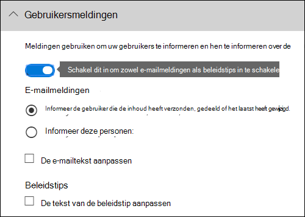

> [!NOTE]
> DLP-beleid is van toepassing op alle documenten die overeenkomen met het beleid, ongeacht of deze documenten nieuw of bestaand zijn.DLP policies apply to all documents that match the policy, whether those documents are new or existing. Een e-mailmelding wordt echter alleen gegenereerd wanneer nieuwe inhoud overeenkomt met een bestaand DLP-beleid.However, an email notification is only generated when new content matches an existing DLP policy. Bestaande inhoud is beveiligd, maar genereert geen gebruikersmelding via e-mail.Existing content is protected, but will not generate a user notification via email.
  
## Opties voor het configureren van e-mailmeldingenOptions for configuring email notifications

Voor elke regel in een DLP-beleid kunt u het volgende doen:For each rule in a DLP policy, you can:
  
- Stuur de melding naar de personen die u kiest.Send the notification to the people you choose. Deze personen kunnen de eigenaar van de inhoud zijn, de persoon die de inhoud het laatst heeft gewijzigd, de eigenaar van de site waar de inhoud is opgeslagen of een specifieke gebruiker.These people can include the owner of the content, the person who last modified the content, the owner of the site where the content is stored, or a specific user.
    
- Pas de tekst aan die in de melding is opgenomen met HTML of tokens.Customize the text that's included in the notification by using HTML or tokens. Zie de onderstaande sectie voor meer informatie.See the section below for more information.
    
> [!NOTE]
>  E-mailmeldingen kunnen alleen worden verzonden naar afzonderlijke geadresseerden, niet naar groepen of distributielijsten.Email notifications can be sent only to individual recipients—not groups or distribution lists. Alleen nieuwe inhoud activeert een e-mailmelding.Only new content will trigger an email notification. Als u bestaande inhoud bewerkt, worden beleidstips in gang gezet, maar geen e-mailmelding.Editing existing content will trigger policy tips, but not an email notification. 
  
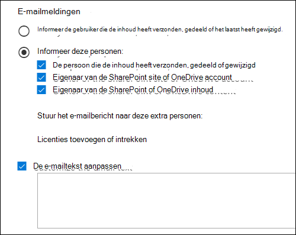
  
### Standaardmelding voor e-mailDefault email notification

Meldingen hebben een onderwerpregel die begint met de actie die is ondernomen, zoals 'Melding', 'Bericht geblokkeerd' voor e-mail of 'Access Blocked' voor documenten.Notifications have a Subject line that begins with the action taken, such as "Notification", "Message Blocked" for email, or "Access Blocked" for documents. Als de melding over een document gaat, bevat de berichtgedeelte van het bericht een koppeling naar de site waar het document is opgeslagen en wordt de beleidstip voor het document geopend, waar u eventuele problemen kunt oplossen (zie de onderstaande sectie over beleidstips).If the notification is about a document, the notification message body includes a link that takes you to the site where the document's stored and opens the policy tip for the document, where you can resolve any issues (see the section below about policy tips). Als de melding over een bericht gaat, bevat de melding als bijlage het bericht dat overeenkomt met een DLP-beleid.If the notification is about a message, the notification includes as an attachment the message that matches a DLP policy.
  
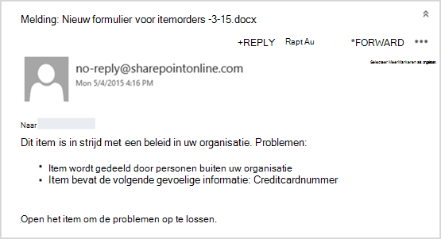
  
In meldingen wordt standaard tekst weergegeven die lijkt op het volgende voor een item op een site.By default, notifications display text similar to the following for an item on a site. De meldingstekst wordt afzonderlijk geconfigureerd voor elke regel, zodat de weergegeven tekst verschilt, afhankelijk van de regel die is afgestemd.The notification text is configured separately for each rule, so the text that's displayed differs depending on which rule is matched.

|**Als de DLP-beleidsregel dit doet...****If the DLP policy rule does this…**|**In de standaardmelding voor SharePoint of OneDrive voor Bedrijven staat dit...****Then the default notification for SharePoint or OneDrive for Business documents says this…**|**In de standaardmelding voor Outlook berichten staat dit...****Then the default notification for Outlook messages says this…**|
|:-----|:-----|:-----|
|Hiermee verzendt u een melding, maar is overschrijven niet toegestaanSends a notification but doesn't allow override    |Dit item is in strijd met een beleid in uw organisatie.This item conflicts with a policy in your organization.    |Uw e-mailbericht is in strijd met een beleid in uw organisatie.Your email message conflicts with a policy in your organization.    |
|Blokkeert toegang, verzendt een melding en staat overschrijven toeBlocks access, sends a notification, and allows override    |Dit item is in strijd met een beleid in uw organisatie.This item conflicts with a policy in your organization. Als u dit conflict niet op kunt lossen, is de toegang tot dit bestand mogelijk geblokkeerd.If you don't resolve this conflict, access to this file might be blocked.    |Uw e-mailbericht is in strijd met een beleid in uw organisatie.Your email message conflicts with a policy in your organization. Het bericht is niet bij alle geadresseerden bezorgd.The message wasn't delivered to all recipients.    |
|Blokkeert toegang en verzendt een meldingBlocks access and sends a notification    |Dit item is in strijd met een beleid in uw organisatie.This item conflicts with a policy in your organization. Toegang tot dit item is geblokkeerd voor iedereen, behalve de eigenaar, de laatste modifier en de beheerder van de primaire siteverzameling.Access to this item is blocked for everyone except its owner, last modifier, and the primary site collection administrator.    |Uw e-mailbericht is in strijd met een beleid in uw organisatie.Your email message conflicts with a policy in your organization. Het bericht is niet bij alle geadresseerden bezorgd.The message wasn't delivered to all recipients.    |
   
### Aangepaste e-mailmeldingCustom email notification

U kunt een aangepaste e-mailmelding maken in plaats van de standaardmelding naar uw eindgebruikers of beheerders te verzenden.You can create a custom email notification instead of sending the default email notification to your end users or admins. De aangepaste e-mailmelding ondersteunt HTML en heeft een limiet van 5.000 tekens.The custom email notification supports HTML and has a 5,000-character limit. U kunt HTML gebruiken om afbeeldingen, opmaak en andere huisstijl op te nemen in de melding.You can use HTML to include images, formatting, and other branding in the notification.
  
U kunt ook de volgende tokens gebruiken om de e-mailmelding aan te passen.You can also use the following tokens to help customize the email notification. Deze tokens zijn variabelen die worden vervangen door specifieke informatie in de melding die wordt verzonden.These tokens are variables that are replaced by specific information in the notification that's sent.

|**Token****Token**|**Beschrijving****Description**|
|:-----|:-----|
|%%AppliedActions%%%%AppliedActions%%    |De acties die zijn toegepast op de inhoud.The actions applied to the content.    |
|%%ContentURL%%%%ContentURL%%    |De URL van het document op de SharePoint onlinesite of OneDrive voor Bedrijven site.The URL of the document on the SharePoint Online site or OneDrive for Business site.    |
|%%MatchedConditions%%%%MatchedConditions%%    |De voorwaarden die zijn afgestemd op de inhoud.The conditions that were matched by the content. Gebruik dit token om personen te informeren over mogelijke problemen met de inhoud.Use this token to inform people of possible issues with the content.    |
   

  
## Opties voor het configureren van beleidstipsOptions for configuring policy tips

Voor elke regel in een DLP-beleid kunt u beleidstips configureren voor:For each rule in a DLP policy, you can configure policy tips to:
  
- Laat de persoon weten dat de inhoud strijdig is met een DLP-beleid, zodat deze actie kan ondernemen om het conflict op te lossen.Simply notify the person that the content conflicts with a DLP policy, so that they can take action to resolve the conflict. U kunt de standaardtekst gebruiken (zie de onderstaande tabellen) of aangepaste tekst invoeren over het specifieke beleid van uw organisatie.You can use the default text (see the tables below) or enter custom text about your organization's specific policies.
    
- Sta de persoon toe het DLP-beleid te overschrijven.Allow the person to override the DLP policy. Desgewenst kunt u het volgende doen:Optionally, you can:
    
  - De persoon verplicht een zakelijke rechtvaardiging in te voeren voor het overschrijven van het beleid.Require the person to enter a business justification for overriding the policy. Deze informatie wordt vastgelegd en u kunt deze weergeven in de DLP-rapporten in **de sectie Rapporten** van het Beveiligings &amp; compliancecentrum.This information is logged and you can view it in the DLP reports in the **Reports** section of the Security &amp; Compliance Center. 
    
  - Sta de persoon toe een fout-positief te melden en het DLP-beleid te overschrijven.Allow the person to report a false positive and override the DLP policy. Deze informatie wordt ook geregistreerd voor rapportage, zodat u false positives kunt gebruiken om uw regels aan te passen.This information is also logged for reporting, so that you can use false positives to fine tune your rules.
    
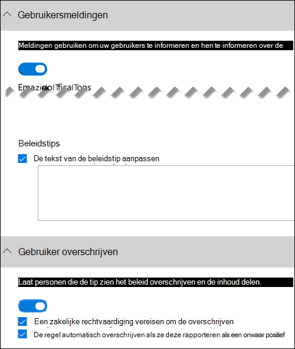
  
U hebt bijvoorbeeld een DLP-beleid toegepast op OneDrive voor Bedrijven sites die persoonsgegevens (PII) detecteren en dit beleid heeft drie regels:For example, you may have a DLP policy applied to OneDrive for Business sites that detects personally identifiable information (PII), and this policy has three rules:
  
1. Eerste regel: Als er minder dan vijf exemplaren van deze gevoelige informatie worden gedetecteerd in een  document en het document wordt gedeeld met personen binnen de organisatie, wordt met de actie Een melding verzenden een beleidstip weergegeven.First rule: If fewer than five instances of this sensitive information are detected in a document, and the document is shared with people inside the organization, the **Send a notification** action displays a policy tip. Voor beleidstips zijn geen opties voor overschrijven nodig, omdat deze regel alleen personen op de hoogte stelt en de toegang niet blokkeert.For policy tips, no override options are necessary because this rule is simply notifying people and not blocking access. 
    
2. Tweede regel: Als er meer dan vijf exemplaren van deze gevoelige informatie worden gedetecteerd in  een document en het document wordt gedeeld met  personen binnen de organisatie, worden met de actie Toegang tot inhoud blokkeren de machtigingen voor het bestand beperkt en kunnen personen met de actie Een melding verzenden de acties in deze regel overschrijven door een zakelijke rechtvaardiging te geven.Second rule: If greater than five instances of this sensitive information are detected in a document, and the document is shared with people inside the organization, the **Block access to content** action restricts the permissions for the file, and the **Send a notification** action allows people to override the actions in this rule by providing a business justification. Het bedrijf van uw organisatie vereist soms interne personen om PII-gegevens te delen en u wilt niet dat uw DLP-beleid dit werk blokkeert.Your organization's business sometimes requires internal people to share PII data, and you don't want your DLP policy to block this work. 
    
3. Derde regel: Als er meer dan vijf exemplaren van deze gevoelige informatie worden gedetecteerd in  een document en het document wordt gedeeld met  personen buiten de organisatie, worden met de actie Toegang tot inhoud blokkeren de machtigingen voor het bestand beperkt en kunnen personen met de actie Een melding verzenden de acties in deze regel niet overschrijven omdat de gegevens extern worden gedeeld.Third rule: If greater than five instances of this sensitive information are detected in a document, and the document is shared with people outside the organization, the **Block access to content** action restricts the permissions for the file, and the **Send a notification** action does not allow people to override the actions in this rule because the information is shared externally. In geen geval mogen personen in uw organisatie PII-gegevens delen buiten de organisatie.Under no circumstances should people in your organization be allowed to share PII data outside the organization. 
    
Hier zijn enkele goede punten om te begrijpen over het gebruik van een beleidstip om een regel te overschrijven:Here are some fine points to understand about using a policy tip to override a rule:
  
- De optie om te overschrijven is per regel en overschrijven alle acties in de regel (behalve het verzenden van een melding, die niet kan worden overgenomen).The option to override is per rule, and it overrides all of the actions in the rule (except sending a notification, which can't be overridden).
    
- Het is mogelijk dat inhoud aan verschillende regels in een DLP-beleid kan voldoen, maar alleen de beleidstip van de meest beperkende regel met de hoogste prioriteit wordt weergegeven.It's possible for content to match several rules in a DLP policy, but only the policy tip from the most restrictive, highest-priority rule will be shown. Een beleidstip van een regel die toegang tot inhoud blokkeert, wordt bijvoorbeeld weergegeven via een beleidstip van een regel die alleen een melding verzendt.For example, a policy tip from a rule that blocks access to content will be shown over a policy tip from a rule that simply sends a notification. Dit voorkomt dat personen een trapsgepunt met beleidstips zien.This prevents people from seeing a cascade of policy tips.
    
- Als de beleidstips in de meest beperkende regel toestaan dat personen de regel overschrijven, worden ook andere regels overgenomen die overeenkomen met de inhoud door deze regel te vervangen.If the policy tips in the most restrictive rule allow people to override the rule, then overriding this rule also overrides any other rules that the content matched.
    
## Beleidstips voor OneDrive voor Bedrijven sites en SharePoint onlinesitesPolicy tips on OneDrive for Business sites and SharePoint Online sites

Wanneer een document op een OneDrive voor Bedrijven- of SharePoint Online-site overeenkomt met een regel in een DLP-beleid en in die regel beleidstips worden gebruikt, worden in de beleidstips speciale pictogrammen weergegeven in het document:When a document on a OneDrive for Business site or SharePoint Online site matches a rule in a DLP policy, and that rule uses policy tips, the policy tips display special icons on the document:
  
1. Als met de regel een melding over het bestand wordt weergegeven, wordt het waarschuwingspictogram weergegeven.If the rule sends a notification about the file, the warning icon appears.
    
2. Als de regel de toegang tot het document blokkeert, wordt het geblokkeerde pictogram weergegeven.If the rule blocks access to the document, the blocked icon appears.
    
   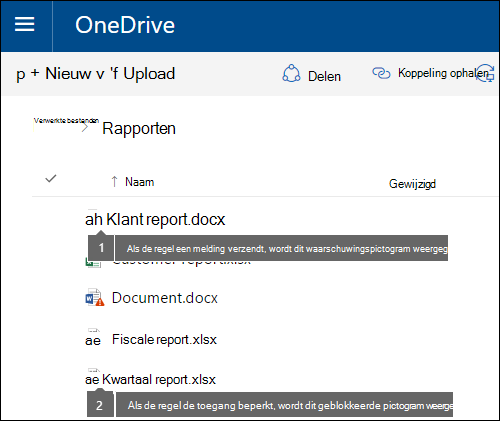
  
Als u actie wilt ondernemen voor een document, kunt u een item selecteren met het pictogram Informatiegegevens in de rechterbovenhoek van de pagina om het \>   detailvenster \> **Beleidstip weergeven te openen.**To take action on a document, you can select an item \> choose **Information**  in the upper-right corner of the page to open the details pane \> **View policy tip**.
  
De beleidstip bevat de problemen met de inhoud en als de beleidstips met  deze opties zijn geconfigureerd, kunt u Oplossen kiezen **en** vervolgens de beleidstip of Fout-positief rapporteren overschrijven. The policy tip lists the issues with the content, and if the policy tips are configured with these options, you can choose **Resolve**, and then **Override** the policy tip or **Report** a false positive. 
  
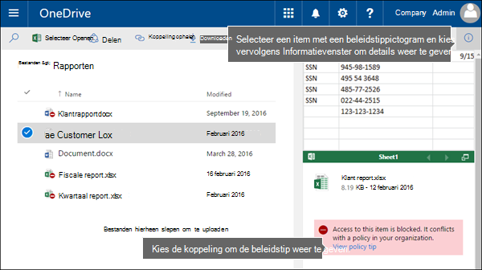
  
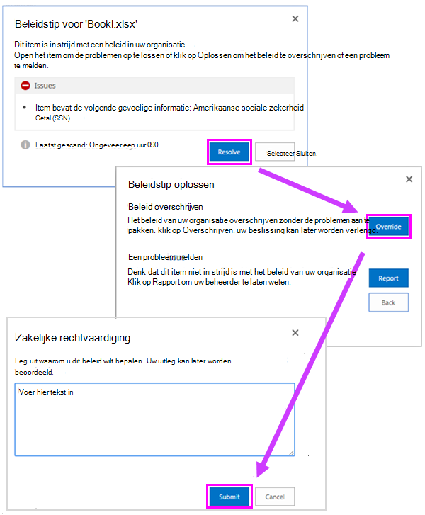
  
DLP-beleid wordt gesynchroniseerd met sites en inhoud wordt regelmatig en asynchroon geëvalueerd, dus er kan een korte vertraging zijn tussen de tijd dat u het DLP-beleid maakt en de tijd dat u beleidstips begint te zien.DLP policies are synced to sites and contented is evaluated against them periodically and asynchronously, so there may be a short delay between the time you create the DLP policy and the time you begin to see policy tips. Er kan een soortgelijke vertraging zijn vanaf het moment dat u een beleidstip opsleed of overschrijven tot wanneer het pictogram op het document op de site verdwijnt.There may be a similar delay from when you resolve or override a policy tip to when the icon on the document on the site goes away.
  
### Standaardtekst voor beleidstips op sitesDefault text for policy tips on sites

In beleidstips wordt standaard tekst weergegeven die lijkt op de volgende tekst voor een item op een site.By default, policy tips display text similar to the following for an item on a site. De meldingstekst wordt afzonderlijk geconfigureerd voor elke regel, zodat de weergegeven tekst verschilt, afhankelijk van de regel die is afgestemd.The notification text is configured separately for each rule, so the text that's displayed differs depending on which rule is matched.

|**Als de DLP-beleidsregel dit doet...****If the DLP policy rule does this…**|**In de standaard beleidstip wordt dit weergegeven...****Then the default policy tip says this…**|
|:-----|:-----|
|Hiermee verzendt u een melding, maar is overschrijven niet toegestaanSends a notification but doesn't allow override    |Dit item is in strijd met een beleid in uw organisatie.This item conflicts with a policy in your organization.    |
|Blokkeert toegang, verzendt een melding en staat overschrijven toeBlocks access, sends a notification, and allows override    |Dit item is in strijd met een beleid in uw organisatie.This item conflicts with a policy in your organization. Als u dit conflict niet op kunt lossen, is de toegang tot dit bestand mogelijk geblokkeerd.If you don't resolve this conflict, access to this file might be blocked.    |
|Blokkeert toegang en verzendt een meldingBlocks access and sends a notification    |Dit item is in strijd met een beleid in uw organisatie.This item conflicts with a policy in your organization. Toegang tot dit item is geblokkeerd voor iedereen, behalve de eigenaar, de laatste modifier en de beheerder van de primaire siteverzameling.Access to this item is blocked for everyone except its owner, last modifier, and the primary site collection administrator.    |
   
### Aangepaste tekst voor beleidstips op sitesCustom text for policy tips on sites

U kunt de tekst voor beleidstips afzonderlijk aanpassen van de e-mailmelding.You can customize the text for policy tips separately from the email notification. In tegenstelling tot aangepaste tekst voor e-mailmeldingen (zie bovenstaande sectie), accepteert aangepaste tekst voor beleidstips geen HTML of tokens.Unlike custom text for email notifications (see above section), custom text for policy tips does not accept HTML or tokens. In plaats daarvan is aangepaste tekst voor beleidstips alleen tekst zonder tekst met een limiet van 256 tekens.Instead, custom text for policy tips is plain text only with a 256-character limit.
  
## Beleidstips in Outlook web en Outlook 2013 en hogerPolicy tips in Outlook on the web and Outlook 2013 and later

Wanneer u een nieuw e-mailbericht opmaakt in Outlook op het web en Outlook 2013 en hoger, ziet u een beleidstip als u inhoud toevoegt die overeenkomt met een regel in een DLP-beleid en voor die regel worden beleidstips gebruikt.When you compose a new email in Outlook on the web and Outlook 2013 and later, you'll see a policy tip if you add content that matches a rule in a DLP policy, and that rule uses policy tips. De beleidstip wordt boven aan het bericht boven de geadresseerden weergegeven terwijl het bericht wordt samengesteld.The policy tip appears at the top of the message, above the recipients, while the message is being composed.
  

  
Beleidstips werken of de gevoelige informatie wordt weergegeven in de berichtbewerker, onderwerpregel of zelfs een berichtbijlage zoals hier wordt weergegeven.Policy tips work whether the sensitive information appears in the message body, subject line, or even a message attachment as shown here.
  
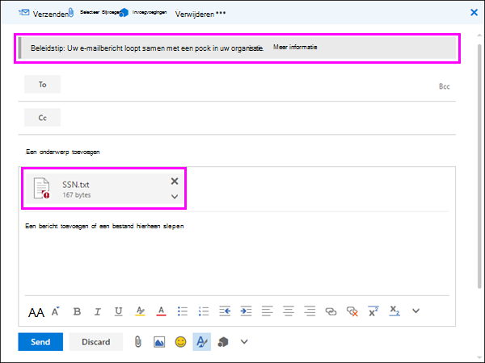
  
Als de beleidstips zijn geconfigureerd om overschrijven  toe te staan, kunt u Details overschrijven tonen kiezen door een zakelijke rechtvaardiging in te voeren of een fout-positieve \>  \> \> **overschrijven te rapporteren.**If the policy tips are configured to allow override, you can choose **Show Details** \> **Override** \> enter a business justification or report a false positive \> **Override**.
  
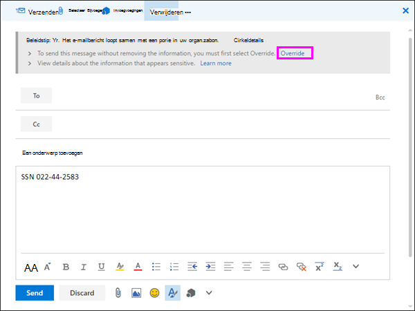
  
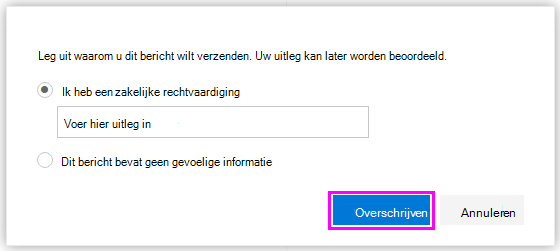
  
Houd er rekening mee dat wanneer u gevoelige informatie aan een e-mailbericht toevoegt, er mogelijk latentie is tussen wanneer de gevoelige informatie wordt toegevoegd en wanneer de beleidstip wordt weergegeven.Note that when you add sensitive information to an email, there may be latency between when the sensitive information is added and when the policy tip appears.

### Outlook 2013 en hoger ondersteunt met beleidstips voor slechts enkele voorwaardenOutlook 2013 and later supports showing policy tips for only some conditions

Momenteel worden Outlook 2013 en hoger ondersteund met alleen beleidstips voor deze voorwaarden:Currently, Outlook 2013 and later supports showing policy tips only for these conditions:

- Inhoud bevatContent contains
- Inhoud wordt gedeeldContent is shared

Uitzonderingen worden beschouwd als voorwaarden en al deze voorwaarden werken in Outlook, waarbij ze overeenkomen met inhoud en beschermende acties voor inhoud afdwingen.Note that Exceptions are considered conditions and all of these conditions work in Outlook, where they will match content and enforce protective actions on content. Maar het weergeven van beleidstips voor gebruikers wordt nog niet ondersteund.But showing policy tips to users is not yet supported. 
  
### Beleidstips in het Exchange-beheercentrum versus het Beveiligings &amp; compliancecentrumPolicy tips in the Exchange admin center vs. the Security &amp; Compliance Center

Beleidstips kunnen werken met DLP-beleidsregels en e-mailstroomregels die zijn gemaakt in het Exchange-beheercentrum of met DLP-beleid dat is gemaakt in het Beveiligings &amp; compliancecentrum, maar niet beide.Policy tips can work either with DLP policies and mail flow rules created in the Exchange admin center, or with DLP policies created in the Security &amp; Compliance Center, but not both. Dit komt omdat deze beleidsregels op verschillende locaties worden opgeslagen, maar beleidstips kunnen slechts op één locatie worden gebruikt.This is because these policies are stored in different locations, but policy tips can draw only from a single location.
  
Als u beleidstips hebt geconfigureerd in het Exchange-beheercentrum, worden beleidstips die u configureert in het Beveiligings compliancecentrum niet weergegeven voor gebruikers in Outlook op het web en Outlook 2013 en hoger totdat u de tips in het &amp; Exchange-beheercentrum uit schakelen.If you've configured policy tips in the Exchange admin center, any policy tips that you configure in the Security &amp; Compliance Center won't appear to users in Outlook on the web and Outlook 2013 and later until you turn off the tips in the Exchange admin center. Dit zorgt ervoor dat uw huidige Exchange e-mailstroomregels (ook wel transportregels genoemd) blijven werken totdat u ervoor kiest om over te schakelen naar het Beveiligings &amp; compliancecentrum.This ensures that your current Exchange mail flow rules (also known as transport rules) will continue to work until you choose to switch over to the Security &amp; Compliance Center.
  
Hoewel beleidstips slechts vanaf één locatie kunnen worden gebruikt, worden er altijd e-mailmeldingen verzonden, zelfs als u DLP-beleid gebruikt in zowel het Beveiligings compliancecentrum als het &amp; Exchange beheercentrum.Note that while policy tips can draw only from a single location, email notifications are always sent, even if you're using DLP policies in both the Security &amp; Compliance Center and the Exchange admin center.
  
### Standaardtekst voor beleidstips in e-mailDefault text for policy tips in email

In beleidstips wordt standaard tekst weergegeven die lijkt op de volgende tekst voor e-mail.By default, policy tips display text similar to the following for email.

|**Als de DLP-beleidsregel dit doet...****If the DLP policy rule does this…**|**In de standaard beleidstip wordt dit weergegeven...****Then the default policy tip says this…**|
|:-----|:-----|
|Hiermee verzendt u een melding, maar is overschrijven niet toegestaanSends a notification but doesn't allow override    |Uw e-mail is in strijd met een beleid in uw organisatie.Your email conflicts with a policy in your organization.    |
|Blokkeert toegang, verzendt een melding en staat overschrijven toeBlocks access, sends a notification, and allows override    |Uw e-mail is in strijd met een beleid in uw organisatie.Your email conflicts with a policy in your organization.    |
|Blokkeert toegang en verzendt een meldingBlocks access and sends a notification    |Uw e-mail is in strijd met een beleid in uw organisatie.Your email conflicts with a policy in your organization.    |
   
## Beleidstips in Excel, PowerPoint en WordPolicy tips in Excel, PowerPoint, and Word

Wanneer personen met gevoelige inhoud werken in de bureaubladversies van Excel, PowerPoint en Word, kunnen beleidstips hen in realtime laten weten dat de inhoud strijdig is met een DLP-beleid.When people work with sensitive content in the desktop versions of Excel, PowerPoint, and Word, policy tips can notify them in real time that the content conflicts with a DLP policy. Hiervoor moet u het volgende doen:This requires that:
  
- Het Office document wordt opgeslagen op een OneDrive voor Bedrijven site of SharePoint onlinesite.The Office document is stored on a OneDrive for Business site or SharePoint Online site.
    
- De site is opgenomen in een DLP-beleid dat is geconfigureerd voor het gebruik van beleidstips.The site is included in a DLP policy that's configured to use policy tips.
    
Office bureaubladprogramma's automatisch DLP-beleid rechtstreeks vanuit Office 365 synchroniseren en vervolgens uw documenten scannen om ervoor te zorgen dat ze niet in strijd zijn met uw DLP-beleid en beleidstips in realtime weergeven.Office desktop programs automatically sync DLP policies directly from Office 365, and then scan your documents to ensure that they don't conflict with your DLP policies and display policy tips in real time.

> [!NOTE]
> Office bureaublad-apps scannen documenten zelf om te bepalen of DLP-beleidstips moeten worden weergegeven. er worden geen beleidstips weergegeven die SharePoint onlinesites of OneDrive voor Bedrijven sites die al zijn vastgesteld, moeten worden weergegeven in een bestand.Office desktop apps scan documents themselves to determine if DLP policy tips should be shown; they do not show policy tips that SharePoint Online sites or OneDrive for Business sites have already determined should be shown on a file. Hierdoor ziet u mogelijk niet altijd een DLP-beleidstip in de bureaublad-apps die u ziet in de SharePoint Online-sites of OneDrive voor Bedrijven sites.As a result, you may not always see a DLP policy tip in the desktop apps that you see in the SharePoint Online sites or OneDrive for Business sites. In de Office op internet worden echter alleen DLP-beleidstips weergegeven die SharePoint Onlinesites of OneDrive voor Bedrijven sites al hebben bepaald.In contrast, the Office applications on the web only show DLP policy tips that SharePoint Online sites or OneDrive for Business sites have already determined should be shown.
  
Afhankelijk van hoe u de beleidstips in het DLP-beleid configureert, kunnen personen ervoor kiezen om de beleidstip te negeren, het beleid te negeren met of zonder zakelijke rechtvaardiging, of een onwaar positief rapport te rapporteren.Depending on how you configure the policy tips in the DLP policy, people can choose to simply ignore the policy tip, override the policy with or without a business justification, or report a false positive.
  
Beleidstips worden weergegeven op de berichtenbalk.Policy tips appear on the Message Bar.
  

  
En beleidstips worden ook weergegeven in de weergave Backstage (op het **tabblad** Bestand).And policy tips also appear in the Backstage view (on the **File** tab). 
  

  
Als beleidstips in het DLP-beleid met deze  opties zijn geconfigureerd, kunt u Oplossen kiezen om **een** beleidstip te overschrijven of **Een** onwaar positief melden.If policy tips in the DLP policy are configured with these options, you can choose **Resolve** to **Override** a policy tip or **Report** a false positive. 
  
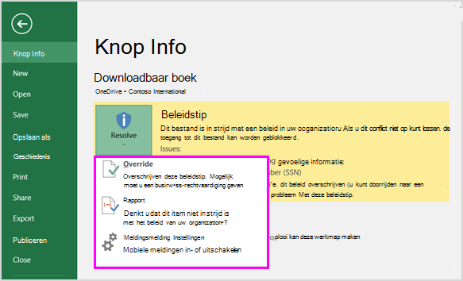
  
In elk van deze Office bureaubladprogramma's kunnen personen ervoor kiezen beleidstips uit te schakelen.In each of these Office desktop programs, people can choose to turn off policy tips. Als dit is uitgeschakeld, worden beleidstips die eenvoudige meldingen zijn, niet weergegeven in de weergave Berichtenbalk of Backstage (op het **tabblad** Bestand).If turned off, policy tips that are simple notifications will not appear on the Message Bar or Backstage view (on the **File** tab). Beleidstips over blokkeren en overschrijven worden echter nog steeds weergegeven en ze ontvangen nog steeds de e-mailmelding.However, policy tips about blocking and overriding will still appear, and they will still receive the email notification. Bovendien wordt het document niet vrijgesteld van DLP-beleid dat is toegepast op het document als beleidstips worden uitgeschakeld.In addition, turning off policy tips does not exempt the document from any DLP policies that have been applied to it. 
  
### Standaardtekst voor beleidstips in Excel 2016, PowerPoint 2016 en Word 2016Default text for policy tips in Excel 2016, PowerPoint 2016, and Word 2016

In beleidstips wordt standaard tekst weergegeven die lijkt op het volgende in de berichtenbalk en backstage-weergave van een geopend document.By default, policy tips display text similar to the following on the Message Bar and Backstage view of an open document. De meldingstekst wordt afzonderlijk geconfigureerd voor elke regel, zodat de weergegeven tekst verschilt, afhankelijk van de regel die is afgestemd.The notification text is configured separately for each rule, so the text that's displayed differs depending on which rule is matched.

|**Als de DLP-beleidsregel dit doet...****If the DLP policy rule does this…**|**In de standaard beleidstip wordt dit weergegeven...****Then the default policy tip says this…**|
|:-----|:-----|
|Hiermee verzendt u een melding, maar is overschrijven niet toegestaanSends a notification but doesn't allow override    |Dit bestand is in strijd met een beleid in uw organisatie.This file conflicts with a policy in your organization. Ga naar het **menu** Bestand voor meer informatie.Go to the **File** menu for more information.    |
|Blokkeert toegang, verzendt een melding en staat overschrijven toeBlocks access, sends a notification, and allows override    |Dit bestand is in strijd met een beleid in uw organisatie.This file conflicts with a policy in your organization. Als u dit conflict niet op kunt lossen, is de toegang tot dit bestand mogelijk geblokkeerd.If you don't resolve this conflict, access to this file might be blocked. Ga naar het **menu** Bestand voor meer informatie.Go to the **File** menu for more information.    |
|Blokkeert toegang en verzendt een meldingBlocks access and sends a notification    |Dit bestand is in strijd met een beleid in uw organisatie.This file conflicts with a policy in your organization. Als u dit conflict niet op kunt lossen, is de toegang tot dit bestand mogelijk geblokkeerd.If you don't resolve this conflict, access to this file might be blocked. Ga naar het **menu** Bestand voor meer informatie.Go to the **File** menu for more information.    |
   
### Aangepaste tekst voor beleidstips in Excel, PowerPoint en WordCustom text for policy tips in Excel, PowerPoint, and Word

U kunt de tekst voor beleidstips afzonderlijk aanpassen van de e-mailmelding.You can customize the text for policy tips separately from the email notification. In tegenstelling tot aangepaste tekst voor e-mailmeldingen (zie bovenstaande sectie), accepteert aangepaste tekst voor beleidstips geen HTML of tokens.Unlike custom text for email notifications (see above section), custom text for policy tips does not accept HTML or tokens. In plaats daarvan is aangepaste tekst voor beleidstips alleen tekst zonder tekst met een limiet van 256 tekens.Instead, custom text for policy tips is plain text only with a 256-character limit.
  
## Meer informatieMore information

- [Meer informatie over preventie van gegevensverliesLearn about data loss prevention](dlp-learn-about-dlp.md)    
- [Een DLP-beleid maken vanuit een sjabloonCreate a DLP policy from a template](create-a-dlp-policy-from-a-template.md)
- [DLP-beleidsvoorwaarden, uitzonderingen en acties (voorbeeld)DLP policy conditions, exceptions, and actions (preview)](./dlp-microsoft-teams.md) 
- [Een DLP-beleid maken om documenten te beveiligen met FCI of andere eigenschappenCreate a DLP policy to protect documents with FCI or other properties](protect-documents-that-have-fci-or-other-properties.md)
- [Wat zijn de DLP-beleidssjablonen?What the DLP policy templates include](what-the-dlp-policy-templates-include.md)
- [Definities van entiteiten van het type vertrouwelijke gegevensSensitive information type entity definitions](sensitive-information-type-entity-definitions.md)