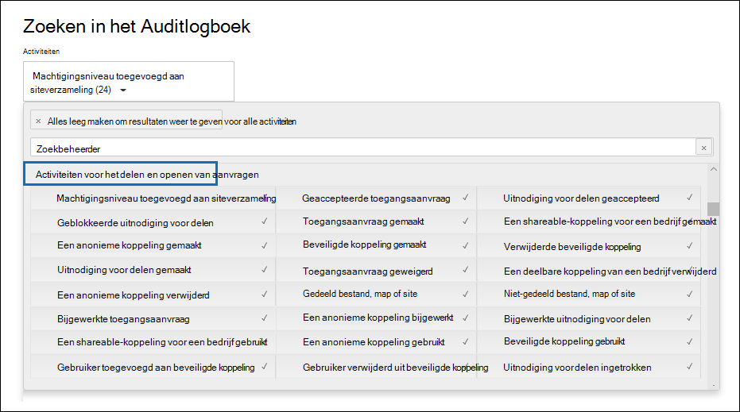

# Controle delen gebruiken in het auditlogboekUse sharing auditing in the audit log

Delen is een belangrijke activiteit in SharePoint Online en OneDrive voor Bedrijven, en wordt veel gebruikt in organisaties.Sharing is a key activity in SharePoint Online and OneDrive for Business, and it's widely used in organizations. Beheerders kunnen delen controleren in het auditlogboek gebruiken om te bepalen hoe delen wordt gebruikt in hun organisatie.Administrators can use sharing auditing in the audit log to determine how sharing is used in their organization. 
  
## Het schema SharePoint delenThe SharePoint Sharing schema

Gebeurtenissen voor delen (met inbegrip van gebeurtenissen met betrekking tot het delen van beleid en koppelingen voor delen) verschillen op één primaire manier van bestands- en mapgerelateerde gebeurtenissen: de ene gebruiker voert een actie uit die van invloed is op een andere gebruiker.Sharing events (not including events related to sharing policy and sharing links) are different from file- and folder-related events in one primary way: one user is performing an action that has an effect on another user. Bijvoorbeeld wanneer een resource gebruiker A gebruiker B toegang geeft tot een bestand.For example, when a resource User A gives User B access to a file. In dit voorbeeld is gebruiker A de *waarnemende gebruiker en* gebruiker B de *doelgebruiker.*In this example, User A is the  *acting user*  and User B is the  *target user*. In het SharePoint bestandsschema is de actie van de waarnemende gebruiker alleen van invloed op het bestand zelf.In the SharePoint File schema, the acting user's action only affects the file itself. Wanneer gebruiker A een bestand opent, is de acteergebruiker de enige informatie die nodig is in de **gebeurtenis FileAccessed.**When User A opens a file, the only information needed in the **FileAccessed** event is the acting user. Om dit verschil aan te pakken, is er een afzonderlijk schema, SharePoint schema *delen,* dat meer informatie over het delen van gebeurtenissen vast legt.To address this difference, there is a separate schema, called the  *SharePoint Sharing schema*, that captures more information about sharing events. Dit zorgt ervoor dat beheerders inzicht hebben in wie een resource heeft gedeeld en met de gebruiker met wie de resource is gedeeld.This ensures that administrators have visibility into who shared a resource and the user the resource was shared with. 
  
Het schema Delen bevat twee extra velden in een auditrecord met betrekking tot het delen van gebeurtenissen:The Sharing schema provides two additional fields in an audit record related to sharing events: 
  
- **TargetUserOrGroupType:** Hiermee wordt aangegeven of de doelgebruiker of groep lid, gast, SharePointGroup, Beveiligingsgroep of Partner is.**TargetUserOrGroupType:** Identifies whether the target user or group is a Member, Guest, SharePointGroup, SecurityGroup, or Partner.

- **TargetUserOrGroupName:** Slaat de UPN of naam op van de doelgebruiker of -groep met een resource (Gebruiker B in het vorige voorbeeld).**TargetUserOrGroupName:** Stores the UPN or name of the target user or group that a resource was shared with (User B in the previous example). 

Deze twee velden kunnen, naast andere eigenschappen uit het auditlogboekschema, zoals Gebruiker, Bewerking en  Datum, het volledige verhaal vertellen over welke gebruiker welke *resource* heeft gedeeld met wie en *wanneer.* These two fields, in addition to other properties from the audit log schema such as User, Operation, and Date can tell the full story about  *which*  user shared  *what*  resource with  *whom*  and  *when*. 
  
Er is nog een schema-eigenschap die belangrijk is voor het gedeelde verhaal.There's another schema property that's important to the sharing story. Wanneer u de zoekresultaten van het auditlogboek exporteert, worden in de **kolom AuditData** in het geëxporteerde CSV-bestand gegevens over het delen van gebeurtenissen opgeslagen.When you export audit log search results, the **AuditData** column in the exported CSV file stores information about sharing events. Wanneer een gebruiker bijvoorbeeld een site deelt met een andere gebruiker, wordt dit bereikt door de doelgebruiker toe te voegen aan een SharePoint groep.For example, when a user shares a site with another user, this is accomplished by adding the target user to a SharePoint group. De **kolom AuditData** legt deze gegevens vast om beheerders context te bieden.The **AuditData** column captures this information to provide context for administrators. Zie [Stap 2 voor](#step-2-use-the-powerquery-editor-to-format-the-exported-audit-log) instructies over het parseren van de gegevens in de kolom **AuditData.**See [Step 2](#step-2-use-the-powerquery-editor-to-format-the-exported-audit-log) for instructions on how to parse the information in the **AuditData** column.

## SharePoint delen van gebeurtenissenSharePoint sharing events

Delen wordt gedefinieerd door wanneer een gebruiker *(de* waarnemende gebruiker) een resource wil delen met een andere gebruiker (de *doelgebruiker).*Sharing is defined by when a user (the *acting* user) wants to share a resource with another user (the *target* user). Auditrecords met betrekking tot het delen van een resource met een externe gebruiker (een gebruiker die buiten uw organisatie is en geen gastaccount heeft in het Azure Active Directory van uw organisatie) worden geïdentificeerd door de volgende gebeurtenissen, die zijn geregistreerd in het auditlogboek:Audit records related to sharing a resource with an external user (a user who is outside of your organization and doesn't have a guest account in your organization's Azure Active Directory) are identified by the following events, which are logged in the audit log:

- **SharingInvitationCreated:** Een gebruiker in uw organisatie heeft geprobeerd een resource (waarschijnlijk een site) te delen met een externe gebruiker.**SharingInvitationCreated:** A user in your organization tried to share a resource (likely a site) with an external user. Dit resulteert in een uitnodiging voor extern delen die naar de doelgebruiker is verzonden.This results in an external sharing invitation sent to the target user. Er wordt op dit moment geen toegang tot de resource verleend.No access to the resource is granted at this point.

- **SharingInvitationAccepted:** De externe gebruiker heeft de uitnodiging voor delen geaccepteerd die door de waarnemende gebruiker is verzonden en heeft nu toegang tot de resource.**SharingInvitationAccepted:** The external user has accepted the sharing invitation sent by the acting user and now has access to the resource.

- **AnonymousLinkCreated:** Er wordt een anonieme koppeling (ook wel een koppeling 'Iedereen' genoemd) gemaakt voor een resource.**AnonymousLinkCreated:** An anonymous link (also called an "Anyone" link) is created for a resource. Omdat een anonieme koppeling kan worden gemaakt en vervolgens gekopieerd, is het redelijk om ervan uit te gaan dat elk document met een anonieme koppeling is gedeeld met een doelgebruiker.Because an anonymous link can be created and then copied, it's reasonable to assume that any document that has an anonymous link has been shared with a target user.

- **AnonymousLinkUsed:** Zoals de naam al aangeeft, wordt deze gebeurtenis geregistreerd wanneer een anonieme koppeling wordt gebruikt om toegang te krijgen tot een resource.**AnonymousLinkUsed:** As the name implies, this event is logged when an anonymous link is used to access a resource. 

- **SecureLinkCreated:** Een gebruiker heeft een 'specifieke personenkoppeling' gemaakt om een resource te delen met een bepaalde persoon.**SecureLinkCreated:** A user has created a "specific people link" to share a resource with a specific person. Deze doelgebruiker kan iemand zijn die buiten uw organisatie valt.This target user may be someone who is external to your organization. De persoon met wie de resource wordt gedeeld, wordt geïdentificeerd in de auditrecord voor de **gebeurtenis AddedToSecureLink.**The person that the resource is shared with is identified in the audit record for the **AddedToSecureLink** event. De tijdstempels voor deze twee gebeurtenissen zijn nagenoeg identiek.The time stamps for these two events are nearly identical.

- **AddedToSecureLink:** Een gebruiker is toegevoegd aan een specifieke personenkoppeling.**AddedToSecureLink:** A user was added to a specific people link. Gebruik het **veld TargetUserOrGroupName** in deze gebeurtenis om de gebruiker te identificeren die is toegevoegd aan de bijbehorende specifieke personenkoppeling.Use the **TargetUserOrGroupName** field in this event to identify the user added to the corresponding specific people link. Deze doelgebruiker kan iemand zijn die buiten uw organisatie valt.This target user may be someone who is external to your organization.

## Werkstroom voor auditing delenSharing auditing work flow
  
Wanneer een gebruiker (de waarnemende gebruiker) een resource wil delen met een andere gebruiker (de doelgebruiker), controleert SharePoint (of OneDrive voor Bedrijven) eerst of het e-mailadres van de doelgebruiker al is gekoppeld aan een gebruikersaccount in de adreslijst van de organisatie.When a user (the acting user) wants to share a resource with another user (the target user), SharePoint (or OneDrive for Business) first checks if the email address of the target user is already associated with a user account in the organization's directory. Als de doelgebruiker zich in de adreslijst (en heeft een bijbehorend gastgebruikersaccount), doet SharePoint de volgende dingen:If the target user is in the directory (and has a corresponding guest user account), SharePoint does the following things:
  
-  Direct worden de machtigingen van de doelgebruiker toegewezen om toegang te krijgen tot de resource door de doelgebruiker toe te voegen aan de juiste SharePoint groep en een **gebeurtenis AddedToGroup te** logboeken.Immediately assigns the target user permissions to access the resource by adding the target user to the appropriate SharePoint group, and logs an **AddedToGroup** event. 
    
- Hiermee wordt een melding voor delen verzonden naar het e-mailadres van de doelgebruiker.Sends a sharing notification to the email address of the target user.
    
- Registreert een **SharingSet-gebeurtenis.**Logs a **SharingSet** event. Deze gebeurtenis heeft een vriendelijke naam van 'Gedeeld bestand, map of site' onder **Activiteiten** voor delen en toegang aanvragen in de activiteiten picker van het zoekprogramma voor auditlogboek.This event has a friendly name of "Shared file, folder, or site" under **Sharing and access request activities** in the activities picker of the audit log search tool. Zie de schermafbeelding in [stap 1.](#step-1-search-for-sharing-events-and-export-the-results-to-a-csv-file)See the screenshot in [Step 1](#step-1-search-for-sharing-events-and-export-the-results-to-a-csv-file). 
    
Als een gebruikersaccount voor de doelgebruiker zich niet in de adreslijst SharePoint doet u het volgende:If a user account for the target user isn't in the directory, SharePoint does the following: 
    
   - Registreert een van de volgende gebeurtenissen op basis van de manier waarop de resource wordt gedeeld:Logs one of the following events, based on how the resource is shared:
   
      - **AnonymousLinkCreated****AnonymousLinkCreated**
   
      - **SecureLinkCreated****SecureLinkCreated**
   
      - **AddedToSecureLink****AddedToSecureLink** 

      - **SharingInvitationCreated** (deze gebeurtenis wordt alleen geregistreerd wanneer de gedeelde resource een site is)**SharingInvitationCreated** (this event is logged only when the shared resource is a site)
    
   - Wanneer de doelgebruiker de uitnodiging voor delen accepteert die naar hem of haar is verzonden (door op de koppeling in de uitnodiging te klikken), registreert SharePoint een **gebeurtenis sharingInvitationAccepted** en wijst de doelgebruiker machtigingen toe om toegang te krijgen tot de resource.When the target user accepts the sharing invitation that's sent to them (by clicking the link in the invitation), SharePoint logs a **SharingInvitationAccepted** event and assigns the target user permissions to access the resource. Als de doelgebruiker een anonieme koppeling wordt verzonden, wordt de **gebeurtenis AnonymousLinkUsed** geregistreerd nadat de doelgebruiker de koppeling gebruikt om toegang te krijgen tot de resource.If the target user is sent an anonymous link, the **AnonymousLinkUsed** event is logged after the target user uses the link to access the resource. Voor veilige koppelingen wordt een **FileAccessed-gebeurtenis** geregistreerd wanneer een externe gebruiker de koppeling gebruikt om toegang te krijgen tot de resource.For secure links, a **FileAccessed** event is logged when an external user uses the link to access the resource.

Aanvullende informatie over de doelgebruiker wordt ook vastgelegd, zoals de identiteit van de gebruiker die de uitnodiging heeft ontvangen en de gebruiker die de uitnodiging accepteert.Additional information about the target user is also logged, such as the identity of the user the invitation is to and the user who accepts the invitation. In sommige gevallen kunnen deze gebruikers (of e-mailadressen) verschillen.In some case, these users (or email addresses) can be different. 

## Resources identificeren die met externe gebruikers zijn gedeeldHow to identify resources shared with external users

Een veelvoorkomende vereiste voor beheerders is het maken van een lijst met alle resources die zijn gedeeld met gebruikers buiten de organisatie.A common requirement for administrators is creating a list of all resources that have been shared with users outside of the organization. Door auditing voor delen in Office 365 gebruiken, kunnen beheerders deze lijst genereren.By using sharing auditing in Office 365, administrators can generate this list. Deze zijn als volgt.Here's how.
  
### Stap 1: Gebeurtenissen voor delen zoeken en de resultaten exporteren naar een CSV-bestandStep 1: Search for sharing events and export the results to a CSV file

De eerste stap is het zoeken in het auditlogboek voor het delen van gebeurtenissen.The first step is to search the audit log for sharing events. Zie Het auditlogboek doorzoeken in het beveiligings- & compliancecentrum voor meer informatie (inclusief [de vereiste machtigingen) over het doorzoeken van het auditlogboek.](search-the-audit-log-in-security-and-compliance.md)For more information (including the required permissions) about searching the audit log, see [Search the audit log in the Security & Compliance Center](search-the-audit-log-in-security-and-compliance.md).
  
1. Ga naar <https://compliance.microsoft.com>.Go to <https://compliance.microsoft.com>.

2. Meld u aan met uw werk- of schoolaccount.Sign in using your work or school account.

3. Klik in het linkerdeelvenster Microsoft 365-compliancecentrum op **Controleren.**In the left pane of the Microsoft 365 compliance center, click **Audit**.

    De **pagina Controle** wordt weergegeven.The **Audit** page is displayed.

4. Klik **onder Activiteiten** op Activiteiten en klik op Activiteiten voor delen en **toegang** aanvragen om te zoeken naar gebeurtenissen die betrekking hebben op delen.Under **Activities**, click **Sharing and access request activities** to search for sharing-related events. 

    
  
5. Selecteer een datum- en tijdbereik om te zoeken naar de gebeurtenissen voor delen die binnen die periode hebben plaatsgevonden.Select a date and time range to find the sharing events that occurred within that period. 

6. Klik **op Zoeken** om de zoekopdracht uit te voeren.Click **Search** to run the search. 

7. Wanneer de zoekopdracht is voltooid en de resultaten worden weergegeven, klikt u op **Resultaten exporteren** Alle \> **resultaten downloaden.**When the search is finished running and the results are displayed, click **Export results** \> **Download all results**.

    Nadat u de exportoptie hebt geselecteerd, wordt u in een bericht onder aan het venster gevraagd het CSV-bestand te openen of op te slaan.After you select the export option, a message at the bottom of the window prompts you to open or save the CSV file.

8. Klik **op Opslaan** als \> **en** sla het CSV-bestand op in een map op uw lokale computer.Click **Save** \> **Save as** and save the CSV file to a folder on your local computer. 

### Stap 2: PowerQuery Editor gebruiken om het geëxporteerde auditlogboek op te makenStep 2: Use the PowerQuery Editor to format the exported audit log

De volgende stap is het gebruik van de JSON-transformatiefunctie in de Power Query Editor in Excel om elke eigenschap in de **kolom AuditData** (die bestaat uit een JSON-object met meerdere eigenschappen) te splitsen in een eigen kolom.The next step is to use the JSON transform feature in the Power Query Editor in Excel to split each property in the **AuditData** column (which consists of a multi-property JSON object) into its own column. Hiermee kunt u kolommen filteren om records te bekijken die betrekking hebben op delenThis lets you filter columns to view records related to sharing

Zie "Stap 2: de geëxporteerde autditlogboeken opmaken met de Power Query Editor'  voor stapsgewijze instructies in [Auditlogboekrecords exporteren, configureren en bekijken](export-view-audit-log-records.md#step-2-format-the-exported-audit-log-using-the-power-query-editor).For step-by-step instructions, see "Step 2: Format the exported audit log using the Power Query Editor" in [Export, configure, and view audit log records](export-view-audit-log-records.md#step-2-format-the-exported-audit-log-using-the-power-query-editor).

### Stap 3: Het CSV-bestand filteren op resources die met externe gebruikers zijn gedeeldStep 3: Filter the CSV file for resources shared with external users

De volgende stap is om de CSV te filteren op de verschillende gebeurtenissen met betrekking tot delen die eerder zijn beschreven in de sectie SharePoint [delen van](#sharepoint-sharing-events) gebeurtenissen.The next step is to filter the CSV for the different sharing-related events that were previously described in the [SharePoint sharing events](#sharepoint-sharing-events) section. U kunt ook de kolom **TargetUserOrGroupType** filteren om alle records weer te geven waarin de waarde van deze eigenschap **Gast** is.Alternatively, you can filter the **TargetUserOrGroupType** column to display all records where the value of this property is **Guest**. 

Nadat u de instructies in de vorige stap hebt gevolgd om het CSV-bestand voor te bereiden met de PowerQuery-editor, gaat u als volgt te werk:After you've followed the instructions in the previous step to prepare the CSV file by using the PowerQuery editor, do the following:
    
1. Open het Excel bestand dat u hebt gemaakt in stap 2.Open the Excel file that you created in Step 2. 

2. Klik op **het** tabblad Start op **Sorteren & filteren** en klik vervolgens op **Filteren.**On the **Home** tab, click **Sort & Filter**, and then click **Filter**.
    
3. Schakel in de vervolgkeuzelijst Sorteren &  **filter** in de kolom Bewerkingen alle selecties uit, selecteer vervolgens een of meer van de volgende gebeurtenissen met betrekking tot delen en klik vervolgens op **Ok.**In the **Sort & Filter** dropdown list on the **Operations** column, clear all selections, then select one or more the following sharing-related events and then click **Ok**.
 
   - **SharingInvitationCreated****SharingInvitationCreated**
   
   - **AnonymousLinkCreated****AnonymousLinkCreated**
   
   - **SecureLinkCreated****SecureLinkCreated**
   
   - **AddedToSecureLink****AddedToSecureLink** 
    
    Excel worden de rijen weergegeven voor de gebeurtenissen die u hebt geselecteerd.Excel displays the rows for the events you selected.
    
4. Ga naar de kolom **TargetUserOrGroupType** en selecteer deze.Go to the column named **TargetUserOrGroupType** and select it. 
    
5. Schakel in **de vervolgkeuzelijst Sorteren & filter** alle selecties uit en selecteer vervolgens **TargetUserOrGroupType:Guest** en klik op **Ok.**In the **Sort & Filter** dropdown list, clear all selections, then select **TargetUserOrGroupType:Guest**, and click **Ok**.
    
    Nu Excel de rijen voor het delen van gebeurtenissen en waar de doelgebruiker zich buiten uw organisatie, omdat externe gebruikers worden geïdentificeerd door de waarde **TargetUserOrGroupType:Guest.**Now Excel displays the rows for sharing events AND where the target user is outside of your organization, because external users are identified by the value **TargetUserOrGroupType:Guest**. 
  
> [!TIP]
> Voor de auditrecords die worden weergegeven, identificeert de **kolom ObjectId** de resource die is gedeeld met de doelgebruiker. bijvoorbeeld  `ObjectId:https:\/\/contoso-my.sharepoint.com\/personal\/sarad_contoso_com\/Documents\/Southwater Proposal.docx` .For the audit records that are displayed, the **ObjectId** column identifies the resource that was shared with the target user; for example  `ObjectId:https:\/\/contoso-my.sharepoint.com\/personal\/sarad_contoso_com\/Documents\/Southwater Proposal.docx`.
