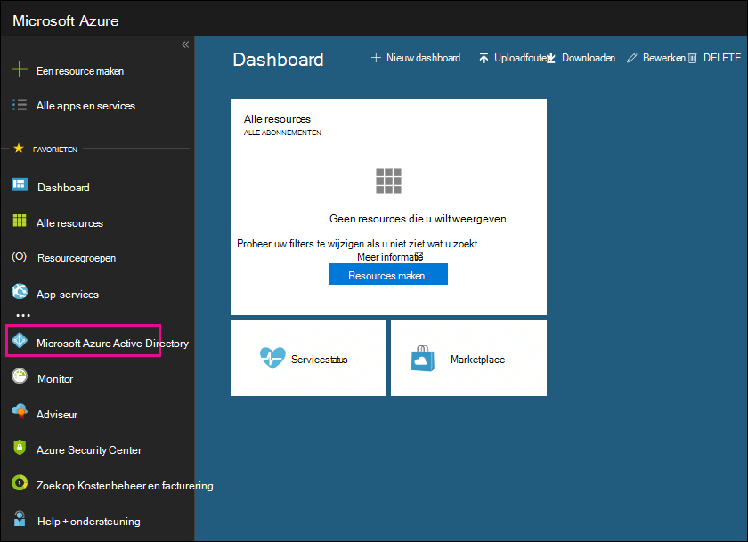

# Uw gratis Azure Active Directory-abonnement gebruiken

Als uw organisatie een betaald abonnement heeft op Microsoft 365, Microsoft Dynamics CRM Online, Enterprise Mobility Suite of andere Microsoft-services, dan hebt u een gratis abonnement op Microsoft Azure Active Directory. U en andere beheerders kunnen Azure AD gebruiken om gebruikers- en groepsaccounts te maken en beheren. Als u Azure AD wilt gebruiken, gaat u naar Azure Portal en meldt u zich aan bij uw account.

## Een persoonlijke browsersessie openen

Gebruik een persoonlijke browsersessie (geen gewone sessie) om toegang te krijgen tot Azure Portal (in stap 1 hieronder). Hiermee voorkomt u dat de referenties waarmee u momenteel bent aangemeld, worden doorgegeven aan Azure. Een persoonlijke browsersessie openen:

- Druk in Microsoft Edge (oudere versie), Internet Explorer of Mozilla FireFox op `CTRL+SHIFT+P`.

- Druk in Microsoft Edge (nieuwste versie) of Google Chrome op `CTRL+SHIFT+N`.

## Toegang tot Azure Active Directory

1. Ga naar [portal.azure.com](https://portal.azure.com) en meld u aan met uw werk- of schoolaccount.

2. Klik in het linker navigatiedeelvenster in Azure Portal op **Azure Active Directory**.

    

    Het **Azure Active Directory**-beheercentrum wordt weergegeven.

## Meer informatie

- Een gratis Azure Active Directory-abonnement bevat het activiteitenrapport Aanmeldingen niet. Als u aanmeldingsactiviteit wilt registreren (wat handig kan zijn bij een gegevenslek), hebt u een Azure Active Directory Premium-abonnement nodig. Zie [Hoe lang worden de gegevens opgeslagen in Azure AD?](/azure/active-directory/reports-monitoring/reference-reports-data-retention#how-long-does-azure-ad-store-the-data) voor meer informatie.

- U kunt het **Azure Active Directory**-beheercentrum ook openen vanuit het Microsoft 365-beheercentrum. Klik in het linker navigatiedeelvenster van het Microsoft 365-beheercentrum op **Beheercentra** \> **Azure Active Directory**.

- Zie [Uw Azure AD-adreslijst beheren](/azure/active-directory/active-directory-administer) voor meer informatie over het beheren van gebruikers en groepen en het uitvoeren van overige taken voor adreslijstbeheer.