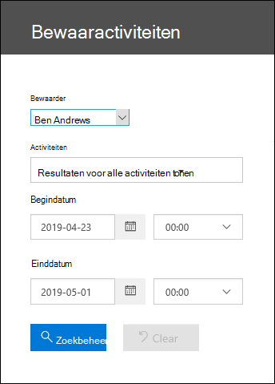
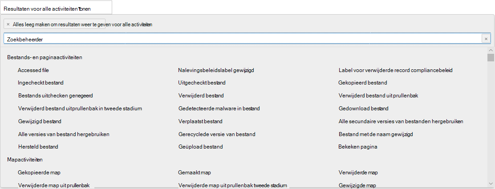

# Controleactiviteit voor beheerders weergevenView custodian audit activity

Wilt u weten of een gebruiker een specifiek document heeft bekeken of een item uit zijn postvak heeft verwijderd?Need to find if a user viewed a specific document or purged an item from their mailbox? Advanced eDiscovery is nu geïntegreerd met het bestaande zoekprogramma voor auditlogboek in & Compliancecentrum.Advanced eDiscovery is now integrated with the existing audit log search tool in the Security & Compliance Center. Met deze ingesloten ervaring kunt u het hulpprogramma Advanced eDiscovery bewaarderbeheer gebruiken om uw onderzoek te vergemakkelijken door eenvoudig toegang te krijgen tot de activiteit en te zoeken naar beheerders in uw zaak.Using this embedded experience, you can use the Advanced eDiscovery Custodian Management tool to facilitate your investigation by easily accessing and searching the activity for custodians within your case.

## Machtigingen krijgenGet permissions

U moet de rol auditlogboeken View-Only auditlogboeken in Exchange Online om het auditlogboek te doorzoeken.You have to be assigned the View-Only Audit Logs or Audit Logs role in Exchange Online to search the audit log. Deze rollen worden standaard toegewezen aan de rollengroepen Compliancebeheer en Organisatiebeheer op de pagina Machtigingen in het Exchange beheercentrum.By default, these roles are assigned to the Compliance Management and Organization Management role groups on the Permissions page in the Exchange admin center. Als u een gebruiker de mogelijkheid wilt geven om het Advanced eDiscovery-auditlogboek te doorzoeken met het minimumniveau van bevoegdheden, kunt u een aangepaste rollengroep maken in Exchange Online, de rol View-Only Auditlogboeken of Auditlogboeken toevoegen en vervolgens de gebruiker toevoegen als lid van de nieuwe rollengroep.To give a user the ability to search the Advanced eDiscovery audit log with the minimum level of privileges, you can create a custom role group in Exchange Online, add the View-Only Audit Logs or Audit Logs role, and then add the user as a member of the new role group. Zie Rollengroepen beheren in Exchange Online voor meer Exchange Online.For more information, see Manage role groups in Exchange Online.

> [!IMPORTANT]
> Als u een gebruiker de rol View-Only auditlogboeken of auditlogboeken toewijst op de pagina Machtigingen in het beveiligings- & compliancecentrum, kunnen ze niet in het auditlogboek zoeken.If you assign a user the View-Only Audit Logs or Audit Logs role on the Permissions page in the Security & Compliance Center, they won't be able to search the audit log. U moet de machtigingen toewijzen in Exchange Online.You have to assign the permissions in Exchange Online. Dit komt omdat de onderliggende cmdlet die wordt gebruikt om het auditlogboek te doorzoeken een Exchange Online cmdlet is.This is because the underlying cmdlet used to search the audit log is an Exchange Online cmdlet.

## Stap 1: het auditlogboek doorzoeken op activiteiten die door een bewaarder worden uitgevoerdStep 1: Search the audit log for activities performed by a custodian

1. Ga naar **eDiscovery > Advanced eDiscovery** en open de zaak.Go to  **eDiscovery > Advanced eDiscovery** and open the case.
  
2. Klik op **het tabblad** Bronnen.Click the **Sources** tab.
  
3. Selecteer op **de pagina Bewaarders** een bewaarder in de lijst en klik vervolgens op **Bewaaractiviteiten weergeven** op de flyoutpagina.On the **Custodians** page, select a custodian from the list, and then click **View custodian activity** on the flyout page.

    De zoekpagina Bewaaractiviteiten wordt weergegeven.The Custodian activities search page is displayed. Houd er rekening mee dat de bewaarder die u in de vorige stap hebt geselecteerd, wordt weergegeven in het vervolgkeuzevak **Bewaarder.**Note the custodian you selected in the previous step is displayed in the **Custodian** drop-down box. U kunt verschillende beheerders selecteren in de vervolgkeuzebus, maar u kunt alleen zoeken naar activiteiten voor één bewaarder tegelijk.You can select different custodians in the drop-down box, but you can only search for activities for one custodian at a time.

    
   
4. De volgende zoekcriteria configureren:Configure the following search criteria:
      
   1. **Activiteiten:** klik op de vervolgkeuzelijst om de activiteiten weer te geven die u kunt zoeken.**Activities** - Click the drop-down list to display the activities that you can search for. Nadat u de zoekopdracht hebt uitgevoerd, worden alleen de auditrecords voor de geselecteerde activiteiten weergegeven.After you run the search, only the audit records for the selected activities are displayed. Als **u Resultaten weergeven voor alle activiteiten selecteert,** worden resultaten weergegeven voor alle activiteiten die worden uitgevoerd door de bewaarder die voldoen aan de andere zoekcriteria.Selecting **Show results for all activities** will display results for all activities performed by the custodian that match the other search criteria.

      
      
   1. **Begindatum en einddatum:** selecteer een datum en tijdbereik om de gebeurtenissen weer te geven die binnen die periode hebben plaatsgevonden.**Start date and End date** - Select a date and time range to display the events that occurred within that period. De laatste zeven dagen zijn standaard geselecteerd.The last seven days are selected by default. De datum en tijd worden weergegeven in de UTC-indeling (Coordinated Universal Time).The date and time are presented in Coordinated Universal Time (UTC) format. Het maximumdatumbereik dat u kunt opgeven, is één jaar.The maximum date range that you can specify is one year.
      
   1. **Bewaarders:** klik in dit vak en selecteer vervolgens een specifieke bewaarder om zoekresultaten weer te geven.**Custodians** - Click in this box and then select a specific custodian to display search results for. Auditrecords voor de geselecteerde activiteit die wordt uitgevoerd door de gebruikers die u in dit vak selecteert, worden weergegeven in de lijst met resultaten.Audit records for the selected activity performed by the users you select in this box are displayed in the list of results.
      
5. Klik opClick   om de zoekopdracht uit te voeren met behulp van uw zoekcriteria.to run the search using your search criteria. De zoekresultaten worden geladen en na enkele ogenblikken worden ze weergegeven onder Resultaten op de zoekpagina Bewaaractiviteiten.The search results are loaded, and after a few moments they are displayed under Results on the Custodian Activities search page. 

## Stap 2: De zoekresultaten van het auditlogboek weergevenStep 2: View the audit log search results

De resultaten van een zoekopdracht in een auditlogboek worden weergegeven onder Resultaten op de pagina Bewaarcontrolelogboek.The results of an audit log search are displayed under Results on the Custodian Audit log page. Maximaal 5.000 (nieuwste) gebeurtenissen worden weergegeven in stappen van 150 gebeurtenissen.A maximum of 5,000 (newest) events are displayed in increments of 150 events. Als u meer gebeurtenissen wilt weergeven, kunt u de schuifbalk gebruiken in het deelvenster Resultaten of u kunt op Shift+ End drukken om de volgende 150 gebeurtenissen weer te geven.To display more events you can use the scroll bar in the Results pane or you can press Shift + End to display the next 150 events.

De resultaten bevatten de volgende informatie over elke gebeurtenis die door de zoekopdracht wordt geretourneerd.The results contain the following information about each event returned by the search.
- **Datum:** De datum en tijd (in UTC-indeling) wanneer de gebeurtenis heeft plaatsgevonden.**Date**: The date and time (in UTC format) when the event occurred.

- **IP-adres:** het IP-adres van het apparaat dat is gebruikt toen de activiteit werd geregistreerd.**IP address**: The IP address of the device that was used when the activity was logged. Het IP-adres wordt weergegeven in een IPv4- of IPv6-adresindeling.The IP address is displayed in either an IPv4 or IPv6 address format.

- **Gebruiker:** de gebruiker (of het serviceaccount) die de actie heeft uitgevoerd die de gebeurtenis heeft veroorzaakt.**User**: The user (or service account) who performed the action that triggered the event.

- **Activiteit:** De activiteit die door de gebruiker wordt uitgevoerd.**Activity**: The activity performed by the user. Deze waarde komt overeen met de activiteiten die u hebt geselecteerd in de vervolgkeuzelijst Activiteiten.This value corresponds to the activities that you selected in the Activities drop down list. Voor een gebeurtenis uit het auditlogboek Exchange beheerder, is de waarde in deze kolom een Exchange cmdlet.For an event from the Exchange admin audit log, the value in this column is an Exchange cmdlet.

- **Item:** Het object dat is gemaakt of gewijzigd als gevolg van de bijbehorende activiteit.**Item**: The object that was created or modified as a result of the corresponding activity. Bijvoorbeeld het bestand dat is bekeken of gewijzigd of het gebruikersaccount dat is bijgewerkt.For example, the file that was viewed or modified or the user account that was updated. Niet alle activiteiten hebben een waarde in deze kolom.Not all activities have a value in this column.

- **Detail:** Meer informatie over een activiteit.**Detail**: Additional detail about an activity. Nogmaals, niet alle activiteiten hebben een waarde.Again, not all activities will have a value.

## Stap 3: De zoekresultaten filterenStep 3: Filter the search results

U kunt niet alleen sorteren, maar ook de resultaten van een zoekopdracht in een auditlogboek filteren.In addition to sorting, you can also filter the results of an audit log search. Dit kan u helpen om snel de resultaten te filteren voor een specifieke gebruiker of activiteit.This can help you quickly filter the results for a specific user or activity. 

De resultaten filteren:To filter the results:

 1. Een auditlogboek zoeken maken en uitvoeren.Create and run an audit log search.
  
2. Wanneer de resultaten worden weergegeven, klikt u op **Resultaten filteren.**When the results are displayed, click **Filter results**.
 
3. Trefwoordvakken worden weergegeven onder elke kolomkop.Keyword boxes are displayed under each column header.
  
4. Klik op een van de vakken onder een kolomkop en typ een woord of woordgroep, afhankelijk van de kolom waar u op filtert.Click one of the boxes under a column header and type a word or phrase, depending on the column you're filtering on. De resultaten worden dynamisch aangepast om de gebeurtenissen weer te geven die overeenkomen met uw filter.The results will dynamically readjust to display the events that match your filter.
  
5. Als u een filter wilt verwijderen, klikt u op **de X** in het filtervak of klikt u op **Filteren verbergen.**To clear a filter, click the **X** in the filter box or just click **Hide filtering**.

## De zoekresultaten exporteren naar een bestandExport the search results to a file

U kunt de resultaten van een zoekopdracht in een auditlogboek exporteren naar een door komma's gescheiden waardebestand (CSV) op uw lokale computer.You can export the results of an audit log search to a comma separated value (CSV) file on your local computer. U kunt dit bestand openen in Microsoft Excel en functies gebruiken zoals zoeken, sorteren, filteren en splitsen van één kolom (die cellen met meerdere waarden bevat) in meerdere kolommen.You can open this file in Microsoft Excel and use features such as search, sorting, filtering, and splitting a single column (that contains multi-value cells) into multiple columns.

1. Voer een zoekopdracht uit in een auditlogboek en pas de zoekcriteria aan totdat u de gewenste resultaten hebt.Run an audit log search, and then revise the search criteria until you have the desired results.
  
2. Klik op Resultaten exporteren en selecteer een van de volgende opties:Click Export results and select one of the following options:

    - **Geladen resultaten opslaan:** Kies deze optie om alleen de items te exporteren die worden weergegeven onder **Resultaten** op de zoekpagina van het logboek **van de bewaardercontrole.****Save loaded results:** Choose this option to export only the entries that are displayed under **Results** on the **Custodian Audit log search** page. Het CSV-bestand dat wordt gedownload, bevat dezelfde kolommen (en gegevens) die op de pagina worden weergegeven (Datum, Gebruiker, Activiteit, Item en Details).The CSV file that is downloaded contains the same columns (and data) displayed on the page (Date, User, Activity, Item, and Details). Er wordt een extra kolom (met de naam **Meer)** opgenomen in het CSV-bestand met meer informatie uit de vermelding van het auditlogboek.An additional column (titled **More**) is included in the CSV file that contains more information from the audit log entry. Omdat u dezelfde resultaten exporteert die zijn geladen (en kunnen worden weergegeven) op de zoekpagina auditlogboek, worden maximaal 5.000 items geëxporteerd.Because you're exporting the same results that are loaded (and viewable) on the Audit log search page, a maximum of 5,000 entries are exported.
        
    - **Alle resultaten downloaden:** Kies deze optie om alle items uit het auditlogboek te exporteren die voldoen aan de zoekcriteria.**Download all results:** Choose this option to export all entries from the audit log that meet the search criteria. Kies voor een grote set zoekresultaten deze optie om alle items uit het auditlogboek te downloaden, naast de 5.000 resultaten die kunnen worden weergegeven op de zoekpagina **Van** controlelogboek voor beheerders.For a large set of search results, choose this option to download all entries from the audit log in addition to the 5,000 results that can be displayed on the **Custodian Audit log** search page. Met deze optie worden de onbewerkte gegevens uit het auditlogboek gedownload naar een CSV-bestand en worden aanvullende gegevens uit de vermelding van het auditlogboek in een kolom met de naam AuditData toegevoegd.This option will download the raw data from the audit log to a CSV file, and contains additional information from the audit log entry in a column named AuditData. Het kan langer duren om het bestand te downloaden als u deze exportoptie kiest, omdat het bestand mogelijk veel groter is dan het bestand dat wordt gedownload als u de andere optie kiest.It may take longer to download the file if you choose this export option because the file may be much larger than the one that's downloaded if you choose the other option.
    
      > [!IMPORTANT]
      > U kunt maximaal 50.000 items naar een CSV-bestand downloaden vanuit één zoekopdracht in een auditlogboek.You can download a maximum of 50,000 entries to a CSV file from a single audit log search. Als 50.000 items worden gedownload naar het CSV-bestand, kunt u er waarschijnlijk van uitgaan dat er meer dan 50.000 gebeurtenissen zijn die voldoen aan de zoekcriteria.If 50,000 entries are downloaded to the CSV file, you can probably assume there are more than 50,000 events that met the search criteria. Als u meer dan deze limiet wilt exporteren, gebruikt u een datumbereik om het aantal controlelogboekgegevens te verminderen.To export more than this limit, try using a date range to reduce the number of audit log entries. Mogelijk moet u meerdere zoekopdrachten uitvoeren met kleinere datumbereiken om meer dan 50.000 items te exporteren.You might have to run multiple searches with smaller date ranges to export more than 50,000 entries.
        

3. Nadat u een exportoptie hebt geselecteerd, wordt onder aan het venster een bericht weergegeven waarin u wordt gevraagd het CSV-bestand te openen, op te slaan in de map Downloads of het op te slaan in een specifieke mapAfter you select an export option, a message is displayed at the bottom of the window that prompts you to open the CSV file, save it to the Downloads folder, or save it to a specific folder

Zie Het auditlogboek doorzoeken in het Beveiligings- & Compliancecentrum voor meer informatie over het weergeven, filteren [of exporteren van de zoekresultaten van het auditlogboek.](search-the-audit-log-in-security-and-compliance.md)For more information about viewing, filtering, or exporting audit log search results, see [Search the audit log in the Security & Compliance Center](search-the-audit-log-in-security-and-compliance.md).
