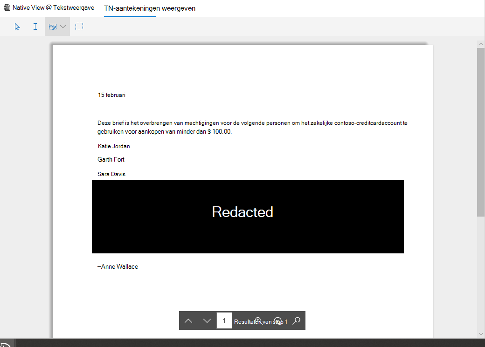

# Documenten weergeven in een revisieset in Advanced eDiscovery

Advanced eDiscovery geeft inhoud weer via verschillende gebruikers, elk met verschillende doeleinden. De verschillende gebruikers kunnen worden gebruikt door op een document in een revisieset te klikken. De huidige kijkers zijn:

- Bestandsmetagegevens
- Inheems beeld
- Tekstweergave
- Aantekeningen maken

## Bestandsmetagegevens

Dit deelvenster kan worden in- of uitgeschakeld om verschillende metagegevens weer te geven die aan het document zijn gekoppeld. Hoewel het raster met zoekresultaten kan worden aangepast om specifieke metagegevens weer te geven, zijn er gevallen waarin horizontaal schuiven lastig kan zijn tijdens het controleren van gegevens. In het deelvenster Bestandsmetagegevens kan een gebruiker schakelen in een weergave in de viewer.

## Inheems beeld

De native viewer geeft de rijkste weergave van een document weer. Het ondersteunt honderden bestandstypen en is bedoeld om de waarst mogelijke native ervaring weer te geven. Voor Microsoft Office bestanden gebruikt de viewer de webversie van Office-apps om inhoud weer te geven, zoals document opmerkingen, Excel formules, verborgen rijen/kolommen en PowerPoint notities.

## Tekstweergave

De viewer Tekst biedt een weergave van de uitgepakte tekst van een bestand. Ingesloten afbeeldingen en opmaak worden genegeerd, maar zijn zeer effectief als u de inhoud snel wilt begrijpen. De tekstweergave bevat ook de volgende functies:

- Met regelteller kunt u gemakkelijker verwijzen naar specifieke gedeelten van een document
- Markeer de zoekactie om termen in het document en de schuifbalk te markeren
- De diffweergave biedt een vergelijkingsweergave die tekstuele verschillen markeert bij het weergeven van Documenten bij dubbele weergave

## Aantekeningen maken

De weergave Aantekeningen bevat functies waarmee gebruikers markeringen kunnen toepassen op een document, waaronder:

- Gebiedsreactie: gebruikers kunnen een vak tekenen in het document om gevoelige inhoud te verbergen
- Potlood: gebruikers kunnen hand in hand tekenen op een document om de aandacht te vestigen op bepaalde gedeelten van een document
- Aantekeningen selecteren: gebruikers kunnen aantekeningen in een document selecteren om ze te verwijderen
- Aantekeningstransparantie in-/uitschakelen: maakt aantekeningen semitransparantie om de inhoud achter de aantekening weer te geven
- Vorige pagina: navigeert naar vorige pagina
- Volgende pagina: navigeert naar de volgende pagina
- Naar pagina gaan: de gebruiker kan een specifiek paginanummer invoeren om naar te navigeren
- Zoomen: zoomniveau instellen voor aantekeningenweergave
- Draaien: gebruiker kan document met de klok mee draaien
- Zoeken: gebruiker kan zoeken in een document en naar de verschillende hits in het document navigeren

  

## Dashboardweergave

Met de dashboardweergave kunt u de gegevens in het raster met zoekresultaten visualiseren en samenvatten. In deze weergave kunt u aangepaste widgets maken om het analyseren en rapporteren van uw revisieset intuïtief en eenvoudig te maken. Nadat u uw widgets hebt gemaakt, kunt u er mee werken om het aantal items op te halen of om een zoekopdracht te maken.
