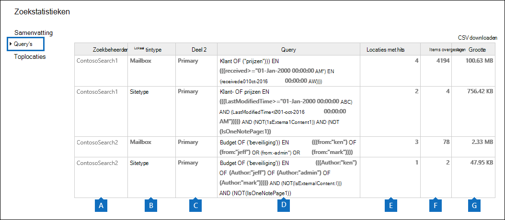
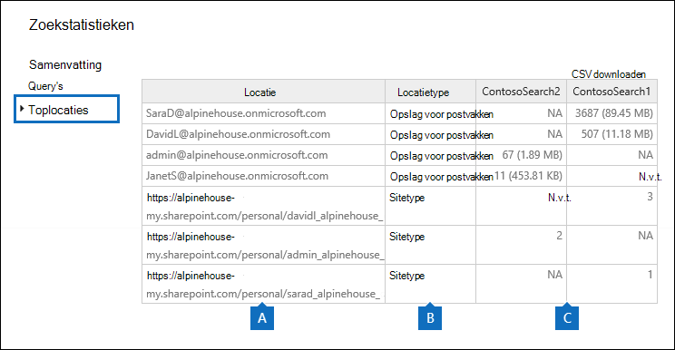

# Trefwoordstatistieken weergeven voor resultaten van inhoudszoekactieView keyword statistics for Content Search results

Nadat u een inhoudszoekactie hebt gestart en uitgevoerd, kunt u statistieken bekijken over de geschatte zoekresultaten.After you create and run a Content Search, you can view statistics about the estimated search results. Dit omvat een overzicht van de zoekresultaten (vergelijkbaar met de samenvatting van de geschatte zoekresultaten die worden weergegeven in het detailvenster), de querystatistieken, zoals het aantal inhoudslocaties met items die overeenkomen met de zoekquery en de naam van inhoudslocaties met de meest overeenkomende items.This includes a summary of the search results (similar to the summary of the estimated search results displayed in the details pane), the query statistics such as the number of content locations with items that match the search query, and the name of content locations that have the most matching items. U kunt statistieken weergeven voor een of meer zoekopdrachten naar inhoud.You can display statistics for one or more content searches. Op deze manier kunt u snel de resultaten van meerdere zoekopdrachten vergelijken en beslissingen nemen over de effectiviteit van uw zoekquery's.This lets you to quickly compare the results for multiple searches and make decisions about the effectiveness of your search queries.
  
Daarnaast kunt u nieuwe en bestaande zoekopdrachten configureren om statistieken te retourneren voor elk trefwoord in een zoekquery.Additionally, you can configure new and existing searches to return statistics for each keyword in a search query. Op deze manier kunt u het aantal resultaten van elk trefwoord in een query vergelijken en de trefwoordstatistieken van meerdere zoekopdrachten vergelijken.This lets you compare the number of results for each keyword in a query and to compare the keyword statistics from multiple searches.
  
U kunt ook de zoekstatistieken en trefwoordstatistieken downloaden naar een CSV-bestand.You can also download the search statistics and keyword statistics to a CSV file. Op deze manier kunt u de filter- en sorteerfuncties in Excel gebruiken om resultaten te vergelijken en rapporten voor te bereiden op uw zoekresultaten.This lets you use the filtering and sorting features in Excel to compare results, and prepare reports for your search results.
  
## Statistieken voor zoeken naar inhoud downloadenGet statistics for Content Searches

Statistieken weergeven voor zoeken naar inhoud:To display statistics for Content searches:
  
1. Ga in Microsoft 365 compliancecentrum naar **Alle inhoud**  >  **zoeken.**In the Microsoft 365 compliance center, go to **Show all** > **Content search**.

2. Selecteer in de lijst met zoekopdrachten twee of meer zoekopdrachten en klik vervolgens op Zoekstatistieken **op** de flyoutpagina **Bulkacties.**In the list of searches, select two or more searches, and then click **Search statistics** on the **Bulk actions** flyout page.
    
    
  
3. Klik op **de pagina** Zoekstatistieken op een van de volgende koppelingen om statistieken weer te geven over de geselecteerde zoekopdrachten.On the **Search statistics** page, click one of the following links to display statistics about the selected searches. 
    
    **Samenvatting****Summary**
    
    Op deze pagina worden statistieken weergegeven die vergelijkbaar zijn met de statistieken die worden weergegeven in het detailvenster op de **pagina Inhoud zoeken.**This page displays statistics similar to the ones displayed in the details pane on the **Content search** page. Statistieken voor alle geselecteerde zoekopdrachten worden weergegeven.Statistics for all selected searches are displayed. U kunt de geselecteerde zoekopdrachten ook opnieuw uitvoeren vanaf deze pagina om de statistieken bij te werken.Note that you can also re-run the selected searches from this page to update the statistics. 
    
    
  
    a.a.  De naam van het zoeken naar inhoud.The name of the Content Search. Zoals eerder vermeld, kunt u statistieken voor meerdere zoekopdrachten weergeven en vergelijken.As previously stated, you can display and compare statistics for multiple searches.
    
    b.b. Het type inhoudslocatie dat is doorzocht.The type of content location that was searched. In elke rij worden statistieken weergegeven voor postvakken, sites en openbare mappen uit de opgegeven zoekopdracht.Each row displays statistics for mailboxes, sites, and public folders from the specified search.
    
    c.c. Het aantal inhoudslocaties met items die overeenkomen met de zoekquery.The number of content locations containing items that match the search query. Voor postvakken bevat deze statistiek ook het aantal archiefpostvakken dat items bevat die overeenkomen met de zoekquery.For mailboxes, this statistic also includes the number of archive mailboxes that contain items that match the search query.
    
    d.d. Het totale aantal items van alle opgegeven inhoudslocaties die overeenkomen met de zoekquery.The total number of items of all specified content locations that match the search query. Voorbeelden van itemtypen zijn e-mailberichten, agenda-items en documenten.Examples of item types include email messages, calendar items, and documents. Als een item meerdere exemplaren bevat van een trefwoord dat wordt gezocht, wordt dit slechts eenmaal geteld in het totale aantal items.If an item contains multiple instances of a keyword that is being searched for, it's only counted once in the total number of items. Als u bijvoorbeeld zoekt naar woorden 'aandelen' of 'fraude' en een e-mailbericht drie exemplaren bevat van het woord 'aandelen', wordt dit slechts eenmaal geteld in de kolom **Items.**For example, if you're searching for words "stock" or "fraud" and an email message contains three instances of the word "stock", it's only counted once in the **Items** column. 
    
    e.e. De totale grootte van alle items die zijn gevonden op de opgegeven inhoudslocatie die overeenkomen met de zoekquery.The total size of all items that were found in the specified content location that match the search query. 
    
    **Query's****Queries**
    
    Op deze pagina worden statistieken over de zoekquery weergegeven.This page displays statistics about the search query.
    
    
  
    a.a. De naam van het zoeken naar inhoud waar de rij querystatistieken voor bevat.The name of the Content Search that the row contains query statistics for.
    
    b.b. Het type inhoudslocatie waar de querystatistieken op van toepassing zijn.The type of content location that the query statistics are applicable to.
    
    c.c. In deze kolom wordt aangegeven op welk deel van de zoekquery de statistieken van toepassing zijn.This column indicates which part of the search query the statistics are applicable to. **Primair** geeft de hele zoekquery aan.**Primary** indicates the entire search query. Als u een trefwoordlijst gebruikt wanneer u een zoekquery maakt of bewerkt, worden statistieken voor elk onderdeel van de query in deze tabel opgenomen.If you use a keyword list when you create or edit a search query, statistics for each component of the query are included in this table. Zie de [sectie Trefwoordstatistieken voor zoeken](#get-keyword-statistics-for-content-searches) naar inhoud in dit artikel voor meer informatie.See the [Get keyword statistics for Content Searches](#get-keyword-statistics-for-content-searches) section in this article for more information. 
    
    d.d. Deze kolom bevat de werkelijke zoekquery die wordt uitgevoerd door het hulpprogramma Inhoud zoeken.This column contains the actual search query that run by the Content Search tool. Houd er rekening mee dat het hulpprogramma automatisch een paar extra onderdelen toevoegt aan de query die u maakt.Note that the tool automatically adds a few additional components to the query that you create. 

    - Wanneer u zoekt naar alle inhoud in postvakken (door geen trefwoorden op te geven), is de werkelijke woordquery zo dat alle  `size>=0` items worden geretourneerd.When you search for all content in mailboxes (by not specifying any keywords), the actual key word query is  `size>=0` so that all items are returned. 
    
     - Wanneer u op SharePoint Online en OneDrive voor Bedrijven sites, worden de twee volgende onderdelen toegevoegd:When you search SharePoint Online and OneDrive for Business sites, the two following components are added:
    
          **NOT IsExternalContent:1** : Sluit inhoud uit van een on-premises SharePoint organisatie.**NOT IsExternalContent:1** - Excludes any content from an on-premises SharePoint organization. 
    
          **NOT IsOneNotePage:1:** alle bestanden OneNote uitgesloten, omdat dit duplicaten zijn van elk document dat overeenkomt met de zoekquery.**NOT IsOneNotePage:1** - Excludes all OneNote files because these would be duplicates of any document that matches the search query. 

    
    e.e. Het aantal inhoudslocaties (opgegeven door de kolom \*\* Locatietype \*\* die items bevatten die overeenkomen met de zoekquery die in de **kolom Query wordt** vermeld.The number of the content locations (specified by the \*\* Location type \*\* column) that contain items that match the search query listed in the **Query** column. 
    
    f.f. Het aantal items (van de opgegeven inhoudslocatie) dat overeenkomen met de zoekquery in de **kolom** Query.The number of items (from the specified content location) that match the search query listed in the **Query** column. Zoals eerder uitgelegd, als een item meerdere exemplaren bevat van een trefwoord dat wordt gezocht, wordt dit slechts eenmaal geteld in deze kolom.As previously explained, if an item contains multiple instances of a keyword that is being searched for, it's only counted once in the this column. 
    
    g.g. De totale grootte van alle items die zijn gevonden (op de opgegeven inhoudslocatie) die overeenkomen met de zoekquery in de **kolom** Query.The total size of all items that were found (in the specified content location) that match the search query in the **Query** column. 
    
    **Toplocaties****Top locations**
    
    Op deze pagina worden statistieken weergegeven over het aantal items dat overeenkomen met de zoekquery op elke gezochte inhoudslocatie.This page displays statistics about the number of items that match the search query in each content location that was searched. De bovenste 1000 locaties worden weergegeven.The top 1,000 locations are displayed. Als u statistieken voor meerdere zoekopdrachten bekijkt, worden de bovenste 1000 locaties voor elke zoekopdracht weergegeven.If you view statistics for multiple searches, the top 1,000 locations for each search are displayed. Houd er rekening mee dat er geen inhoudslocatie is opgenomen op deze pagina als deze geen items bevat die overeenkomen met de zoekquery.Note that a content location isn't included on this page if it doesn't contain any items that match the search query.
    
    
  
    a.a. De naam van de inhoudslocatie.The name of the content location.
    
    b.b. Het type inhoudslocatie waar de locatiestatistieken op van toepassing zijn.The type of content location that the location statistics are applicable to.
    
    c.c. Er zijn kolommen voor elke zoekopdracht waar u statistieken voor wilt weergeven.There are columns for each search that you're displaying statistics for. In deze kolom ziet u het aantal (en de totale grootte) van items die overeenkomen met de zoekquery op elke inhoudslocatie.This column shows the number (and total size) of items that match the search query in each content location. Houd er rekening mee dat wanneer u statistieken voor meerdere zoekopdrachten we weergeven, de 'NA' in deze kolom aangeeft dat de inhoudslocatie niet is opgenomen in die zoekopdracht.Note that when you're displaying statistics for multiple searches, the "NA" in this column indicates that the content location wasn't included in that search. 

## Trefwoordstatistieken voor zoeken naar inhoud downloadenGet keyword statistics for Content Searches

Zoals eerder uitgelegd, worden op de pagina **Query's** de zoekquery en het aantal (en de grootte) van items weergegeven die overeenkomen met de query.As previous explained, the **Queries** page shows the search query and the number (and size) of items that match the query. Als u een lijst met trefwoorden gebruikt wanneer u een zoekquery maakt of bewerkt, kunt u uitgebreide statistieken krijgen die laten zien hoeveel items overeenkomen met elk trefwoord of trefwoord.If you use a keyword list when you create or edit a search query, you can get enhanced statistics that show how many items match each keyword or keyword phrase. Op deze manier kunt u snel bepalen welke onderdelen van de query het meest (en het minst) effectief zijn.This can help you quickly identify which parts of the query are the most (and least) effective. Als een trefwoord bijvoorbeeld een groot aantal items retourneert, kunt u ervoor kiezen om de trefwoordquery te verfijnen om de zoekresultaten te verfijnen.For example, if a keyword returns a large number of items, you might choose to refine the keyword query to narrow the search results. U kunt een trefwoordlijst instellen wanneer u een inhoudszoekactie maakt of bewerkt.You can set up a keyword list when you create or edit a Content Search. 

Een trefwoordlijst maken en trefwoordstatistieken weergeven voor een inhoudszoekactie:To create a keyword list and view keyword statistics for a Content Search:
  
1. Ga in Microsoft 365 compliancecentrum naar **Alle inhoud**  >  **zoeken.**In the Microsoft 365 compliance center, go to **Show all** > **Content search**.
    
2. Klik in de lijst met inhoudszoekbewerkingen op een zoekopdracht en klik vervolgens op **Pictogram**  bewerken.In the list of content searches, click and a search, and then click **Edit** .
    
3. Klik **op Query** en ga vervolgens als volgt te werk:Click **Query** and then do the following things: 
    
    
  
    a.a. Klik op **het selectievakje Trefwoordlijst weergeven.**Click the **Show keyword list** check box. 
    
    b.b. Typ een trefwoord of trefwoordfase in een rij in de trefwoordentabel.Type a keyword or keyword phase in a row in the keywords table. Typ bijvoorbeeld **budget** in de eerste rij en typ vervolgens **beveiliging** in de tweede rij.For example, type **budget** in the first row and then type **security** in the second row. 
    
4. Nadat u de trefwoorden hebt toegevoegd die u wilt zoeken en statistieken wilt krijgen, klikt u **op** Zoeken om de gewijzigde zoekopdracht uit te voeren.After adding the keywords that you want to search and get statistics for, click **Search** to run the revised search. 
    
5. Wanneer de zoekopdracht is voltooid, selecteert u deze in de lijst met zoekopdrachten en klikt u vervolgens op **de** knop  Zoekstatistieken.When the search is completed, select it in the list of searches, and then click **Search statistics** . U kunt ook trefwoordstatistieken weergeven en vergelijken voor meerdere zoekopdrachten.You can also display and compare keyword statistics for multiple searches.
    
6. Klik op **de pagina Zoekstatistieken** op **Query om** de trefwoordstatistieken weer te geven voor de geselecteerde zoekopdrachten.On the **Search statistics** page, click **Query** to display the keyword statistics for the selected searches. 
    
    
  
    Zoals in de vorige schermafbeelding wordt weergegeven, worden de statistieken voor elk trefwoord weergegeven. dit omvat:As shown in the previous screenshot, the statistics for each keyword are displayed; this includes: 
    
    - De trefwoordstatistieken voor elk type inhoudslocatie dat is opgenomen in de zoekopdracht.The keyword statistics for each type of content location included in the search.
    
    - De werkelijke zoekquery voor elk trefwoord, met alle voorwaarden uit de zoekquery.The actual search query for each keyword, which includes any conditions from the search query. 
    
    - De volledige zoekquery (die is geïdentificeerd als **primair** in de **kolom** Onderdeel) en de statistieken voor de volledige query.The complete search query (identified as **Primary** in the **Part** column) and the statistics for the complete query. Houd er rekening mee dat dit dezelfde statistieken zijn die worden weergegeven op de **pagina** Overzicht.Note these are the same statistics displayed on the **Summary** page. 

> [!NOTE]
> Als u problemen wilt beperken die worden veroorzaakt door grote trefwoordlijsten, bent u nu beperkt tot maximaal 20 rijen in de trefwoordlijst van een zoekquery.To help reduce issues caused by large keyword lists, you're now limited to a maximum of 20 rows in the keyword list of a search query.
