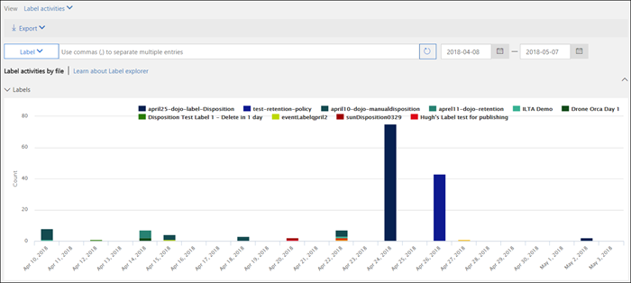

# Labelactiviteit voor documenten weergeven

Nadat u de labels hebt gemaakt, kunt u verifiëren of deze worden toegepast zoals bedoelt. Met de labelactiviteitenverkenner in het beveiligings- &amp; compliancecentrum kunt u de labelactiviteit van de afgelopen dertig dagen voor alle inhoud in SharePoint en OneDrive voor Bedrijven snel zoeken en bekijken. Dit zijn realtimegegevens die u een goed beeld geven van wat er in uw tenant gebeurt.
  
Met de labelactiviteitenverkenner kunt u het volgende doen:
  
- Bekijken hoe vaak elk label per dag is toegepast (maximaal dertig dagen).
    
- Zien wie welk bestand op welke datum heeft gelabeld, samen met een koppeling naar de site waar dat bestand zich bevindt.
    
- Bekijken voor welke bestanden labels zijn gewijzigd of verwijderd, wat de oude en nieuwe labels zijn en wie de wijziging heeft aangebracht.
    
- De gegevens filteren om alle labelactiviteit voor een specifiek label, bestand of gebruiker te bekijken. U kunt ook labelactiviteit filteren op locatie (SharePoint of OneDrive voor Bedrijven) en of het label handmatig of automatisch is toegepast.
    
- Bekijk labelactiviteit voor zowel mappen als afzonderlijke documenten. Binnenkort kunt u zien hoeveel bestanden in die map zijn gelabeld omdat de map is gelabeld.
    
U vindt de labelactiviteitenverkenner in het beveiligings- &amp; compliancecentrum > **Informatiebeheer** > **Labelactiviteitenverkenner**.
  
Houd er rekening mee dat voor de labelactiviteitenverkenner een Office 365 Enterprise E5-abonnement is vereist.
  

  
## Labelactiviteiten voor bestanden of mappen weergeven

Boven aan de labelactiviteitenverkenner kunt u kiezen of u activiteiten voor bestanden of mappen wilt bekijken. Houd er rekening mee dat mapactiviteit alleen de map zelf betreft, niet de bestanden in de map.
  
Mogelijk wilt u labelactiviteit voor mappen zien omdat als u een map labelt, alle bestanden in die map dat label krijgen (met uitzondering van bestanden waarop expliciet een label is toegepast). Het labelen van mappen kan dus van invloed zijn op een aanzienlijk aantal bestanden. Zie [Een standaardretentielabel toepassen op alle inhoud in een SharePoint-bibliotheek, -map of -documentenset](create-apply-retention-labels.md#applying-a-default-retention-label-to-all-content-in-a-sharepoint-library-folder-or-document-set) voor meer informatie.
  

  
### Labelactiviteiten

 **Labelactiviteiten** bevat alle labelacties: **toevoegen**, **verwijderen** of **wijzigen** van een etiket. U kunt deze weergave gebruiken voor een uitgebreid overzicht van het aantal bestanden waarop elk etiket per dag is toegepast. 
  
### Labelwijzigingen

 **Labelwijzigingen** omvat de mogelijk riskante acties van het **verwijderen** of **wijzigen** van een label. U kunt deze weergave gebruiken om snel dergelijke riskante acties te bekijken en tevens de gebruiker die ze heeft uitgevoerd. In de activiteitenlijst onder de grafiek kunt u een bestand selecteren en vervolgens in het detailvenster aan de rechterkant op een koppeling naar dat bestand klikken. 
  

  
## Labelactiviteit filteren

U kunt de gegevens snel filteren om alle labelactiviteit voor een specifiek label, bestand of gebruiker te bekijken. U kunt ook labelactiviteit filteren op locatie (SharePoint of OneDrive voor Bedrijven) en of het label handmatig of automatisch is toegepast.
  

  

