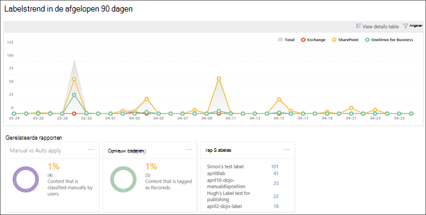
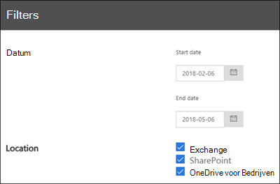

# De gegevensbeheerrapporten weergeven

Nadat u de labels gemaakt hebt, kunt u verifiëren of deze toegepast worden zoals u voorzien had. Met gegevensbeheerrapporten in het &amp;Beveiligings-en compliancecentrum kunt u het volgende snel bekijken:
  
- **Top 5 labels** Dit rapport geeft het aantal van de top 5 labels weer die toegepast werden op de inhoud. Klik op dit rapport om een lijst weer te geven van alle labels die recentelijk zijn toegepast op de inhoud. U kunt het aantal en de locatie van elk label zien, hoe het is toegepast, de bewaaracties, of het een record is en het dispositietype. 
    
- **Manueel vs automatisch toepassen** Dit rapport geeft het aantal weer van alle inhoud die manueel of automatisch gelabeld is en het percentage van de inhoud dat manueel is gelabeld tegenover automatisch. 
    
- **Taggen van records** Dit rapport geeft het aantal weer van alle inhoud die getagd werd als een record of niet-record en het percentage van inhoud dat als record werd getagd tegenover niet-record. 
    
- **Trend van labels van de laatste 90 dagen** Dit rapport geeft het aantal en locatie weer van alle labels die werden toegepast in de laatste 90 dagen. 
    
Alle rapporten geven gelabelde inhoud weer uit Exchange, SharePoint en OneDrive voor Bedrijven.
  
U vindt deze rapporten terug in het Beveiligings-&amp;en compliancecentrum \> **Informatiebeheer** \> [**Dashboard**](https://protection.office.com/datamanagement/dashboard).
  

  
U kunt gegevensbeheerrapporten filteren op datum (tot 90 dagen) en locatie (Exchange, SharePoint en OneDrive voor Bedrijven). Het kan tot 24 uur duren voordat de meest recente gegevens worden weergegeven in het rapport.
  

  

