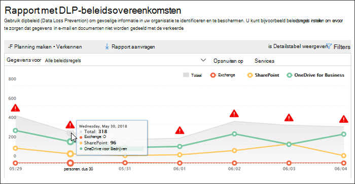
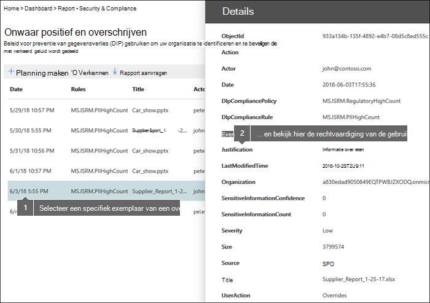
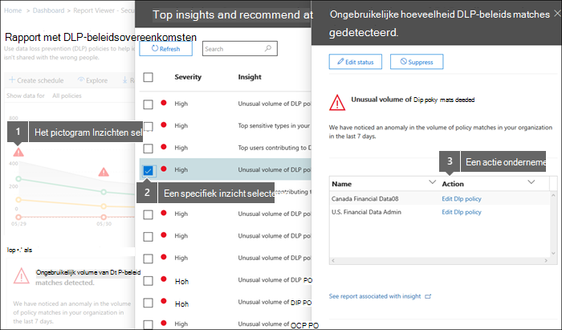

# De rapporten weergeven voor preventie van gegevensverlies

Nadat u uw DLP-beleid (Data Loss Prevention) heeft gemaakt, moet u controleren of het werkt zoals u het bedoeld heeft en of het u helpt om aan de regels te blijven voldoen. Met de DLP-rapporten in het Beveiligings compliancecentrum kunt u snel het &amp; volgende bekijken:
  
- **DLP-beleid** In dit rapport ziet u het aantal DLP-beleids matches in de tijd. U kunt het rapport filteren op datum, locatie, beleid of actie. U kunt dit rapport gebruiken om: 
    
  - U kunt uw DLP-beleid afstemmen of verfijnen terwijl u ze in de testmodus uit runt. U kunt de specifieke regel bekijken die overeenkomen met de inhoud.
    
  - Focus op specifieke tijdsperiodes en begrijp de redenen voor pieken en trends.
    
  - Ontdek bedrijfsprocessen die strijdig zijn met het DLP-beleid van uw organisatie.
    
  - Inzicht in de zakelijke gevolgen van het DLP-beleid door te zien welke acties worden toegepast op inhoud.
    
  - Controleer de naleving van een specifiek DLP-beleid door alle overeenkomsten voor dat beleid weer te geven.
    
  - Bekijk een lijst met beste gebruikers en herhaal gebruikers die bijdragen aan incidenten in uw organisatie.
    
  - Bekijk een lijst met de belangrijkste typen gevoelige informatie in uw organisatie.
    
- **DLP-incidenten** In dit rapport ziet u ook beleidswedstrijden in de tijd, zoals het rapport beleid dat overeenkomt met het beleid. Het rapport beleid komt overeen met overeenkomsten op regelniveau. Als een e-mailbericht bijvoorbeeld overeenkomt met drie verschillende regels, worden er drie verschillende regelitems in het rapport beleid gevonden. Het rapport incidenten daarentegen bevat overeenkomsten op itemniveau. Als een e-mailbericht bijvoorbeeld aan drie verschillende regels heeft gematcht, wordt in het rapport incidenten één regelitem voor dat inhoudsartikel gebruikt. 
    
  Omdat de rapporttellingen anders worden samengevoegd, is het rapport beleidsafstemmingen beter voor het identificeren van overeenkomsten met specifieke regels en het afstemmen van DLP-beleid. Het rapport incidenten is beter voor het identificeren van specifieke inhoudsstukken die problematisch zijn voor uw DLP-beleid.
    
- **DLP false positives and overrides** Als gebruikers met uw DLP-beleid het kunnen overschrijven of een onwaar positief rapport kunnen rapporteren, wordt in dit rapport een aantal van dergelijke exemplaren in de tijd berekent. U kunt het rapport filteren op datum, locatie of beleid. U kunt dit rapport gebruiken om: 
    
  - U kunt uw DLP-beleid afstemmen of verfijnen door te zien welk beleid een hoog aantal onwaar-positieven veroorzaakt.
    
  - Bekijk de rechtvaardigingen die door gebruikers zijn ingediend wanneer ze een beleidstip oplossen door het beleid te overschrijven.
    
  - Ontdek waar DLP-beleid strijdig is met geldige bedrijfsprocessen door een groot aantal gebruikers te overschrijven.
    
Alle DLP-rapporten kunnen gegevens uit de meest recente periode van vier maanden laten zien. Het kan tot 24 uur duren voordat de meest recente gegevens worden weergegeven in het rapport.
  
U vindt deze rapporten in het dashboard Rapporten van het &amp; Beveiligings \>  \> **compliancecentrum.**
  

  
## De rechtvaardiging weergeven die door een gebruiker is ingediend voor een overschrijven

Als uw DLP-beleid gebruikers toestaat dit te overschrijven, kunt u het fout-positieve rapport gebruiken en het rapport overschrijven gebruiken om de tekst weer te geven die door gebruikers is verzonden in de beleidstip.
  

  
## Actie ondernemen op basis van inzichten en aanbevelingen

Rapporten kunnen inzichten en aanbevelingen weergeven waarin u op het rode waarschuwingspictogram kunt klikken om details over mogelijke problemen te zien en mogelijke herstelactie uit te voeren.
  

  
## Machtigingen voor DLP-rapporten

Als u DLP-rapporten wilt weergeven in het & compliancecentrum, moet u het volgende krijgen:

- **Rol beveiligingslezer** in het Exchange beheercentrum. Deze rol is standaard toegewezen aan de rollengroepen Organisatiebeheer en Beveiligingslezer in het Exchange beheercentrum.

- **De functie View-Only DLP Compliance Management** in & Compliance Center. Deze rol is standaard toegewezen aan de rollengroepen Compliancebeheerder, Organisatiebeheer, Beveiligingsbeheerder en Beveiligingslezer in het beveiligingscentrum & Compliancecentrum.

- **De rol Alleen-weergeven geadresseerden** in het Exchange beheercentrum. Deze rol is standaard toegewezen aan de rollengroepen Compliancebeheer, Organisatiebeheer en View-Only organisatiebeheer in het Exchange beheercentrum.

## De cmdlets voor de DLP-rapporten zoeken

Als u de meeste cmdlets wilt gebruiken voor het Beveiligings &amp; compliancecentrum, moet u het volgende doen:
  
1. [Verbinding maken naar het Beveiligings &amp; compliancecentrum met behulp van externe PowerShell](/powershell/exchange/connect-to-scc-powershell&amp;clcid=0x409)
    
2. Een van deze [ &amp; cmdlets van het Beveiligings compliancecentrum gebruiken](/powershell/exchange/exchange-online-powershell)
    
In DLP-rapporten moeten echter gegevens uit verschillende Office 365 worden verzameld, inclusief Exchange Online. Daarom zijn de cmdlets voor de DLP-rapporten beschikbaar in Exchange Online Powershell, niet in Security &amp; Compliance Center Powershell. Als u de cmdlets voor de DLP-rapporten wilt gebruiken, moet u het volgende doen:
  
1. [Maak verbinding met Exchange Online via externe PowerShell](/powershell/exchange/connect-to-exchange-online-powershell)
    
2. Gebruik een van deze cmdlets voor de DLP-rapporten:
    
      - [Get-DlpDetectionsReport](/powershell/module/exchange/get-dlpdetectionsreport)
    
      - [Get-DlpDetailReport](/powershell/module/exchange/get-dlpdetailreport)
