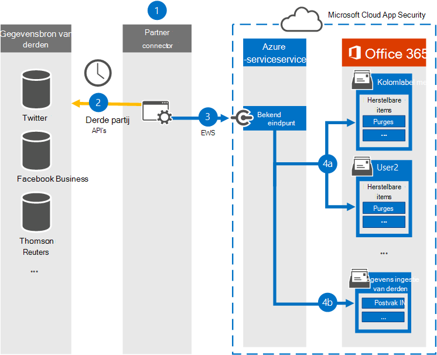
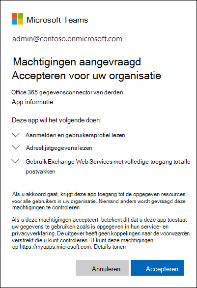

# <a name="work-with-a-partner-to-archive-third-party-data"></a>Werken met een partner voor het archiveren van gegevens van derden

U kunt met een Microsoft-partner werken om gegevens uit een externe gegevensbron te importeren en te archiveren Microsoft 365. Een partner kan u een aangepaste verbindingslijn bieden die is geconfigureerd om items uit de gegevensbron van derden op te halen (op regelmatige basis) en vervolgens deze items te importeren. De partnerconnector converteert de inhoud van een item uit de gegevensbron naar een e-mailberichtindeling en slaat de items vervolgens op in postvakken. Nadat gegevens van derden zijn geïmporteerd, kunt u Microsoft 365 compliancefuncties zoals Litigation Hold, eDiscovery, In-Place Archiving, Auditing en Microsoft 365 bewaarbeleid toepassen op deze gegevens.

>[!IMPORTANT]
>De [communicatie complianceoplossing](communication-compliance.md) in Microsoft 365 kan niet worden toegepast op de gegevens van derden die zijn geïmporteerd door partnerconnectoren die in dit artikel worden vermeld. 

Hier volgen een overzicht van het proces en de stappen die nodig zijn om samen met een Microsoft-partner gegevens van derden te importeren.

[Stap 1: Een externe gegevenspartner zoeken](#step-1-find-a-third-party-data-partner)

[Stap 2: Een gegevenspostvak van derden maken en configureren](#step-2-create-and-configure-a-third-party-data-mailbox-in-microsoft-365)

[Stap 3: Gebruikerspostvakken configureren voor gegevens van derden](#step-3-configure-user-mailboxes-for-third-party-data)

[Stap 4: Geef uw partner informatie](#step-4-provide-your-partner-with-information)

[Stap 5: De gegevensconnector van derden registreren in Azure Active Directory](#step-5-register-the-third-party-data-connector-in-azure-active-directory)

## <a name="how-the-third-party-data-import-process-works"></a>Hoe het gegevensimportproces van derden werkt

In de volgende afbeelding en beschrijving wordt uitgelegd hoe het importproces voor gegevens van derden werkt wanneer u met een partner werkt.
  

  
1. De klant werkt samen met zijn of haar partner om een connector te configureren die items uit de gegevensbron van derden haalt en vervolgens deze items importeert in Microsoft 365.
    
2. De partnerconnector maakt verbinding met gegevensbronnen van derden via een API van derden (gepland of geconfigureerd) en haalt items uit de gegevensbron op. De partnerconnector converteert de inhoud van een item naar een e-mailberichtindeling. Zie de [sectie Meer informatie](#more-information) voor een beschrijving van het schema voor berichtindeling. 
    
3. Partnerconnector maakt verbinding met de Azure-service in Microsoft 365 via Exchange Web Service (EWS) via een bekend eindpunt.
    
4. Items worden geïmporteerd in het postvak van een specifieke gebruiker of in een 'catch-all' gegevenspostvak van derden. Of een item wordt geïmporteerd in een specifiek gebruikerspostvak of in het gegevenspostvak van derden, is gebaseerd op de volgende criteria:
    
   1. **Items met een gebruikers-id die overeenkomt met een gebruikersaccount:** Als de partnerconnector de gebruikers-id van het item in de gegevensbron van derden kan in kaart brengen aan een specifieke gebruikers-id in Microsoft 365, wordt het item gekopieerd naar de map **Purges** in de map Herstelbare items van de gebruiker. Gebruikers hebben geen toegang tot items in de map Purges. U kunt echter eDiscovery-hulpprogramma's gebruiken om te zoeken naar items in de map Purges.
    
   1. **Items die geen gebruikers-id hebben die overeenkomen met een gebruikersaccount:** Als de partnerconnector de gebruikers-id van een item niet aan een specifieke gebruikers-id kan toevoegen, wordt het item gekopieerd naar de map **Postvak IN** van het gegevenspostvak van derden. Als u items importeert in het Postvak IN, kunt u of iemand in uw organisatie zich aanmelden bij het postvak van derden om deze items weer te geven en te beheren, en te kijken of er wijzigingen moeten worden aangebracht in de configuratie van de partnerconnector.
 
## <a name="step-1-find-a-third-party-data-partner"></a>Stap 1: Een externe gegevenspartner zoeken

Een belangrijk onderdeel voor het archiveren van gegevens van derden in Microsoft 365 is het zoeken en werken met een Microsoft-partner die zich specialiseert in het vastleggen van gegevens van een externe gegevensbron en het importeren ervan in Microsoft 365. Nadat de gegevens zijn geïmporteerd, kunnen deze worden gearchiveerd en bewaard, samen met de andere Microsoft-gegevens van uw organisatie, zoals e-mail van Exchange en documenten uit SharePoint en OneDrive voor Bedrijven. Een partner maakt een verbindingslijn die gegevens uit de gegevensbronnen van derden van uw organisatie haalt (zoals BlackBerry, Facebook, Google+, Thomson Reuters, Twitter en YouTube) en deze gegevens doorverzend naar een Microsoft 365-API die items importeert naar Exchange-postvakken als e-mailberichten.
  
In de volgende secties worden de Microsoft-partners (en de gegevensbronnen van derden die ze ondersteunen) vermeld die deelnemen aan het programma voor het archiveren van gegevens van derden in Microsoft 365.

[17a-4 LLC](#17a-4-llc)
  
[ArchiveSocial](#archivesocial)
  
[Veritas](#veritas)
  
[OpenText](#opentext)
  
[Smarsh](#smarsh)

[Verba](#verba)
  
### <a name="17a-4-llc"></a>17a-4 LLC

[17a-4 LLC](https://www.17a-4.com) ondersteunt de volgende gegevensbronnen van derden:
  
- BlackBerry
    
- Gegevens van Bloomberg Streams
    
- Cisco Jabber
    
- FactSet
    
- HipChat
    
- InvestEdge
    
- LivePerson
    
- MessageLabs Data Streams
    
- OpenText
    
- Oracle/ATG 'click-to-call' Live Help
    
- Pivot IMTRADER
    
- Microsoft SharePoint
    
- MindAlign
    
- Sitrion One (Newsgator)
    
- Skype voor Bedrijven (Lync/OCS)
    
- Skype voor Bedrijven Online (Lync Online)
    
- SQL Databases
    
- Squawker
    
- Thomson Reuters Eikon Messenger
  

  
### <a name="archivesocial"></a>ArchiveSocial

[ArchiveSocial ](https://www.archivesocial.com) ondersteunt de volgende gegevensbronnen van derden: 
  
- Facebook
    
- Flickr
    
- Instagram
    
- LinkedIn
    
- Pinterest
    
- Twitter
    
- YouTube
    
- Vimeo
  
### <a name="veritas"></a>Veritas

[Veritas](https://www.globanet.com) ondersteunt de volgende gegevensbronnen van derden: 
  
- AOL met draaitabelclient 
    
- BlackBerry-oproeplogboeken (v5, v10, v12)
    
- BlackBerry Messenger (v5, v10, v12)
    
- BlackBerry-pincode (v5, v10, v12)
    
- BlackBerry Sms (v5, v10, v12)
    
- Bloomberg Chat
    
- E-mail van Bloomberg
    
- Vak
    
- CipherCloud voor Salesforce Chatter
    
- Cisco IM &amp; Presence Server (v10, v10.5.1 SU1, v11.0, v11.5 SU2)

- Cisco Webex Teams

- Citrix Workspace &amp; ShareFile

- CrowdCompass

- Aangepaste tekstbestanden met scheidingstekens
    
- Aangepaste XML-bestanden
    
- Facebook (pagina's)
    
- Factset
    
- FXConnect
    
- ICE Chat/YellowJacket
    
- Jive
    
- Macgregor XIP

- Microsoft Exchange Server
    
- Microsoft OneDrive voor Bedrijven

- Microsoft Teams
       
- Microsoft Yammer
    
- Mobiele beveiliging
    
- Pivot
    
- Salesforce Chatter

- Skype voor Bedrijven Online
    
- Skype voor Bedrijven versie 2007 R2 - 2016 (on-premises)
    
- Slack Enterprise Grid
    
- Symphony
    
- Thomson Reuters Eikon
    
- Thomson Reuters Messenger
    
- Thomson Reuters Dealings 3000 / FX Trading
    
- Twitter
    
- UBS-chat
    
- YouTube
  
### <a name="opentext"></a>OpenText

[OpenText](https://www.opentext.com/what-we-do/products/opentext-product-offerings-catalog/rebranded-products/daegis) ondersteunt de volgende gegevensbronnen van derden: 
  
- Axs Encrypted
    
- Axs Exchange
    
- Axs Local Archive
    
- Tijdelijke aanduiding Axs
    
- Axs Signed
    
- Bloomberg
    
- Thomson Reuters
  
### <a name="smarsh"></a>Smarsh

[Smarsh ondersteunt](https://www.smarsh.com) de volgende gegevensbronnen van derden: 
  
- AIM
    
- American Idool
    
- Appelsap
    
- AOL met draaitabelclient
    
- Ares
    
- De stem van Dezaar
    
- Bear Share
    
- Bit-torrent
    
- BlackBerry-oproeplogboeken (v5, v10, v12)
    
- BlackBerry Messenger (v5, v10, v12)
    
- BlackBerry-pincode (v5, v10, v12)
    
- BlackBerry Sms (v5, v10, v12)
    
- E-mail van Bloomberg
    
- CellTrust
    
- Chat importeren
    
- Realtime logboekregistratie en beleid chatten
    
- Chatter
    
- Cisco IM &amp; Presence Server (v9.0.1, v9.1, v9.1.1 SU1, v10, v10.5.1 SU1)
    
- Cisco Unified Presence Server (v8.6.3, v8.6.4, v8.6.5)
    
- Samenwerking importeren
    
- Realtime logboekregistratie voor samenwerking
    
- Directe Verbinding maken
    
- Facebook
    
- FactSet
    
- FastTrack
    
- Gnutella
    
- Google+
    
- GoToMyPC
    
- Hopster
    
- HubConnex
    
- IBM Connections (v3.0.1, v4.0, v4.5, v4.5 CR3, v5)
    
- IBM Connections Chat Cloud
    
- IBM Connections Social Cloud
    
- IBM SameTime Advanced 8.5.2 IFR1
    
- IBM SameTime Communicate 9.0
    
- IBM SameTime Community (v8.0.2, v8.5.1 IFR2, v8.5.2 IFR1, v9.1)
    
- IBM SameTime Complete 9.0
    
- IBM SameTime Conference 9.0
    
- IBM SameTime Meeting 8.5.2 IFR1
    
- ICE/YellowJacket
    
- Chat importeren
    
- Realtime logboekregistratie en beleid chatberichten
    
- Indii Messenger
    
- Instant Bloomberg
    
- IRC
    
- Jive
    
- Jive 6 Realtime logboekregistratie (v6, v7)
    
- Jive-import
    
- JXTA
    
- LinkedIn
    
- Microsoft Lync (2010, 2013)
    
- MFTP
    
- Microsoft Lync 2013 Voice
    
- Microsoft SharePoint (2010, 2013)
    
- Microsoft SharePoint Online
    
- Microsoft UC (Unified Communications)
    
- MindAlign
    
- Mobiele beveiliging
    
- MSN
    
- Mijn ruimte
    
- NEONetwork
    
- Microsoft 365 Lync Dedicated
    
- Microsoft 365 Gedeeld chatbericht
    
- Pinterest
    
- Pivot
    
- QQ
    
- Skype voor Bedrijven 2015
    
- SoftEther
    
- Symphony
    
- Thomson Reuters Eikon
    
- Thomson Reuters Messenger
    
- Tor
    
- TTT
    
- Twitter
    
- WinMX
    
- Winny
    
- Yahoo
    
- Yammer
    
- YouTube
    

### <a name="verba"></a>Verba

[Verba ondersteunt](https://www.verba.com) de volgende gegevensbronnen van derden: 
  
- Avaya Aura Video
    
- Avaya Aura Voice
    
- Avtec Radio
    
- Bosch/Telex Radio
    
- BroadSoft Video
    
- BroadSoft Voice
    
- Centile Voice
    
- Cisco Jabber-chatbericht
    
- Cisco UC Video
    
- Cisco UC Voice
    
- Cisco UCCX/UCCE Video
    
- Cisco UCCX/UCCE Voice
    
- ESChat Radio
    
- Geoman Contact Expert
    
- IP Trade Voice
    
- Luware LUCS Contact Center
    
- Microsoft UC (Unified Communications)
    
- Mitel MiContact Center voor Lync (prairieFyre)
    
- Oracle / Acme Packet Session Border Controller Video
    
- Oracle / Acme Packet Session Border Controller Voice
    
- Singtel Mobile Voice
    
- SIPREC Video
    
-  SIPREC Voice 
    
- Skype voor Bedrijven / Lync-chatbericht
    
- Skype voor Bedrijven / Lync Video
    
- Skype voor Bedrijven / Lync Voice
    
- Luidsprekerbus-stem
    
- Standaard SIP/H.323 Video
    
- Standaard SIP/H.323 Voice
    
- Truphone-stem
    
- TwistedPair Radio
    
- Windows Bureaubladcomputerscherm
  
## <a name="step-2-create-and-configure-a-third-party-data-mailbox-in-microsoft-365"></a>Stap 2: Een gegevenspostvak van derden maken en configureren in Microsoft 365

Hier volgen de stappen voor het maken en configureren van een gegevenspostvak van derden voor het importeren van gegevens in Microsoft 365. Zoals eerder is uitgelegd, worden items geïmporteerd in dit postvak als de partnerconnector de gebruikers-id van het item niet aan een gebruikersaccount kan toevoegen.
  
 **Deze taken uitvoeren in het Microsoft 365 beheercentrum**
  
1. Maak een gebruikersaccount en wijs het een licentie Exchange Online abonnement 2 toe. zie [Gebruikers toevoegen aan Microsoft 365.](../admin/add-users/add-users.md) Een abonnement 2-licentie is vereist om het postvak in de bewaring voor rechtszaken te plaatsen of om een archiefpostvak met een onbeperkt opslagquotum in te stellen.
    
2. Voeg het gebruikersaccount voor het gegevenspostvak van derden toe aan **Exchange beheerdersrol** in Microsoft 365; zie [Beheerdersrollen toewijzen in Microsoft 365.](../admin/add-users/assign-admin-roles.md)
    
    > [!TIP]
    > Noteert u de referenties voor dit gebruikersaccount. U moet deze aan uw partner verstrekken, zoals beschreven in stap 4. 
  
 **Deze taken uitvoeren in het Exchange beheercentrum**
  
1. Het gegevenspostvak van derden verbergen in het adresboek en andere adreslijsten in uw organisatie; zie [Gebruikerspostvakken beheren.](/exchange/recipients-in-exchange-online/manage-user-mailboxes/manage-user-mailboxes) U kunt ook de volgende PowerShell-opdracht uitvoeren:
    
    ```powershell
    Set-Mailbox -Identity <identity of third-party data mailbox> -HiddenFromAddressListsEnabled $true
    ```

2. Wijs **de machtiging FullAccess** toe aan het gegevenspostvak van derden, zodat beheerders of compliancemedewerkers het gegevenspostvak van derden kunnen openen in de Outlook desktopclient; zie [Machtigingen voor geadresseerden beheren.](https://go.microsoft.com/fwlink/p/?LinkId=692104)
    
3. Schakel de volgende compliance-gerelateerde functies in voor het gegevenspostvak van derden:
    
    - Het archiefpostvak inschakelen. zie [Archiefpostvakken inschakelen en](enable-archive-mailboxes.md) [Onbeperkt archiveren inschakelen.](enable-unlimited-archiving.md) Hiermee kunt u opslagruimte vrij maken in het primaire postvak door een archiefbeleid in te stellen waarmee gegevensitems van derden naar het archiefpostvak worden verplaatst. Dit biedt u onbeperkte opslagruimte voor gegevens van derden.
    
    - Plaats het gegevenspostvak van derden in de procedure voor het in de wacht houden van rechtszaken. U kunt ook een bewaarbeleid Microsoft 365 in het beveiligings- en compliancecentrum. Als u dit postvak in de wacht zet, blijven gegevensitems van derden (voor onbepaalde tijd of voor een bepaalde duur) behouden en worden ze niet uit het postvak verwijderd. Zie een van de volgende onderwerpen:
    
      - [Een postvak in de wacht houden voor rechtszaken plaatsen](./create-a-litigation-hold.md)
    
      - [Meer informatie over bewaarbeleid en retentielabels](retention.md)
    
    - Logboekregistratie voor postvakcontrole inschakelen voor toegang van eigenaar, gedelegeerde en beheerder tot het gegevenspostvak van derden; zie [Postvakcontrole inschakelen.](enable-mailbox-auditing.md) Hiermee kunt u alle activiteiten controleren die worden uitgevoerd door elke gebruiker die toegang heeft tot het gegevenspostvak van derden.

## <a name="step-3-configure-user-mailboxes-for-third-party-data"></a>Stap 3: Gebruikerspostvakken configureren voor gegevens van derden

De volgende stap is het configureren van postvakken van gebruikers om gegevens van derden te ondersteunen. Voltooi deze taken met behulp van het Exchange beheercentrum of met de bijbehorende Windows PowerShell cmdlets.
  
1. Schakel het archiefpostvak voor elke gebruiker in; zie [Archiefpostvakken inschakelen en](enable-archive-mailboxes.md) [Onbeperkt archiveren inschakelen.](enable-unlimited-archiving.md)
    
2. Gebruikerspostvakken in bewaring plaatsen of een bewaarbeleid Microsoft 365 toepassen; zie een van de volgende onderwerpen: 
    
    - [Een postvak in de wacht houden voor rechtszaken plaatsen](./create-a-litigation-hold.md)
    
    - [Meer informatie over bewaarbeleid en retentielabels](retention.md)
    
    Zoals eerder is aangegeven, kunt u, wanneer u postvakken in de wacht houdt, een duur instellen voor de duur van het opslaan van items uit de gegevensbron van derden of u kunt ervoor kiezen items voor onbepaalde tijd vast te houden.

## <a name="step-4-provide-your-partner-with-information"></a>Stap 4: Geef uw partner informatie

De laatste stap is om uw partner de volgende informatie te verstrekken, zodat deze de verbindingslijn kan configureren om verbinding te maken met uw organisatie om gegevens te importeren in gebruikerspostvakken en in het gegevenspostvak van derden. 
  
- Het eindpunt dat wordt gebruikt om verbinding te maken met de Azure-service in Microsoft 365:

    ```http
    https://office365ingestionsvc.gble1.protection.outlook.com/service/ThirdPartyIngestionService.svc
    ```

- De aanmeldingsreferenties (Microsoft 365 gebruikers-id en wachtwoord) van het gegevenspostvak van derden dat u hebt gemaakt in stap 2. Deze referenties zijn vereist, zodat de partnerconnector items kan openen en importeren in postvakken van gebruikers en in het gegevenspostvak van derden.
 
## <a name="step-5-register-the-third-party-data-connector-in-azure-active-directory"></a>Stap 5: De gegevensconnector van derden registreren in Azure Active Directory

Vanaf 30 september 2018 wordt met de Azure-service in Microsoft 365 moderne verificatie in Exchange Online gebruikt om gegevensconnectoren van derden te verifiëren die verbinding proberen te maken met uw organisatie om gegevens te importeren. De reden voor deze wijziging is dat moderne verificatie meer beveiliging biedt dan de huidige methode, die is gebaseerd op een lijst met toegestane connectors van derden die het eerder beschreven eindpunt gebruiken om verbinding te maken met de Azure-service.

Als u een externe gegevensconnector wilt inschakelen om verbinding te maken met Microsoft 365 met de nieuwe moderne verificatiemethode, moet een beheerder in uw organisatie toestemming geven om de verbindingslijn te registreren als een vertrouwde servicetoepassing in Azure Active Directory. Dit wordt gedaan door een machtigingsaanvraag te accepteren om de verbindingslijn toegang te geven tot de gegevens van uw organisatie in Azure Active Directory. Nadat u deze aanvraag hebt geaccepteerd, wordt de gegevensconnector van derden toegevoegd als een ondernemingstoepassing om Azure Active Directory worden weergegeven als serviceprincipaal. Zie Toestemming van tenantbeheerder voor meer informatie over het [toestemmingsproces.](/skype-sdk/trusted-application-api/docs/tenantadminconsent)

Hier volgen de stappen voor het openen en accepteren van de aanvraag om de verbindingslijn te registreren:

1. Ga naar [deze pagina en](https://login.microsoftonline.com/common/oauth2/authorize?client_id=8dfbc50b-2111-4d03-9b4d-dd0d00aae7a2&response_type=code&redirect_uri=https://portal.azure.com/&nonce=1234&prompt=admin_consent) meld u aan met de referenties van een globale beheerder.

   Het volgende dialoogvenster wordt weergegeven. U kunt de carets uitbreiden om de machtigingen te bekijken die aan de verbindingslijn worden toegewezen.

   

2. Klik **op Accepteren.**

Nadat u de aanvraag hebt geaccepteerd, wordt de [Azure-portal](https://portal.azure.com) weergegeven. Als u de lijst met toepassingen voor uw organisatie wilt weergeven, klikt u **Azure Active Directory**  >  **Enterprise-toepassingen.** De Microsoft 365 gegevensconnector van derden wordt weergegeven op het **enterprise-toepassingenblad.**

> [!IMPORTANT]
> Na 30 september 2018 worden gegevens van derden niet meer geïmporteerd in postvakken in uw organisatie als u geen gegevensconnector van derden registreert in Azure Active Directory. Houd er rekening mee dat bestaande gegevensconnectoren van derden (die zijn gemaakt vóór 30 september 2018) ook moeten worden geregistreerd in Azure Active Directory door de procedure in stap 5 te volgen.

### <a name="revoking-consent-for-a-third-party-data-connector"></a>Toestemming intrekken voor een gegevensconnector van derden

Nadat uw organisatie instemt met de machtigingenaanvraag voor het registreren van een gegevensconnector van derden in Azure Active Directory, kan uw organisatie deze toestemming op elk moment intrekken. Het intrekken van de toestemming voor een verbindingslijn betekent echter dat gegevens uit de gegevensbron van derden niet meer worden geïmporteerd in Microsoft 365.

Als u de toestemming voor een gegevensconnector van derden wilt intrekken, kunt u de toepassing  (door de bijbehorende serviceprincipaal te verwijderen) verwijderen uit Azure Active Directory met behulp van het enterprise-toepassingenblad in de Azure-portal of met behulp van [remove-MsolServicePrincipal](/powershell/module/msonline/remove-msolserviceprincipal) in Microsoft 365 PowerShell. U kunt ook de [cmdlet Remove-AzureADServicePrincipal](/powershell/module/azuread/remove-azureadserviceprincipal) gebruiken in Azure Active Directory PowerShell.
  
## <a name="more-information"></a>Meer informatie

- Zoals eerder is uitgelegd, worden items uit gegevensbronnen van derden geïmporteerd in Exchange postvakken als e-mailberichten. De partnerconnector importeert het item met behulp van een schema dat is vereist door Microsoft 365 API. In de volgende tabel worden de berichteigenschappen van een item uit een gegevensbron van derden beschreven nadat het is geïmporteerd in een postvak Exchange een e-mailbericht. In de tabel wordt ook aangegeven of de eigenschap bericht verplicht is. Verplichte eigenschappen moeten worden ingevuld. Als een item een verplichte eigenschap mist, wordt dit niet geïmporteerd in Microsoft 365. Het importproces retourneert een foutbericht waarin wordt uitgelegd waarom een item niet is geïmporteerd en welke eigenschap ontbreekt.<br/><br/>
    
    |**Bericht, eigenschap**|**Verplicht?**|**Beschrijving**|**Voorbeeldwaarde**|
    |:-----|:-----|:-----|:-----|
    |**Van** <br/> |Ja  <br/> |De gebruiker die het item oorspronkelijk heeft gemaakt of verzonden in de gegevensbron van derden. De partnerconnector probeert de gebruikers-id van het bronitem (bijvoorbeeld een Twitter-greep) toe te wijden aan een gebruikersaccount voor alle deelnemers (gebruikers in de velden VAN en TO). Een kopie van het bericht wordt geïmporteerd in het postvak van elke deelnemer. Als geen van de deelnemers van het item kan worden toegeschreven aan een gebruikersaccount, wordt het item geïmporteerd in het archiefpostvak van derden in Microsoft 365.  <br/> <br/> De deelnemer die is geïdentificeerd als de afzender van het item, moet een actief postvak hebben in de organisatie waarin het item wordt geïmporteerd. Als de afzender geen actief postvak heeft, wordt de volgende fout geretourneerd:<br/><br/>  `One or more messages in the Request failed to be delivered to either From or Sender email address. You will need to resend your entire Request. Error: The request failed. The remote server returned an error: (401) Unauthorized.`  | `bob@contoso.com` <br/> |
    |**Aan** <br/> |Ja  <br/> |De gebruiker die een item heeft ontvangen, indien van toepassing voor een item in de gegevensbron.  <br/> | `bob@contoso.com` <br/> |
    |**Onderwerp** <br/> |Nee  <br/> |Het onderwerp van het bronitem.  <br/> | `"Mega deals with Contoso coming your way! #ContosoHolidayDeals"` <br/> |
    |**DATUM** <br/> |Ja  <br/> |De datum waarop het item oorspronkelijk is gemaakt of gepost in de klantgegevensbron. Bijvoorbeeld de datum waarop een Twitter-bericht is getwitteerd.  <br/> | `01 NOV 2015` <br/> |
    |**BODY** <br/> |Nee  <br/> |De inhoud van het bericht of bericht. Voor sommige gegevensbronnen kan de inhoud van deze eigenschap hetzelfde zijn als de inhoud van de eigenschap **SUBJECT.** Tijdens het importproces probeert de partnerconnector de volledige kwaliteit van de inhoudsbron zo mogelijk te behouden. Indien mogelijk worden bestanden, afbeeldingen of andere inhoud uit de body van het bronitem opgenomen in deze eigenschap. Anders wordt inhoud uit het bronitem opgenomen in de eigenschap **BIJLAGE.** De inhoud van deze eigenschap is afhankelijk van de partnerconnector en van de mogelijkheden van het bronplatform.  <br/> | `Author: bob@contoso.com` <br/>  `Date: 10 DEC 2014` <br/>  `Tweet: "Mega deals with Contoso coming your way! #ContosoHolidayDeals"` <br/>  `Date: 01 NOV 2015` <br/> |
    |**BIJLAGE** <br/> |Nee  <br/> |Als een item in de gegevensbron (zoals een tweet in Twitter of een chatgesprek) een bijgevoegd bestand heeft of afbeeldingen bevat, wordt eerst geprobeerd om bijlagen in de eigenschap **BODY** op te nemen. Als dat niet mogelijk is, wordt deze toegevoegd aan de eigenschap ** BIJLAGE **. Andere voorbeelden van bijlagen zijn Vind ik leuks in Facebook, metagegevens uit de inhoudsbron en antwoorden op een bericht of bericht.  <br/> | `image.gif` <br/> |
    |**BERICHTKLASSE** <br/> |Ja  <br/> | Dit is een eigenschap met meerdere waarden, die wordt gemaakt en ingevuld door partnerconnector. De notatie van deze eigenschap is  `IPM.NOTE.Source.Event` . (Deze eigenschap moet beginnen met  `IPM.NOTE` . Deze indeling is vergelijkbaar met de indeling voor de  `IPM.NOTE.X` berichtenklasse.) Deze eigenschap bevat de volgende informatie:  <br/><br/>`Source`: geeft de gegevensbron van derden aan; bijvoorbeeld Twitter, Facebook of BlackBerry.  <br/> <br/>  `Event`: geeft het type activiteit aan dat is uitgevoerd in de gegevensbron van derden die de items heeft geproduceerd; bijvoorbeeld een tweet in Twitter of een bericht op Facebook. Gebeurtenissen zijn specifiek voor de gegevensbron.  <br/> <br/>  Een van de doeleinden van deze eigenschap is om specifieke items te filteren op basis van de gegevensbron waar een item vandaan komt of op basis van het type gebeurtenis. In een eDiscovery-zoekopdracht kunt u bijvoorbeeld een zoekquery maken om alle tweets te vinden die door een specifieke gebruiker zijn gepost.  <br/> | `IPM.NOTE.Twitter.Tweet` <br/> |
   
- Wanneer items zijn geïmporteerd in postvakken in Microsoft 365, wordt een unieke id als onderdeel van het HTTP-antwoord teruggegeven aan de beller. Deze id, genaamd , kan worden gebruikt voor latere probleemoplossingsdoeleinden door partners voor  `x-IngestionCorrelationID` het end-to-end bijhouden van items. Het wordt aangeraden dat partners deze gegevens vastleggen en dienovereenkomstig aan hun einde aanmelden. Hier is een voorbeeld van een HTTP-antwoord met deze id:

    ```http
    HTTP/1.1 200 OK
    Content-Type: text/xml; charset=utf-8
    Server: Microsoft-IIS/8.5
    x-IngestionCorrelationID: 1ec7667d-f097-47fe-a9a2-bc7ab0a7552b
    X-AspNet-Version: 4.0.30319
    X-Powered-By: ASP.NET
    Date: Tue, 02 Feb 2016 22:55:33 GMT 
    ```

- U kunt het hulpprogramma Inhoud zoeken in het beveiligings- en compliancecentrum gebruiken om te zoeken naar items die zijn geïmporteerd in postvakken van een externe gegevensbron. Als u specifiek wilt zoeken naar deze geïmporteerde items, kunt u de volgende eigenschapswaardeparen voor berichten gebruiken in het trefwoordvak voor een inhoudszoekactie.
    
  - **`kind:externaldata`**: Gebruik dit eigenschapswaardepaar om alle gegevenstypen van derden te doorzoeken. Als u bijvoorbeeld wilt zoeken naar items die zijn geïmporteerd uit een externe gegevensbron en het woord 'contoso' bevatten in de eigenschap Onderwerp van het geïmporteerde item, gebruikt u de trefwoordquery. `kind:externaldata AND subject:contoso`
    
  - **`itemclass:ipm.externaldata.<third-party data type>`**: Gebruik dit eigenschapswaardepaar om alleen te zoeken in een opgegeven type gegevens van derden. Als u bijvoorbeeld alleen wilt zoeken op Facebook-gegevens met het woord 'contoso' in de eigenschap Onderwerp, gebruikt u de trefwoordquery. `itemclass:ipm.externaldata.Facebook* AND subject:contoso` 

  Zie Inhoud zoeken gebruiken om te zoeken naar gegevens van derden die zijn geïmporteerd in Microsoft 365 voor een volledige lijst met waarden die u wilt gebruiken voor gegevenstypen van derden `itemclass` [voor de eigenschap.](use-content-search-to-search-third-party-data-that-was-imported.md)
    
   Zie voor meer informatie over het gebruik van Inhoud zoeken en het maken van zoekquery's voor trefwoorden:
    
  - [Zoeken naar inhoud](content-search.md)
    
  - [Trefwoordquery's en zoekvoorwaarden voor Zoeken naar inhoud](keyword-queries-and-search-conditions.md)