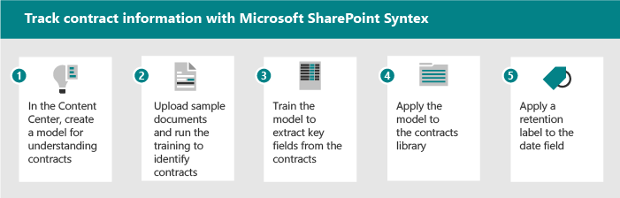

# Scenario's en use cases voor Microsoft SharePoint SyntexScenarios and use cases for Microsoft SharePoint Syntex

Gebruik de volgende voorbeeldscenario's om ideeën te vragen over hoe u syntex in SharePoint organisatie kunt gebruiken.Use the following example scenarios to prompt ideas about how you can use SharePoint Syntex in your organization.

- [Scenario: Gegevens van facturen bijhouden met formulierverwerkingScenario: Track data from invoices with form processing](adoption-scenarios.md#scenario-track-data-from-invoices-with-form-processing)
- [Scenario: Gegevens uit contracten bijhouden met documentkennisScenario: Track information from contracts with document understanding](adoption-scenarios.md#scenario-track-information-from-contracts-with-document-understanding)
- [Scenario: Risico's vermijden met recordsbeheer, documentbeheer en complianceprocessen op basis van SharePoint SyntexScenario: Avoid risk with records management, document governance, and compliance processes based on SharePoint Syntex](adoption-scenarios.md#scenario-avoid-risk-with-records-management-document-governance-and-compliance-processes-based-on-sharepoint-syntex)
- [Scenario: Gegevens uit eerder ontoegankelijke documenten vastleggenScenario: Capture information from previously inaccessible documents](adoption-scenarios.md#scenario-capture-information-from-previously-inaccessible-documents)
- [Scenario: Gegevensverwerking verbeteren om inzichten en analyses te biedenScenario: Improve data processing to provide insights and analytics](adoption-scenarios.md#scenario-improve-data-processing-to-provide-insights-and-analytics)
- [Scenario: Orderverwerking automatiserenScenario: Automate order processing](adoption-scenarios.md#scenario-automate-order-processing)
- [Scenario: Vereenvoudig het verlengingsproces voor visaScenario: Simplify visa renewal process](adoption-scenarios.md#scenario-simplify-visa-renewal-process)

## Scenario: Gegevens van facturen bijhouden met formulierverwerkingScenario: Track data from invoices with form processing

U kunt bijvoorbeeld een proces instellen met behulp van SharePoint Syntex en Power Automate om facturen bij te houden en te controleren.For example, you can set up a process using SharePoint Syntex and Power Automate features to track and monitor invoices.

1. Stel een bibliotheek in om de factuurdocumenten op te slaan.Set up a library to store the invoice documents.
1. Train het model om velden in de documenten te herkennen.Train the model to recognize fields in the documents.
1. Haal de velden op die u wilt bijhouden in een lijst.Extract the fields you want to track into a list.
1. Een stroom instellen om u op de hoogte te stellen van specifieke gebeurtenissen, zoals:Set up a flow to notify you for specific events, such as:
    - Er wordt een nieuwe factuur toegevoegd.A new invoice is added.
    - Een factuur is na de einddatum.An invoice is past its due date.
    - Een factuur is voor een bedrag dat groter is dan uw automatische goedkeuringsbedrag.An invoice is for an amount that's larger than your automatic approval amount.

Wanneer u dit scenario automatiseert, kunt u het volgende doen:When you automate this scenario, you can:

- Bespaar tijd en geld door automatisch gegevens uit de facturen op te halen in plaats van handmatig te doen.Save time and money by automatically extracting data from the invoices instead of doing it manually.
- Verminder mogelijke fouten en zorg voor een betere naleving door werkstromen te gebruiken om facturen te controleren en u op de hoogte te stellen van eventuele problemen.Reduce potential errors and ensure better compliance by using workflows to check invoices and notify you of any issues.

## Scenario: Gegevens uit contracten bijhouden met documentkennisScenario: Track information from contracts with document understanding

Als een ander voorbeeld kunt u een proces instellen om contracten te identificeren die uw bedrijf heeft met andere bedrijven of personen.As another example, you can set up a process to identify contracts your company has with other companies or individuals. Stel een model in om belangrijke informatie uit die contracten op te halen, zoals de klantnaam, kosten, datums of andere belangrijke informatie, en voeg de informatie toe aan de bibliotheek als velden die u snel kunt bekijken.Set up a model to extract key information from those contracts, such as the client name, fees, dates, or other important information, and add the information to the library as fields you can quickly view. Een bewaarlabel toepassen op de documentbibliotheek om ervoor te zorgen dat contracten niet vóór een bepaalde periode kunnen worden verwijderd voor de juiste naleving van uw bedrijfsvoorschriften.Apply a retention label on the document library to ensure that contracts can't be deleted before a specific length of time for appropriate compliance with your business regulations.

1. Begin in het inhoudscentrum en maak een nieuw documentkennismodel voor contracten.Start at the content center and create a new document understanding model for contracts.
1. Upload voorbeelddocumenten voor positieve en negatieve voorbeelden en voer vervolgens de training uit om contractdocumenten te identificeren en de resultaten te bekijken.Upload sample documents for positive and negative examples, then run the training to identify contract documents and review the results.
1. Train de extractor om velden in de contracten te identificeren, zoals de naam, kosten en datum van de klant, en test vervolgens de extractor.Train the extractor to identify fields in the contracts, such as the client name, fee, and date, and then test the extractor.
1. Wanneer het model is voltooid, kunt u het model toepassen op een bibliotheek waar u contracten kunt uploaden.When the model is complete, apply the model to a library where you can upload contracts.
1. Pas een bewaarlabel toe op het datumveld, zodat contracten voor de vereiste tijd in de bibliotheek worden bewaard.Apply a retention label to the date field, so that contracts are retained in the library for the required length of time.

Wanneer u dit scenario automatiseert, kunt u het volgende doen:When you automate this scenario, you can:

- Bespaar tijd en geld door automatisch gegevens uit de contracten op te halen in plaats van handmatig te doen.Save time and money by automatically extracting data from the contracts instead of doing it manually.
- Zorg voor betere naleving door bewaarlabels te gebruiken om ervoor te zorgen dat de contracten op de juiste manier worden bewaard.Ensure better compliance by using retention labels to ensure that the contracts are retained appropriately.

## Scenario: Risico's vermijden met recordsbeheer, documentbeheer en complianceprocessen op basis van SharePoint SyntexScenario: Avoid risk with records management, document governance, and compliance processes based on SharePoint Syntex

Het beperken van risico's is een gemeenschappelijk doel voor de meeste bedrijven.Reducing risks is a common goal for most companies. Mogelijk hebt u het volgende nodig:You might need:

- Een betere manier om informatiebeheer in uw tenant op te geven/af te dwingen.A better way to provide/enforce information governance across your tenant.
- Het systeem voor de classificatie van documenten, e-mailberichten en andere communicatievormen als 'records' voor projecten verbeteren.To improve the system for classification of documents, emails and other forms of communication considered ‘records’ for projects.
- Om ontvangstbevestigingen, contracten, en meer te controleren, om ervoor te zorgen dat het bedrijfsbeleid wordt nageleefd.To audit receipts, contracts, and so on, to ensure compliance with company policies.
- Om ervoor te zorgen dat projecten alle documentatie hebben die nodig is voor naleving.To ensure that projects have all the documentation required for compliance.

Stel een aantal processen in voor naleving SharePoint Syntex om documenten en formulieren die beter beheer nodig hebben, vast te leggen en op de juiste manier te classificeren, te controleren en te markeren.Set up some processes for compliance with SharePoint Syntex to capture and appropriately classify, audit, and flag documents and forms that need better governance. U kunt op syntex SharePoint vertrouwen om inhoud automatisch te classificeren in plaats van dat u erop vertrouwt dat eindgebruikers handmatig labelen of het complianceteam om handmatig beheerregels en archivering toe te passen.You can rely on SharePoint Syntex to auto classify content rather than relying on end users to manually tag, or the compliance team to manually apply governance rules and archiving. En u kunt een vereenvoudigde zoekervaring inschakelen, gegevensvolumes beheren, recordsbeheer- en bewaarbeleid toepassen, naleving en best practice-archiverings- en purgingpraktijken garanderen.And you can enable a simplified search experience, manage data volumes, apply records management and retention policies, ensure compliance, and best practice archiving and purging practices.

Wanneer u dit scenario automatiseert, kunt u zich er zeker van voelen dat:When you automate this scenario, you can feel secure that:

- Naleving wordt gehandhaafd en het risico wordt verminderd.Compliance is upheld and risk is reduced.
- Taxonomie- en recordsbeheer wordt consistent en nauwkeurig toegepast.Taxonomy and records management is consistently and accurately applied.
- Inhoudsvolumes worden beheerd.Content volumes are controlled.
- Werknemers kunnen eenvoudig de juiste informatie vinden in de juiste context.Employees can easily discover the right information in the right context.

## Scenario: Gegevens uit eerder ontoegankelijke documenten vastleggenScenario: Capture information from previously inaccessible documents

De meeste organisaties hebben grote opslagplaatsen van juridische documenten, beleidsregels, contracten, HR-documenten en beheerrichtlijnen.Most organizations have large repositories of legal documents, policies, contracts, HR documents, and governance guidelines. Gebruik deze gegevensopslag om waardevolle informatie op te halen, zoals: projecten, sectoren, thema's, personen, geografische gebieden, en dergelijke.Mine these data stores to extract valuable information such as: projects, sectors, themes, people, geographical areas, and so on.

Een HR-directeur moet bijvoorbeeld snel toegang hebben tot alle HR-documenten, inclusief cv's, HR-beleid en andere formulieren.For example, an HR director needs to quickly access all HR documents – including resumes, HR policies, and other forms. En ze willen snel de benodigde informatie uit cv's en andere HR-gerelateerde documenten identificeren zonder de documenten handmatig te doorzenden.And they want to quickly identify necessary information from resumes and other HR-related documents without manually sifting through the documents. Ze zijn op zoek naar een oplossing waarmee ze snel de informatie kunnen vinden die ze nodig hebben, zonder dat ze handmatig duizenden cv's, HR-beleid en andere documentatie hoeven te bekijken die over verschillende sites kunnen worden verspreid.They’re looking for a solution that allows them to quickly find the information they need without having to manually look through thousands of resumes, HR policies, and other documentation that may be spread across several sites.

Wanneer u dit scenario automatiseert, kunt u het volgende doen:When you automate this scenario, you can:

- Ontgrendel kennis van digitale inhoud.Unlock knowledge from digital content.
- Classificeer HR-beleid, cv's, verkoopdocumenten, technische blauwdrukken, accountplannen en haal informatie op.Classify HR policies, resumes, sales documents, technical blueprints, account plans and extract information.
- Zoek snel de juiste informatie of het juiste document dat u zoekt.Quickly find the correct information or document that you’re looking for.
- Krijg direct toegang tot de meest recente informatie.Get instant access to the latest information.
- Zoektijden verminderen.Reduce search times.

## Scenario: Gegevensverwerking verbeteren om inzichten en analyses te biedenScenario: Improve data processing to provide insights and analytics

Een farmaceutisch bedrijf kan bijvoorbeeld een SharePoint Syntex gebruiken om informatie op te halen uit FDA-documenten om vragen te beantwoorden die hun leiders hebben.For example, a pharmaceutical company could use SharePoint Syntex to extract information from FDA documents to answer questions that their leaders have. Als u de antwoorden gemakkelijker toegankelijk hebt, kunt u minder tijd nodig hebben om deze antwoorden te geven en de beschikbaarheid van gegevens vergroten om nauwkeurigere antwoorden te genereren op leiderschapsvragen.Having the answers more easily accessible can reduce the time needed to produce these answers and increase the availability of data to generate more accurate answers to leadership questions.

Een projectmanager moet bijvoorbeeld snel antwoorden geven op productgerelateerde vragen van mijn leidinggevende team.For example, a project manager needs to quickly provide answers to product-related questions from my leadership team. Ze moeten informatie en metrische gegevens met betrekking tot query's vinden in één samengevoegd dashboard.They need to find information and metrics related to queries in one consolidated dashboard. Ze zijn op zoek naar een oplossing die de informatie haalt die ze nodig hebben uit productlabels, productpamfletten en andere materialen en een geconsolideerd rapport genereert dat ze kunnen gebruiken bij het rapporteren aan hun leidinggevende team.They’re looking for a solution that extracts the information they need from product labels, product pamphlets, and other materials and generates a consolidated report that they can use when reporting back to their leadership team.

Wanneer u dit scenario automatiseert, kunt u het volgende doen:When you automate this scenario, you can:

- Verminder de tijd om antwoorden te produceren.Reduce time to produce answers.
- De beschikbaarheid van gegevens vergroten.Increase availability of data.
- Geef nauwkeurigere antwoorden.Provide more accurate answers.

## Scenario: Orderverwerking automatiserenScenario: Automate order processing

Met SharePoint Syntex kunt u de tijd van handmatige verwerking van klantorders verminderen.With SharePoint Syntex, you can reduce the time of manual processing of customer orders. U kunt bijvoorbeeld orders van fax, e-mail of papier uploaden naar SharePoint door OCR-verwerking te gebruiken en vervolgens de metagegevens uit deze orders op te halen, zodat u deze kunt uitvoeren met behulp van geautomatiseerde processen.For example, you can upload orders from fax, email, or paper into SharePoint by using OCR processing and then extract the metadata from those orders so you can fulfill them by using automated processes.

Een supply chain manager wil bijvoorbeeld fouten beperken die worden veroorzaakt door handmatige gegevensinvoer.For example, a supply chain manager wants to reduce errors caused by manual data entry. Ze willen handmatige controle en gegevensinvoer van binnenkomende klantorders (papier, fax of e-mail) voorkomen om fouten in hun bedrijfssystemen te beperken.They want to avoid manual review and data entry of inbound customer orders (paper, fax, or e-mail) to reduce errors going into their business systems. Ze willen een oplossing waarmee AI- en machine learning-technieken worden toegepast om binnenkomende ordergegevens te valideren, kerngegevens op te halen en deze automatisch in hun ERP-systeem te plaatsen, voor orderafhandeling en afstemming.They want a solution that applies AI and machine learning techniques to validate incoming order information, extract core data and automatically push it into their ERP system, for order fulfillment and reconciliation.

Wanneer u dit scenario automatiseert, kunt u ervoor zorgen dat:When you automate this scenario, you can ensure that:

- Order- en verzendingsnauwkeurigheid neemt toe.Order and shipment accuracy increases.
- Kosten of boetes die zijn gekoppeld aan order- of verzendingsfouten, worden verlaagd.Fees or penalties associated to order or shipment errors are reduced.
- Vertragingen in facturering of betalingen nemen af.Delays in invoicing or payments decrease.
- De personeelskosten worden verlaagd.Personnel costs are reduced.

## Scenario: Vereenvoudig het verlengingsproces voor visaScenario: Simplify visa renewal process

SharePoint Syntex kan u helpen herinneringen en verlengingen te automatiseren voor belangrijke contractgegevens.SharePoint Syntex can help you automate reminders and renewals for key contract information. Een HR-directeur moet er bijvoorbeeld voor zorgen dat de visa van werknemers up-to-date zijn en/of op tijd worden verlengd.For example, an HR director needs to ensure that employees’ visas are up to date and/or renewed on time. Ze willen mensen een eenvoudig en intuïtief proces bieden voor het bijwerken van hun Visa.They want to give people a simple and intuitive process for updating their Visas. Ze hebben een oplossing nodig die verlengingsdatums uit contracten haalt en werknemers automatisch herinneringen stuurt wanneer hun verlengingsdatum nadert.They need a solution that extracts renewal dates from contracts and automatically sends employees reminders when their renewal dates are approaching.

Wanneer u dit scenario automatiseert, kunt u ervoor zorgen dat:When you automate this scenario, you can ensure that:

- De niveaus van niet-naleving worden verminderd.The levels of non-compliance are reduced.
- Het aantal handmatige herinneringen wordt verminderd.The number of manual reminders is reduced.
- Het aantal boetes voor niet-naleving wordt verminderd.The number of fines for non-compliance is reduced.

## Zie ookSee also

[Microsoft SharePoint Syntex-acceptatie: Aan de slagMicrosoft SharePoint Syntex adoption: Get started](adoption-getstarted.md)