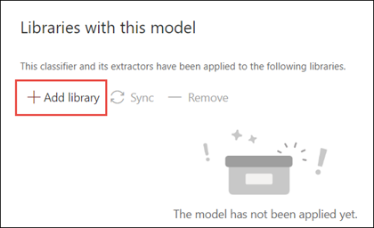
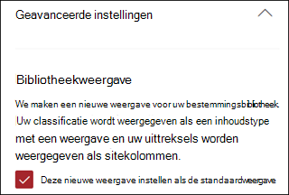
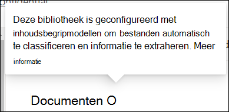
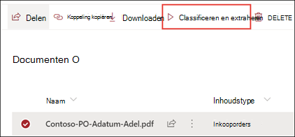

# Een documentbegripmodel toepassen in Microsoft SharePoint SyntexApply a document understanding model in Microsoft SharePoint Syntex

 

> [!VIDEO https://www.microsoft.com/videoplayer/embed/RE4CSoL]

 

Na het publiceren van uw documentbegtipmodel kunt u het toepassen op een of meer SharePoint-documentbibliotheken in uw Microsoft 365-tenant.After publishing your document understanding model, you can apply it to one or more SharePoint document library in your Microsoft 365 tenant.

> [!NOTE]
> U kunt het model alleen toepassen op documentbibliotheken waar u toegang toe heeft.You are only able to apply the model to document libraries that you have access to.

## Uw model toepassen op een documentbibliotheek.Apply your model to a document library.

U past als volgt een model toe op een SharePoint-documentbibliotheek:To apply your model to to a SharePoint document library:

1. Op de startpagina van het model selecteert u op tegel **Model toepassen op bibliotheken** de optie **Model publiceren**.On model home page, on the **Apply model to libraries** tile, select **Publish model**. U kunt ook **+Bibliotheek toevoegen** selecteren in het gedeelte **Bibliotheken met dit model**.Or you can select  **+Add Library** in the **Libraries with this model** section.  

     

2. Vervolgens kunt u de SharePoint-site selecteren die de documentbibliotheek bevat waarop u het model wilt toepassen.You can then select the SharePoint site that contains the document library that you want to apply the model to. Als de site niet in de lijst wordt weergegeven, gebruikt u het zoekvak om de site te vinden.If the site does not show in the list, use the search box to find it. 

     

    > [!NOTE]
    > U moet beschikken over de machtiging *Lijst beheren* of *Machtiging voor bewerken* voor de documentbibliotheek waarop u het model toepast.You must have *Manage List* permissions or *Edit* rights to the document library you are applying the model to. 

3. Na het selecteren van de site selecteert u de documentbibliotheek waarop u het model wilt toepassen.After selecting the site, select the document library to which you want to apply the model. Selecteer in het voorbeeld de documentbibliotheek *Documenten* van de site *Contoso Case Tracking*.In the sample, select the *Documents* document library from the *Contoso Case Tracking* site. 

     

4. Aangezien het model aan een inhoudstype is gekoppeld, worden het inhoudstype en de bijbehorende weergave met de labels die worden opgehaald, als kolommen toegevoegd wanneer u het model toepast.Since the model is associated to a content type, when you apply it to the library it will add the content type and its view with the labels you extracted showing as columns. Deze weergave is de standaardweergave van de bibliotheek, maar u kunt ervoor kiezen om dit niet de standaardweergave te maken door **Geavanceerde instellingen** te selecteren en **Deze nieuwe weergave instellen als standaard** te deselecteren.This view is the library's default view by default, but you can optionally choose to not have it be the default view by selecting **Advanced settings** and deselecting **Set this new view as default**. 

     

5. Selecteer **Toevoegen** om het model toe te passen op de bibliotheek.Select **Add** to apply the model to the library. 
6. Op de startpagina van het model wordt in het gedeelte **Bibliotheken met dit model** de URL van de SharePoint-site weergegeven.On the model home page, in the **Libraries with this model** section, you should see the URL to the SharePoint site listed. 

     

7. Ga naar de documentbibliotheek en controleer of de documentbibliotheekweergave van het model wordt weergegeven.Go to your document library and make sure you are in the model's document library view. U ziet dat wanneer u de informatieknop naast de naam van de documentbibliotheek selecteert, het bericht wordt weergegeven dat uw model is toegepast op de documentbibliotheek.Notice that if you select the information button next to the document library name, a message notes that your model has been applied to the document library.

      

Nadat u het model hebt toegepast op de documentbibliotheek, kunt u beginnen met het uploaden van documenten naar de site en bekijken van de resultaten.After applying the model to the document library, you can begin uploading documents to the site and see the results.

Het model identificeert bestanden met het relevante inhoudstype en toont ze in de weergave.The model identifies any files with model’s associated content type and lists them in your view. Als uw model extractoren bevat, worden in de weergave kolommen weergegeven voor de gegevens die u uit elk bestand haalt.If your model has any extractors, the view displays columns for the data you are extracting from each file.

### Het model toepassen op bestanden die zich al in de documentbibliotheek bevindenApply the model to files already in the document library

Terwijl een toegepast model alle bestanden verwerkt die naar de documentbibliotheek worden geüpload nadat het is toegepast, kunt u ook het volgende doen om het model uit te voeren op bestanden die al aanwezig waren in de documentbibliotheek voordat het model werd toegepast:While an applied model processes all files uploaded to the document library after it is applied, you can also do the following to run the model on files that already exists in the document library prior to the model being applied:

1. Selecteer in de documentbibliotheek de bestanden die u wilt laten verwerken door het model.In your document library, select the files that you want to be processed by your model.
2. Nadat u bestanden hebt geselecteerd, wordt **Classificeren en extraheren** weergegeven op het lint van de documentbibliotheek.After selecting your files, **Classify and extract** will appear in the document library ribbon. Selecteer **Classificeren en extraheren**.Select **Classify and extract**.
3. De bestanden die u hebt geselecteerd, worden toegevoegd aan de verwerkingswachtrij.The files you selected will be added to the queue to be processed.

        

## Zie ookSee Also
[Een classificatie makenCreate a classifier](create-a-classifier.md)

[Een extractor makenCreate an extractor](create-an-extractor.md)

[Overzicht van documentbegripDocument Understanding overview](document-understanding-overview.md)

