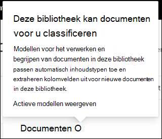

# Een documentbegripmodel toepassen (voorbeeld)Apply a document understanding model (Preview)

> [!Note] 
> De inhoud in dit artikel is voor Project Cortex Private Preview.The content in this article is for Project Cortex Private Preview. [Lees meer over Project Cortex](https://aka.ms/projectcortex).[Find out more about Project Cortex](https://aka.ms/projectcortex).

 

> [!VIDEO https://www.microsoft.com/videoplayer/embed/RE4CSoL]

 

Nadat u het model voor het begrijpen van documenten hebt gepubliceerd, u dit toepassen op een SharePoint-documentbibliotheek in uw Microsoft 365-tenant.After publishing your document understanding model, you can apply it to a SharePoint document library in your Microsoft 365 tenant.

> [!Note]
> U het model alleen toepassen op documentbibliotheken waar u toegang toe hebt.You will only be able to apply the model to document libraries that you have access to.

## Pas uw model toe op een documentbibliotheek.Apply your model to a document library.

Ga als voorbeeld van uw model naar een SharePoint-documentbibliotheek:To apply your model to to a SharePoint document library:

1. Selecteer op de startpagina van het model op de tegel **Model toepassen** op bibliotheken de optie **Model publiceren**.On the model home page, on the **Apply model to libraries** tile, select **Publish model**. U **ook +Bibliotheek toevoegen** in de **bibliotheken selecteren met deze modelsectie.**Or you can  select  **+Add Library** in the **Libraries with this model** section.  

     

2. U vervolgens de SharePoint-site selecteren die de documentbibliotheek bevat waarop u het model wilt toepassen.You can then select the SharePoint site that contains the document library that you want to apply the model to. Als de site niet wordt weergegeven in de lijst, gebruikt u het zoekvak om deze te zoeken.If the site does not show in the list, use the search box to find it. 

     

    > [!Note]
    > U moet *machtigingen voor lijst beheren* of De rechten voor de documentbibliotheek *waarop* u het model toepast, bewerken.You must have *Manage List* permissions or *Edit* rights to the document library you are applying the model to. 

3. Nadat u de site hebt geselecteerd, moet u de documentbibliotheek selecteren waarop u het model wilt toepassen.After selecting the site, you then need to select the document library to which you want to apply the model. In het voorbeeld selecteren we de documentbibliotheek *Documenten* op de *contoso-site voor het bijhouden van de aanvraag.*In the example, we are selecting the *Documents* document library from the *Contoso Case Tracking* site. 

     

4. Aangezien het model is gekoppeld aan een inhoudstype, wordt bij het toepassen van het model een weergave gemaakt voor het inhoudstype met de labels die u als kolommen hebt geëxtraheerd.Since the model is associated to a content type, when you apply it to the library it will create a view for the content type with the labels you extracted showing as columns. Deze weergave is standaard de standaardweergave van de bibliotheek, maar u er optioneel voor kiezen om deze niet de standaardweergave te laten zijn door **Geavanceerde instellingen** te selecteren en deze nieuwe weergave **als standaard**instellen uit te stellen.This view will be the library's default view by default, but you can optionally choose to not have it be the default view by selecting **Advanced settings** and deselecting **Set this new view as default**. 

     

5. Selecteer **Toevoegen** om het model toe te passen op de bibliotheek.Select **Add** to apply the model to the library. 
6. Op de startpagina van het model, in de **sectie Bibliotheken met dit model,** ziet u de URL naar de SharePoint-site vermeld.On the model home page, in the **Libraries with this model** section, you will see the URL to the SharePoint site listed. 

     

7. Ga naar uw documentbibliotheek en zorg ervoor dat u zich in de documentbibliotheekweergave van het model bevindt.Go to your document library and make sure you are in the model's document library view. U zult merken dat als u de informatieknop naast de naam van de documentbibliotheek selecteert, er een bericht wordt weergegeven dat uw model is toegepast op de documentbibliotheek.You'll notice that if you select the information button next to the document library name, a message will note that your model has been applied to the document library.

      

Nadat u het model hebt toegepast op de documentbibliotheek, u beginnen met het uploaden van documenten naar de site en de resultaten bekijken.After applying the model to the document library, you can begin uploading documents to the site and see the results.

Het model identificeert alle bestanden met het bijbehorende inhoudstype van het model en geeft deze in uw weergave weer.The model will identify any files with model’s associated content type and will list them in your view. Als uw model uitstanden heeft, worden in de weergave kolommen weergegeven voor de gegevens die u uit elk bestand haalt.If your model has any extractors, the view will display columns for the data you are extracting from each file.

### Het model toepassen op bestanden die al in de documentbibliotheek staanApply the model to files already in the document library

Hoewel een toegepast model alle bestanden verwerkt die naar de documentbibliotheek zijn geüpload nadat het is toegepast, u ook het volgende uitvoeren om het model uit te voeren op bestanden die al in de documentbibliotheek bestonden voordat het model werd toegepast:While an applied model will process all files uploaded to the document library after it is applied, you can also do the following to run the model on files that already existed in the document library prior to the model being applied:

1. Selecteer in uw documentbibliotheek de bestanden die u door uw model wilt verwerken.In your document library, select the files that you want to be processed by your model.
2. Nadat u uw bestanden hebt geselecteerd, wordt **Classificeren en extraheren** weergegeven op het lint van de documentbibliotheek.After selecting your files, **Classify and extract** will appear in the document library ribbon. Selecteer **Classificeren en uitpakken**.Select **Classify and extract**.
3. De geselecteerde bestanden worden toegevoegd aan de wachtrij die moet worden verwerkt.The files you selected will be added to the queue to be processed.

        

## Zie ookSee Also
[Een classificatie makenCreate a classifier](create-a-classifier.md) 
[Een afzuiger makenCreate an extractor](create-an-extractor.md) 
[Overzicht van documentbegripDocument Understanding overview](document-understanding-overview.md) 
[Een formulierverwerkingsmodel makenCreate a form processing model](create-a-form-processing-model.md)  

