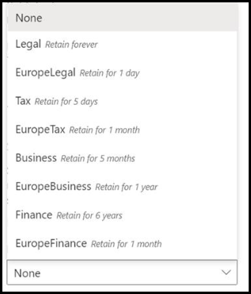

# Een Bewaar label toepassen op een document wat model

 

> [!VIDEO https://www.microsoft.com/videoplayer/embed/RE4CSoL]

 

U kunt eenvoudig een [Bewaar label](https://docs.microsoft.com/microsoft-365/compliance/retention) toepassen op een document met beinformatie over model in Microsoft SharePoint Syntex.

Met labels voor bewaarbeleid kunt u bewaarinstellingen toepassen op de documenten die uw document begrijpt.  U wilt bijvoorbeeld dat uw model alleen de documenten van de *verzekerings kennisgeving* die wordt geüpload naar de documentbibliotheek identificeert, maar u kunt ook een Bewaar code voor een *bedrijf* toepassen, zodat deze documenten niet kunnen worden verwijderd uit de documentbibliotheek voor de opgegeven tijdsperiode (bijvoorbeeld de volgende vijf maanden).

U kunt een al bestaand Bewaar label toepassen op uw document met behulp van de modelinstellingen op de startpagina van uw model. 

> [!Important]
> Voor Bewaar etiketten die u kunt gebruiken om uw inhoud toe te passen, moeten ze worden [gemaakt en gepubliceerd in het nalevings centrum van Microsoft 365](https://docs.microsoft.com/microsoft-365/compliance/create-apply-retention-labels#how-to-create-and-publish-retention-labels).

## Een Bewaar label toevoegen aan een document wat is het model

1. Selecteer op de startpagina van model de optie **modelinstellingen**. 
2. Selecteer in de sectie **model instellingen**in de sectie **beveiliging en compliance** het menu **Bewaar label** om een lijst weer te geven van de Bewaar etiketten die beschikbaar zijn om te worden toegepast op het model. 
   
3. Selecteer het Bewaar label dat u wilt toepassen op het model en selecteer vervolgens **Opslaan**. 

Na het toepassen van het Bewaar etiket op uw model, kunt u dit toepassen op een van de volgende dingen:
- Nieuwe documentbibliotheek
- Document bibliotheek waarmee het model al wordt toegepast
 
## Het label voor bewaarbeleid toepassen op een documentbibliotheek waarmee het model al wordt toegepast

Als het document al is toegepast op een documentbibliotheek, kunt u het volgende doen om uw Bewaar etiket-update te synchroniseren zodat u deze op de documentbibliotheek kunt toepassen: 

1. Selecteer op de startpagina van uw model in de sectie **bibliotheken met dit model** de documentbibliotheek waarop u de update voor het Bewaar label wilt toepassen.   
2. Selecteer **synchroniseren**.  
   

Nadat u de update hebt geïnstalleerd en de update hebt gesynchroniseerd met uw model, kunt u het volgende doen:

1. Klik in het inhouds centrum, in de sectie **bibliotheken met dit model** , op de bibliotheek waarop uw bijgewerkte model is toegepast.  
2. Selecteer in de weergave Documentbibliotheek het informatiepictogram om de modeleigenschappen te controleren.   
3. Selecteer het bijgewerkte model in de lijst **actieve modellen** . 
4. In het gedeelte **Bewaar label** ziet u de naam van het toegepaste Bewaar etiket. 

Op de paginaweergave van uw model in de documentbibliotheek wordt een nieuwe **Bewaar label** kolom weergegeven.  Aangezien bestanden worden geclassificeerd op basis van het inhoudstype van de modelsite en deze weergeven in de bibliotheek weergave, wordt in de kolom Bewaar etiket ook de naam van het Bewaar label weergegeven dat op het model is toegepast.

Alle *verzekerings kennisgevingen* die uw model identificeert, zien er *ook het* bedrijfsbewaar label voor, zodat ze gedurende vijf maanden niet uit de documentbibliotheek kunnen worden verwijderd. Als er wordt gevraagd of u het bestand uit de documentbibliotheek wilt verwijderen, wordt er een foutbericht weergegeven met de melding dat dit niet is toegestaan vanwege het toegepaste Bewaar etiket.

## Zie ook
[Een classificatie maken](create-a-classifier.md) 
[Een extractor maken](create-an-extractor.md) 
[Overzicht van document](document-understanding-overview.md) 
[Een formulier verwerkings model maken](create-a-form-processing-model.md)  
