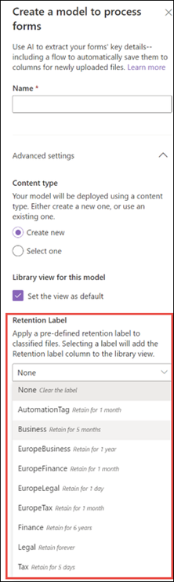

# Je kunt een retentietag toepassen op een model in Microsoft SharePoint SyntexApply a retention label to a model in SharePoint Syntex

 

> [!VIDEO https://www.microsoft.com/videoplayer/embed/RE4GydO]  

 

Je kunt eenvoudig een [retentietag](../compliance/retention.md) toepassen op een model in Microsoft SharePoint Syntex.You can easily apply a [retention label](../compliance/retention.md) to a model in Microsoft SharePoint Syntex. Je kan dit voor documentbegripmodellen en formulierverwerkingsmodellen doen.You can do this for both document understanding and form processing models.

Met retentietags kan je retentie-instellingen toepassen op de documenten die door je modellen worden geïdentificeerd.Retention labels let you apply retention settings to the documents that your models identify.  Bijvoorbeeld: u wilt dat uw model niet alleen alle documenten met *verzekeringskennisgevingen* die naar uw documentbibliotheek worden geüpload identificeert, maar ook een retentietag *zakelijk* aanbrengt, zodat deze documenten niet uit de documentbibliotheek kunnen worden verwijderd gedurende de opgegeven periode (bijvoorbeeld de komende vijf maanden).For example, you want your model to not only identify any *Insurance notice* documents that are uploaded to your document library, but to also apply a *Business* retention tag to them so that these documents cannot be deleted from the document library for the specified time period (the next five months, for example).

Je kunt een bestaande retentietag toepassen op je model via de modelinstellingen op de startpagina van het model.You can apply a pre-existing retention label to your model through your model settings on your model's home page. 

> [!Important]
> Als je wilt dat retentietags beschikbaar zijn voor je documentbegripmodel, moeten deze [aangemaakt en gepubliceerd worden in het Microsoft 365-compliancecentrum](../compliance/create-apply-retention-labels.md#how-to-create-and-publish-retention-labels).For retention labels to be available to apply to your document understanding models, they need to be [created and published in the Microsoft 365 Compliance Center](../compliance/create-apply-retention-labels.md#how-to-create-and-publish-retention-labels).

## Een retentietag toepassen op een documentbegripmodelTo add a retention label to a document understanding model

1. Selecteren **Modelinstellingen** op de startpagina van het model.From the model home page, select **Model settings**. 
2. Selecteer in **Modelinstellingen**, in het gedeelte **Beveiliging en compliance**, het menu **Retentietag** om een lijst met retentietags weer te geven die beschikbaar zijn om toe te passen op het model.In **Model settings**, in the **Security and compliance** section, select the **Retention label** menu to see a list of retention labels that are available for your to apply to the model. 
   
3. Selecteer de retentietag die u wilt toepassen op het model en selecteer **Opslaan**.Select the retention label you want to apply to the model, and then select **Save**. 

Nadat u de retentietag hebt toegepast op uw model, kunt u het toepassen op een:After applying the retention label to your model, you are able to apply it to a:
- Nieuwe documentbibliotheekNew document library
- Documentbibliotheek waarop het model al is toegepastDocument library to which the model is already applied
 
## De retentietag toepassen op een documentbibliotheek waarop het model al is toegepastApply the retention label to a document library to which the model is already applied

Als uw documentbegripmodel al is toegepast op een documentbibliotheek, kunt u het volgende doen om de retentietagupdate te synchroniseren en toe te passen op de documentbibliotheek:If your document understanding model has already been applied to a document library, you can do the following to sync your retention label update to apply it to the document library: 

1. Selecteer op de startpagina van het model in het gedeelte **Bibliotheken met dit model** de documentbibliotheek waarop u de retentietagupdate wilt toepassen.On your model home page, in the **Libraries with this model** section, select the document library to which you want to apply the retention label update.   
2. Selecteer **Synchroniseren**.Select **Sync**.  
   

Nadat u de update hebt toegepast en gesynchroniseerd met uw model, kunt u het volgende doen:After applying the update and syncing it to your model, you can confirm that it has been applied by doing the following:

1. Klik in het inhoudscentrum in het gedeelte **Bibliotheken met deze model** op de bibliotheek waarop het bijgewerkte model is toegepast.In the content center, in the **Libraries with this model** section, click on the library to which your updated model was applied.  
2. Selecteer in de documentbibliotheekweergave het informatiepictogram om de modeleigenschappen te bekijken.In your document library view, select the information icon to check the model properties.   
3. Selecteer in de lijst **Actieve modellen** het bijgewerkte model.In the **Active models** list, select your updated model. 
4. In het gedeelte **Retentietag** wordt de naam van de toegepaste retentietag weergegeven.In the **Retention label** section you will see the name of the applied retention label. 

Op de pagina met de weergave van uw model in uw documentbibliotheek wordt er een nieuwe kolom **Retentietag** weergegeven.On your model's view page in your document library, a new **Retention label** column will display.  Omdat uw model bestanden classificeert die het identificeert als het relevante inhoudstype en ze vermeldt in de bibliotheekweergave, bevat de kolom Retentietag ook de naam van de retentietag die via het model is toegepast.As your model classifies files it identifies as belonging to it's content type and lists them in the library view, the Retention label column will also display the name of the retention label that has been applied to it through the model.

Bijvoorbeeld: op alle *verzekeringskennisgevingen* die uw model identificeert, wordt ook de retentietag *zakelijk* toegepast, zodat ze gedurende vijf maanden lang niet uit de documentenbibliotheek kunnen worden verwijderd.For example, all *Insurance notice* documents that your model identifies will also have the *Business* retention label applied to them, preventing them from being deleted from the document library for five months. Als geprobeerd wordt het bestand uit de documentbibliotheek te verwijderen, wordt een foutbericht weergegeven met de mededeling dat het niet is toegestaan vanwege de toegepaste retentietag.If an attempt is made to delete the file from the document library, an error will display saying it is not allowed because of the applied retention label.

## Een retentietag toepassen op een formulierverwerkingsmodelTo add a retention label to a form processing model

> [!Important]
> Als je wilt dat retentietags beschikbaar zijn voor je formulierverwerkingsmodel, moeten deze [aangemaakt en gepubliceerd worden in het Microsoft 365-compliancecentrum](../compliance/create-apply-retention-labels.md#how-to-create-and-publish-retention-labels).For retention labels to be available to apply to your form processing model, they need to be [created and published in the Microsoft 365 Compliance Center](../compliance/create-apply-retention-labels.md#how-to-create-and-publish-retention-labels).

Je kan een retentietag toepassen op een formulierverwerkingsmodel wanneer je een model maakt of je kan het toepassen op een bestaand model.You can either apply a retention label to a form processing model when you are creating a model, or apply it to an existing model.

### Een retentietag toepassen wanneer je een formulierverwerkingsmodel maaktTo add a retention label when you create a form processing model

1. Wanneer je een [nieuw formulierverwerkingsmodel maakt](./create-a-form-processing-model.md), kies <b>Geavanceerde instellingen.</b>When you are [creating a new form processing model](./create-a-form-processing-model.md), select <b>Advanced settings.</b>
2. In <b>Geavanceerde instellingen</b>, in de sectie <b>Retentietag</b>, selecteer het menu en selecteer vervolgens de retentietag die je wilt toepassen op het model.</b>In <b>Advanced settings</b>, in the <b>Retention label</b> section, select the menu and then select the retention label you want to apply to the model.</b>

 
      

3.  Nadat je de overige modelinstellingen afgewerkt hebt, selecteer <b>Aanmaken</b> om jouw model te maken.After you've completed your remaining model settings, select <b>Create</b> to build your model.

### Een retentietag toepassen op een bestaand formulierverwerkingsmodelTo add a retention label to an existing form processing model

Een retentietag toevoegen aan een bestaand formulierverwerkingsmodel kan op verschillende manieren:You can add a retention label to an existing form processing model in different ways:
- Via het Automatiseren-menu in de documentbibliotheekThrough the Automate menu in the document library
- Via de actieve modellen-instellingen in de documentbibliotheekThrough the Active model settings in the document library 

#### Een retentietag toepassen op een bestaand formulierverwerkingsmodel via het Automatiseren-menuTo add a retention label to an existing form processing model through the Automate menu

Je kan een retentietag aan een bestaand formulierverwerkingsmodel dat je bezit, toevoegen via het Automatiseren-menu in de documentbibliotheek, waarop het model wordt toegepast.You can add a retention label to an existing form processing model that you own through the Automate menu in the document library in which the model is applied.

1. In je documentbibliotheek, waarop het formulierverwerkingsmodel wordt toegepast, kies je het menu <b>Automatiseren</b>, kies <b>AI-opbouwfunctie</b> en kies vervolgens <b>Informatie over formulierverwerkingsmodel weergeven</b>.In your document library to which the form processing model is applied, select the <b>Automate</b> menu, select <b>AI Builder</b>, then select <b>View form processing model details</b>.

    

2. In de informatie over het model, in de sectie <b>Retentietag</b>, selecteer de retentietag die je wilt toepassen.In the model details, in the <b>Retention Label</b> section, select the retention label you want to apply.  Selecteer vervolgens <b>Opslaan</b>.Then select <b>Save</b>.

       

#### Een retentietag toevoegen aan een bestaand formulierverwerkingsmodel in de actieve modelinstellingenTo add a retention label to an existing form processing model in the active model settings

Je kan een retentietag aan een bestaand formulierverwerkingsmodel dat je bezit, toevoegen via de actieve modelinstellingen in de documentbibliotheek, waarop het model wordt toegepast.You can add a retention label to an existing form processing model that you own through the Active model settings in the document library in which the model is applied.

1. In de SharePoint documentbibliotheek waarop het model wordt toegepast, selecteer het pictogram<b>Actieve modellen weergeven</b> en selecteer vervolgens <b>Actieve modellen weergeven</b>.</b>In the SharePoint document library in which the model is applied, select the <b>View active models</b> icon, and then select <b>View active models</b>.</b>

     

2. In <b>Actieve modellen</b>, selecteer het formulierverwerkingsmodel waarop je de retentietag wilt toepassen.In <b>Active models</b>, select the form processing model to which you want to apply the retention label.

       

3. In de informatie over het model, in de sectie <b>Retentietag</b>, selecteer de retentietag die je wilt toepassen.In the model details, in the <b>Retention Label</b> section, select the retention label you want to apply.  Selecteer vervolgens <b>Opslaan</b>.Then select <b>Save</b>.

> [!NOTE]
> Enkel de eigenaar van het model kan bewerkingen maken in het deelvenster modelinstellingen.You must be the model owner for the model settings pane to be editable. 

## Zie ookSee Also
[Een classificatie makenCreate a classifier](create-a-classifier.md)

[Een extractor makenCreate an extractor](create-an-extractor.md)

[Overzicht van documentbegripDocument Understanding overview](document-understanding-overview.md)
