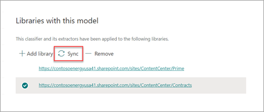

# Een gevoeligheidslabel toepassen op een model in Microsoft SharePoint Syntex

U kunt eenvoudig een [gevoeligheidslabel](../compliance/sensitivity-labels.md) toepassen op een documentbegripmodel in Microsoft SharePoint Syntex. Deze functie is nog niet beschikbaar voor formulierverwerkingsmodellen.

Met gevoeligheidslabels kunt u beleid voor versleuteling, delen en voorwaardelijke toegang toepassen op de documenten die uw modellen identificeren. U wilt bijvoorbeeld dat uw model niet alleen financiële documenten identificeert die bankrekeningnummers of creditcardnummers bevatten die naar uw documentbibliotheek zijn geüpload, maar ook een gevoeligheidslabel *Versleuteling* erop toepast om te beperken wie toegang heeft tot die inhoud en hoe het kan worden gebruikt. SharePoint Syntex-modellen houden zich aan de regels voor [labelvolgorde](../compliance/apply-sensitivity-label-automatically.md#how-multiple-conditions-are-evaluated-when-they-apply-to-more-than-one-label) en overschrijven ook geen bestaand label dat handmatig door een gebruiker op het bestand is toegepast. 

U kunt een reeds bestaand gevoeligheidslabel op uw model toepassen via uw modelinstellingen op de startpagina van uw model. Het label moet al zijn gepubliceerd om te kunnen worden geselecteerd in de modelinstellingen.

> [!Important]
> Als je wilt dat gevoeligheidslabels beschikbaar zijn voor je documentbegripmodel, moeten deze [aangemaakt en gepubliceerd worden in het Microsoft 365-compliancecentrum](../business-video/create-sensitivity-labels.md).

## Een gevoeligheidslabel toepassen op een documentbegripmodel

1. Selecteer op de startpagina van het model **Modelinstellingen**.

   

2. Selecteer in het deelvenster **Modelinstellingen** in de sectie **Naleving** het menu **Gevoeligheidslabel** om een lijst met gevoeligheidslabels weer te geven die u kunt toepassen op het model.

    

3. Selecteer het gevoeligheidslabel dat u wilt toepassen op het model en selecteer vervolgens **Opslaan**.

Nadat u het gevoeligheidslabel op het model hebt toegepast, kunt u dit toepassen op een:

- Nieuwe documentbibliotheek
- Documentbibliotheek waarop het model al is toegepast
 
### Het gevoeligheidslabel toepassen op een documentbibliotheek waarop het model al is toegepast

Als uw documentbegripmodel al is toegepast op een documentbibliotheek, kunt u het volgende doen om de gevoeligheidslabelupdate te synchroniseren en toe te passen op de documentbibliotheek:

1. Selecteer op de startpagina van het model in het gedeelte **Bibliotheken met dit model** de documentbibliotheek waarop u de gevoeligheidslabelupdate wilt toepassen.

2. Selecteer **Synchroniseren**.

   

Nadat u de update hebt toegepast en deze naar uw model hebt gesynchroniseerd, kunt u bevestigen dat deze is toegepast door de volgende stappen uit te voeren:

1. Klik in het inhoudscentrum in het gedeelte **Bibliotheken met dit model** op de bibliotheek waarop het bijgewerkte model is toegepast. 

2. Selecteer in de documentbibliotheekweergave het informatiepictogram om de modeleigenschappen te bekijken.

3. Selecteer in de lijst **Actieve modellen** het bijgewerkte model.

4. In het gedeelte **Gevoeligheidslabel** ziet u de naam van het toegepaste gevoeligheidslabel.

Op de pagina met de weergave van uw model in uw documentbibliotheek wordt er een nieuwe kolom **Gevoeligheidslabel** weergegeven. Terwijl uw model bestanden classificeert die het identificeert als behorend tot het inhoudstype en ze weergeeft in de bibliotheekweergave, zal de kolom **Gevoeligheidslabel** ook de naam weergeven van het gevoeligheidslabel dat er via het model op is toegepast.

Op alle financiële documenten die uw model identificeert, wordt bijvoorbeeld ook het gevoeligheidslabel *Versleuteling* toegepast, zodat onbevoegden er geen toegang toe hebben. Als een onbevoegde persoon probeert toegang te krijgen tot het bestand vanuit de documentbibliotheek, wordt er een foutmelding weergegeven waarin staat dat dit niet is toegestaan vanwege het toegepaste gevoeligheidslabel.

<!---
## Add a sensitivity label to a form processing model

> [!Important]
> For sensitivity labels to be available to apply to your form processing model, they need to be [created and published in the Microsoft 365 Compliance Center](../business-video/create-sensitivity-labels.md).

You can either apply a sensitivity label to a form processing model when you are creating a model, or apply it to an existing model.

### Add a sensitivity label when you create a form processing model

1. When you [create a new form processing model](create-a-form-processing-model.md), select **Advanced settings**.

2. In **Advanced settings**, in the **Sensitivity label** section, select the menu and then select the sensitivity label you want to apply to the model.

3.  After you've completed your remaining model settings, select **Create** to build your model.

### Add a sensitivity label to an existing form processing model

You can add a sensitivity label to an existing form processing model in different ways:

- Through the **Automate** menu in the document library
- Through the **Active model** settings in the document library 

#### Add a sensitivity label to an existing form processing model through the Automate menu

You can add a sensitivity label to an existing form processing model that you own through the **Automate** menu in the document library in which the model is applied.

1. In your document library to which the form processing model is applied, select the **Automate** menu, select **AI Builder**, and then select **View form processing model details**.

2. On the **Model details** pane, in the **Sensitivity label** section, select the sensitivity label you want to apply. Then select **Save**.

#### Add a sensitivity label to an existing form processing model in the active model settings

You can add a sensitivity label to an existing form processing model that you own through the **Active model** settings in the document library in which the model is applied.

1. In the SharePoint document library in which the model is applied, select the **View active models** icon, and then select **View active models**.

2. In **Active models**, select the form processing model to which you want to apply the sensitivity label.

3. On the **Model details** pane, in the **Sensitivity label** section, select the sensitivity label you want to apply. Then select **Save**.

   > [!NOTE]
   > You must be the model owner for the **Model settings** pane to be editable. 
--->

## Zie ook

[Een retentielabel toepassen](apply-a-retention-label-to-a-model.md)

[Een classificatie maken](create-a-classifier.md)

[Een extractor maken](create-an-extractor.md)

[Overzicht van documentbegrip](document-understanding-overview.md)
