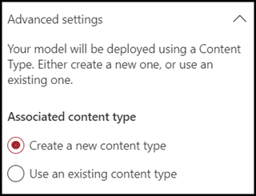
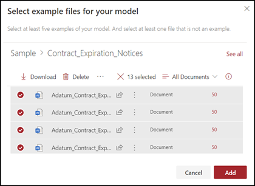

# Een classificatie maken in Microsoft SharePoint Syntex

 

> [!VIDEO https://www.microsoft.com/videoplayer/embed/RE4CL0R]  

 

Een classificatie is een typemodel dat je kunt gebruiken om de identificatie en classificatie van een documenttype te automatiseren. Het is bijvoorbeeld mogelijk dat je alle *contract wilt identificeren* documenten die worden toegevoegd aan de documentbibliotheek, zoals wordt weergegeven in de volgende afbeelding.

Als je een classificatie maakt, kun je een nieuw [SharePoint-inhoudstype](/sharepoint/governance/content-type-and-workflow-planning#content-type-overview) maken dat aan het model wordt gekoppeld.

Bij het maken van de classificatie moet je *uitleg* maken om het model te definiëren. Op deze manier kun je algemene gegevens noteren waarop je dit documenttype consequent zou verwachten. 

Gebruik voorbeelden van het documenttype (' voorbeeldbestanden') om het model te trainen om bestanden met hetzelfde inhoudstype te identificeren.

Om een classificatie te maken, moet je:
1. Geef het model een naam.
2. Voeg je voorbeeldbestanden toe.
3. Label je voorbeeldbestanden.
4. Maak een uitleg.
5. Test je model.

> [!NOTE]
> Hoewel je model een classificatie gebruikt om documenttypen te identificeren en te classificeren, kun je er ook voor kiezen om specifieke gegevens te verzamelen uit elk bestand dat door het model wordt aangeduid. Dit doe je door een **Extractor** te maken om toe te voegen aan je model. Zie[Een extractor maken](create-an-extractor.md).

## Geef het model een naam

De eerste stap voor het maken van een model is het geven van een naam:

1. Selecteer in het Inhoudscentrum **Nieuw** en klik vervolgens **Maak een model**.
2. Typ in het deelvenster **Nieuw document met inzicht in model** in het veldtype **Naam** de naam van het model. Als je bijvoorbeeld documenten voor het verlengen van het contract wilt identificeren, kun je het model *Contractverlenging* noemen.
3. Kies **Create**. Hiermee maa je een startpagina voor het model. 

    

Wanneer je een model maakt, maak je ook een nieuw site-inhoudstype. Een inhoudstype is een categorie documenten met gemeenschappelijke kenmerken en een verzameling kolommen of metagegevenseigenschappen voor die inhoud delen. SharePoint-inhoudstypen worden beheerd via de [Galerie met inhoudstypen](https://support.microsoft.com/office/create-or-customize-a-site-content-type-27eb6551-9867-4201-a819-620c5658a60f). Als je in dit voorbeeld het model maakt, maak je een nieuwe *contract vernieuwing*-inhoudstype.

Selecteer **Geavanceerde instellingen** als je dit model wilt toewijzen aan een bestaand ondernemingsinhoudstype in de SharePoint-galerie met inhoudstypen om het bijbehorende schema te gebruiken. Ondernemingsinhoudtypen worden opgeslagen in de hub inhoudstype in het SharePoint-Beheercentrum en worden gepubliceerd naar alle sites in de Tenant. Hoewel je een bestaand inhoudstype kunt gebruiken om het bijbehorende schema te gebruiken om te helpen bij het identificeren en classificeren, moet je het model nog steeds trainen om gegevens uit bestanden die worden geïdentificeerd op te halen. 

## Voeg je voorbeeldbestanden toe

Voeg op de startpagina van het model je voorbeelden-bestanden toe die je nodig hebt om het model te helpen je documenttype te identificeren.  
 

> [!VIDEO https://www.microsoft.com/videoplayer/embed/RE4D0iX] 

 

> [!NOTE]
> Je moet dezelfde bestanden gebruiken voor zowel classificatie als [Extractor-training](create-an-extractor.md). Je kunt altijd later meer toevoegen, maar meestal voeg je een volledige set voorbeeldbestanden toe. Geef een naam op voor je model en test de resterende niet-gelabelde om model geschiktheid te evalueren. 

Voor het instellen van je training wil je zowel positieve als negatieve voorbeelden gebruiken:
- Positief voorbeeld: documenten die het documenttype voorstellen. Dit zijn tekenreeksen en informatie die altijd in dit type document voorkomen.
- Negatief voorbeeld: een ander document dat niet overeenkomt met het document dat je wilt classificeren. 

Zorg ervoor dat je minimaal vijf positieve voorbeelden gebruikt en ten minste één negatief voorbeeld om het model te trainen.  Je wilt extra codes maken om het model na het trainingsproces te testen.

Om voorbeeldbestanden toe te voegen:

1. Klik op de startpagina van het model in de **Voorbeeldbestanden toevoegen**-tegel op **Bestanden toevoegen**.
2. Selecteer op de pagina **Voorbeeldbestanden voor je model** de optie bestanden uit de bibliotheek van trainingsbestanden in het inhoudscentrum. Als je ze nog niet hebt geüpload, kun je deze nu uploaden door op **Uploaden** te klikken om ze naar de bibliotheek met trainingsbestanden te kopiëren.
3. Nadat je de voorbeeldbestanden hebt geselecteerd die je wilt gebruiken om het model te trainen, klik je op **Toevoegen**.

     

## Label je voorbeeldbestanden

Nadat je de voorbeeldbestanden hebt toegevoegd, moet je ze een label geven als positieve of negatieve voorbeelden.

1. Klik op de startpagina van het model, op de tegel **Bestanden classificeren en training uitvoeren**, en klik op **Train Classifier**.
   Hier wordt de labelpagina weergegeven met een lijst met voorbeeldbestanden met het eerste bestand dat in de viewer wordt weergegeven.
2. In de viewer boven aan het eerste voorbeeldbestand zie je tekst waarin je wordt gevraagd of het bestand een voorbeeld is van het model dat je zojuist hebt gemaakt. Als het om een positief voorbeeld gaat, selecteer je **Ja**. Als het om een negatief voorbeeld gaat, selecteer je **Nee**.
3. Klik in de **lijst met gelabelde voorbeelden** aan de linkerkant op extra bestanden die je als voorbeeld wilt gebruiken en voorzie ze van een label. 

     

> [!NOTE]
> Voorzie ten minste vijf positieve voorbeelden van labels. Je moet ook een label aan ten minste één negatief voorbeeld geven. 

## Maak een uitleg

In de volgende stap wordt uitgelegd hoe je op de pagina Train een uitleg maakt. Met een uitleg wordt het model uitgelegd hoe je het document kunt herkennen. De documenten voor het verlengen van een contract bevatten bijvoorbeeld altijd een *Verzoek om aanvullende informatie* tekenreeks.

> [!Note]
> Als je een verklaring gebruikt met uittreksels, wordt de tekenreeks die je wilt ophalen uit het document geïdentificeerd. 

Maak een uitleg:

1. Op de startpagina van het model selecteer je het tabblad **Train** om naar de pagina Train te gaan.
2. Op de pagina Train kun je in de sectie **Getrainde bestanden** een lijst zien met de voorbeeldbestanden waaraan je eerder een label hebt gegeven. Selecteer een van de positieve bestanden uit de lijst en deze wordt weergegeven in de viewer.
3. In de sectie uitleg selecteert je **Nieuw** en vervolgens **Leeg**.
4. Op de pagina **Maak een uitleg**: 
    a. Typ de **Naam**(bijvoorbeeld "uitnamelijst"). 
    b. Selecteer het **Type**. Voor het voorbeeld selecteer je **lijst met frasen** omdat je een tekenreeks toevoegt. 
    c. Typ de tekenreeks in het vak **Type hier**. Voor het voorbeeld moet je „verzoek om aanvullende informatie“ toe voegen. Je kunt **hoofdlettergevoeligheid selecteren** als de tekenreeks hoofdlettergevoelig moet zijn. 
    d. Klik op **Opslaan**.

     
    
5. Er wordt nu door het Inhoudscentrum gecontroleerd of de uitleg die je hebt gemaakt compleet is om de achterliggende voorbeeldbestanden op de juiste manier te identificeren, als positieve en negatieve voorbeelden. Schakel in de sectie met opgeleid bestanden de **Evaluatie** kolom nadat de training is voltooid om de resultaten te zien. De bestanden bevatten de waarde **Overeenkomst** als de verklaringen die je hebt gemaakt voldoende zijn om aan te geven wat je als positief of negatief hebt gemarkeerd.

     

Als je een **niet-overeenkomende** ontvangt voor de gelabelde bestanden, moet je mogelijk een extra uitleg maken om het model meer informatie te geven om het documenttype te identificeren. Als dit gebeurt, klik je op het bestand om meer informatie weer te geven over de reden waarom de fout is opgetreden.

## Test je model.

Als je een overeenkomst hebt gekregen met de gelabelde voorbeeldbestanden, kun je nu je model testen op de andere niet-gelabelde voorbeeldbestanden die het model nog niet heeft gezien.  Dit is een optionele, maar handige stap voor het evalueren van de "geschiktheid" of het voorbereiding van het model voordat dit wordt gebruikt, door het te testen op bestanden die het model nog niet heeft gezien.

1. Op de startpagina van het model selecteer je het tabblad **Testen**.  Hiermee wordt het model uitgevoerd op de niet-gelabelde voorbeeldbestanden.
2. In de lijst **Testbestanden** worden de voorbeeldbestanden weergegeven en weergegeven als het model deze positief of negatief is. Gebruik deze informatie om de effectiviteit van je classificatie bij het identificeren van je documenten vast te stellen.

     

## Zie ook
[Een extractor maken](create-an-extractor.md)

[Overzicht van documentbegrip](document-understanding-overview.md)

[Uitlegtypen](explanation-types-overview.md)

[Een model toepassen](apply-a-model.md) 

[SharePoint Syntex toegankelijkheidsmodus](accessibility-mode.md)