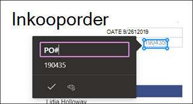

# Maak een formulierverwerkingmodel in Microsoft SharePoint SyntexCreate a form processing model in Microsoft SharePoint Syntex

 

> [!VIDEO https://www.microsoft.com/videoplayer/embed/RE4GnhN]  

 

Met [AI-Builder](https://docs.microsoft.com/ai-builder/overview) - een functie in Microsoft PowerApps - SharePoint-gebruikers kunnen een [formulierverwerkingsmodel](form-processing-overview.md) rechtstreeks vanuit een SharePoint-documentbibliotheek.Using [AI Builder](https://docs.microsoft.com/ai-builder/overview) - a feature in Microsoft PowerApps - SharePoint Syntex users can create a [form processing model](form-processing-overview.md) directly from a SharePoint document library. 

Het maken van een formulierverwerkingsmodel omvat het volgende:Creating a form processing model involves the following:
 - Stap 1: maak het formulierverwerkingsmodel om het inhoudstype te makenStep 1: Create the from processing model to create the content type
 - Stap 2: voorbeeldbestanden toevoegen en analyserenStep 2: Add and analyze example files
 - Stap 3: de formuliervelden selecterenStep 3: Select your form fields
 - Stap 4: trainen testen van je modelStep 4: Train and test your model
 - Stap 5: uw model publicerenStep 5: Publish your model
 - Stap 6: uw model gebruikenStep 6: Use your model

## VereistenRequirements

Je kunt alleen een model voor het verwerken van een formulier maken in de SharePoint-documentbibliotheken waarvoor het model is ingeschakeld.You can only create a form processing model in SharePoint document libraries for which it is enabled. Als de verwerking van formulieren is ingeschakeld, kun je de **AI Builder** zien **„een formulierverwerkingsmodel maken“** onder het menu **Automatiseren** in de documentbibliotheek.If form processing is enabled, you are able to see the **AI Builder** **"Create a form processing model'** under the **Automate** menu in your document library.  Als je verwerking wilt inschakelen voor je documentbibliotheek, moet je contact opnemen met je SharePoint-beheerder.If you need processing enabled on your document library, you must contact your SharePoint administrator.

  

## Stap 1: Een formulierverwerkingsmodel makenStep 1: Create a form processing model

De eerste stap bij het maken van een formulierverwerkingsmodel is het maken van een naam en het maken van het nieuwe inhoudstype en het maken van de nieuwe documentbibliotheekweergave.The first step in creating a form processing model is to name it and create the define the new content type and create a new document library view for it.

1. Selecteer in de documentbibliotheek het menu **Automatisch openen**, selecteer **AI-Builder** en selecteer vervolgens **Een formulierverwerkingsmodel maken**.From the document library, select the **Automate** menu, select **AI Builder**, and then select **Create a Form Processing model**.

     

2. Typ in het deelvenster **Nieuw formulierverwerkingsmodel** in het veld **naam** een naam voor je model (bijvoorbeeld *aankoop orders*).In the **New form processing model** pane, in the  **Name** field, type a name for your model (for example, *Purchase Orders*).

      

3. Wanneer je een formulierverwerkingsmodel maakt, maak je een nieuw SharePoint-inhoudstype.When you create a form processing model, you create a new SharePoint content type. Een SharePoint-inhoudstype is een categorie documenten met gemeenschappelijke kenmerken en een verzameling kolommen of metagegevenseigenschappen voor die inhoud delen.A SharePoint content type represents a category of documents that have common characteristics and share a collection of columns or metadata properties for that particular content. SharePoint-inhoudstypen worden beheerd via de [Galerie met inhoudstypen]().SharePoint Content Types are managed through the [Content types gallery]().

    Selecteer **Geavanceerde instellingen** als je dit model wilt toewijzen aan een bestaand inhoudstype in de SharePoint-galerie met inhoudstypen om het bijbehorende schema te gebruiken.Select **Advanced settings** if you want to map this model to an existing content type in the SharePoint Content types gallery to use its schema. 

4. Het model maakt in je documentbibliotheek een nieuwe weergave voor de geëxtraheerde gegevens.Your model creates a new view in your document library for your extracted data. Als je de standaardweergave niet wilt weergeven, schakel je **de weergave instellen als standaard** uit.If you do not want it to the default view, deselect **Set the view as default**.

5. Selecteer **Maken**. Select **Create**.

## Stap 2: documenten toevoegen en analyserenStep 2: Add and analyze documents

Wanneer je een nieuw formulierverwerkingsmodel hebt gemaakt, wordt in je browser een nieuwe pagina PowerApps AI Builder formulierverwerkingsmodel geopend.After you create your new form processing model, your browser opens a new PowerApps AI Builder forms processing model page. Op deze pagina kun je voorbeelddocumenten toevoegen en analyseren.On this page you can add and analyze your example documents.  

> [!NOTE]
> Als je voorbeeldbestanden zoekt die je wilt gebruiken, raadpleeg je de [ vereisten voor formulierverwerkingseisen en optimaliseringstips](https://docs.microsoft.com/ai-builder/form-processing-model-requirements).When looking for example files to use, see the [form processing model input document requirements and optimization tips](https://docs.microsoft.com/ai-builder/form-processing-model-requirements). 

     
 
1. Selecteer **Documenten toevoegen** om voorbeelddocumenten toe te voegen die worden geanalyseerd om te bepalen welke benoemde waardeparen kunnen worden geëxtraheerd.Select **Add documents** to begin adding example documents analyzed to determine the named value pairs that can be extracted. Je kunt vervolgens **Uploaden van lokale opslag**, **SharePoint-** of **Azure Blob-opslag**.You can then choose either **Upload from local storage**, **SharePoint**, or **Azure Blob storage**. Je moet ten minste vijf bestanden gebruiken voor de training.You need to use at least five files for training.

2. Nadat je bestanden hebt toegevoegd, selecteer je **Analyseren** om te controleren of alle gemeenschappelijke gegevens alle bestanden zijn.After adding files, select **Analyze** to check for any information common is all files. Dit kan een aantal minuten in beslag nemen.This may take several minutes to complete.  
 
      

3. Nadat de bestanden zijn geanalyseerd, selecteer je in **de formuliervelden die je wilt opslaan** pagina selecteer je het bestand om de gevonden velden weer te geven.After the files have been analyzed, in the **Select the form fields you want to save** page select the file to view the detected fields. 

      

## Stap 3: de formuliervelden selecterenStep 3: Select your form fields

Nadat je de documenten voor velden hebt geanalyseerd, zie je nu de velden die werden gevonden en identificeer je de velden die je wilt opslaan.After analyzing the documents for fields, you can now see the fields that were found, and identify the ones that you want to save. Opgeslagen velden worden als kolommen weergegeven in de documentbibliotheek van je model en tonen de waarden van elk document.Saved fields display as columns in your model's document library view and show the values extracted from each document.

1. Op de volgende pagina wordt een van de voorbeeldbestanden weergegeven en worden alle gemeenschappelijke velden gemarkeerd die automatisch door het systeem zijn gedetecteerd.The next page displays one of your sample files and will highlight all common fields that were automatically detected by the system.  

      

2. Selecteer de velden die je wilt opslaan en schakel het selectievakje in om de selectie te bevestigen.Select the fields that you want to save and select the checkbox to confirm your selection. In het Inkoopordermodel selecteer je bijvoorbeeld de velden *datum*, *PO* en *Totaal*.For example, in the Purchase Order model, choose to select the *Date*, *PO*, and *Total* fields.  Je kunt er ook voor kiezen om de naam van een veld te wijzigen.Note that you can also choose to rename a field if you choose.  

      

3. Als een veld niet door de analyse is gedetecteerd, kun je het nog steeds toevoegen.If a field was not detected by analysis, you can still choose to add it. Markeer de gegevens die je wilt ophalen en typ in het vak Naam de gewenste naam.Highlight the information you want to extract, and in the name box type in the name you want. Schakel het selectievakje in.Then select the check box. Je moet niet-gedetecteerde velden in de resterende voorbeeldbestanden bevestigen.Note that you need to confirm undetected fields in your remaining sample files.

4. Klik op **Velden bevestigen** nadat je de velden hebt geselecteerd die je wilt opslaan.Click **Confirm fields** after you have selected the fields that you want to save.  
 
      
 
5. Selecteer op het **de formuliervelden die u wilt opslaan** pagina, hier wordt het aantal velden weergegeven dat je hebt geselecteerd.On the **Select the form fields you want to save** page, it shows the number of fields you have selected. Selecteer **Gereed**.Select **Done**.

## Stap 4: trainen testen van je modelStep 4: Train and test your model

Nadat je de velden hebt geselecteerd die je wilt opslaan, kun je op de pagina **Model samenvatting** het model trainen en testen.After selecting the fields you want to save, the **Model Summary** page lets you train and test your model.

1. Op de pagina **Modelsamenvatting** worden de opgeslagen velden weergegeven in de sectie **Geselecteerde velden**.On the **Model Summary** page, the saved fields will show in the **Selected fields** section. Selecteer **Train** om te beginnen met de training op je voorbeeldbestanden.Select **Train** to begin training on your example files. Houd er rekening mee dat dit een paar minuten in beslag kan nemen.Note that this may take a few minutes to complete. 

       

2. Wanneer je het bericht ziet dat de training is voltooid, selecteer je **Naar detailspagina gaan**.When you see the notification that training has completed, select **Go to details page**. 

3. Op de pagina **Modeldetails** kun je testen hoe je model werkt door **Snelle test** te selecteren.On the **Model details** page, you can choose to test how your model works by selecting **Quick test**. Hiermee kun je bestanden slepen naar en neerzetten op de pagina en nagaan of de velden worden gevonden.This lets you drag and drop files to the page and see if the fields are detected.

      

2. Wanneer je het bericht ziet dat de training is voltooid, selecteer je **Naar detailspagina gaan**.When you see the notification that training has completed, select **Go to details page**. 

3. Op de pagina **Modeldetails** kun je testen hoe je model werkt door **Snelle test** te selecteren.On the **Model details** page, choose to test how your model works by selecting **Quick test**. Hiermee kun je bestanden slepen naar en neerzetten op de pagina en nagaan of de velden worden gevonden.This lets you drag and drop files to the page and see if the fields are detected.

## Stap 5: uw model publicerenStep 5: Publish your model

1. Als je tevreden bent over de resultaten van je model, selecteer je **Publiceren** om het beschikbaar te maken voor gebruik.If you are satisfied with the results of your model, select **Publish** to make it available for use.

2. Nadat het model is gepubliceerd, selecteer je **Model gebruiken**.After the model is published, select **Use model**. Hiermee maak je een PowerAutomate-stroom die kan worden uitgevoerd in je SharePoint-documentbibliotheek, waarna de velden worden geëxtraheerd die in het model zijn geïdentificeerd en vervolgens **Stroom maken** te selecteren.This creates a PowerAutomate flow that can run in your SharePoint document library and extracts the fields that have been identified in the model, then select **Create Flow**.
  
3. Wanneer je klaar bent, zie je het bericht **dat de stroom is gemaakt**.When completed, you will see the message **Your flow has been successfully created**.
 
## Stap 6: uw model gebruikenStep 6: Use your model

Na het publiceren van je model en het maken van de PowerAutomate-stroom, kun je je model gebruiken in je SharePoint-documentbibliotheek.After publishing your model and creating it's PowerAutomate flow, you can use your model in your SharePoint document library.

1. Na het publiceren van je model selecteer je **Ga naar SharePoint** om naar de documentbibliotheek te gaan.After publishing your model, select **Go to SharePoint** to go to your document library.

2. Je ziet dat de velden die je hebt geselecteerd nu als kolommen worden weergegeven in de documentbibliotheek model.In the document library model view, notice that the fields you selected now display as columns. 

      

3. Zoals je ziet, zie je in de koppelingsinformatie naast **Documenten** notities die op deze documentbibliotheek worden toegepast.Notice that the information link next to **Documents** notes that a forms processing model is applied to this document library.

       

4. Bestanden uploaden naar je documentbibliotheek.Upload files to your document library. Alle bestanden die door het model worden aangeduid, worden weergegeven in de lijst met de bestanden in de weergave en de geëxtraheerde gegevens worden weergegeven in de kolommen.Any files that the model identifies as it's content type lists the files in your view and displays the extracted data in the columns. 

       

## Zie ookSee Also
  
[Power Automate-documentatiePower Automate documentation](https://docs.microsoft.com/power-automate/)

[Training: zakelijke prestaties verbeteren met AI-BuilderTraining: Improve business performance with AI Builder](https://docs.microsoft.com/learn/paths/improve-business-performance-ai-builder/?source=learn)
