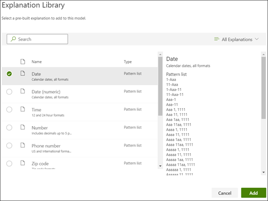

# Maak een Extractor in Microsoft SharePoint Syntex.Create an extractor in Microsoft SharePoint Syntex

 

> [!VIDEO https://www.microsoft.com/videoplayer/embed/RE4CL2G]

  

Vóór of na het maken van een classificatiemodel voor het automatiseren van de identificatie en classificatie van specifieke documenttypen, kun je desgewenst extra uittreksels toevoegen aan je model om specifieke informatie uit deze documenten te halen.Before or after you create a classifier model to automate identification and classification of specific document types, you can optionally choose to add extractors to your model to pull out specific information from these documents. Het is bijvoorbeeld mogelijk dat je wilt dat je model niet alleen wordt herkend aan *alle* documenten die worden toegevoegd aan de documentbibliotheek, maar je kunt ook de *service-begindatum* voor elk document weergeven als een kolomwaarde in de documentbibliotheek.For example, you may want your model not only to identify all *Contract Renewal* documents added to your document library, but also to display the *Service Start date* for each document as a column value in the document library.

Je moet een extractor maken voor elke entiteit in het document die je wilt ophalen.You need to create an extractor for each entity in the document that you want to extract. In ons voorbeeld willen we de  **begindatum van de service** extraheren voor elke  **contractvernieuwing** -document dat door het model wordt geïdentificeerd.In our example, we want to extract the **Service Start Date** for each **Contract Renewal** document that is identified by the model. We willen een weergave kunnen zien in de documentbibliotheek van alle  **contract** documenten, met een kolom waarin de **begindatum van de service** van elk document wordt weergegeven.We want to be able to see a view in the document library of all  **Contract Renewal** documents, with a column that shows the **Service Start** date value of each document. 

> [!NOTE]
> Als je een extractor wilt maken, gebruik je dezelfde bestanden die je eerder hebt geüpload om de classificatie te trainen.In order to create an extractor, you use the same files you previously uploaded to train the classifier. 

## Een naam voor de Extractor gevenName your extractor

1. Klik op de startpagina van het model op **Train Extractor** in de tegel **Extractor maken en trainen**.From the model home page, in the **Create and train extractors** tile, click **Train extractor**.
2. Typ in het scherm **New entiteit Extractor** de naam van je extractor in het veld **Nieuwe extractorname**.On the **New entity extractor** screen, type the name of your extractor in the **New extractor name** field. Als je bijvoorbeeld de **begindatum van de service** wilt wijzigen als je de begindatum van de service wilt ophalen uit elk document voor het verlengen van een contract.For example, name it **Service Start Date** if you want to extract the service start date from each Contract Renewal document. Je kunt er ook voor kiezen om een eerder gemaakte kolom opnieuw te gebruiken (bijvoorbeeld een kolom met beheerde metagegevens).You can also choose to reuse a previously created column (for example, a managed metadata column).
> [!NOTE]
> Als je een nieuwe extractor maakt, selecteer dan **Nieuwe kolomtype** en kies **Enkele tekstregel**. Het maximumaantal tekens is 255.If you create a new extractor, then select **New column type** and choose **Single line of text**, the maximum character limit is 255. Alle tekens die de limiet overschrijden worden afgebroken.Any characters that you type exceeding the limit get truncated. 
3. Klik op **Maken** wanneer je klaar bent.When you're done, click **Create**.

## Een label toevoegenAdd a label

De volgende stap bestaat uit het label van de entiteit die je wilt ophalen in de voorbeeldbestanden van de training.The next step is to label the entity you want to extract in your example training files.

Als je de Extractor maakt, wordt de extractor-pagina geopend.Creating the extractor opens the extractor page. Hier zie je een lijst met je voorbeeldbestanden, met het eerste bestand in de lijst die wordt weergegeven in de viewer.Here you see a list of your sample files, with the first file on the list displayed in the viewer.

1. Selecteer in de viewer de gegevens die je wilt ophalen uit de bestanden.From the viewer, select the data that you want to extract from the files. Als je bijvoorbeeld de *begindatum van service* wilt ophalen, markeer je de datumwaarde in het eerste bestand (*maandag, 14 oktober 2019*).For example, if you want to extract the *Start Service Date*, you highlight the date value in the first file (*Monday, October 14, 2019*). en klik dan op **Opslaan**.and then click **Save**.  De weergave van de waarde wordt weergegeven in het bestand in de lijst voorbeelden met een bijschrift onder de **labelkolom**.You should see the value display from the file in the Labeled examples list, under the **Label** column.
2. Selecteer **Volgende bestand** om automatisch op te slaan en het volgende bestand te openen in de lijst in de viewer.Select **Next file** to auto save and open the next file in the list in the viewer. Of selecteer **Opslaan** en selecteer een ander bestand van de lijst **Gelabelde voorbeelden**.Or select **Save** and then select another file from the **Labeled examples** list.
3. Herhaal stap 1 en 2 in de viewer en herhaal dit totdat je het label in alle vijf bestanden hebt opgeslagen.In the viewer, repeat steps 1 and 2, then repeat until you saved the label in all five files.

     

 
Wanneer je vijf bestanden hebt voorzien van een label, wordt een melding weergegeven met de mededeling dat je wilt overstappen op de training.Once you labeled five files, a notification banner displays informing you to move to training. Je kunt ervoor kiezen om meer documenten beter te labelen of verder te gaan met de training.You can choose to more label more documents or advance to training. 

### Zoeken gebruiken om in je bestand te zoekenUse Find to search your file
Je kunt de functie <b>Zoeken</b> gebruiken om te zoeken naar een entiteit in je document, dat je van een label wilt voorzien.You can use the <b>Find</b> feature to search for an entity in your document that you want to label.

    

De functie Zoeken is handig als je in een groot document zoekt of als het document meerdere exemplaren van de entiteit bevat.The Find feature is useful if you are searching a large document or if there are multiple instances of the entity in the document. Als je meerdere exemplaren hebt gevonden, kun je in de zoekresultaten het exemplaar selecteren dat je nodig hebt om naar die locatie in de viewer te gaan en dat exemplaar van een label te voorzien.If you find multiple instances, you can select the one you need in the search results to go to that location in the viewer to label it.

## Voeg een uitleg toeAdd an explanation

In ons voorbeeld gaan we een uitleg maken met een aanwijzing voor de indeling van de label zelf en de variaties in de voorbeelddocumenten.For our example, we are going to create an explanation that provides a hint about the entity format itself and variations it may have in the sample documents. Een datum kan bijvoorbeeld worden weergegeven in een aantal verschillende notaties:For example, a date value can be in a number of different formats, such as:
- 10/14/201910/14/2019
- 14 oktober 2019October 14, 2019
- Maandag 14 oktober 2019Monday, October 14, 2019
 

Als je de *begindatum van de service* wilt identificeren kun je een uitleg bij het patroon maken.To help identify the *Service Start Date* you can create a pattern explanation.

1. In de sectie uitleg selecteer je **Nieuw** en type een naam (bijvoorbeeld, *Leeg*).In the Explanation section, select **New** and type a name (for example, *Date*).
2. Selecteer bij type **Patroonlijst**.For Type, select **Pattern list**.
3. Geef bij waarde de datumvariant op zoals deze wordt weergegeven in de voorbeeldbestanden.For Value, provide the date variation as they appear in the sample files. Als je bijvoorbeeld datumnotaties hebt die worden weergegeven als 0/00/0000, geef je de variaties op die worden weergegeven in je documenten, zoals:For example, if you have date formats that appear as 0/00/0000, you enter any variations that appear in your documents, such as:
    - 0/0/00000/0/0000
    - 0/00/00000/00/0000
    - 00/0/000000/0/0000
    - 00/00/000000/00/0000
4. Kies **Opslaan**.Select **Save**.

> [!NOTE]
> Zie [Uitlegtypen](https://docs.microsoft.com/microsoft-365/contentunderstanding/explanation-types-overview)voor meer informatie over uitlegtypen.For more learn more about explanation types, see [Explanation types](https://docs.microsoft.com/microsoft-365/contentunderstanding/explanation-types-overview).  

### De Uitlegbibliotheek gebruikenUse the Explanation library

Voor het maken van toelichtingen voor items als datums, is het eenvoudiger om [de uitlegbibliotheek te gebruiken](https://docs.microsoft.com/microsoft-365/contentunderstanding/explanation-types-overview#use-the-explanation-library) dan om alle variaties handmatig in te voeren.For creating explanations for items such as dates, it is easier to [use the explanation library](https://docs.microsoft.com/microsoft-365/contentunderstanding/explanation-types-overview#use-the-explanation-library) than to manually enter all variations. De uitlegbibliotheek is een set vooraf gedefinieerde frasen en patroonverklaringen.The explanation library is a set of pre-built phrase and pattern explanations. De bibliotheek biedt alle indelingen voor veelgebruikte woordenlijsten of patroonlijsten, zoals datums, telefoonnummers en postcodes.The library tries to provides all formats for common phrase or pattern lists, such as dates, phone numbers, zip codes, and many others. 

Voor het voorbeeld *Begindatum van de service* is het efficiënter om de vooraf gedefinieerde uitleg voor *Datum* te gebruiken in de uitlegbibliotheek:For the *Service Start Date* sample, it is more efficient to use the pre-built explanation for *Date* in the explanation library:

1. In de **Sectie uitleg** selecteer je **Nieuw** en vervolgens **Uit Uitlegbibliotheek**.In the **Explanation section**, select **New**, and then select **From explanation library**.
2. Uit de uitlegbibliotheek, selecteer **Datum**.From the explanation library, select **Date**. Je kunt alle datumvariaties weergeven die worden herkend.You can view all variations of date that are recognized.
3. Kies **Toevoegen**.Select **Add**. 

     

4. Op de pagina **een uitleg maken** wordt de *Datum* informatie uit de uitlegbibliotheek automatisch ingevuld op de velden.On the **Create an explanation** page, the *Date* information from the explanation library auto fills the fields. Kies **Opslaan**.Select **Save**. 

     

## Het model trainenTrain the model 

Je uitleg start de training opslaan.Saving your explanation start the training. Als je model voldoende gegevens heeft om de gegevens uit de voorbeeldbestanden met een label te halen, zie je elk bestand dat is gemarkeerd met **Overeenkomst**.If your model has enough information to extract the data from your labeled example files, you will see each file labeled with **Match**.  

 

Als er niet voldoende informatie is om de gegevens te vinden die je wilt ophalen, krijgt elk bestand de aanduiding **Komt niet overeen**.If the explanation does not have enough information to find the data you want to extract, each file will be labeled with **Mismatch**. Je kunt klikken op de **Bestanden die niet overeenkomen**, om meer informatie weer te geven over de reden waarom er geen overeenkomt was.You can click on the **Mismatched** files to see more information about why there was a mismatch.

## Nog een uitleg toevoegenAdd another explanation

Het niet-overeenkomen is vaak een aanwijzing dat de uitleg die we hebben verstrekt niet voldoende gegevens heeft verstrekt om de waarde van de begindatum van de service te halen om te voldoen aan de gelabelde bestanden.Often the mismatch is an indication that the explanation we provided did not provide enough information to extract the service start date value to match our labeled files. Mogelijk moet je het bewerken of nog een uitleg toevoegen.You may need to edit it, or add another explanation.

In ons voorbeeld ziet u dat de tekenreeks *Begindatum van de service van* altijd vóór de werkelijke waarde begint.For our example, notice that the text string *Start Service date of* always precedes the actual value. Als je de begindatum van de service wilt identificeren moet je een uitleg bij de frase maken.To help identify the Service Start Date, you need to create a phrase explanation.

1. In de sectie uitleg selecteer je **Nieuw** en type een naam (bijvoorbeeld, *Voorvoegseltekenreeks*).In the Explanation section, select **New**, and then type a name (for example, *Prefix String*).
2. Voor het type selecteer je **Woordenlijst**.For the Type, select **Phrase list**.
3. De *Begindatum van de service van* als waarde gebruiken.Use *Service Start Date of* as the value.
4. Kies **Opslaan**.Select **Save**.

     

## Het model nogmaals trainenTrain the model again

Door de uitleg op te slaan, wordt de training opnieuw gestart en deze keer worden met beide uitleggen in het voorbeeld gebruikt.Saving the explanation starts the training again, this time using both explanations in the example. Als je model voldoende gegevens heeft om de gegevens uit de voorbeeldbestanden met een label te halen, zie je elk bestand dat is gemarkeerd met **Overeenkomst**.If your model has enough information to extract the data from the labeled example files, you see each file labeled with **Match**. 

Als je opnieuw een **Komt niet overeen** op je gelabelde bestanden ontvangt, moet je waarschijnlijk nog een uitleg maken om het model meer informatie te geven om het documenttype te identificeren, of je kunt wijzigingen aanbrengen in je bestaande bestanden.If you again receive a **Mismatch** on your labeled files, you likely need to create another explanation to provide the model more information to identify the document type, or consider making changes to your existing ones.

## Test je model.Test your model

Als je een overeenkomst hebt gekregen met de gelabelde voorbeeldbestanden, kun je nu je model testen op de andere niet-gelabelde voorbeeldbestanden.If you receive a match on your labeled sample files, you can now test your model on the remaining unlabeled example files. Dit is een optionele, maar handige stap voor het evalueren van de "geschiktheid" of het voorbereiding van het model voordat dit wordt gebruikt, door het te testen op bestanden die het model nog niet heeft gezien.This is optional, but a useful step to evaluate the “fitness” or readiness of the model before using it, by testing it on files the model hasn’t seen before.

1. Op de startpagina van het model klik je op het tabblad **Testen**.  Hiermee wordt het model uitgevoerd op de niet-gelabelde voorbeeldbestanden.From the model home page, click the **Test** tab.  This runs the model on your unlabeled sample files.
2. In de lijst **Testbestanden** worden de voorbeeldbestanden weergegeven om aan te geven of de gegevens die je nodig hebt, door het model kunnen worden opgehaald.In the **Test files** list, your example files display to show if the model is able to extract the information you need. Gebruik deze informatie om de effectiviteit van je classificatie bij het identificeren van je documenten vast te stellen.Use this information to help determine the effectiveness of your classifier in identifying your documents.

     

## Zie ookSee Also
[Een classificatie makenCreate a classifier](create-a-classifier.md)

[UitlegtypenExplanation types](explanation-types-overview.md)

[De taxonomie van een termenarchief benutten bij het maken van een extractorLeverage term store taxonomy when creating an extractor](leverage-term-store-taxonomy.md)

[Overzicht van documentbegripDocument Understanding overview](document-understanding-overview.md)

[Een model toepassenApply a model](apply-a-model.md) 
