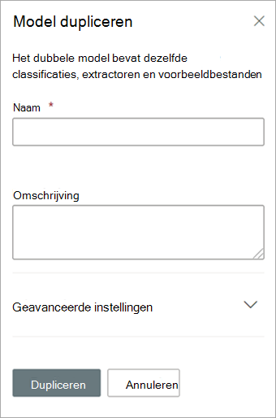

# Een model dupliceren in Microsoft SharePoint SyntexDuplicate a model in Microsoft SharePoint Syntex

Als je een model met documentbegrip dupliceert, kun je tijd en moeite besparen bij het maken van een nieuw model als je weet dat een bestaand model sterk lijkt op wat je nodig hebt.Duplicating a document understanding model can save you time and effort if you need to create a new model, and know that an existing model is very similar to what you need.

Een bestaand model met de naam 'Contracten' classificeert bijvoorbeeld dezelfde bestanden waarmee je moet werken.For example, an existing model named “Contracts” classifies the same files you need to work with. Het nieuwe model haalt een deel van de bestaande gegevens op, maar moet worden bijgewerkt om extra gegevens op te halen.Your new model will extract some of the existing data, but will need to be updated to extract some additional data. In plaats van een nieuw model helemaal opnieuw zelf te maken en te trainen, kun je met de functie Model dupliceren een kopie van het model Contracten maken, waarbij ook alle bijbehorende trainingsitems worden gekopieerd, zoals voorbeeldbestanden en entiteitsextractoren.Instead of creating and training a new model from scratch, you can use the duplicate model feature to make a copy of the Contracts model, which will also copy all associated training items, such as example files and entity extractors.

Wanneer je het model dupliceert en de naam van het model hebt gewijzigd (bijvoorbeeld in 'Contractverlengingen'), kun je het model vervolgens bijwerken.When you duplicate the model, after you rename it (for example, to “Contract Renewals”), you can then make updates to it. Je kunt bijvoorbeeld sommige bestaande opgehaalde velden verwijderen die je niet nodig hebt en het model vervolgens trainen om een nieuw veld op te halen (bijvoorbeeld 'Verlengingsdatum').For example, you can choose to remove some of the existing extracted fields that you don’t need, and then train the model to extract a new one (for example, “Renewal date”).

## Een model duplicerenDuplicate a model

Volg deze stappen om een model met documentbegrip te dupliceren.Follow these steps to duplicate a document understanding model.

1. Selecteer in het inhoudscentrum **Modellen** om de lijst met modellen te zien.From the content center, select **Models** to see your models list.

2. Selecteer op de pagina **Modellen** het model dat je wilt dupliceren.On the **Models** page, select the model you want to duplicate.

3. Gebruik het lint of de knop **Acties weergeven** (naast de modelnaam) om **Dupliceren** te selecteren.By using either the ribbon or the **Show actions** button (next to the model name), select **Duplicate**. 

      

4. In het deelvenster **Model dupliceren**:On the **Duplicate model** panel:

   a.a. Voer bij **Naam** de nieuwe naam in van het model dat je wilt dupliceren.Under **Name**, enter the new name of the model that you want to duplicate. 

      

   b.b. Voeg bij **Beschrijving** een beschrijving van het nieuwe model toe.Under **Description**, add a description of your new model.

   c.c. (Optioneel) Selecteer bij **Geavanceerde instellingen** of je een bestaand [inhoudstype](/sharepoint/governance/content-type-and-workflow-planning#content-type-overview) wilt koppelen.(Optional) Under **Advanced settings**, select whether you want to associate an existing [content type](/sharepoint/governance/content-type-and-workflow-planning#content-type-overview).

5. Selecteer **Dupliceren**.Select **Duplicate**.

## Zie ookSee Also
[Een classificatie makenCreate a classifier](create-a-classifier.md)

[De naam van een model wijzigenRename a model](rename-a-model.md)

[Een extractor makenCreate an extractor](create-an-extractor.md)

[Overzicht van documentbegripDocument Understanding overview](document-understanding-overview.md)

[UitlegtypenExplanation types](explanation-types-overview.md)

[Een model toepassenApply a model](apply-a-model.md) 

[SharePoint Syntex toegankelijkheidsmodusSharePoint Syntex Accessibility Mode](accessibility-mode.md)