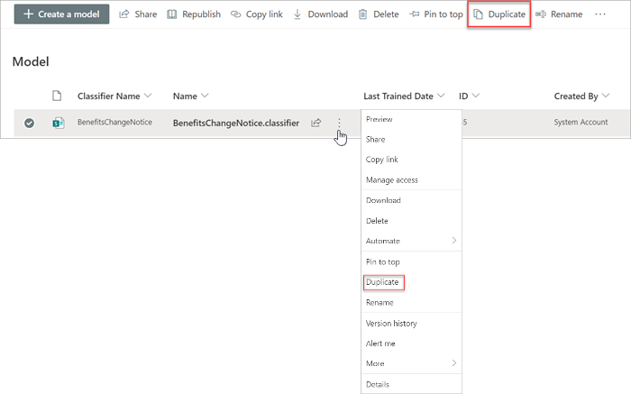

# Een model dupliceren in Microsoft SharePoint Syntex

Als je een model met documentbegrip dupliceert, kun je tijd en moeite besparen bij het maken van een nieuw model als je weet dat een bestaand model sterk lijkt op wat je nodig hebt.

Een bestaand model met de naam 'Contracten' classificeert bijvoorbeeld dezelfde bestanden waarmee je moet werken. Het nieuwe model haalt een deel van de bestaande gegevens op, maar moet worden bijgewerkt om extra gegevens op te halen. In plaats van een nieuw model helemaal opnieuw zelf te maken en te trainen, kun je met de functie Model dupliceren een kopie van het model Contracten maken, waarbij ook alle bijbehorende trainingsitems worden gekopieerd, zoals voorbeeldbestanden en entiteitsextractoren.

Wanneer je het model dupliceert en de naam van het model hebt gewijzigd (bijvoorbeeld in 'Contractverlengingen'), kun je het model vervolgens bijwerken. Je kunt bijvoorbeeld sommige bestaande opgehaalde velden verwijderen die je niet nodig hebt en het model vervolgens trainen om een nieuw veld op te halen (bijvoorbeeld 'Verlengingsdatum').

## Een model dupliceren

Volg deze stappen om een model met documentbegrip te dupliceren.

1. Selecteer in het inhoudscentrum **Modellen** om de lijst met modellen te zien.

2. Selecteer op de pagina **Modellen** het model dat je wilt dupliceren.

3. Gebruik het lint of de knop **Acties weergeven** (naast de modelnaam) om **Dupliceren** te selecteren. 

      

4. In het deelvenster **Model dupliceren**:

   a. Voer bij **Naam** de nieuwe naam in van het model dat je wilt dupliceren. 

      

   b. Voeg bij **Beschrijving** een beschrijving van het nieuwe model toe.

   c. (Optioneel) Selecteer bij **Geavanceerde instellingen** of je een bestaand [inhoudstype](/sharepoint/governance/content-type-and-workflow-planning#content-type-overview) wilt koppelen.

5. Selecteer **Dupliceren**.

## Zie ook
[Een classificatie maken](create-a-classifier.md)

[De naam van een model wijzigen](rename-a-model.md)

[Een extractor maken](create-an-extractor.md)

[Overzicht van documentbegrip](document-understanding-overview.md)

[Uitlegtypen](explanation-types-overview.md)

[Een model toepassen](apply-a-model.md) 

[SharePoint Syntex toegankelijkheidsmodus](accessibility-mode.md)