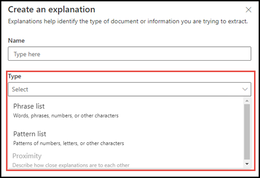
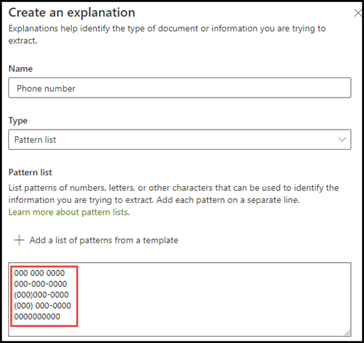
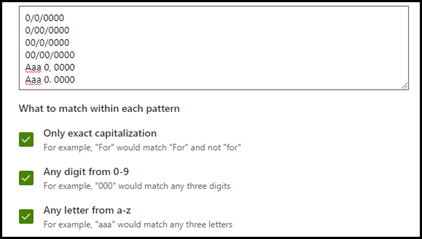
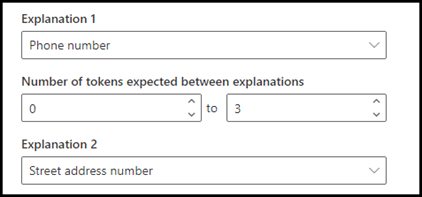
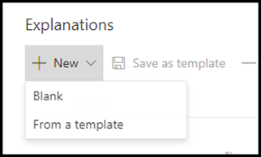

# Inleiding tot uitlegtypenIntroduction to explanation types

Uitleg wordt gebruikt om de gegevens te definiëren die je wilt labelen en ophalen in je documentinformatie over modellen in Microsoft SharePoint Syntex.Explanations are used to help to define the information you want to label and extract in your document understanding models in Microsoft SharePoint Syntex. Bij het maken van een uitleg moet je een uitlegtype selecteren.When creating an explanation, you need to select an explanation type. In dit artikel vind je meer informatie over de verschillende uitlegtypen en hoe je deze kunt gebruiken.This article helps you understand the different explanation types and how they are used. 

    
   
Deze uitlegtypen zijn beschikbaar:These explanation types are available:

- **Frasenlijst**: Lijst met woorden, woordgroepen, getallen of andere tekens die je kunt gebruiken in het document of de gegevens die je wilt ophalen.**Phrase list**: List of words, phrases, numbers, or other characters you can use in the document or information that you are extracting. De tekenreeks **Verwijzen naar Doctor** wordt bijvoorbeeld gebruikt in medische verwijsdocumenten die je identificeert.For example, the text string **Referring Doctor** is in all Medical Referral documents you are identifying. 

- **Patroonlijst**: lijst patronen met getallen, letters of andere tekens die je kunt gebruiken om de gegevens te identificeren die je wilt ophalen.**Pattern list**: List patterns of numbers, letters, or other characters that you can use to identify the information that you are extracting. Je kunt bijvoorbeeld het **Telefoonnummer** van de verwijsarts extraheren uit medische verwijsdocumenten die je identificeert.For example, you can extract the **Phone number** of the referring doctor from all Medical Referral document that you are identifying. 

- **Proximity**: in dit artikel wordt beschreven hoe dicht toelichtingen bij elkaar liggen.**Proximity**: Describes how close explanations are to each other. Een patroonlijst van *straatnummer* wordt bijvoorbeeld direct weergeven voor de woordenlijst met *straatnamen* zonder tokens ertussen (je vind meer informatie over tokens verderop in dit artikel).For example, a *street number* pattern list goes right before the *street name* phrase list, with no tokens in between (you'll learn about tokens later in this article). Voor het type proximity moet je ten minste twee uitleggen in je model hebben, of de optie wordt uitgeschakeld.Using the proximity type requires you to have at least two explanations in your model or the option will be disabled. 
 
## WoordenlijstPhrase list

Het uitlegtype van een woordenlijst wordt meestal gebruikt om een document te identificeren en te classificeren via je model.A phrase list explanation type is typically used to identify and classify a document through your model. Zoals wordt beschreven in het labelvoorbeeld *Verwijzende arts*, is het een tekenreeks met woorden, woordgroepen, getallen of tekens die consequent voorkomen in de documenten die je wilt herkennen.As described in the *Referring Doctor* label example, it is a string of words, phrases, numbers, or characters that is consistently in the documents that you are identifying.

Hoewel het geen eis is, kunt je je uitleg beter laten opvallen als de woordgroep die je wilt vastleggen zich op een consistente locatie in het document bevindt.While not a requirement, you can achieve better success with your explanation if the phrase you are capturing is located in a consistent location in your document. Zo kan het label *Verwijzende arts* label zich in de eerste alinea van het document bevinden.For example, the *Referring Doctor* label may be consistently located in the first paragraph of the document.

Als hoofdlettergevoeligheid een vereiste is bij het identificeren van je label, kun je met het woordenlijsttype in uw uitleg opgeven door het selectievakje **Alleen exacte kapitalisatie** in te schakelen.If case sensitivity is a requirement in identifying your label, using the phrase list type allows you to specify it in your explanation by selecting the **Only exact capitalization** checkbox.

    

## PatroonlijstenPattern lists

Een patroonlijst is met name handig wanneer je een uitleg maakt waarmee gegevens uit een document worden geïdentificeerd en opgehaald.A pattern list type is especially useful when you create an explanation that identifies and extracts information from a document. Deze worden meestal weergegeven in verschillende indelingen, zoals datums, telefoonnummers of creditcardnummers.It is typically presented in different formats, such as dates, phone numbers, and credit card numbers. Een datum kan bijvoorbeeld worden weergegeven in een aantal verschillende notaties (1/1/2020, 1-1-2020, 01/01/20, 01/01/2020, 1 januari 2020, enzovoort).For example, a date can be displayed in a number of different formats (1/1/2020, 1-1-2020, 01/01/20, 01/01/2020, Jan 1,2020, etc.). Door een patroonlijst te definiëren, kun je je efficiënter identificeren door eventuele variaties in de gegevens vast te leggen die je probeert vast te stellen en op te halen.Defining a pattern list makes your explanation more efficient by capturing any possible variations in the data that you are trying to identify and extract. 

Voor het voorbeeld **Telefoonnummer** moet je het telefoonnummer voor elke verwijzende arts ophalen uit alle Medische Verwijzingsdocumenten die door het model worden geïdentificeerd.For the **Phone number** example, you extract the phone number for each referring doctor from all Medical Referral documents that the model identifies. Wanneer je de uitleg maakt, selecteer je het patroonlijsttype om de verschillende indelingen toe te staan die mogelijk naar verwachting worden geretourneerd.When you create the explanation, select the Pattern list type to allow the different formats that you may expect to be returned.

   

Voor dit voorbeeld selecteert u het selectievakje **een cijfer van 0-9** als u elke ' 0 ' waarde die in de patroonlijst wordt gebruikt, wilt herkennen aan een cijfer van 0 tot en met 9.For this example, select the **Any digit from 0-9** checkbox to recognize each "0" value used in your pattern list to be any digit from 0 through 9.

   

Als u een patroonlijst maakt die teksttekens bevat, selecteert u het selectievakje **een letter van a-z** om elk teken dat wordt gebruikt in de patroonlijst te herkennen aan een teken van a tot en met z.Similarly, if you create a pattern list that includes text characters, select the **Any letter from a-z** checkbox to recognize each "a" character used in the pattern list to be any character from "a" to "z".

Als je bijvoorbeeld een patroonlijst **Datum** maakt en je ervoor wilt zorgen dat een datumnotatie wordt ondersteund zoals *2020 1 januari*, moet je het volgende doen:For example, if you create a **Date** pattern list and you want to make sure that a date format such as *Jan 1, 2020* is recognized, you need to:
- Voeg *AAA 0, 0000* en *AAA 00, 0000* aan de patroonlijst toe.Add *aaa 0, 0000* and *aaa 00, 0000* to your pattern list.
- Zorg ervoor dat **Een willekeurige letter van a-z** is geselecteerd.Make sure that **Any letter from a-z** is also selected.

   

Als je hoofdlettereisen in je patroonlijst hebt, kun je ook het selectievakje **Alleen exact hoofdlettergebruik** selecteren.Additionally, if you have capitalization requirements in your pattern list, you have the option to select the **Only exact capitalization** checkbox. Als de eerste letter van de maand moet worden gekapitaliseerd, moet je het volgende doen:For the Date example, if you require the first letter of the month to be capitalized, you need to:

- Voeg *Aaa 0, 0000* en *AAA 00, 0000* aan de patroonlijst toe.Add *Aaa 0, 0000* and *Aaa 00, 0000* to your pattern list.
- Zorg ervoor dat **Alleen exact hoofdlettergebruik** ook is geselecteerd.Make sure that **Only exact capitalization** is also selected.

   

> [!NOTE]
> Gebruik in plaats van het handmatig maken van een uitleg voor patroonlijsten de [uitlegbibliotheek](https://docs.microsoft.com/microsoft-365/contentunderstanding/explanation-types-overview#use-explanation-templates) voor het gebruik van vooraf gemaakte patroonlijstsjablonen voor een algemene patroonlijst, zoals *datum*, *telefoonnummer*, *creditcardnummer*, enzovoort.Instead of manually creating a pattern list explanation, use the [explanation library](https://docs.microsoft.com/microsoft-365/contentunderstanding/explanation-types-overview#use-explanation-templates) to use pattern list templates for a common pattern list, such as *date*, *phone number*, *credit card number*, etc.

## ProximityProximity 

Met het Proximity-uitlegtype kan je model identificeren met behulp van hoe dichtbij een ander stukje gegevens is.The proximity explanation type helps your model identify data by defining how close another piece of data is to it. Bijvoorbeeld, in je model heb je twee verklaringen gedefinieerd waaraan zowel het *huisnummer* als *telefoonnummer* zijn gelabeld.For example, in your model say you have defined two explanations that label both the customer *Street address number* and *Phone number*. 

Je ziet ook dat de telefoonnummers van klanten altijd voor het huisnummer worden weergegeven.Notice that customer phone numbers always appear before the street address number. 

Alex WilburnAlex Wilburn 
555-555-5555555-555-5555 
One Microsoft WayOne Microsoft Way 
Redmond, WA 98034Redmond, WA 98034 

Gebruik de proximity-uitleg om te bepalen hoe ver de uitleg van een telefoonnummer is zodat u het huisnummer in je documenten beter kunt identificeren.Use the proximity explanation to define how far away the phone number explanation is to better identify the street address number in your documents.

    

#### Wat zijn tokens?What are tokens?

Voor het gebruik van het Proximity-uitlegtype moet je weten wat een token is, omdat het aantal tokens is hoe de proximity-uitleg de afstand tussen een verklaring en een andere meet.In order to use the proximity explanation type, you need to understand what a token is, as the number of tokens is how the proximity explanation measures distance from one explanation to another. Een token is een doorlopende reeks (geen spaties of interpunctie) van letters en cijfers.A token is a continuous span (not including spaces or punctuation) of letters and numbers. 

In de volgende tabel zie je enkele voorbeelden van hoe je het aantal tokens in een woordgroep kunt vaststellen.The following table shows examples for how to determine the number of tokens in a phrase.

|WoordengroepPhrase|Aantal tokensNumber of tokens|UitlegExplanation|
|--|--|--|
|`Dog`|11|Eén woord zonder leesteken of spatie.A single word with no punctuation or spaces.|
|`RMT33W`|11|Een record locatornummer.A record locator number. Het mag cijfers en letters bevatten, maar geen leestekens.It may include numbers and letters, but does not have punctuation.|
|`425-555-5555`|55|Een telefoonnummer.A phone number. Elk leesteken bestaat uit één token, zodat `425-555-5555` 5 tokens zou zijn:Each punctuation mark is a single token, so `425-555-5555` is 5 tokens: `425` `-` `555` `-` `5555` |
|`https://luis.ai`|77|`https` `:` `/` `/` `luis` `.` `ai` |

#### Het proximity-uitlegtype configurerenConfigure the proximity explanation type

Voor het voorbeeld configureer je de proximity-instelling zodanig dat je het aantal tokens kunt definiëren in *Telefoonnummer*-uitleg afkomstig van de *Huisnummer*-uitleg.For the example, configure the proximity setting to define the range of the number of tokens in the *Phone number* explanation from the *Street address number* explanation. Je ziet dat het minimumbereik “0“ is omdat er geen tokens zijn tussen het telefoonnummer en het huisnummer.Notice that the minimum range is "0", because there are no tokens between the phone number and street address number.

Sommige telefoonnummers in de voorbeelddocumenten worden echter toegevoegd met *(mobiel)*.But some phone numbers in the sample documents are appended with *(mobile)*.

Wander KuijkenNestor Wilke 
111-111-1111 (mobiel)111-111-1111 (mobile) 
One Microsoft WayOne Microsoft Way 
Redmond, WA 98034Redmond, WA 98034 

Er zijn drie tokens in *(mobiel)*:There are three tokens in *(mobile)*:

|WoordengroepPhrase|Aantal tokensToken count|
|--|--|
|((|11|
|Mobielmobile|22|
|))|33|

Configureer de proximity-instelling voor een bereik van 0 tot en met 3.Configure the proximity setting to have a range of 0 through 3.

    

## Uitlegsjablonen gebruikenUse explanation templates

Hoewel je handmatig verschillende waarden voor een patroonlijst kunt toevoegen voor je uitleg, is het veel eenvoudiger om de vooraf gemaakte sjablonen te gebruiken die in de uitlegbibliotheek worden aangeboden.While you can manually add various pattern list values for your explanation, it can be easier to use the templates provided to you in the explanation library.

Je kunt bijvoorbeeld in plaats van alle variaties voor *Datum* handmatig toe te voegen, de sjabloonlijst met patronen gebruiken voor *Datum*, die al een aantal waarden voor een patroonlijst bevat:For example, instead of manually adding all the variations for *Date*, you can use the pattern list template for *Date* as it already includes a number of pattern lists values: 

    
 
De uitlegbibliotheek bevat een aantal veelgebruikte beschrijvingen van de patroonlijst, waaronder:The explanation library includes commonly used pattern list explanations, including: 

- DatumDate 
- Datum (getal)Date (numeric) 
- TijdTime 
- NummerNumber 
- TelefoonnummerPhone number 
- PostcodeZip code 
- Eerste woord of zinFirst word of sentence 
- CreditcardCredit card 
- Sofi-nummerSocial security number 

Let op: de uitlegbibliotheek bevat ook sjablonen voor verklaringen van een woordenlijst, waaronder:Note that the explanation library also includes templates for phrase list explanations:
- Afgelopen zinEnd of sentence
- ValutaCurrency

#### Een sjabloon gebruiken uit de uitlegbibliotheekTo use a template from the explanation library

1. Ga naar het gedeelte **Uitleg** van de **Train**-pagina van je model en selecteer **Nieuwe** en selecteer vervolgens **Van een sjabloon**.From the **Explanations** section of your model's **Train** page, select **New**, then select **From a template**. 

    

2.  Selecteer op de pagina **Uitlegsjablonen** de uitleg die je wilt gebruiken en selecteer vervolgens **Toevoegen**.On the **Explanation templates** page, select the explanation you want to use, then select **Add**. 

        

3. De informatie voor de sjabloon die je hebt geselecteerd, wordt weergegeven op de pagina **Een uitleg maken**.The information for the template you selected displays on the **Create an explanation** page. Bewerk zo nodig de naam van de uitleg en voeg items toe aan of verwijder items uit de patroonlijst.If needed, edit the explanation name and add or remove items from the pattern list.   

    

4. Selecteer **Opslaan** wanneer je klaar bent.When finished, select **Save**.
