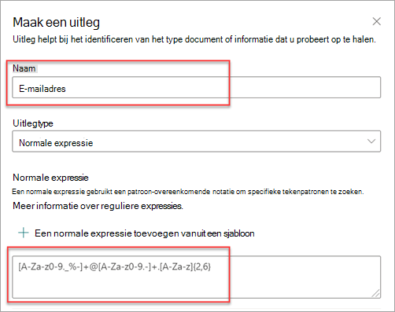

# Uitlegtypen in Microsoft SharePoint SyntexExplanation types in Microsoft SharePoint Syntex

Uitleg wordt gebruikt om de gegevens te definiëren die je wilt labelen en ophalen in je documentinformatie over modellen in Microsoft SharePoint Syntex.Explanations are used to help to define the information you want to label and extract in your document understanding models in Microsoft SharePoint Syntex. Bij het maken van een uitleg moet je een uitlegtype selecteren.When you create an explanation, you need to select an explanation type. In dit artikel vind je meer informatie over de verschillende uitlegtypen en hoe je deze kunt gebruiken.This article helps you understand the different explanation types and how they're used.

 
   
Deze uitlegtypen zijn beschikbaar:These explanation types are available:

- [**Patroonlijst**](#phrase-list): lijst met woorden, woordgroepen, cijfers of andere tekens die u kunt gebruiken in het document of de informatie die u uit het document haalt.[**Phrase list**](#phrase-list): List of words, phrases, numbers, or other characters you can use in the document or information that you're extracting. De tekststring *verwijzende arts* staat bijvoorbeeld in alle medische verwijzingsdocumenten die u identificeert.For example, the text string *referring doctor* is in all Medical Referral documents you're identifying. Of het *telefoonnummer* van de verwijzende arts uit alle medische verwijzingsdocumenten die u identificeert.Or the *phone number* of the referring doctor from all Medical Referral documents that you're identifying.

- [**Reguliere expressie**](#regular-expression): in een reguliere expressie wordt een notatie gebruikt om patronen te matchen en zo specifieke tekenpatronen te vinden.[**Regular expression**](#regular-expression): Uses a pattern-matching notation to find specific character patterns. U kunt bijvoorbeeld een reguliere expressie gebruiken om alle instanties van een *e-mailadres* patroon in een verzameling documenten te zoeken.For example, you can use a regular expression to find all instances of an *email address* pattern in a set of documents.

- [**Nabijheid**](#proximity): beschrijft hoe nauw de verklaringen bij elkaar liggen.[**Proximity**](#proximity): Describes how close explanations are to each other. Een lijst met *straatnummers* staat bijvoorbeeld vlak voor de lijst met *straatnamen*, zonder tokens ertussen (verderop in dit artikel vindt u meer informatie over tokens).For example, a *street number* phrase list goes right before the *street name* phrase list, with no tokens in between (you'll learn about tokens later in this article). Voor het type proximity moet je ten minste twee uitleggen in je model hebben, of de optie wordt uitgeschakeld.Using the proximity type requires you to have at least two explanations in your model or the option will be disabled. 

## WoordenlijstPhrase list

Het uitlegtype van een woordenlijst wordt meestal gebruikt om een document te identificeren en te classificeren via je model.A phrase list explanation type is typically used to identify and classify a document through your model. Zoals beschreven in het voorbeeld van het label *verwijzende arts*, is het een reeks woorden, woordgroepen, cijfers of tekens die consistent in de documenten staat die u identificeert.As described in the *referring doctor* label example, it's a string of words, phrases, numbers, or characters that is consistently in the documents that you're identifying.

Hoewel dit geen vereiste is, kunt u meer succes behalen met uw uitleg als het patroon dat u vastlegt zich op een consistente locatie in uw document bevindt.While not a requirement, you can achieve better success with your explanation if the phrase you're capturing is located in a consistent location in your document. Het label *verwijzende arts* kan bijvoorbeeld consequent in de eerste alinea van het document staan.For example, the *referring doctor* label might be consistently located in the first paragraph of the document. U kunt ook de optie **[Configureren waar zinnen voorkomen in het document](https://docs.microsoft.com/microsoft-365/contentunderstanding/explanation-types-overview#configure-where-phrases-occur-in-the-document)** in de geavanceerde instellingen gebruiken om specifieke gebieden te selecteren waar de zin zich bevindt, vooral als de kans bestaat dat het patroon op meerdere locaties in uw document voorkomt.You can also use the **[Configure where phrases occur in the document](https://docs.microsoft.com/microsoft-365/contentunderstanding/explanation-types-overview#configure-where-phrases-occur-in-the-document)** advanced setting to select specific areas where the phrase is located, especially if there's a chance that the phrase might occur in multiple locations in your document.

Als hoofdlettergevoeligheid een vereiste is bij het identificeren van je label, kun je met het woordenlijsttype in uw uitleg opgeven door het selectievakje **Alleen exacte kapitalisatie** in te schakelen.If case sensitivity is a requirement in identifying your label, using the phrase list type allows you to specify it in your explanation by selecting the **Only exact capitalization** checkbox.

 

Een patroonlijst is vooral handig wanneer u een uitleg maakt die informatie in verschillende indelingen identificeert en extraheert, zoals datums, telefoonnummers en creditcardnummers.A phrase type is especially useful when you create an explanation that identifies and extracts information in different formats, such as dates, phone numbers, and credit card numbers. Een datum kan bijvoorbeeld in veel verschillende formaten worden weergegeven (1/1/2020, 1-1-2020, 01/01/20, 01/01/2020, 1 januari 2020, enzovoort).For example, a date can be displayed in many different formats (1/1/2020, 1-1-2020, 01/01/20, 01/01/2020, or Jan 1,2020). Door een patroonlijst te definiëren, kunt u efficiënter identificeren door eventuele variaties in de gegevens vast te leggen die u probeert vast te stellen en op te halen.Defining a phrase list makes your explanation more efficient by capturing any possible variations in the data that you're trying to identify and extract. 

Voor het voorbeeld *Telefoonnummer* haalt u het telefoonnummer voor elke verwijzende arts op uit alle Medische Verwijzingsdocumenten die door het model worden geïdentificeerd.For the *phone number* example, you extract the phone number for each referring doctor from all Medical Referral documents that the model identifies. Wanneer u de uitleg maakt, typt u de verschillende notaties die een telefoonnummer in uw document kan weergeven, zodat u mogelijke variaties kunt vastleggen.When you create the explanation, type the different formats a phone number might display in your document so that you're able to capture possible variations. 

Schakel voor dit voorbeeld in **Geavanceerde instellingen** het selectievakje **Elk cijfer van 0-9** in om elke '0'-waarde die in uw lijst met zinnen wordt gebruikt, te herkennen als een cijfer van 0 tot en met 9.For this example, in **Advanced Settings** select the **Any digit from 0-9** checkbox to recognize each "0" value used in your phrase list to be any digit from 0 through 9.

Als u een patroonlijst maakt die teksttekens bevat, selecteert u het selectievakje **Willekeurige letter van a-z** om aan te geven dat elk 'a'-teken dat in de patroonlijst wordt gebruikt, elk teken van 'a' tot 'z' kan zijn.Similarly, if you create a phrase list that includes text characters, select the **Any letter from a-z** checkbox to recognize each "a" character used in the phrase list to be any character from "a" to "z".

Als u bijvoorbeeld een patroonlijst **Datum** maakt en u ervoor wilt zorgen dat een datumnotatie wordt ondersteund zoals *1 januari 2020*, moet u het volgende doen:For example, if you create a **Date** phrase list and you want to make sure that a date format such as *Jan 1, 2020* is recognized, you need to:

- Voeg *0 AAA 0000* en *00 AAA 0000* aan de patroonlijst toe.Add *aaa 0, 0000* and *aaa 00, 0000* to your phrase list.
- Zorg ervoor dat **Een willekeurige letter van a-z** is geselecteerd.Make sure that **Any letter from a-z** is also selected.

Als je hoofdlettereisen in je patroonlijst hebt, kun je ook het selectievakje **Alleen exact hoofdlettergebruik** selecteren.If you have capitalization requirements in your phrase list, you can select the **Only exact capitalization** checkbox. Als u voor het datumvoorbeeld wilt dat de eerste letter van de maand met een hoofdletter wordt geschreven, moet u:For the date example, if you require the first letter of the month to be capitalized, you need to:

- Voeg *0 Aaa 0000* en *00 AAA 0000* aan de patroonlijst toe.Add *Aaa 0, 0000* and *Aaa 00, 0000* to your phrase list.
- Zorg ervoor dat **Alleen exact hoofdlettergebruik** ook is geselecteerd.Make sure that **Only exact capitalization** is also selected.

> [!NOTE]
> Gebruik in plaats van het handmatig maken van een uitleg voor patroonlijsten de [uitlegbibliotheek](https://docs.microsoft.com/microsoft-365/contentunderstanding/explanation-types-overview#use-explanation-templates) voor het gebruik van vooraf gemaakte patroonlijstsjablonen voor een algemene patroonlijst, zoals *datum*, *telefoonnummer*, *creditcardnummer*, enzovoort.Instead of manually creating a phrase list explanation, use the [explanation library](https://docs.microsoft.com/microsoft-365/contentunderstanding/explanation-types-overview#use-explanation-templates) to use phrase list templates for a common phrase list, such as *date*, *phone number*, or *credit card number*.

## Reguliere expressieRegular expression

Met behulp van een reguliere uitlegtype voor expressies kunt u patronen maken om bepaalde tekenreeksen in documenten te zoeken en te identificeren.A regular expression explanation type allows you to create patterns that help find and identify certain text strings in documents. U kunt reguliere expressies gebruiken om snel grote hoeveelheden tekst te parseren om:You can use regular expressions to quickly parse large amounts of text to:

- Specifieke tekenpatronen te zoeken.Find specific character patterns.
- Tekst te valideren om ervoor te zorgen dat deze overeenkomt met een vooraf gedefinieerd patroon (zoals een e-mailadres).Validate text to ensure that it matches a predefined pattern (such as an email address).
- Tekstsubtekenreeksen te extraheren, bewerken, vervangen of verwijderen.Extract, edit, replace, or delete text substrings.

Een type reguliere expressie is vooral handig wanneer u een uitleg maakt die informatie in vergelijkbare indelingen identificeert en extraheert, zoals e-mailadressen, bankrekeningnummers of URL's.A regular expression type is especially useful when you create an explanation that identifies and extracts information in similar formats, such as email addresses, bank account numbers, or URLs. Een e-mailadres, zoals megan@contoso.com, wordt bijvoorbeeld met een bepaald patroon weergegeven ('megan' is het eerste deel en 'com' is het laatste deel).For example, an email address, such as megan@contoso.com, is displayed in a certain pattern ("megan" is the first part, and "com" is the last part). 

De reguliere expressie voor een e-mailadres is: **[A-Za-z0-9._%-]+@[A-Za-z0-9.-]+. [A-Za-z]{2,6}**.The regular expression for an email address is: **[A-Za-z0-9._%-]+@[A-Za-z0-9.-]+.[A-Za-z]{2,6}**.

Deze expressie bestaat uit vijf delen, in deze volgorde:This expression consists of five parts, in this order:

1. Een of meer van de volgende tekens:Any amount of the following characters:

   a.a. Letters van a tot zLetters from a to z

   b.b. Getal tussen 0 en 9Numbers from 0-9

   c.c. Punt, onderstrepingsteken, percentage of streepjePeriod, underscore, percent, or dash

2. Het @-symboolThe @ symbol

3. Elk aantal van hetzelfde soort tekens als het eerste deel van het e-mailadresAny amount of the same characters as the first part of the email address

4. Een puntA period

5. Twee tot zes lettersTwo to six letters

Een uitlegtype voor een reguliere expressie toevoegen:To add a regular expression explanation type:

1. Selecteer **Reguliere expressie** in het deelvenster **Een uitleg maken** onder **Type uitleg**.From the **Create an explanation** panel, under **Explanation type**, select **Regular expression**.

   

2. U kunt een uitdrukking typen in het tekstvak **Reguliere expressie** of **Een reguliere uitdrukking uit een sjabloon toevoegen** selecteren.You can either type an expression in the **Regular expression** text box or select **Add a regular expression from a template**.

   Wanneer u een reguliere expressie toevoegt met behulp van een sjabloon, worden de naam en de reguliere expressie automatisch toegevoegd aan het tekstvak.When you add a regular expression by using a template, it automatically adds the name and the regular expression to the text box. Als u bijvoorbeeld de sjabloon **E-mailadres** kiest, wordt het paneel **Een uitleg maken** ingevuld.For example, if you choose the **Email address** template, the **Create an explanation** panel will be populated.

   

## ProximityProximity 

Met het Proximity-uitlegtype kan je model identificeren met behulp van hoe dichtbij een ander stukje gegevens is.The proximity explanation type helps your model identify data by defining how close another piece of data is to it. Stel dat u in uw model twee verklaringen hebt gedefinieerd die zowel het *huisnummer* van de klant als het *telefoonnummer* van een label voorzien.For example, in your model say you have defined two explanations that label both the customer *street address number* and *phone number*. 

Je ziet ook dat de telefoonnummers van klanten altijd voor het huisnummer worden weergegeven.Notice that customer phone numbers always appear before the street address number. 

Alex WilburnAlex Wilburn 
555-555-5555555-555-5555 
One Microsoft WayOne Microsoft Way 
Redmond, WA 98034Redmond, WA 98034 

Gebruik de proximity-uitleg om te bepalen hoe ver de uitleg van een telefoonnummer is zodat u het huisnummer in je documenten beter kunt identificeren.Use the proximity explanation to define how far away the phone number explanation is to better identify the street address number in your documents.

#### Wat zijn tokens?What are tokens?

Om het uitlegtype nabijheid te gebruiken, moet u weten wat een token is.To use the proximity explanation type, you need to understand what a token is. Het aantal tokens is de manier waarop de nabijheidsverklaring de afstand van de ene uitleg tot de andere meet.The number of tokens is how the proximity explanation measures distance from one explanation to another. Een token is een doorlopende reeks (geen spaties of interpunctie) van letters en cijfers.A token is a continuous span (not including spaces or punctuation) of letters and numbers. 

In de volgende tabel zie je enkele voorbeelden van hoe je het aantal tokens in een woordgroep kunt vaststellen.The following table shows examples for how to determine the number of tokens in a phrase.

|WoordengroepPhrase|Aantal tokensNumber of tokens|UitlegExplanation|
|--|--|--|
|`Dog`|11|Eén woord zonder leesteken of spatie.A single word with no punctuation or spaces.|
|`RMT33W`|11|Een record locatornummer.A record locator number. Het mag cijfers en letters bevatten, maar geen leestekens.It might include numbers and letters, but doesn't have punctuation.|
|`425-555-5555`|55|Een telefoonnummer.A phone number. Elk leesteken bestaat uit één token, zodat `425-555-5555` 5 tokens zou zijn:Each punctuation mark is a single token, so `425-555-5555` is 5 tokens: `425` `-` `555` `-` `5555` |
|`https://luis.ai`|77|`https` `:` `/` `/` `luis` `.` `ai` |

#### Het proximity-uitlegtype configurerenConfigure the proximity explanation type

Voor het voorbeeld configureert u de nabijheidsinstelling zodanig dat u het aantal tokens kunt definiëren in de *telefoonnummer*-uitleg afkomstig van de *huisnummer*-uitleg.For the example, configure the proximity setting to define the range of the number of tokens in the *phone number* explanation from the *street address number* explanation. Je ziet dat het minimumbereik “0“ is omdat er geen tokens zijn tussen het telefoonnummer en het huisnummer.Notice that the minimum range is "0", because there are no tokens between the phone number and street address number.

Sommige telefoonnummers in de voorbeelddocumenten worden echter toegevoegd met *(mobiel)*.But some phone numbers in the sample documents are appended with *(mobile)*.

Wander KuijkenNestor Wilke 
111-111-1111 (mobiel)111-111-1111 (mobile) 
One Microsoft WayOne Microsoft Way 
Redmond, WA 98034Redmond, WA 98034 

Er zijn drie tokens in *(mobiel)*:There are three tokens in *(mobile)*:

|WoordengroepPhrase|Aantal tokensToken count|
|--|--|
|((|11|
|Mobielmobile|22|
|))|33|

Configureer de proximity-instelling voor een bereik van 0 tot en met 3.Configure the proximity setting to have a range of 0 through 3.

## Configureren waar woordgroepen voorkomen in het documentConfigure where phrases occur in the document

Wanneer u een uitleg maakt, wordt standaard in het hele document gezocht naar het patroon dat u wilt extraheren.When you create an explanation, by default the entire document is searched for the phrase you're trying to extract. U kunt echter de geavanceerde instelling **Waar deze woordgroepen voorkomen** gebruiken om een specifieke locatie in het document te isoleren waar een woordgroep voorkomt.However, you can use the **Where these phrases occur** advanced setting to help in isolating a specific location in the document that a phrase occurs. Deze instelling is handig in situaties waarin vergelijkbare gevallen van een patroon ergens anders in het document kunnen voorkomen en u zeker wilt weten dat de juiste is geselecteerd.This setting is useful in situations where similar instances of a phrase might appear somewhere else in the document, and you want to make sure that the correct one is selected.

Wanneer we kijken naar ons voorbeelddocument voor medische verwijzing, wordt de *verwijzende arts* altijd in de eerste alinea van het document vermeld.Referring to our Medical Referral document example, the *referring doctor* is always mentioned in the first paragraph of the document. Met de instelling **Waar deze woordgroepen voorkomen** kunt u in dit voorbeeld de uitleg zo configureren dat alleen in het begin van het document naar dit label wordt gezocht, of op een andere locatie waar dit kan voorkomen.With the **Where these phrases occur** setting, in this example you can configure your explanation to search for this label only in the beginning section of the document, or any other location in which it might occur.

U kunt kiezen uit de volgende opties voor deze instelling:You can choose the following options for this setting:

- Overal in het bestand: in het hele document wordt naar de woordgroep gezocht.Anywhere in the file: The entire document is searched for the phrase.

- Begin van het bestand: het document wordt vanaf het begin tot aan de locatie van de woordgroep doorzocht.Beginning of the file:  The document is searched from the beginning to the phrase location.

   

    In de viewer kunt u het selectievakje handmatig aanpassen zodat de locatie van de woordgroep wordt opgenomen.In the viewer, you can manually adjust the select box to include the location where the phase occurs. De waarde van **Eindpositie** wordt bijgewerkt om het aantal tokens weer te geven dat het geselecteerde gebied bevat.The **End position** value will update to show the number of tokens your selected area includes. U kunt de waarde van de **Eindpositie** ook bijwerken om het geselecteerde gebied aan te passen.You can update the **End position** value as well to adjust the selected area.

   

- Einde van het bestand: het document wordt vanaf het eind tot aan de locatie van het patroon doorzocht.End of the file: The document is searched from the end to the phrase location.

   

    In de viewer kunt u het selectievakje handmatig aanpassen zodat de locatie van de woordgroep wordt opgenomen.In the viewer, you can manually adjust the select box to include the location where the phase occurs. De waarde van **Beginpositie** wordt bijgewerkt om het aantal tokens weer te geven dat het geselecteerde gebied bevat.The **Starting position** value will update to show the number of tokens your selected area includes. U kunt de waarde van de Beginpositie ook bijwerken om het geselecteerde gebied aan te passen.You can update the Starting position value as well to adjust the selected area.

   

- Aangepast bereik: het document wordt binnen een opgegeven bereik doorzocht op de locatie van het patroon.Custom range: The document is searched within a specified range for the phrase location.

   

    In de viewer kunt u het selectievakje handmatig aanpassen zodat de locatie van de woordgroep wordt opgenomen.In the viewer, you can manually adjust the select box to include the location where the phase occurs. Voor deze instelling moet u een **Beginpositie** en een **Eindpositie** selecteren.For this setting, you need to select a **Start** and an **End** position. Deze waarden geven het aantal tokens aan vanaf het begin van het document.These values represent the number of tokens from the beginning of the document. Hoewel u deze waarden handmatig kunt invoeren, is het eenvoudiger om het selectievakje handmatig aan te passen in de viewer.While you can manually enter in these values, it's easier to manually adjust the select box in the viewer. 
   
## Uitlegsjablonen gebruikenUse explanation templates

Je kan handmatig verschillende frasenlijstwaarden toevoegen voor je uitleg, maar het kan eenvoudiger door sjablonen te gebruiken die aangeboden worden in de uitlegbibliotheek.While you can manually add various phrase list values for your explanation, it can be easier to use the templates provided to you in the explanation library.

In plaats van alle variaties voor de *datum* handmatig toe te voegen, kunt u bijvoorbeeld de sjabloonlijst voor het patroon voor *datum* gebruiken, omdat deze al veel waarden voor een patroonlijst bevat:For example, instead of manually adding all the variations for *date*, you can use the phrase list template for *date* because it already includes many phrase lists values:

 
De uitlegbibliotheek bevat een aantal veelgebruikte beschrijvingen van de *patroonlijst*, waaronder:The explanation library includes commonly used *phrase list* explanations, including:

- Datum: Kalenderdatums, alle notaties.Date: Calendar dates, all formats. Bevat tekst en getallen (bijvoorbeeld &quot;9 dec, 2020").Includes text and numbers (for example, "Dec 9, 2020").
- Datum (numeriek): Kalenderdatums, alle notaties.Date (numeric): Calendar dates, all formats. Bevat getallen (bijvoorbeeld 1-11-2020).Includes numbers (for example, 1-11-2020).
- Tijd: 12- en 24-uurs tijdnotatie.Time: 12 and 24 hour formats.
- Getal: positieve en negatieve getallen met maximaal twee decimalen.Number: Positive and negative numbers up to two decimals. 
- Percentage: een lijst met patronen die een percentage vertegenwoordigen.Percentage: A list of patterns representing a percentage. Bijvoorbeeld 1%, 11%, 100% of 11,11%.For example, 1%, 11%, 100%, or 11.11%.
- Telefoonnummer: veelgebruikte Amerikaanse en internationale notaties.Phone number: Common US and International formats. Bijvoorbeeld 000 000 0000, 000-000-0000, (000)000-0000 of (000) 000-0000.For example, 000 000 0000, 000-000-0000, (000)000-0000, or (000) 000-0000.
- Postcode: Amerikaanse postcode-indelingen.Zip code: US Zip code formats. Bijvoorbeeld, 11111, 11111-1111.For example, 11111, 11111-1111.
- Eerste woord van zin: algemene patronen voor woorden met maximaal negen tekens.First word of sentence: Common patterns for words up to nine characters. 
- Einde van zin: veelvoorkomende interpunctie voor het einde van een zin.End of sentence: Common punctuation for end of a sentence.
- Creditcard: veelgebruikte notaties voor creditcards.Credit card: Common credit card number formats. Bijvoorbeeld, 1111-1111-1111-1111.For example, 1111-1111-1111-1111. 
- Sofinummer: Amerikaanse notatie voor het sofinummer. Bijvoorbeeld: 111-11-1111.Social security number: US Social Security Number format. For example, 111-11-1111. 
- Selectievakje: een patroonlijst die variaties op een ingevuld selectievakje vertegenwoordigt.Checkbox: A phrase list representing variations on a filled in checkbox. Bijvoorbeeld: _X_, _ _X_For example, _X_, _ _X_.
- Valuta: Belangrijke internationale symbolen.Currency: Major international symbols. Bijvoorbeeld, $.For example, $. 
- E-mail CC: een patroonlijst met de term 'CC:', die vaak wordt gevonden in de buurt van de namen of e-mailadressen van andere mensen of groepen waarnaar het bericht is verzonden.Email CC: A phrase list with the term 'CC:', often found near the names or email addresses of other people or groups the message was sent to.
- E-maildatum: Een frasenlijst met de term 'Verzonden op:', vaak gevonden bij de datum waarop het e-mailbericht is verzonden.Email date: A phrase list with the term 'Sent on:', often found near the date the email was sent.
- E-mail begroeting: Algemene beginregels voor e-mailberichten.Email greeting: Common opening lines for emails.
- E-mail ontvanger: Een frasenlijst met de term 'Aan:', vaak gevonden in de buurt van de namen of e-mailadressen van personen of groepen waar het bericht naar is verzonden.Email recipient: A phrase list with the term 'To:', often found near the names or email addresses of people or groups the message was sent to. 
- E-mail afzender: Een frasenlijst met de term 'Van:', vaak gevonden in de buurt van de naam of het e-mailadres van de afzender.Email sender: A phrase list with the term 'From:', often found near the sender's name or email address. 
- E-mail onderwerp: Een frasenlijst met de term 'Onderwerp:', vaak gevonden in de buurt van het e-mail onderwerp.Email subject: A phrase list with the term 'Subject:', often found near the email's subject.

De uitlegbibliotheek bevat beschrijvingen van een aantal veelgebruikte *reguliere expressies*, waaronder:The explanation library also includes commonly used *regular expression* explanations, including:

- 6 tot 17 cijfers: komt overeen met een getal van 6 tot 17 cijfers.6 to 17 digit numbers: Matches any number from 6 to 17 digits long. Amerikaanse bankrekeningnummers hebben dit patroon.US bank account numbers fit this pattern.
- E-mailadres: komt overeen met een gangbaar type e-mailadres zoals meganb@contoso.com.Email address: Matches a common type of email address like meganb@contoso.com.
- Id-nummer van Amerikaanse belastingplichtige: komt overeen met een driecijferig nummer dat begint met een 9, gevolgd door een zescijferig nummer dat begint met een 7 of 8.US taxpayer ID number: Matches a three-digit number starting with 9 followed by a 6 digit number starting with 7 or 8. 
- Webadres (URL): komt overeen met de indeling van een webadres, beginnend met http:// of https://.Web address (URL): Matches the format of a web address, starting with http:// or https://.

Bovendien bevat de uitlegbibliotheek drie automatische sjabloontypen die werken met de gegevens die u in uw voorbeeldbestanden hebt gelabeld:In addition, the explanation library includes three automatic template types that work with the data you've labeled in your example files:

- After-label: De woorden of karakters die voorkomen na de labels in de voorbeeldbestanden.After label: The words or characters that occur after the labels in the example files.
- Before-label: De woorden of karakters die voorkomen voor de labels in de voorbeeldbestanden.Before label: The words or characters that occur before the labels in the example files.
- Labels: Tot maximaal de eerste 10 karakters van de voorbeeldbestanden.Labels: Up to the first 10 labels from the example files.

Automatische sjablonen werken bijvoorbeeld zoals in het volgende voorbeeldbestand waar we de before-label-uitlegsjabloon gebruiken om het model meer informatie te geven zodat we tot een nauwkeurigere overeenkomst komen.To give you an example of how automatic templates work, in the following example file, we'll use the Before label explanation template to help give the model more information to get a more accurate match.

Als je het before-label-uitlegsjabloon selecteert, zoekt het de eerste groep woorden die voorkomen vóór het label in je voorbeeldbestanden.When you select the Before label explanation template, it will look for the first set of words that appear before the label in your example files. In het voorbeeld is het woord dat geïdentificeerd werd ‘Vanaf’.In the example, the words that are identified in the first example file is "As of".

Je kan een uitleg voor een sjabloon maken door **Toevoegen** te selecteren.You can select **Add** to create an explanation from the template.  Aanvullende woorden worden geïdentificeerd en toegevoegd aan de frasenlijst naargelang je meer voorbeeldbestanden toevoegt.As you add more example files, additional words will be identified and added to the phrase list.

 
#### Een sjabloon gebruiken uit de uitlegbibliotheekTo use a template from the explanation library

1. Ga naar het gedeelte **Uitleg** van de **Train**-pagina van je model en selecteer **Nieuwe** en selecteer vervolgens **Van een sjabloon**.From the **Explanations** section of your model's **Train** page, select **New**, then select **From a template**.

   

2.  Selecteer op de pagina **Uitlegsjablonen** de uitleg die je wilt gebruiken en selecteer vervolgens **Toevoegen**.On the **Explanation templates** page, select the explanation you want to use, then select **Add**.

    

3. De informatie voor de sjabloon die je hebt geselecteerd, wordt weergegeven op de pagina **Een uitleg maken**.The information for the template you selected displays on the **Create an explanation** page. Bewerk zo nodig de naam van de uitleg en voeg items toe of verwijder items uit de frasenlijst.If needed, edit the explanation name and add or remove items from the phrase list.  

    

4. Selecteer **Opslaan** wanneer je klaar bent.When finished, select **Save**.