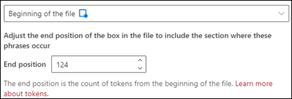

# Inleiding tot uitlegtypen

Uitleg wordt gebruikt om de gegevens te definiëren die je wilt labelen en ophalen in je documentinformatie over modellen in Microsoft SharePoint Syntex. Bij het maken van een uitleg moet je een uitlegtype selecteren. In dit artikel vind je meer informatie over de verschillende uitlegtypen en hoe je deze kunt gebruiken. 

 
   
Deze uitlegtypen zijn beschikbaar:

- **Frasenlijst**: Lijst met woorden, woordgroepen, getallen of andere tekens die je kunt gebruiken in het document of de gegevens die je wilt ophalen. De tekenreeks **Verwijzen naar Doctor** wordt bijvoorbeeld gebruikt in medische verwijsdocumenten die je identificeert. Of het **telefoonnummer** van de verwijzende arts uit medische verwijzingsdocumenten die u identificeert.

- **Nabijheid**: in dit artikel wordt beschreven hoe dicht toelichtingen bij elkaar liggen. Een lijst met *straatnummers* staat bijvoorbeeld vlak voor de lijst met *straatnamen*, zonder tokens ertussen (verderop in dit artikel vindt u meer informatie over tokens). Voor het type proximity moet je ten minste twee uitleggen in je model hebben, of de optie wordt uitgeschakeld. 
 
## Woordenlijst

Het uitlegtype van een woordenlijst wordt meestal gebruikt om een document te identificeren en te classificeren via je model. Zoals wordt beschreven in het labelvoorbeeld *Verwijzende arts*, is het een tekenreeks met woorden, woordgroepen, getallen of tekens die consequent voorkomen in de documenten die je wilt herkennen.

Hoewel het geen eis is, kunt je je uitleg beter laten opvallen als de woordgroep die je wilt vastleggen zich op een consistente locatie in het document bevindt. Zo kan het label *Verwijzende arts* label zich in de eerste alinea van het document bevinden. U kunt ook de optie **[Configureren waar zinnen voorkomen in het document](https://docs.microsoft.com/microsoft-365/contentunderstanding/explanation-types-overview#configure-where-phrases-occur-in-the-document)** in de geavanceerde instellingen gebruiken om specifieke gebieden te selecteren waar de zin zich bevindt, vooral als de kans bestaat dat de zin op meerdere locaties in uw document voorkomt.

Als hoofdlettergevoeligheid een vereiste is bij het identificeren van je label, kun je met het woordenlijsttype in uw uitleg opgeven door het selectievakje **Alleen exacte kapitalisatie** in te schakelen.

 

Een patroonlijst is vooral handig wanneer u een uitleg maakt die informatie in verschillende indelingen identificeert en extraheert, zoals datums, telefoonnummers en creditcardnummers. Een datum kan bijvoorbeeld worden weergegeven in een aantal verschillende notaties (1/1/2020, 1-1-2020, 01/01/20, 01/01/2020, 1 januari 2020, enzovoort). Door een patroonlijst te definiëren, kunt u efficiënter identificeren door eventuele variaties in de gegevens vast te leggen die u probeert vast te stellen en op te halen. 

Voor het voorbeeld **Telefoonnummer** moet je het telefoonnummer voor elke verwijzende arts ophalen uit alle Medische Verwijzingsdocumenten die door het model worden geïdentificeerd. Wanneer u de uitleg maakt, typt u de verschillende notaties die een telefoonnummer in uw document kan weergeven, zodat u mogelijke variaties kunt vastleggen. 

Schakel voor dit voorbeeld in **Geavanceerde instellingen** het selectievakje **Elk cijfer van 0-9** in om elke '0'-waarde die in uw lijst met zinnen wordt gebruikt, te herkennen als een cijfer van 0 tot en met 9.

Als u een patroonlijst maakt die teksttekens bevat, selecteert u het selectievakje **Willekeurige letter van a-z** om aan te geven dat elk 'a'-teken dat in de patroonlijst wordt gebruikt, elk teken van 'a' tot 'z' kan zijn.

Als u bijvoorbeeld een patroonlijst **Datum** maakt en u ervoor wilt zorgen dat een datumnotatie wordt ondersteund zoals *1 januari 2020*, moet u het volgende doen:
- Voeg *0 AAA 0000* en *00 AAA 0000* aan de patroonlijst toe.
- Zorg ervoor dat **Een willekeurige letter van a-z** is geselecteerd.

Als je hoofdlettereisen in je patroonlijst hebt, kun je ook het selectievakje **Alleen exact hoofdlettergebruik** selecteren. Als de eerste letter van de maand moet worden gekapitaliseerd, moet u het volgende doen:

- Voeg *0 Aaa 0000* en *00 AAA 0000* aan de patroonlijst toe.
- Zorg ervoor dat **Alleen exact hoofdlettergebruik** ook is geselecteerd.

> [!NOTE]
> Gebruik in plaats van het handmatig maken van een uitleg voor patroonlijsten de [uitlegbibliotheek](https://docs.microsoft.com/microsoft-365/contentunderstanding/explanation-types-overview#use-explanation-templates) voor het gebruik van vooraf gemaakte patroonlijstsjablonen voor een algemene patroonlijst, zoals *datum*, *telefoonnummer*, *creditcardnummer*, enzovoort.

## Proximity 

Met het Proximity-uitlegtype kan je model identificeren met behulp van hoe dichtbij een ander stukje gegevens is. Bijvoorbeeld, in je model heb je twee verklaringen gedefinieerd waaraan zowel het *huisnummer* als *telefoonnummer* zijn gelabeld. 

Je ziet ook dat de telefoonnummers van klanten altijd voor het huisnummer worden weergegeven. 

Alex Wilburn 
555-555-5555 
One Microsoft Way 
Redmond, WA 98034 

Gebruik de proximity-uitleg om te bepalen hoe ver de uitleg van een telefoonnummer is zodat u het huisnummer in je documenten beter kunt identificeren.

#### Wat zijn tokens?

Voor het gebruik van het Proximity-uitlegtype moet je weten wat een token is, omdat het aantal tokens is hoe de proximity-uitleg de afstand tussen een verklaring en een andere meet. Een token is een doorlopende reeks (geen spaties of interpunctie) van letters en cijfers. 

In de volgende tabel zie je enkele voorbeelden van hoe je het aantal tokens in een woordgroep kunt vaststellen.

|Woordengroep|Aantal tokens|Uitleg|
|--|--|--|
|`Dog`|1|Eén woord zonder leesteken of spatie.|
|`RMT33W`|1|Een record locatornummer. Het mag cijfers en letters bevatten, maar geen leestekens.|
|`425-555-5555`|5|Een telefoonnummer. Elk leesteken bestaat uit één token, zodat `425-555-5555` 5 tokens zou zijn: `425` `-` `555` `-` `5555` |
|`https://luis.ai`|7|`https` `:` `/` `/` `luis` `.` `ai` |

#### Het proximity-uitlegtype configureren

Voor het voorbeeld configureer je de proximity-instelling zodanig dat je het aantal tokens kunt definiëren in *Telefoonnummer*-uitleg afkomstig van de *Huisnummer*-uitleg. Je ziet dat het minimumbereik “0“ is omdat er geen tokens zijn tussen het telefoonnummer en het huisnummer.

Sommige telefoonnummers in de voorbeelddocumenten worden echter toegevoegd met *(mobiel)*.

Wander Kuijken 
111-111-1111 (mobiel) 
One Microsoft Way 
Redmond, WA 98034 

Er zijn drie tokens in *(mobiel)*:

|Woordengroep|Aantal tokens|
|--|--|
|(|1|
|Mobiel|2|
|)|3|

Configureer de proximity-instelling voor een bereik van 0 tot en met 3.

## Configureren waar woordgroepen voorkomen in het document

Wanneer u een uitleg maakt, wordt standaard in het hele document gezocht naar de woordgroep die u wilt extraheren. U kunt echter de geavanceerde instelling **Waar deze woordgroepen voorkomen** gebruiken om een specifieke locatie in het document te isoleren waar een woordgroep voorkomt. Dit is handig in situaties waarin soortgelijke gevallen van een woordgroep ergens anders in het document kunnen worden weergegeven en u wilt ervoor zorgen dat de juiste is geselecteerd. Wanneer we kijken naar ons voorbeelddocument voor medische verwijzing, wordt de **Verwijzende arts** altijd in de eerste alinea van het document vermeld. Met de instelling **Waar deze woordgroepen voorkomen kunt u in dit voorbeeld de uitleg zo configureren dat alleen in het begin van het document naar dit label wordt gezocht, of op een andere locatie waar dit kan voorkomen.

U kunt kiezen uit de volgende opties voor deze instelling:

- Overal in het bestand: in het hele document wordt naar de woordgroep gezocht.

- Begin van het bestand: het document wordt vanaf het begin tot aan de locatie van de woordgroep doorzocht.

   

    In de viewer kunt u het selectievakje handmatig aanpassen zodat de locatie van de woordgroep wordt opgenomen. De waarde van **Eindpositie** wordt bijgewerkt om het aantal tokens weer te geven dat het geselecteerde gebied bevat. U kunt de waarde van de Eindpositie ook bijwerken om het geselecteerde gebied aan te passen.

   

- Einde van het bestand: het document wordt vanaf het eind tot aan de locatie van de woordgroep doorzocht.

   

    In de viewer kunt u het selectievakje handmatig aanpassen zodat de locatie van de woordgroep wordt opgenomen. De waarde van **Beginpositie** wordt bijgewerkt om het aantal tokens weer te geven dat het geselecteerde gebied bevat. U kunt de waarde van de Beginpositie ook bijwerken om het geselecteerde gebied aan te passen.

   

- Aangepast bereik: in een bepaald bereik binnen het document wordt gezocht naar de locatie van de woordgroep.

   

    In de viewer kunt u het selectievakje handmatig aanpassen zodat de locatie van de woordgroep wordt opgenomen. Voor deze instelling moet u een **Beginpositie** en een **Eindpositie** selecteren. Deze waarden geven het aantal tokens aan vanaf het begin van het document. Hoewel u deze waarden handmatig kunt invoeren, is het eenvoudiger om het selectievakje handmatig aan te passen in de viewer. 
   
## Uitlegsjablonen gebruiken

Je kan handmatig verschillende frasenlijstwaarden toevoegen voor je uitleg, maar het kan eenvoudiger door sjablonen te gebruiken die aangeboden worden in de uitlegbibliotheek.

Je kunt bijvoorbeeld in plaats van alle variaties voor *Datum* handmatig toe te voegen, de frasenlijstsjabloon gebruiken voor *Datum*, die al een aantal frasenlijstwaarden bevat:

 
De uitlegbibliotheek bevat een aantal veelgebruikte beschrijvingen van de frasenlijst, waaronder:

- Datum: Kalenderdatums, alle notaties. Bevat tekst en getallen (bijvoorbeeld "9 dec, 2020").
- Datum (numeriek): Kalenderdatums, alle notaties. Bevat getallen (bijvoorbeeld 1-11-2020).
- Tijd: 12- en 24-uurs tijdnotatie.
- Getal: Positieve en negatieve getallen tot maximaal 2 decimalen. 
- Percentage: een lijst met patronen die een percentage vertegenwoordigen. Bijvoorbeeld, 1%, 11%, 100%, 11.11%, enz.
- Telefoonnummer: veelgebruikte Amerikaanse en internationale notaties. Bijvoorbeeld, 000 000 0000, 000-000-0000, (000)000-0000, (000) 000-0000, enz.
- Postcode: Amerikaanse postcode-indelingen. Bijvoorbeeld, 11111, 11111-1111.
- Eerste woord van zin: algemene patronen voor woorden met maximaal negen tekens. 
- Einde van zin: veelvoorkomende interpunctie voor het einde van een zin
- Creditcard: veelgebruikte notaties voor creditcards. Bijvoorbeeld, 1111-1111-1111-1111. 
- Sofinummer: Amerikaanse notatie voor het sofinummer. Bijvoorbeeld, 111-11-1111. 
- Selectievakje: een frasenlijst die variaties op een opgevuld selectievakje vertegenwoordigt. Bijvoorbeeld, _X_, _ _X_, enz.
- Valuta: Belangrijke internationale symbolen. Bijvoorbeeld, $. 
- E-mail CC: Een frasenlijst met de term 'CC:', vaak gevonden in de buurt van de namen of e-mailadressen van extra personen of groepen waar het bericht naar is verzonden.
- E-maildatum: Een frasenlijst met de term 'Verzonden op:', vaak gevonden bij de datum waarop het e-mailbericht is verzonden.
- E-mail begroeting: Algemene beginregels voor e-mailberichten.
- E-mail ontvanger: Een frasenlijst met de term 'Aan:', vaak gevonden in de buurt van de namen of e-mailadressen van personen of groepen waar het bericht naar is verzonden. 
- E-mail afzender: Een frasenlijst met de term 'Van:', vaak gevonden in de buurt van de naam of het e-mailadres van de afzender. 
- E-mail onderwerp: Een frasenlijst met de term 'Onderwerp:', vaak gevonden in de buurt van het e-mail onderwerp. 

De uitlegbibliotheek bevat ook drie automatische sjabloontypen die binnen de gegevens werken die je gelabeld hebt in je voorbeeldbestanden:

- After-label: De woorden of karakters die voorkomen na de labels in de voorbeeldbestanden.
- Before-label: De woorden of karakters die voorkomen voor de labels in de voorbeeldbestanden.
- Labels: Tot maximaal de eerste 10 karakters van de voorbeeldbestanden.

Automatische sjablonen werken bijvoorbeeld zoals in het volgende voorbeeldbestand waar we de before-label-uitlegsjabloon gebruiken om het model meer informatie te geven zodat we tot een nauwkeurigere overeenkomst komen.

Als je het before-label-uitlegsjabloon selecteert, zoekt het de eerste groep woorden die voorkomen vóór het label in je voorbeeldbestanden. In het voorbeeld is het woord dat geïdentificeerd werd ‘Vanaf’.

Je kan een uitleg voor een sjabloon maken door **Toevoegen** te selecteren.  Aanvullende woorden worden geïdentificeerd en toegevoegd aan de frasenlijst naargelang je meer voorbeeldbestanden toevoegt.

 
#### Een sjabloon gebruiken uit de uitlegbibliotheek

1. Ga naar het gedeelte **Uitleg** van de **Train**-pagina van je model en selecteer **Nieuwe** en selecteer vervolgens **Van een sjabloon**.

   

2.  Selecteer op de pagina **Uitlegsjablonen** de uitleg die je wilt gebruiken en selecteer vervolgens **Toevoegen**.

    

3. De informatie voor de sjabloon die je hebt geselecteerd, wordt weergegeven op de pagina **Een uitleg maken**. Bewerk zo nodig de naam van de uitleg en voeg items toe of verwijder items uit de frasenlijst.  

    

4. Selecteer **Opslaan** wanneer je klaar bent.