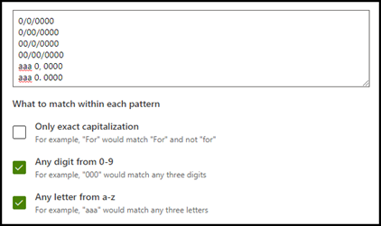

# Inleiding tot uitlegtypenIntroduction to explanation types

Uitleg wordt gebruikt om de gegevens te definiëren die je wilt labelen en ophalen in je documentinformatie over modellen in Microsoft SharePoint Syntex.Explanations are used to help to define the information you want to label and extract in your document understanding models in Microsoft SharePoint Syntex. Bij het maken van een uitleg moet je een uitlegtype selecteren.When creating an explanation, you need to select an explanation type. In dit artikel vind je meer informatie over de verschillende uitlegtypen en hoe je deze kunt gebruiken.This article helps you understand the different explanation types and how they are used. 

    
   
Deze uitlegtypen zijn beschikbaar:These explanation types are available:

- **Frasenlijst**: Lijst met woorden, woordgroepen, getallen of andere tekens die je kunt gebruiken in het document of de gegevens die je wilt ophalen.**Phrase list**: List of words, phrases, numbers, or other characters you can use in the document or information that you are extracting. De tekenreeks **Verwijzen naar Doctor** wordt bijvoorbeeld gebruikt in medische verwijsdocumenten die je identificeert.For example, the text string **Referring Doctor** is in all Medical Referral documents you are identifying. 

- **Patroonlijst**: lijst patronen met getallen, letters of andere tekens die je kunt gebruiken om de gegevens te identificeren die je wilt ophalen.**Pattern list**: List patterns of numbers, letters, or other characters that you can use to identify the information that you are extracting. Je kunt bijvoorbeeld het **Telefoonnummer** van de verwijsarts extraheren uit medische verwijsdocumenten die je identificeert.For example, you can extract the **Phone number** of the referring doctor from all Medical Referral document that you are identifying. 

- **Proximity**: in dit artikel wordt beschreven hoe dicht toelichtingen bij elkaar liggen.**Proximity**: Describes how close explanations are to each other. Een patroonlijst van *straatnummer* wordt bijvoorbeeld direct weergeven voor de woordenlijst met *straatnamen* zonder tokens ertussen (je vind meer informatie over tokens verderop in dit artikel).For example, a *street number* pattern list goes right before the *street name* phrase list, with no tokens in between (you'll learn about tokens later in this article). Voor het type proximity moet je ten minste twee uitleggen in je model hebben, of de optie wordt uitgeschakeld.Using the proximity type requires you to have at least two explanations in your model or the option will be disabled. 
 
## WoordenlijstPhrase list

Het uitlegtype van een woordenlijst wordt meestal gebruikt om een document te identificeren en te classificeren via je model.A phrase list explanation type is typically used to identify and classify a document through your model. Zoals wordt beschreven in het labelvoorbeeld *Verwijzende arts*, is het een tekenreeks met woorden, woordgroepen, getallen of tekens die consequent voorkomen in de documenten die je wilt herkennen.As described in the *Referring Doctor* label example, it is a string of words, phrases, numbers, or characters that is consistently in the documents that you are identifying.

Hoewel het geen eis is, kunt je je uitleg beter laten opvallen als de woordgroep die je wilt vastleggen zich op een consistente locatie in het document bevindt.While not a requirement, you can achieve better success with your explanation if the phrase you are capturing is located in a consistent location in your document. Zo kan het label *Verwijzende arts* label zich in de eerste alinea van het document bevinden.For example, the *Referring Doctor* label may be consistently located in the first paragraph of the document.

Als hoofdlettergevoeligheid een vereiste is bij het identificeren van je label, kun je met het woordenlijsttype in uw uitleg opgeven door het selectievakje **Alleen exacte kapitalisatie** in te schakelen.If case sensitivity is a requirement in identifying your label, using the phrase list type allows you to specify it in your explanation by selecting the **Only exact capitalization** checkbox.

    

## PatroonlijstenPattern lists

Een patroonlijst is met name handig wanneer je een uitleg maakt waarmee gegevens uit een document worden geïdentificeerd en opgehaald.A pattern list type is especially useful when you create an explanation that identifies and extracts information from a document. Deze worden meestal weergegeven in verschillende indelingen, zoals datums, telefoonnummers of creditcardnummers.It is typically presented in different formats, such as dates, phone numbers, and credit card numbers. Een datum kan bijvoorbeeld worden weergegeven in een aantal verschillende notaties (1/1/2020, 1-1-2020, 01/01/20, 01/01/2020, 1 januari 2020, enzovoort).For example, a date can be displayed in a number of different formats (1/1/2020, 1-1-2020, 01/01/20, 01/01/2020, Jan 1,2020, etc.). Door een patroonlijst te definiëren, kun je je efficiënter identificeren door eventuele variaties in de gegevens vast te leggen die je probeert vast te stellen en op te halen.Defining a pattern list makes your explanation more efficient by capturing any possible variations in the data that you are trying to identify and extract. 

Voor het voorbeeld **Telefoonnummer** moet je het telefoonnummer voor elke verwijzende arts ophalen uit alle Medische Verwijzingsdocumenten die door het model worden geïdentificeerd.For the **Phone number** example, you extract the phone number for each referring doctor from all Medical Referral documents that the model identifies. Wanneer je de uitleg maakt, selecteer je het patroonlijsttype om de verschillende indelingen toe te staan die mogelijk naar verwachting worden geretourneerd.When you create the explanation, select the Pattern list type to allow the different formats that you may expect to be returned.

   

Voor dit voorbeeld selecteert u het selectievakje **een cijfer van 0-9** als u elke ' 0 ' waarde die in de patroonlijst wordt gebruikt, wilt herkennen aan een cijfer van 0 tot en met 9.For this example, select the **Any digit from 0-9** checkbox to recognize each "0" value used in your pattern list to be any digit from 0 through 9.

   

Als u een patroonlijst maakt die teksttekens bevat, selecteert u het selectievakje **een letter van a-z** om elk teken dat wordt gebruikt in de patroonlijst te herkennen aan een teken van a tot en met z.Similarly, if you create a pattern list that includes text characters, select the **Any letter from a-z** checkbox to recognize each "a" character used in the pattern list to be any character from "a" to "z".

Als je bijvoorbeeld een patroonlijst **Datum** maakt en je ervoor wilt zorgen dat een datumnotatie wordt ondersteund zoals *2020 1 januari*, moet je het volgende doen:For example, if you create a **Date** pattern list and you want to make sure that a date format such as *Jan 1, 2020* is recognized, you need to:
- Voeg *AAA 0, 0000* en *AAA 00, 0000* aan de patroonlijst toe.Add *aaa 0, 0000* and *aaa 00, 0000* to your pattern list.
- Zorg ervoor dat **Een willekeurige letter van a-z** is geselecteerd.Make sure that **Any letter from a-z** is also selected.

   

Als je hoofdlettereisen in je patroonlijst hebt, kun je ook het selectievakje **Alleen exact hoofdlettergebruik** selecteren.Additionally, if you have capitalization requirements in your pattern list, you have the option to select the **Only exact capitalization** checkbox. Als de eerste letter van de maand moet worden gekapitaliseerd, moet je het volgende doen:For the Date example, if you require the first letter of the month to be capitalized, you need to:

- Voeg *Aaa 0, 0000* en *AAA 00, 0000* aan de patroonlijst toe.Add *Aaa 0, 0000* and *Aaa 00, 0000* to your pattern list.
- Zorg ervoor dat **Alleen exact hoofdlettergebruik** ook is geselecteerd.Make sure that **Only exact capitalization** is also selected.

   

> [!NOTE]
> Gebruik in plaats van het handmatig maken van een uitleg voor patroonlijsten de [uitlegbibliotheek](#use-explanation-templates) voor het gebruik van vooraf gemaakte patroonlijstsjablonen voor een algemene patroonlijst, zoals *datum*, *telefoonnummer*, *creditcardnummer*, enzovoort.Instead of manually creating a pattern list explanation, use the [explanation library](#use-explanation-templates) to use pattern list templates for a common pattern list, such as *date*, *phone number*, *credit card number*, etc.

## ProximityProximity 

Met het Proximity-uitlegtype kan je model identificeren met behulp van hoe dichtbij een ander stukje gegevens is.The proximity explanation type helps your model identify data by defining how close another piece of data is to it. Bijvoorbeeld, in je model heb je twee verklaringen gedefinieerd waaraan zowel het *huisnummer* als *telefoonnummer* zijn gelabeld.For example, in your model say you have defined two explanations that label both the customer *Street address number* and *Phone number*. 

Je ziet ook dat de telefoonnummers van klanten altijd voor het huisnummer worden weergegeven.Notice that customer phone numbers always appear before the street address number. 

Alex WilburnAlex Wilburn 
555-555-5555555-555-5555 
One Microsoft WayOne Microsoft Way 
Redmond, WA 98034Redmond, WA 98034 

Gebruik de proximity-uitleg om te bepalen hoe ver de uitleg van een telefoonnummer is zodat u het huisnummer in je documenten beter kunt identificeren.Use the proximity explanation to define how far away the phone number explanation is to better identify the street address number in your documents.

    

#### Wat zijn tokens?What are tokens?

Voor het gebruik van het Proximity-uitlegtype moet je weten wat een token is, omdat het aantal tokens is hoe de proximity-uitleg de afstand tussen een verklaring en een andere meet.In order to use the proximity explanation type, you need to understand what a token is, as the number of tokens is how the proximity explanation measures distance from one explanation to another. Een token is een doorlopende reeks (geen spaties of interpunctie) van letters en cijfers.A token is a continuous span (not including spaces or punctuation) of letters and numbers. 

In de volgende tabel zie je enkele voorbeelden van hoe je het aantal tokens in een woordgroep kunt vaststellen.The following table shows examples for how to determine the number of tokens in a phrase.

|WoordengroepPhrase|Aantal tokensNumber of tokens|UitlegExplanation|
|--|--|--|
|`Dog`|11|Eén woord zonder leesteken of spatie.A single word with no punctuation or spaces.|
|`RMT33W`|11|Een record locatornummer.A record locator number. Het mag cijfers en letters bevatten, maar geen leestekens.It may include numbers and letters, but does not have punctuation.|
|`425-555-5555`|55|Een telefoonnummer.A phone number. Elk leesteken bestaat uit één token, zodat `425-555-5555` 5 tokens zou zijn:Each punctuation mark is a single token, so `425-555-5555` is 5 tokens: `425` `-` `555` `-` `5555` |
|`https://luis.ai`|77|`https` `:` `/` `/` `luis` `.` `ai` |

#### Het proximity-uitlegtype configurerenConfigure the proximity explanation type

Voor het voorbeeld configureer je de proximity-instelling zodanig dat je het aantal tokens kunt definiëren in *Telefoonnummer*-uitleg afkomstig van de *Huisnummer*-uitleg.For the example, configure the proximity setting to define the range of the number of tokens in the *Phone number* explanation from the *Street address number* explanation. Je ziet dat het minimumbereik “0“ is omdat er geen tokens zijn tussen het telefoonnummer en het huisnummer.Notice that the minimum range is "0", because there are no tokens between the phone number and street address number.

Sommige telefoonnummers in de voorbeelddocumenten worden echter toegevoegd met *(mobiel)*.But some phone numbers in the sample documents are appended with *(mobile)*.

Wander KuijkenNestor Wilke 
111-111-1111 (mobiel)111-111-1111 (mobile) 
One Microsoft WayOne Microsoft Way 
Redmond, WA 98034Redmond, WA 98034 

Er zijn drie tokens in *(mobiel)*:There are three tokens in *(mobile)*:

|WoordengroepPhrase|Aantal tokensToken count|
|--|--|
|((|11|
|Mobielmobile|22|
|))|33|

Configureer de proximity-instelling voor een bereik van 0 tot en met 3.Configure the proximity setting to have a range of 0 through 3.

    

## Configureren waar woordgroepen voorkomen in het documentConfigure where phrases occur in the document

Wanneer u een uitleg maakt, wordt standaard in het hele document gezocht naar de woordgroep die u wilt extraheren.When you create an explanation, by default the entire document is searched for the phrase you are trying to extract. U kunt echter de geavanceerde instelling <b>Waar deze woordgroepen voorkomen</b> gebruiken om een specifieke locatie in het document te isoleren waar een woordgroep voorkomt.However, you can use the <b>Where these phrases occur</b> advanced setting to help in isolating a specific location in the document that a phrase occurs. Dit is handig in situaties waarin soortgelijke gevallen van een woordgroep ergens anders in het document kunnen worden weergegeven en u wilt ervoor zorgen dat de juiste is geselecteerd.This is useful in situations where similar instances of a phrase might appear somewhere else in the document, and you want to make sure that the correct one is selected. Wanneer we kijken naar ons voorbeelddocument voor medische verwijzing, wordt de **Verwijzende arts** altijd in de eerste alinea van het document vermeld.Referring to our Medical Referral document example, the **Referring Doctor** is always mentioned in the first paragraph of the document. Met de instelling <b>Waar deze woordgroepen voorkomen</b> kunt u in dit voorbeeld de uitleg zo configureren dat alleen in het begin van het document naar dit label wordt gezocht, of op een andere locatie waar dit kan voorkomen.With the <b>Where these phrases occur</b> setting, in this example you can configure your explanation to search for this label only in the beginning section of the document, or any other location in which it might occur.

    

U kunt kiezen uit de volgende opties voor deze instelling:You can choose the following options for this setting:

- Overal in het bestand: in het hele document wordt naar de woordgroep gezocht.Anywhere in the file: The entire document is searched for the phrase.
- Begin van het bestand: het document wordt vanaf het begin tot aan de locatie van de woordgroep doorzocht.Beginning of the file:  The document is searched from the beginning to the phrase location.  
    
In de viewer kunt u het selectievakje handmatig aanpassen zodat de locatie van de woordgroep wordt opgenomen.In the viewer, you can manually adjust the select box to include the location where the phase occurs. De waarde van <b>Eindpositie</b> wordt bijgewerkt om het aantal tokens weer te geven dat het geselecteerde gebied bevat.The <b>End position</b> value will update to show the number of tokens your selected area includes. U kunt de waarde van de Eindpositie ook bijwerken om het geselecteerde gebied aan te passen.Note that you can update the End position value as well to adjust the selected area. 
    

- Einde van het bestand: het document wordt vanaf het eind tot aan de locatie van de woordgroep doorzocht.End of the file:  The document is searched from the end to the phrase location.  
    
In de viewer kunt u het selectievakje handmatig aanpassen zodat de locatie van de woordgroep wordt opgenomen.In the viewer, you can manually adjust the select box to include the location where the phase occurs. De waarde van <b>Beginpositie</b> wordt bijgewerkt om het aantal tokens weer te geven dat het geselecteerde gebied bevat.The <b>Starting position</b> value will update to show the number of tokens your selected area includes. U kunt de waarde van de Beginpositie ook bijwerken om het geselecteerde gebied aan te passen.Note that you can update the Starting position value as well to adjust the selected area.  
    
- Aangepast bereik: in een bepaald bereik binnen het document wordt gezocht naar de locatie van de woordgroep.Custom range:  The document is searched in a specified range within the it for the phrase location.  
    
In de viewer kunt u het selectievakje handmatig aanpassen zodat de locatie van de woordgroep wordt opgenomen.In the viewer, you can manually adjust the select box to include the location where the phase occurs. Voor deze instelling moet u een <b>Beginpositie</b> en een <b>Eindpositie</b> selecteren.For this setting, you need to select a <b>Start</b> and an <b>End</b> position. Deze waarden geven het aantal tokens aan vanaf het begin van het document.These values represent the number of tokens from the begging of the document. Hoewel u deze waarden handmatig kunt invoeren, is het eenvoudiger om het selectievakje handmatig aan te passen in de viewer.While you can manually enter in these values, it is easier to manually adjust the select box in the viewer.  
   
## Uitlegsjablonen gebruikenUse explanation templates

Je kan handmatig verschillende frasenlijstwaarden toevoegen voor je uitleg, maar het kan eenvoudiger door sjablonen te gebruiken die aangeboden worden in de uitlegbibliotheek.While you can manually add various phrase list values for your explanation, it can be easier to use the templates provided to you in the explanation library.

Je kunt bijvoorbeeld in plaats van alle variaties voor *Datum* handmatig toe te voegen, de frasenlijstsjabloon gebruiken voor *Datum*, die al een aantal frasenlijstwaarden bevat:For example, instead of manually adding all the variations for *Date*, you can use the phrase list template for *Date* as it already includes a number of phrase lists values: 

    
 
De uitlegbibliotheek bevat een aantal veelgebruikte beschrijvingen van de frasenlijst, waaronder:The explanation library includes commonly used phrase list explanations, including: 

- Datum: Kalenderdatums, alle notaties.Date: Calendar dates, all formats. Bevat tekst en getallen (bijvoorbeeld "9 dec, 2020").Includes text and numbers (for example, "Dec 9, 2020"). 
- Datum (numeriek): Kalenderdatums, alle notaties.Date (numeric): Calendar dates, all formats. Bevat getallen (bijvoorbeeld 1-11-2020).Includes numbers (for example 1-11-2020). 
- Tijd: 12- en 24-uurs tijdnotatie.Time: 12 and 24 hour formats. 
- Getal: Positieve en negatieve getallen tot maximaal 2 decimalen.Number: Positive and negative numbers up to 2 decimals.  
- Percentage: een lijst met patronen die een percentage vertegenwoordigen.Percentage: A list of patterns representing a percentage. Bijvoorbeeld, 1%, 11%, 100%, 11.11%, enz.For example, 1%, 11%, 100%, 11.11%, etc. 
- Telefoonnummer: veelgebruikte Amerikaanse en internationale notaties.Phone number: Common US and International formats. Bijvoorbeeld, 000 000 0000, 000-000-0000, (000)000-0000, (000) 000-0000, enz.For example, 000 000 0000, 000-000-0000, (000)000-0000, (000) 000-0000, etc. 
- Postcode: Amerikaanse postcode-indelingen.Zip code: US Zip code formats. Bijvoorbeeld, 11111, 11111-1111.For example, 11111, 11111-1111. 
- Eerste woord van zin: algemene patronen voor woorden met maximaal negen tekens.First word of sentence: Common patterns for words up to 9 characters.  
- Einde van zin: veelvoorkomende interpunctie voor het einde van een zinEnd of sentence: Common punctuation for end of a sentence 
- Creditcard: veelgebruikte notaties voor creditcards.Credit card: Common credit card number formats. Bijvoorbeeld, 1111-1111-1111-1111.For example, 1111-1111-1111-1111.  
- Sofinummer: Amerikaanse notatie voor het sofinummer.Social security number: US Social Security Number format. Bijvoorbeeld, 111-11-1111.For example, 111-11-1111.  
- Selectievakje: een frasenlijst die variaties op een opgevuld selectievakje vertegenwoordigt.Checkbox: A phrase list representing variations on a filled in checkbox. Bijvoorbeeld, _X_, _ _X_, enz.For example, _X_, _ _X_, etc. 
- Valuta: Belangrijke internationale symbolen.Currency: Major international symbols. Bijvoorbeeld, $.For example, $.  
- E-mail CC: Een frasenlijst met de term 'CC:', vaak gevonden in de buurt van de namen of e-mailadressen van extra personen of groepen waar het bericht naar is verzonden.Email CC: A phrase list with the term 'CC:', often found near the names or email addresses of additional people or groups the message was sent to. 
- E-maildatum: Een frasenlijst met de term 'Verzonden op:', vaak gevonden bij de datum waarop het e-mailbericht is verzonden.Email date: A phrase list with the term 'Sent on:', often found near the date the email was sent. 
- E-mail begroeting: Algemene beginregels voor e-mailberichten.Email greeting: Common opening lines for emails. 
- E-mail ontvanger: Een frasenlijst met de term 'Aan:', vaak gevonden in de buurt van de namen of e-mailadressen van personen of groepen waar het bericht naar is verzonden.Email recipient: A phrase list with the term 'To:', often found near the names or email addresses of people or groups the message was sent to.  
- E-mail afzender: Een frasenlijst met de term 'Van:', vaak gevonden in de buurt van de naam of het e-mailadres van de afzender.Email sender: A phrase list with the term 'From:', often found near the sender's name or email address.  
- E-mail onderwerp: Een frasenlijst met de term 'Onderwerp:', vaak gevonden in de buurt van het e-mail onderwerp.Email subject: A phrase list with the term 'Subject:', often found near the email's subject.  

De uitlegbibliotheek bevat ook drie automatische sjabloontypen die binnen de gegevens werken die je gelabeld hebt in je voorbeeldbestanden:The explanation library also includes three automatic template types that work with the data you've labeled in your example files:

- After-label: De woorden of karakters die voorkomen na de labels in de voorbeeldbestanden.After label: The words or characters that occur after the labels in the example files. 
- Before-label: De woorden of karakters die voorkomen voor de labels in de voorbeeldbestanden.Before label: The words or characters that occur before the labels in the example files. 
- Labels: Tot maximaal de eerste 10 karakters van de voorbeeldbestanden.Labels: Up to the first 10 labels from the example files. 

Automatische sjablonen werken bijvoorbeeld zoals in het volgende voorbeeldbestand waar we de before-label-uitlegsjabloon gebruiken om het model meer informatie te geven zodat we tot een nauwkeurigere overeenkomst komen.To give you an example of how automatic templates work, in the following example file, we will use the Before Label explanation template to help give the model more information to get a more accurate match.

    

Als je het before-label-uitlegsjabloon selecteert, zoekt het de eerste groep woorden die voorkomen vóór het label in je voorbeeldbestanden.When you select the Before Label explanation template, it will look for the first set of words that appear before the label in your example files. In het voorbeeld is het woord dat geïdentificeerd werd ‘Vanaf’.In the example, the words that are identified in the first example file is "As of".

    

Je kan een uitleg voor een sjabloon maken door <b>Toevoegen</b> te selecteren.You can select <b>Add</b> to create an explanation from the template.  Aanvullende woorden worden geïdentificeerd en toegevoegd aan de frasenlijst naargelang je meer voorbeeldbestanden toevoegt.As you add more example files, additional words will be identified and added to the phrase list.

    
 
#### Een sjabloon gebruiken uit de uitlegbibliotheekTo use a template from the explanation library

1. Ga naar het gedeelte **Uitleg** van de **Train**-pagina van je model en selecteer **Nieuwe** en selecteer vervolgens **Van een sjabloon**.From the **Explanations** section of your model's **Train** page, select **New**, then select **From a template**. 

    

2.  Selecteer op de pagina **Uitlegsjablonen** de uitleg die je wilt gebruiken en selecteer vervolgens **Toevoegen**.On the **Explanation templates** page, select the explanation you want to use, then select **Add**. 

        

3. De informatie voor de sjabloon die je hebt geselecteerd, wordt weergegeven op de pagina **Een uitleg maken**.The information for the template you selected displays on the **Create an explanation** page. Bewerk zo nodig de naam van de uitleg en voeg items toe of verwijder items uit de frasenlijst.If needed, edit the explanation name and add or remove items from the phrase list.   

    

4. Selecteer **Opslaan** wanneer je klaar bent.When finished, select **Save**.