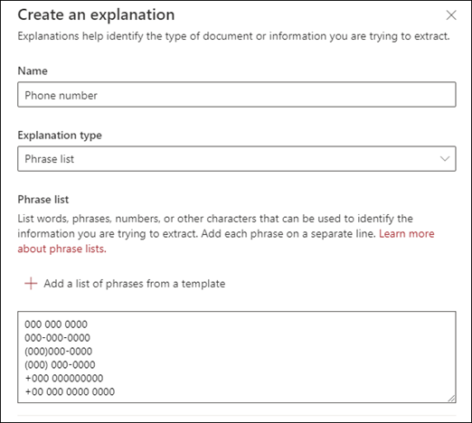

# Inleiding tot uitleg typenIntroduction to explanation types

Gebruik uitleg voor hulp bij het definiëren van de informatie die u wilt labelen en extraheren in uw document met de informatie over modellen voor Microsoft SharePoint Syntex.Use explanations to help to define the information that you want to label, and extract in your document the understanding models for Microsoft SharePoint Syntex. Wanneer u een uitleg maakt, moet u ervoor zorgen dat u een uitleg type selecteert.When you create an explanation, be sure to select an explanation type. 

Dit artikel helpt u inzicht te krijgen in de verschillende typen uitleg en hoe deze worden gebruikt.This article helps you understand the different explanation types and how they are used.

    
   
Deze uitleg typen zijn beschikbaar:These explanation types are available:

- **Woordgroepenlijst**: een lijst met woorden, woordgroepen, getallen of andere tekens die u kunt gebruiken in het document of de gegevens die u wilt ophalen.**Phrase list**: List of words, phrases, numbers, or other characters you can use in the document or information that you are extracting. De tekstreeks die **verwijst** naar de tekstreeks, is bijvoorbeeld in alle medische verwijzingen die u identificeert.For example, the text string **Referring Doctor** is in all Medical Referral documents you are identifying. 

- **Patroon lijst**: een lijst met getallen, letters of andere tekens die u kunt gebruiken om de informatie die u extraheert te identificeren.**Pattern list**: List patterns of numbers, letters, or other characters that you can use to identify the information that you are extracting. U kunt bijvoorbeeld het **telefoonnummer** van de betreffende dokter extraheren uit elk document dat u identificeert voor de medische verwijzing.For example, you can extract the **Phone number** of the referring doctor from all Medical Referral document that you are identifying. 

- **Proximity**: hierin wordt beschreven hoe u de uitleg dicht bij elkaar hebt.**Proximity**: Describes how close explanations are to each other. Zo wordt een patroon lijst voor een *straatnummer* direct weergegeven vóór de naam van de *straatnaam* , zonder tokens ertussen (u kunt verderop in dit artikel meer informatie over tokens vinden).For example, a *street number* pattern list goes right before the *street name* phrase list, with no tokens in between (you'll learn about tokens later in this article). 
 
## Lijst met zinnenPhrase list

Een beschrijving van de lijst met zinnen wordt meestal gebruikt voor het identificeren en classificeren van een document via uw model.A phrase list explanation type is typically used to identify and classify a document through your model. Zoals beschreven in het voorbeeld van het *verwijzen van dokter* , is dit een reeks woorden, zinnen, getallen of tekens die consistent zijn in de documenten die u identificeert.As described in the *Referring Doctor* label example, it is a string of words, phrases, numbers, or characters that is consistently in the documents that you are identifying.

Hoewel u geen behoefte hebt, kunt u een betere succesvolle beschrijving krijgen als de woordgroep die u vastlegt, op een consistente locatie in het document staat.While not a requirement, you can acheive better success with your explanation if the phrase you are capturing is located in a consistent location in your document. Het label van de *verwijzings dokter* kan bijvoorbeeld consistent zijn in de eerste alinea van het document.For example, the *Referring Doctor* label may be consistently located in the first paragraph of the document.

Als hoofdlettergevoeligheid een vereiste is voor het identificeren van uw etiket, kunt u dit in uw uitleg opgeven door het selectievakje **alleen exact hoofdlettergebruik** in te schakelen.If case sensitivity is a requirement in identifying your label, using the phrase list type allows you to specify it in your explanation by selecting the **Only exact capitalization** checkbox.

    

## Patroon lijstenPattern lists

Een patroon lijsttype is vooral handig als u een uitleg maakt waarmee informatie wordt geïdentificeerd en opgehaald uit een document.A pattern list type is especially useful when you create an explanation that identifies and extracts information from a document. Dit wordt meestal weergegeven in verschillende notaties, zoals datums, telefoonnummers of creditcardnummers.It is typically presented in different formats, such as dates, phone numbers, or credit card numbers. Zo kan een datum worden weergegeven in verschillende notaties (1/1/2020, 1-1-2020, 01/01/20, 01/01/2020, 1 januari 2020, enzovoort).For example, a date can be displayed in a number of different formats (1/1/2020, 1-1-2020, 01/01/20, 01/01/2020, Jan 1,2020, etc.). Door een patroon lijst te definiëren, wordt uw uitleg efficiënter gemaakt door eventuele variaties te vastleggen in de gegevens die u wilt identificeren en uitpakken.Defining a pattern list makes your explanation more efficient by capturing any possible variations in the data that you are trying to identify and extract. 

Voor het voorbeeld van het **telefoonnummer** pakt u het telefoonnummer voor elke verzorgde dokter uit met alle medische Referral documenten die door het model worden geïdentificeerd.For the **Phone number** sample, extract the phone number for each referring doctor from all Medical Referral documents that the model identifies. Wanneer u de uitleg maakt, selecteert u het lijsttype patroon om de verschillende opmaken toe te staan die u mogelijk verwacht te retourneren.When you create the explanation, select the Pattern list type to allow the different formats that you may expect to be returned.

   

Voor dit voorbeeld selecteert u het selectievakje **willekeurig cijfer uit 0-9** .For this sample, select the **Any digit from 0-9** checkbox. Als u deze optie selecteert, wordt de waarde ' 0 ' in de lijst patroon herkend als een cijfer van 0 tot en met 9.Selecting this recognizes each "0" value used in your pattern list to be any digit from 0 through 9.

   

Als u een patroon lijst maakt met teksttekens, selecteert u ook de **letter van a-z** .Similarly, if you create a pattern list that includes text characters, select the **Any letter from a-z** checkbox. Als u deze optie selecteert, wordt elk willekeurig teken dat in de lijst patroon wordt gebruikt, herkend als een willekeurig teken van ' a ' tot ' z '.Selecting this recognizes each "a" character used in the pattern list to be any character from "a" to "z".

Als u bijvoorbeeld een lijst met **datum** patronen maakt en u er zeker van wilt zijn dat de datumnotatie *1 januari 2020* wordt herkend, moet u het volgende doen:For example, if you create a **Date** pattern list and you want to make sure that a date format such as *Jan 1, 2020* is recognized, you need to:
- Voeg *AAA 0, 0000* en *AAA 00, 0000* toe aan de lijst patroon.Add *aaa 0, 0000* and *aaa 00, 0000* to your pattern list.
- Zorg ervoor dat **de letter van a-z** ook is geselecteerd.Make sure that **Any letter from a-z** is also selected.

   

Daarnaast hebt u de mogelijkheid om het selectievakje **alleen exact hoofdlettergebruik** in te schakelen in de lijst patroon.Additionally, if you have capitalization requirements in your pattern list, you have the option to select the **Only exact capitalization** checkbox. Voor het voorbeeld van de datum als u de eerste letter van de maand moet worden gekapitaliseerd, moet u het volgende doen:For the Date example, if you require the first letter of the month to be capitalized, you need to:

- Voeg *AAA 0, 0000* en *AAA 00, 0000* toe aan de lijst patroon.Add *Aaa 0, 0000* and *Aaa 00, 0000* to your pattern list.
- Zorg ervoor dat u ook **exact de juiste hoofdletters** selecteert.Make sure that **Only exact capitalization** is also selected.

   

> [!NOTE]
> In plaats van een uitleg van de patroon lijst handmatig te maken, gebruikt u de [uitleg bibliotheek]() om vooraf gemaakte patroon lijstsjablonen te gebruiken voor veelgebruikte patroon lijst, zoals *datum*, *telefoonnummer*, *creditcardnummer*, enzovoort.Instead of manually creating pattern list explanation, use the [explanation library]() to use pre-made pattern list templates for common pattern list, such as *date*, *phone number*, *credit card number*, etc.. 

## BuurtProximity 

Het type uitleg bij de buurt helpt uw modelgegevens te identificeren door te definiëren hoe u een ander stuk van de gegevens wilt opslaan.The proximity explanation type helps your model identify data through defining how close another piece of data is to it. In uw model hebt u bijvoorbeeld twee uitleg gedefinieerd met een naam voor het *adres* en het *telefoonnummer*van de klant.For example, in your model, you have defined two explanations that label both the customer *Street address number* and *Phone number*. 

U ziet ook dat telefoonnummers van klanten altijd voor het adres van de klant worden weergegeven.You also notice that customer phone numbers always appear before the street address number. 

Alex WilburnAlex Wilburn 
555-555-5555555-555-5555 
Eén Microsoft-manierOne Microsoft Way 
Redmond, WA 98034Redmond, WA 98034 

Gebruik de uitleg van de nabijheid van het nummer om aan te geven hoe ver u wilt dat het nummer van de telefoon wordt aangegeven in uw documenten.Use the proximity explanation to define how far away the phone number explanation is to better identify the street address number in your documents.

    

#### Wat zijn tokens?What are tokens?

Als u het type proximity uitleg wilt gebruiken, begrijpt u wat een token is, aangezien het aantal tokens de afstand tussen de Proximity-uitleg en de een andere uitleg.In order to use the proximity explanation type, understand what a token is, as the number of tokens is how the proximity explanation measures distance from one explanation to another.  

Een token is een doorlopend bereik (geen spaties of leestekens) van letters en cijfers.A token is a continuous span (no spaces or punctuation) of letters and numbers. Een spatie is geen token.A space is NOT a token. Elk leesteken is een token.Each punctuation character is a token. In de volgende tabel ziet u enkele voorbeelden van het bepalen van het aantal tokens in een woordgroep.The following table shows some examples of how to determine the number of tokens in a phrase.

|ZinnenPhrase|Aantal tokensNumber of tokens|UitlegExplanation|
|--|--|--|
|`Dog`|11|Eén woord zonder leestekens of spaties.A single word with no punctuation or spaces.|
|`RMT33W`|11|Een record-locator-nummer.A record locator number. Het is mogelijk dat er cijfers en letters zijn, maar geen leestekens.It may have numbers and letters, but does not have any punctuation.|
|`425-555-5555`|vijf5|Een telefoonnummer.A phone number. Elk interpunctie is één token, dus  `425-555-5555` moet u 5 tokens hebben:Each punctuation mark is a single token so  `425-555-5555` would be 5 tokens: `425` `-` `555` `-` `5555` |
|`https://luis.ai`|7,57|`https` `:` `/` `/` `luis` `.` `ai` |

#### Het uitleg type proximity configurerenConfigure the proximity explanation type

Voor het voorbeeld moet u de nabijheids instelling configureren, zodat we het bereik van het aantal tokens opgeven dat door het *telefoon* *nummer wordt* uitgelegd.For the sample, configure the proximity setting so that we can define the range of the number of tokens the *Phone number* explanation is from the *Street address number* explanation.

U ziet dat het minimale bereik 0 is omdat er geen tokens zijn tussen het telefoonnummer en het adres.You should see that the minimum range is "0" since there are no tokens between the phone number and street address number.

Sommige telefoonnummers in de voorbeelddocumenten worden echter met *(mobiel)* toegevoegd.However, some phone numbers in the sample documents are appended with *(mobile)*.

Nestor WilkeNestor Wilke 
111-111-1111 (mobiel)111-111-1111 (mobile) 
Eén Microsoft-manierOne Microsoft Way 
Redmond, WA 98034Redmond, WA 98034 

Er zijn drie tokens in *(mobiele nummers)*:There are three tokens in *(mobile)*:

|ZinnenPhrase|Aantal tokensToken count|
|--|--|
|((|11|
|mobielemobile|32|
|))|driefasig3|

Configureer de nabijheids instelling voor een bereik van 0 tot en met 3.Configure the proximity setting to have a range of 0 through 3.

    

## De uitleg bibliotheek gebruikenUse the explanation library

Hoewel u handmatig verschillende waarden voor de patroon lijst voor uw uitleg kunt toevoegen, kunt u het beste gebruikmaken van de vooraf gemaakte sjablonen die u aan u hebt verstrekt in de uitleg bibliotheek.While you can manually add various pattern list values for your explanation, it's much easier to use the pre-created templates provided to you in the explanation library.

In plaats van alle variaties voor *datum*handmatig toe te voegen, gebruikt u de sjabloon patroon lijst voor *datum*die al een aantal waarden voor patroon lijsten omvat:For example, instead of manually adding all the variations for *Date*, use the pattern list template for *Date*, that already includes a number of pattern lists values: 

    
 
De uitleg bibliotheek bevat een aantal veelgestelde beschrijvingen van patroon lijsten, waaronder:The explanation library includes a number of commonly used pattern list explanations, including: 

- EinddatumDate 
- Datum (getal)Date (numeric) 
- FaseTime 
- NummerNumber 
- TelefoonnummerPhone number 
- PostcodeZip code 
- Eerste woord van de zinFirst word of sentence 
- Credit CardCredit card 
- Sofi-nummerSocial security number 

Houd er rekening mee dat de uitleg bibliotheek ook sjablonen bevat voor uitleg over de lijst met zinnen, waaronder:Note that the explanation library also includes templates for phrase list explanations as well, including:
- Einde van de zinEnd of sentence
- MeerdereCurrency

#### Een sjabloon uit de uitleg bibliotheek gebruikenTo use a template from the explanation library

1. Selecteer in het gedeelte **uitleg** van de **Train** -pagina van uw model de optie **Nieuw**en selecteer vervolgens **een sjabloon op basis van een sjabloon**.From the **Explanations** section of your model's **Train** page, select **New**, then select **From a template**. 

    

2.  Selecteer op de pagina met **uitleg sjablonen** de uitleg die u wilt gebruiken en selecteer vervolgens **toevoegen**.On the **Explanation templates** page, select the explanation you want to use, and then select **Add**. 

        

3. De gegevens voor de sjabloon die u hebt geselecteerd, worden weergegeven op de pagina **een uitleg maken** .The information for the template you selected will display on the **Create an explanation** page. Bewerk, indien nodig, de naam van de uitleg en voeg items toe aan of verwijder ze uit de lijst patroon.If needed, edit the explanation name, and add or remove items from the pattern list.   

    

4. Selecteer **Opslaan**wanneer u klaar bent.When finished, select **Save**.
