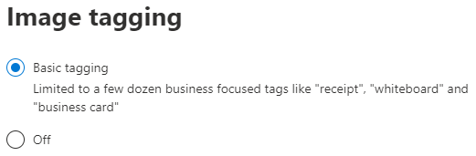

# Afbeeldingen taggen in SharePoint SyntexImage tagging in SharePoint Syntex

Standaard is het basis taggen van afbeeldingen ingeschakeld voor SharePoint en OneDrive.By default, basic image tagging is turned on for SharePoint and OneDrive. Afbeeldingen die zijn geüpload naar een van beide locaties, worden automatisch gescand en toepasbare tags worden toegepast, indien beschikbaar, uit een lijst met 37-basistags.Images uploaded to either location are automatically scanned and applicable tags are applied, if available, from a list of 37 basic tags. Gebruikers kunnen afbeeldingen zoeken via zoeken door de afbeeldingtags te zoeken.Users can find images through search by searching on the image tags.

Wanneer een gebruiker een afbeelding uploadt, wordt het tagproces automatisch uitgevoerd.When a user uploads an image, the  tagging process runs automatically. Als een afbeelding wordt bewerkt, wordt het tagproces nogmaals uitgevoerd om de labels bij te werken.If an image is edited, the tagging process runs again to update the tags.

Gebruikers met machtigingen voor het afbeeldingsbestand kunnen de tags in het bestandsinformatie paneel of op de pagina met zoekresultaten zien en bewerken.Users with permissions to the image file can see and edit the tags in the file information panel or in the search results page. Wanneer een gebruiker de labels van een afbeelding bewerkt, worden automatisch automatische tags op die afbeelding uitgevoerd. ook als deze is bewerkt.Once a user edits an image's tags, the system no longer performs auto-tagging on that image, even if it is edited.

Als u taggen uitschakelt, worden afbeeldingen niet meer automatisch getagd.If you turn tagging off, images will no longer be automatically tagged. Bestaande tags worden niet verwijderd.Existing tags will not be removed.

## Afbeelding taggen configurerenConfigure image tagging

U kunt taggen van afbeeldingen configureren in het Microsoft 365-beheercentrum.You can configure image tagging in the Microsoft 365 admin center.  

Taggen van afbeeldingen in- of uitschakelenTo turn image tagging on or off

1. In het Microsoft 365-beheercentrum, klik op **Instellingen**.In the Microsoft 365 admin center, click **Setup**.

2. Klik onder **Organisatiekennis** op **Meer informatie** over het automatiseren van inhoud.Under **Organizational knowledge**, click **Automate content understanding**.

3. Klik op **Beheren**.Click **Manage**.

4. Klik op het tabblad **Afbeeldingen taggen** op **Bewerken**.On the **Image tagging** tab, click **Edit**.

5. Geef aan dat **basis-taggen** moet worden toegestaan of schakel tagging **Uit**.Choose to allow **Basic tagging** or turn tagging **Off**.

6. Klik op **Opslaan**.Click **Save**.

    

## Zie ookSee also

[Instellen begrip van inhoudSet up content understanding](set-up-content-understanding.md)