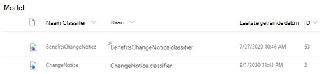

# Meer informatie over het werken met modellen via een voorbeeldmodelLearn about document understanding models through a sample model

Met Microsoft SharePoint Syntex krijgt u een voorbeeld van een model dat u kunt gebruiken om te onderzoeken, zodat u beter inzicht krijgt in het maken van uw eigen modellen.Microsoft SharePoint Syntex provides you a with a sample model you can use to examine, giving you a better understanding of how to create your own models. Met het voorbeeldmodel kunt u ook modelonderdelen bekijken, zoals de classificatie, extraheren en uitleg.The sample model also allows you to examine model components, such as its classifier, extractors, and explanations. U kunt ook de voorbeeldbestanden gebruiken voor het trainen van het model.You can also use the sample files to train the model.

## Het voorbeeldmodel importerenImport the sample model

Als u toegang wilt krijgen tot het voorbeeldmodel, moet u eerst het model importeren in uw inhouds centrum.To access the sample model, you need to first import the model to your content center.

1. Selecteer in het inhouds centrum **modellen** om de lijst met modellen weer te geven.From the content center, select **Models** to see your models list. 
2. Selecteer op de pagina **modellen** de optie **import voorbeeldmodel**.On the **Models** page, select **Import sample model**. 

      

3. Zoek het voorbeeldmodel getiteld *BenefitsChangeNotice. Classifier* , dat wordt weergegeven in uw lijst met modellen.Look for the sample model titled *BenefitsChangeNotice.classifier* that appears in your models list. 

      

4. Selecteer de *BenefitsChangeNotice. Classifier*om de startpagina van het model te openen.Select the *BenefitsChangeNotice.classifier*, to open the model's home page. 
  
     

5. Ga naar de startpagina van het model en onderzoek het model om te zien hoe dit is gemaakt.From the model home page, examine the model more closely to see how it was created.
 
- Bekijk de voorbeeldbestanden voor het trainen van het model.View the sample files used to train the model.
- Bekijk de entiteits extracters van het model nauwkeuriger om te zien hoe het voorbeeld van de uitleg is geconfigureerd.Examine the model's entity extractors more closely to see how the sample model configured the explanations.

     

## Zie ookSee Also
[Een classificatie makenCreate a classifier](create-a-classifier.md) 
[Een extractor makenCreate an extractor](create-an-extractor.md) 
[Overzicht van documentDocument Understanding overview](document-understanding-overview.md) 
[Een formulier verwerkings model makenCreate a form processing model](create-a-form-processing-model.md)  
