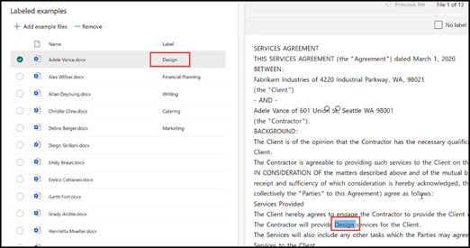

# De taxonomie van een termenarchief gebruiken bij het maken van een extractor

 

> [!VIDEO https://www.microsoft.com/videoplayer/embed/RE4GpJJ]  

 

Wanneer je een extractor maakt in je documentbegrippenmodel met SharePoint Syntex, kan je gebruikmaken van de globale termensets in[termenarchief](https://docs.microsoft.com/sharepoint/managed-metadata) en voorkeurstermen te bekijken voor de gegevens die je extraheert.  

Bijvoorbeeld: uw model identificeert en classificeert alle **contract** documenten die worden geüpload naar de documentbibliotheek.  Daarnaast extraheert het model ook een waarde **contractservice** uit elk contract, die wordt weergegeven in een kolom in uw bibliotheekweergave. Tussen de verschillende waarden contractservices in de contracten staan verschillende oudere waarden, die niet langer worden gebruikt in het bedrijf en die een andere naam hebben gekregen. Zo moeten alle verwijzingen naar de contractservices *Ontwerp*, *Afbeeldingen* en *Topografie* nu *Creatief* worden genoemd. Wanneer uw model een van de verouderde termen uit een contractdocument ophaalt, wilt u dat de huidige term (Creatief) in de bibliotheekweergave wordt weergegeven. In het onderstaande voorbeeld ziet u dat tijdens het trainen van het model een voorbeelddocument de verouderde term *Ontwerp* bevat.

    

## Een kolom Beheerde metagegevens in uw extractor gebruiken

Termensets worden geconfigureerd in het termenarchief Beheerde metagegevensservices (MMS) in het SharePoint-beheercentrum. In het onderstaande voorbeeld is de [termenset](https://docs.microsoft.com/sharepoint/managed-metadata#term-set) *contractservices* geconfigureerd om een aantal termen te bevatten, waaronder *Creatief*.  De informatie ervoor laat zien dat de term drie synoniemen heeft (*Ontwerp*, *Afbeelding* en *Topografie*) en dat de synoniemen moeten worden omgezet naar *Creatief*. 

    

Er kunnen een aantal redenen zijn om een synoniem te gebruiken in uw termenset. Er kunnen bijvoorbeeld verouderde termen, hernoemde termen of variaties afkomstig van de afdelingen van uw organisatie aanwezig zijn.

Om het veld beheerde metagegevens beschikbaar te maken voor selectie wanneer u de extractor maakt in uw model, moet u die [toevoegen als sitekolom beheerde metagegevens](https://support.microsoft.com/office/8fad9e35-a618-4400-b3c7-46f02785d27f). Nadat u de sitekolom hebt toegevoegd, is die beschikbaar om te selecteren wanneer u de extractor voor uw model maakt.

    

Na het toepassen van uw model op de documentbibliotheek, wordt bij het uploaden van documenten naar de bibliotheek in de kolom *Creatieve diensten* de voorkeursterm (*Creatief*) weergeven wanneer de extractor een van de synonieme waarden (*Ontwerp*, *Afbeelding*, en *Topografie*) vindt.

    

## Zie ook
[Introductie tot beheerde metagegevens](https://docs.microsoft.com/sharepoint/managed-metadata#terms)

[Een extractor maken](create-an-extractor.md)

[Een kolom met beheerde metagegevens maken](https://support.microsoft.com/office/create-a-managed-metadata-column-8fad9e35-a618-4400-b3c7-46f02785d27f?redirectSourcePath=%252farticle%252fc2a06717-8105-4aea-890d-3082853ab7b7&ui=en-US&rs=en-US&ad=US)

