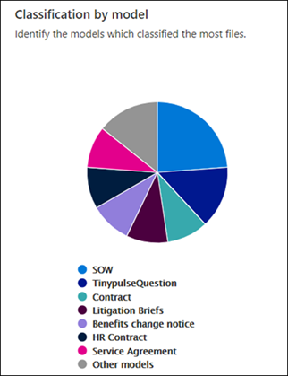
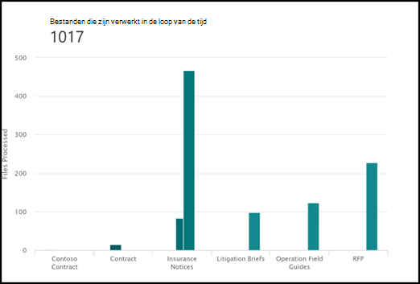

# Gebruiksanalyse documentbegripmodellen

 

> [!VIDEO https://www.microsoft.com/videoplayer/embed/RE4GnhX]  

 

U kunt analysemodellen gebruiken in uw Microsoft SharePoint Syntex-inhoudscentrum, voor meer informatie over de manier waarop de modellen die zijn gepubliceerd vanuit het inhoudscentrum worden gebruikt. Dit omvat een overzicht van de volgende informatie:

- Waar uw modellen worden toegepast
- Hoeveel bestanden er in de loop van de tijd worden verwerkt

   

## Percentage van alle modellen

     

Het cirkeldiagram **Percentage van alle modellen** geeft elk gepubliceerd model weer als een percentage van het totale aantal bestanden dat is verwerkt door alle gepubliceerde modellen in het inhoudscentrum.

Voor elk model wordt ook de **Voltooiingspercentage** weergeven, oftewel het percentage geüploade bestanden dat door het model is geanalyseerd. Een laag voltooiingspercentage kan betekenen dat er problemen zijn met het model of de bestanden die worden geanalyseerd.

## Verwerkte bestanden in de loop der tijd

     

Het staafdiagram **Verwerkte bestanden in de loop der tijd** geeft niet alleen het aantal bestanden weer dat in de loop der tijd is verwerkt door elk model, maar ook de documentbibliotheken waarop het model is toegepast.

     

## Zie ook
[Een classificatie maken](create-a-classifier.md)

[Een extractor maken](create-an-extractor.md)

[Overzicht van documentbegrip](document-understanding-overview.md)

[Een formulierverwerkingsmodel maken](create-a-form-processing-model.md)  
