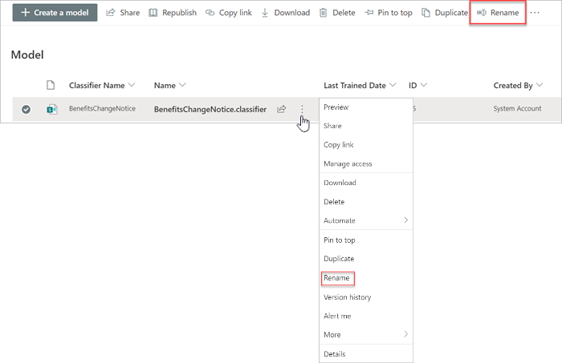

# De naam van een model wijzigen in Microsoft SharePoint SyntexRename a model in Microsoft SharePoint Syntex

Op een bepaald moment wilt je misschien de naam van een model met documentbegrip wijzigen.At some point, you might want to rename a document understanding model. Een veelvoorkomende voorbeeld hiervan is wanneer je bij het eerste concept van een model misschien niet veel aandacht hebt besteed aan de definitieve naam (je hebt het model bijvoorbeeld 'AlexWilburModel1' genoemd).A common example is when you create an initial draft of a model, you might not have given a lot of thought as to the final name (for example, you might have named it “AlexWilburModel1”). Wanneer je het model bijna hebt voltooid en in gebruik wilt nemen, besef je dat 'Contractvernieuwingen' een geschiktere naam zou zijn en dat je de naam van het model wilt wijzigen.As you come closer to finalizing the model and putting it to use, you realize that a more proper name would be “Contract Renewals,” and you want to rename it.  

Een ander voorbeeld is wanneer je organisatie besluit om met een andere naam te verwijzen naar een proces of documenttype.Another example is when your organization makes a decision to refer to a process or document type by a different name. Nadat je je model hebt gemaakt en klaar bent om het toe te passen, kan je organisatie bijvoorbeeld bepalen dat alle 'Contracten' nu officieel 'Overeenkomsten' worden genoemd.For example, after you create your model and are ready to apply it, your organization might mandate that all “Contracts” will now formally be referred to as “Agreements.” Indien nodig kunt je de naam van je model wijzigen van 'Contractverlenging' in 'Overeenkomstverlenging'.If needed, you can choose to rename your model from “Contract Renewals” to “Agreement Renewals.”

> [!IMPORTANT]
> Je kunt de naam van een model met documentbegrip alleen wijzigen als het model niet op een documentbibliotheek is toegepast.You can only rename a document understanding model if it has not been applied to a document library. 

Als je de naam van een model wijzigt, wijzig je ook de naam van het [inhoudstype](/sharepoint/governance/content-type-and-workflow-planning#content-type-overview) dat aan het model is gekoppeld.Renaming a model also renames the [content type](/sharepoint/governance/content-type-and-workflow-planning#content-type-overview) that is associated with the model.

## De naam van een model wijzigenRename a model

Volg deze stappen om de naam van een model met documentbegrip te wijzigen.Follow these steps to rename a document understanding model.

1. Selecteer in het inhoudscentrum **Modellen** om de lijst met modellen te zien.From the content center, select **Models** to see your models list.

2. Selecteer op de pagina **Modellen** het model waarvan je de naam wilt wijzigen.On the **Models** page, select the model you want to rename.

3. Gebruik het lint of de knop **Acties weergeven** (naast de modelnaam) om **Naam wijzigen** te selecteren.By using either the ribbon or the **Show actions** button (next to the model name), select **Rename**.  

      

4. In het deelvenster **Naam van model wijzigen**:On the **Rename model** panel:

   a.a. Voer bij **Nieuwe naam** de nieuwe naam in van het model waarvan je de naam wilt wijzigen.Under **New name**, enter the new name of the model that you want to rename. 

      

   b.b. (Optioneel) Selecteer bij **Geavanceerde instellingen** of je een bestaand [inhoudstype](/sharepoint/governance/content-type-and-workflow-planning#content-type-overview) wilt koppelen.(Optional) Under **Advanced settings**, select whether you want to associate an existing [content type](/sharepoint/governance/content-type-and-workflow-planning#content-type-overview). Als je **Een bestaand inhoudstype gebruiken** kiest, wordt de naam van het model gewijzigd en afgestemd op het geselecteerde inhoudstype.If you choose **Use an existing content type**, the model will be renamed to match the selected content type.

5. Selecteer **Naam wijzigen**.Select **Rename**.

## Zie ookSee Also
[Een classificatie makenCreate a classifier](create-a-classifier.md)

[Een extractor makenCreate an extractor](create-an-extractor.md)

[De naam van een extractor wijzigenRename an extractor](rename-an-extractor.md)

[Overzicht van documentbegripDocument Understanding overview](document-understanding-overview.md)

[UitlegtypenExplanation types](explanation-types-overview.md)

[Een model toepassenApply a model](apply-a-model.md) 
