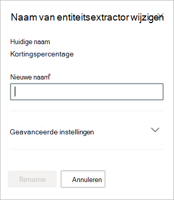

# De naam van een extractor wijzigen in Microsoft SharePoint Syntex.Rename an extractor in Microsoft SharePoint Syntex

Op een bepaald moment moet je misschien de naam van een extractor wijzigen als je naar een opgehaald gegevensveld wilt verwijzen met een andere naam.At some point, you might need to rename an extractor if you want to refer to an extracted data field by a different name. Je organisatie besluit bijvoorbeeld wijzigingen aan te brengen in hun contractdocumenten en in hun documenten naar 'klanten' te verwijzen als 'cliënten'.For example, your organization decides to make changes to their contract documents, and refers to “customers” as “clients” in their documents. Als je een veld 'Klant' uit je model ophaalde, kunt je de naam wijzigen in 'Cliënt'.If you were extracting a “Customer” field in your model, you can choose to rename it to “Client.”

Wanneer je het bijgewerkte model synchroniseert met je SharePoint-documentbibliotheek zie je een nieuwe kolom 'Cliënt' in de documentbibliotheekweergave.When you sync your updated model to your SharePoint document library, you will see a new “Client” column in your document library view. De weergave behoudt de kolom 'Klant' voor eerdere activiteiten, maar de nieuwe kolom 'Cliënt' wordt bijgewerkt voor alle nieuwe documenten die door je model worden verwerkt.Your view will retain the “Customer” column for past activity, but will update the new “Client” column for all new documents that are processed by your model. 

> [!IMPORTANT]
>  Zorg ervoor dat je het bijgewerkte model synchroniseert naar de documentbibliotheken waarin je het eerder hebt toegepast om de nieuwe kolomnaam ook daar weer te geven.Make sure to sync your updated model to the document libraries where you had previously applied it for the new column name to display. 

## De naam van een extractor wijzigenRename an extractor

Volg deze stappen om de naam van een entiteitsextractor te wijzigen.Follow these steps to rename an entity extractor.

1. Selecteer in het inhoudscentrum **Modellen** om de lijst met modellen te zien.From the content center, select **Models** to see your models list.

2. Selecteer op pagina **Modellen** in de kolom **Naam** het model waarvoor je de naam van een extractor wilt wijzigen.On the **Models** page, in the **Name** column, select the model for which you want to rename an extractor.

3. Selecteer bij **Entiteitsextractors** de naam van de extractor waarvan je de naam wilt wijzigen en selecteer vervolgens **Naam wijzigen**.Under **Entity extractors**, select the name of the extractor you want to rename, and then select **Rename**. 

      

4. In het deelvenster **Naam van entiteitsextractor wijzigen**:On the **Rename entity extractor** panel:

   a.a. Voer bij **Nieuwe naam** de nieuwe naam van de extractor in.Under **New name**, enter the new name of the extractor. 

      

   b.b. (Optioneel) Selecteer bij **Geavanceerde instellingen** of je een bestaande Sitekolom wilt koppelen.(Optional) Under **Advanced settings**, select whether you want to associate an existing site column.

5. Selecteer **Naam wijzigen**.Select **Rename**.

## Zie ookSee Also
[Een extractor makenCreate an extractor](create-an-extractor.md)

[Een classificatie makenCreate a classifier](create-a-classifier.md)

[De naam van een model wijzigenRename a model](rename-a-model.md)

[UitlegtypenExplanation types](explanation-types-overview.md)

[De taxonomie van een termenarchief benutten bij het maken van een extractorLeverage term store taxonomy when creating an extractor](leverage-term-store-taxonomy.md)

[Overzicht van documentbegripDocument Understanding overview](document-understanding-overview.md)

[Een model toepassenApply a model](apply-a-model.md) 
