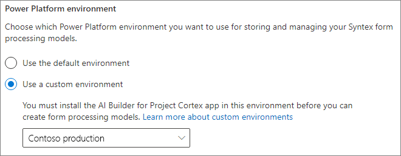

# SharePoint Syntex instellenSet up SharePoint Syntex

Beheerders kunnen het Microsoft 365-beheercentrum gebruiken om [Microsoft SharePoint Syntex](index.md) in te stellen.Admins can use the Microsoft 365 admin center to set up [Microsoft SharePoint Syntex](index.md). 

Houd rekening met het volgende voordat u begint:Consider the following before you start:

- Op welke SharePoint-sites schakelt u het verwerken van formulieren in?In which SharePoint sites will you enable form processing? Op alle sites, enkele sites of alleen specifieke sites?All of them, some, or select sites?
- Welke naam geeft u aan uw standaard inhoudscentrum?What will you name your default content center?

U kunt de instellingen wijzigen na de eerste installatie in het Microsoft 365-beheercentrum.You can change your settings after initial setup in the Microsoft 365 admin center.

Voordat u met het instellen begint, moet u plannen wat de beste manier is om inhoudsbegrip te configureren voor uw omgeving.Prior to setup, make sure to plan for the best way to set up and configure content understanding in your environment. Zo moet u bijvoorbeeld de volgende beslissingen nemen:For example, you need to make the following decisions:

- De SharePoint-sites waarvoor u de formulierverwerking wilt inschakelen; alle sites, enkele sites of specifieke sitesThe SharePoint sites in which you want to enable form processing - all of them, some, or selected sites
- De naam en beheerders van het inhoudscentrumThe name and admins for your content center

## VereistenRequirements 

> [!NOTE]
> Je moet beschikken over de machtigingen van een globale beheerder of SharePoint-beheerder om toegang te krijgen tot het Microsoft 365-beheercentrum en SharePoint Syntex in te stellen.You must have Global admin or SharePoint admin permissions to be able to access the Microsoft 365 admin center and set up SharePoint Syntex.

Als beheerder kunt u ook op elk gewenst moment wijzigingen aanbrengen in de geselecteerde instellingen en de beheerinstellingen voor inhoudsbegrip in het Microsoft 365-beheercentrum.As an admin, you can also make changes to your selected settings anytime after setup, and throughout the content understanding management settings in the Microsoft 365 Admin Center.

### LicentieverleningLicensing

Als u SharePoint Syntex wilt gebruiken, moet uw organisatie een abonnement op SharePoint Syntex hebben en moeten aan elke gebruiker de volgende licenties zijn toegewezen:To use SharePoint Syntex, your organization must have a subscription to SharePoint Syntex, and each user must have the following licenses assigned:

- SharePoint SyntexSharePoint Syntex
- SharePoint Syntex - SPO-typeSharePoint Syntex - SPO type
- Common Data Service voor SharePoint SyntexCommon Data Service for SharePoint Syntex

Als u uw SharePoint Syntex-abonnement in de toekomst opzegt (of als uw proefabonnement verloopt), kunnen gebruikers geen modellen voor documentbegrip of formulierverwerking meer maken of gebruiken en is de sjabloon voor het inhoudscentrum niet meer beschikbaar.If you cancel your SharePoint Syntex subscription at a future date (or your trial expires), users will no longer be able to create or run document understanding or form processing models, and the content center template will no longer be available. Bovendien zijn rapporten voor het termopslag, SKOS-taxonomieimports en push-inhoudstype niet meer beschikbaar.Additionally, term store reports, SKOS taxonomy import, and Content type push will no longer be available. Er wordt geen inhoud verwijderd en sitemachtigingen worden niet gewijzigd.No content will be deleted and site permissions will not be changed.

### AI Builder-creditsAI Builder credits

Als u 300 of meer SharePoint Syntex-licenties voor SharePoint Syntex in uw organisatie hebt, worden er 1 miljoen AI Builder-credits aan u toegewezen.If you have 300 or more SharePoint Syntex licenses for SharePoint Syntex in your organization, you will be allocated one million AI Builder credits. Als u minder dan 300 licenties hebt, moet u AI Builder-credits kopen om formulierverwerking te kunnen gebruiken.If you have fewer than 300 licenses, you must purchase AI Builder credits in order to use forms processing.

U kunt een schatting maken van de benodigde AI Builder-capaciteit [AI Builder-calculator](https://powerapps.microsoft.com/ai-builder-calculator).You can estimate the AI Builder capacity that’s right for you with the [AI Builder calculator](https://powerapps.microsoft.com/ai-builder-calculator).

Als u een aangepaste Power Platform-omgeving wilt gebruiken, moet u [tegoeden toewijzen aan die omgeving](/power-platform/admin/capacity-add-on).If you plan to use a custom Power Platform environment, you must [allocate credits to that environment](/power-platform/admin/capacity-add-on).

Ga naar het [Power platform-beheercentrum](https://admin.powerplatform.microsoft.com/resources/capacity) om uw credits en gebruiksgegevens te bekijken.Go to the [Power Platform admin center](https://admin.powerplatform.microsoft.com/resources/capacity) to check your credits and usage.

## SharePoint Syntex instellenTo set up SharePoint Syntex

1. Selecteer **Instellingen** in het Microsoft 365-beheercentrum en bekijk het gedeelte **Bestanden en inhoud**.In the Microsoft 365 admin center, select **Setup**, and then view the **Files and content** section.

2. Selecteer onder **Bestanden en inhoud** de optie **Inhoudsbegrip automatiseren**.In the **Files and content** section, select **Automate content understanding**. 

3. Klik op de pagina **Inhoudsbegrip automatiseren** op **Aan de slag** om het installatieproces te doorlopen.On the **Automate content understanding** page, click **Get started** to walk through the setup process. 

    > [!div class="mx-imgBorder"]
    >  

4. Op de pagina **Formulierverwerking configureren** kunt u kiezen of u wilt dat gebruikers formulierverwerkingsmodellen kunnen maken in specifieke SharePoint-documentbibliotheken.On the **Configure Form Processing** page, you can choose if you want to let users be able to create form processing models in specific SharePoint document libraries. Er is een menuoptie beschikbaar op het lint van de documentbibliotheek voor het **maken van een formulierverwerkingsmodel** in SharePoint-documentbibliotheken waarin dit is ingeschakeld.A menu option will be available in the document library ribbon to **Create a form processing model** in SharePoint document libraries in which it is enabled.
 
     Bij **Welke SharePoint-bibliotheken moeten de optie weergeven voor het maken van een formulierverwerkingsmodel**, kunt u het volgende selecteren:For **Which SharePoint libraries should show option to create a form processing model**, you can select: 
      - **Bibliotheken op alle SharePoint-sites** om de optie beschikbaar te maken voor alle SharePoint-bibliotheken in uw organisatie.**Libraries in all SharePoint sites** to make it available to all SharePoint libraries in your organization. 
      - **Bibliotheken op geselecteerde SharePoint-sites**; selecteer vervolgens de sites waar u de optie beschikbaar wilt maken of upload een lijst met maximaal 50 sites.**Libraries in selected SharePoint sites**, and then select the sites in which you want to make it available or upload a list of up to 50 sites. 
      - **Geen SharePoint-bibliotheken** als u de optie niet beschikbaar wilt maken voor sites (u kunt dit wijzigen na de installatie).**No SharePoint libraries** if you don't want to make it available to any sites (you can change this after setup).

   > [!div class="mx-imgBorder"]
   > 

   > [!Note]
   > Het verwijderen van een site nadat deze is toegevoegd is niet van invloed op bestaande modellen die zijn toegepast op de bibliotheken in die site, of de mogelijkheid om documentbegrip toe te passen op een bibliotheek.Removing a site after it has been included does not affect existing models applied to the libraries in that site or the ability to apply document understanding models to a library. 
    
    Als u meerdere Power Platform-omgevingen hebt geconfigureerd, kunt u kiezen welke u wilt gebruiken voor de formulierverwerking.If you have multiple Power Platform environments configured, you can choose which one you want to use with for form processing. (Deze optie wordt niet weergegeven als u slechts één omgeving hebt.)(This option will not appear if you only have one environment.)

    

    Voor de **Power Platform-omgeving** kunt u het volgende selecteren:For **Power Platform environment**, you can select:
    - **Gebruik de standaardomgeving** om uw Power Platform-standaardomgeving te gebruiken.**Use the default environment** to use your default Power Platform environment.
    - **Gebruik een aangepaste omgeving** om een aangepaste omgeving te gebruiken.**Use a custom environment** to use a custom environment. Kies de omgeving die u wilt gebruiken uit de lijst.Choose the environment that you want to use from the list. U moet de *AI Builder voor Project Cortex*-app in deze omgeving installeren en er AI Builder-credits aan toewijzen voordat u formulierverwerkingsmodellen kunt maken.You must install the *AI Builder for Project Cortex* app in this environment and allocate AI Builder credits to it before you can create form processing models.

    Klik op **Volgende**.Click **Next**.

5. Op de pagina **Inhoudscentrum maken** kunt u een SharePoint-inhoudscentrumsite maken waar gebruikers documentbegripmodellen kunnen maken en beheren.On the **Create Content Center** page, you can create a SharePoint content center site on which your users can create and manage document understanding models.

    1. Typ voor **Sitenaam** de naam die u de inhoudscentrumsite wilt geven.For **Site name**, type the name you want to give your content center site.
    
    1. Bij **Siteadres** wordt de URL voor uw site weergegeven op basis van wat u hebt opgegeven als sitenaam.The **Site address** will show the URL for your site, based on what you selected for the site name. Klik op **Bewerken** om dit te wijzigen.If you want to change it, click **Edit**.

       > [!div class="mx-imgBorder"]
       >  

       Selecteer **Volgende**.Select **Next**.

6. Op de pagina **Controleren en voltooien** kunt u de geselecteerde instelling bekijken en wijzigingen aanbrengen.On the **Review and finish** page, you can look at your selected setting and choose to make changes. Selecteer **Activeren** wanneer u tevreden bent met uw selecties.If you are satisfied with your selections, select **Activate**.

7. Klik op **Gereed** op de bevestigingspagina.On the confirmation page, click **Done**.

8. U gaat terug naar de pagina **Inhoudsbegrip automatiseren**.You'll be returned to your **Automate content understanding** page. Op deze pagina kunt u **Beheren** selecteren om wijzigingen aan te brengen in de configuratie-instellingen.From this page, you can select **Manage** to make any changes to your configuration settings. 

## Licenties toewijzenAssign licenses

Nadat u SharePoint Syntex hebt geconfigureerd, moet u licenties toewijzen voor de gebruikers die een SharePoint Syntex-functie gebruiken.Once you have configured SharePoint Syntex, you must assign licenses for the users who will be using any SharePoint Syntex features.

Licenties toewijzen:To assign licenses:

1. Klik in het Microsoft 365-beheercentrum onder **Gebruikers** op **Actieve gebruikers**.In the Microsoft 365 admin center, under **Users**, click **Active users**.

2. Selecteer de gebruikers aan wie u een licentie wilt toewijzen en kies **Productlicenties beheren**.Select the users that you want to license, and choose **Manage product licenses**.

3. Kies **Apps** in het vervolgkeuzemenu.Choose **Apps** from the drop-down menu.

4. Selecteer **Apps voor SharePoint Syntex weergeven**.Select **Show apps for  SharePoint Syntex**. Zorg ervoor dat onder **Apps** **Algemene Gegevens sService voor SharePoint Syntex**, **SharePoint Syntex** en **SharePoint Syntex-SPO type** allemaal zijn geselecteerd.Under **Apps**, make sure **Common Data Service for SharePoint Syntex**, **SharePoint Syntex**, and **SharePoint Syntex - SPO type** are all selected.

    > [!div class="mx-imgBorder"]
    > 

5. Klik op **Wijzigingen opslaan**.Click **Save changes**.

## Zie ookSee also

[Overzicht van het formulierverwerkingsmodelOverview of the form processing model](/ai-builder/form-processing-model-overview)

[Stap voor stap: een documentbegripmodel maken (video)Step-by-Step: How to Build a Document Understanding Model (video)](https://www.youtube.com/watch?v=DymSHObD-bg)

[Omgevingen maken en beheren in het Power Platform-beheercentrumCreate and manage environments in the Power Platform admin center](/power-platform/admin/create-environment)
