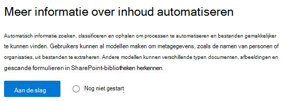
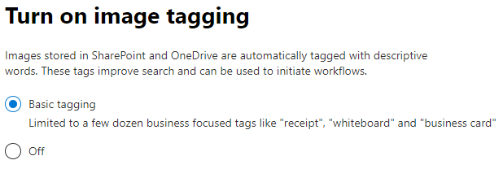
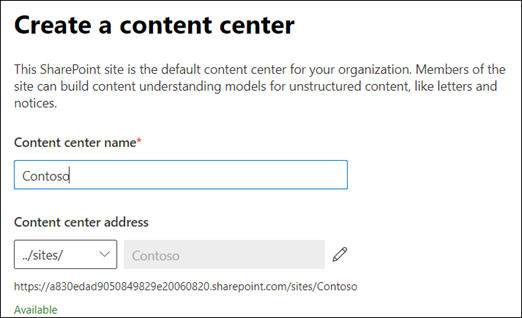
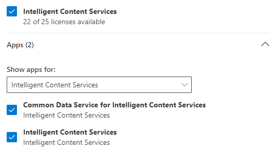

# SharePoint-Syntex instellen

Beheerders kunnen het Microsoft 365-Beheercentrum gebruiken voor het instellen van en Microsoft SharePoint Syntex. 

Voordat u begint, moet u rekening houden met het volgende:

- Welke SharePoint-sites gebruikt u om de formulierverwerking in te schakelen? Allemaal, of selecteer sites?
- Wat is de naam van uw inhouds centrum en wie is de primaire sitebeheerder?

U kunt de instellingen wijzigen na de eerste configuratie in het Microsoft 365-Beheercentrum.

De inhoud in dit artikel is bedoeld voor de cortex van de private preview van project. [Lees meer over project cortex](https://aka.ms/projectcortex).

Zorg er eerst voor dat u op de hoogte bent van de beste manier om inhoud in uw omgeving in te stellen en te configureren. U moet bijvoorbeeld overwegingen doen voor de volgende namen:

- De SharePoint-sites die u wilt gebruiken voor het bewerken van formulieren: al deze, bepaalde of geselecteerde sites
- Uw inhouds centrum en de naam van de primaire sitebeheerder

## Vereisten 

> [!NOTE]
> U moet beschikken over de machtigingen van een globale beheerder of SharePoint-beheerder om toegang te krijgen tot het Microsoft 365-Beheercentrum en de informatie over de inhoud ervan kunt instellen.

Als beheerder kunt u ook op elk gewenst moment na de installatie wijzigingen aanbrengen in de geselecteerde instellingen en in de inhoud van de beheerinstellingen in het Microsoft 365-Beheercentrum.

## SharePoint Syntex instellen

1. Selecteer in het Microsoft 365-Beheercentrum de optie **instellen**en bekijk vervolgens de sectie **bedrijfsinformatie** .

2. Selecteer in de sectie **kennis van organisatie** de optie **inhouds inzicht automatiseren**. 

     

3. Klik op de pagina **SharePoint Syntex automatiseren** op aan de **slag** om het installatieproces te doorlopen. 

     

4. Kies op de pagina afbeeldingen label inschakelen de optie als u [afbeeldingen](image-tagging.md)wilt toestaan.

     

5. Op de pagina voor het verwerken van de **formulier** kunt u aangeven of u de gebruikers van AI Builder de mogelijkheid wilt bieden om formulier verwerkings modellen te maken met specifieke documentenbibliotheken van SharePoint. Er is een menuoptie beschikbaar op het lint van de documentbibliotheek om **een formulier verwerkings model te maken** in SharePoint-documentbibliotheken waarin dit is ingeschakeld.
 
     Voor **welke SharePoint-bibliotheken moet de optie voor het maken van een formulier voor het bewerken van een formulier worden weergegeven**: 
      - **Alle SharePoint-bibliotheken** als u deze beschikbaar wilt maken voor alle SharePoint-bibliotheken in uw organisatie. 
      - **Alleen bibliotheken op geselecteerde sites**en selecteer vervolgens de sites waarvan u de site beschikbaar wilt maken. 

   

   > [!Note]
   > Als u deze instelling inschakelt voor een SharePoint-documentbibliotheek, heeft dit geen invloed op bestaande modellen die zijn toegepast op de bibliotheek of de mogelijkheid om documenten toe te passen op een bibliotheek. 
    
6. Op de pagina **inhouds centrum maken** kunt u een SharePoint-inhouds centrum site maken waarop uw gebruikers document leren maken en beheren.  
    a. Voor de naam van de **site**typt u de naam die uw inhouds centrum site moet opgeven. 
    b. Het **adres** van de site toont de URL voor uw site, op basis van de optie die u hebt geselecteerd voor de sitenaam. Als u dit wilt wijzigen, klikt u op **bewerken**. 

       

    Selecteer **Volgende**.

7. Op de pagina **controleren en voltooien** ziet u de geselecteerde instelling en kiest u om wijzigingen aan te brengen. Als u tevreden bent met uw selecties, selecteert u **activeren**.

8. Klik op de pagina confirmation op **done**.

9. U gaat terug naar de pagina informatie **over het automatiseren** van de inhoud. Op deze pagina kunt u **beheren** selecteren om wijzigingen aan te brengen in de configuratie-instellingen. 

## Licenties toewijzen

Als u een SharePoint-Syntex hebt geconfigureerd, moet u een licentie toewijzen voor de gebruikers die de functies voor formulierverwerking en document leren gebruiken.

Licenties toewijzen:

1. Klik in het Microsoft 365-Beheercentrum onder **gebruikers**op **actieve gebruikers**.

2. Selecteer de gebruikers voor wie u een licentie wilt instellen en klik op **productlicenties beheren**.

3. Selecteer **meer toewijzen**.

4. Selecteer **intelligente inhouds Services**. Zorg ervoor dat onder **apps**de optie **common data service voor Intelligent Content Services** en **intelligente inhouds** service beide is geselecteerd.

    

5. Klik op **Wijzigingen opslaan**.

## Tegoed van AI Builder

Als u een 300 of meer SharePoint-Syntex-licenties voor SharePoint Syntex in uw organisatie hebt, worden er dan 1.000.000 AI Builder-tegoed toegewezen. Als u minder dan 300 licenties hebt, moet u de tegoed van de AI-Builders aanschaffen om de verwerking van formulieren te kunnen gebruiken.

U kunt de capaciteit van de AI Builder voor u ramen met de [AI Builder-rekenmachine](https://powerapps.microsoft.com/ai-builder-calculator).

Ga naar het [Power platform-Beheercentrum](https://admin.powerplatform.microsoft.com/resources/capacity) om uw tegoed en gebruik te controleren.

## Zie ook

[Overzicht van het formulier verwerkings model](https://docs.microsoft.com/ai-builder/form-processing-model-overview)

[Stapsgewijze procedure: een document maken in overeenstemming met model (video)](https://www.youtube.com/watch?v=DymSHObD-bg)

