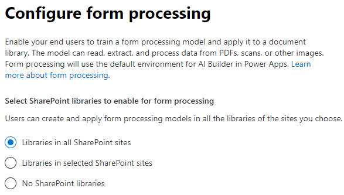

# Inhoudsbegrip instellen (Voorbeeld)Set up content understanding (Preview)

> [!Note] 
> De inhoud in dit artikel is voor Project Cortex Private Preview.The content in this article is for Project Cortex Private Preview. [Lees meer over Project Cortex](https://aka.ms/projectcortex).[Find out more about Project Cortex](https://aka.ms/projectcortex).

Beheerders kunnen het Microsoft 365-beheercentrum gebruiken om inhoudsbegrip in te stellen en te configureren.Admins can use the Microsoft 365 admin center to set up and configure content understanding. 

Voordat u de installatie instelt, moet u plannen voor de beste manier om inhoudsbegrip in uw omgeving in te stellen en te configureren.Prior to setup, make sure to plan for the best way to set up and configure content understanding in your environment. U moet bijvoorbeeld overwegingen maken over het volgende:For example, you will need to make considerations about the following:
- Welke SharePoint-sites schakelt u formulierverwerking in?Which SharePoint sites will you enable form processing? Allemaal, sommige, of selecteer sites?All of them, some, or select sites?
- Naam van uw inhoudscentrum en wie is de primaire sitebeheerder?Name of your content center, and who is the primary site admin?

Een beheerder kan ook wijzigingen aanbrengen in uw geselecteerde instellingen op elk gewenst moment na de installatie via de instellingen voor het begrijpen van inhoud in het Microsoft 365-beheercentrum.An admin can also make changes to your selected settings anytime after setup through the content understanding management settings in the Microsoft 365 admin center.

## VereistenRequirements 
U moet globale beheerders- of SharePoint-beheerdersmachtigingen hebben om toegang te krijgen tot het Microsoft 365-beheercentrum en inhoudsbegrip in te stellen.You must have Global Admin or SharePoint admin permissions to be able to access the Microsoft 365 admin center and set up content understanding.

## Inhoudsbegrip instellenTo set up content understanding

1. Selecteer **Setup**in het Microsoft 365-beheercentrum en bekijk de sectie **Kennis organisatie.**In the Microsoft 365 admin center, select **Setup**, and then view the **Organizational knowledge** section.
2. Selecteer **inhoudsbegrip automatiseren**in de sectie **Organisatiekennis** .In the **Organizational knowledge** section, select **Automate content understanding**. 

     

3. Klik op de pagina **Inhoudsbegrip automatiseren** op Aan de **slag** om u door het installatieproces te leiden.On the **Automate content understanding** page, click **Get started** to walk you through the setup process. 

     

4. Op de pagina **Formulierverwerking configureren** u kiezen of u gebruikers AI Builder wilt laten gebruiken om formulierverwerkingsmodellen te maken in specifieke SharePoint-documentbibliotheken.On the **Configure Form Processing** page, you can choose if you want to let users be able to use AI Builder to create form processing models in specific SharePoint document libraries. Er is een menuoptie beschikbaar op het lint van de documentbibliotheek om **een formulierverwerkingsmodel** te maken in SharePoint-documentbibliotheken waarin deze is ingeschakeld.A menu option will be available in the document library ribbon to **Create a form processing model** in SharePoint document libraries in which it is enabled.
 
     Voor **welke SharePoint-bibliotheken de optie moeten weergeven om een formulierverwerkingsmodel te maken,** u het gewenste selecteren:For **Which SharePoint libraries should show option to create a form processing model**, you can select: 
    - **Alle SharePoint-bibliotheken** om deze beschikbaar te maken voor alle SharePoint-bibliotheken in uw tenant.**All SharePoint libraries** to make it available to all SharePoint libraries in your tenant. 
    - **Alleen bibliotheken in geselecteerde sites**en selecteer vervolgens de sites waarin u deze beschikbaar wilt maken.**Only libraries in selected sites**, and then select the sites in which you want to make it available. 
    - **Geen SharePoint-bibliotheken** als u deze momenteel niet beschikbaar wilt maken voor sites (u dit na de installatie wijzigen).**No SharePoint libraries** if you currently don't want to make it available to any sites (you can change this after setup).
 

   

 

   > [!Note]
   > Als u deze instelling inschakelt in een SharePoint-documentbibliotheek, heeft dit geen invloed op bestaande modellen die op de bibliotheek worden toegepast of op de mogelijkheid om modellen voor documentbegrip toe te passen op een bibliotheek.Enabling this setting on a SharePoint document library does not affect existing models applied to the library or the ability to apply document understanding models to a library. 

    
5. Op de pagina **Inhoudscentrum maken** u een SharePoint-inhoudscentrumsite maken waarop uw gebruikers modellen voor het begrijpen van documenten kunnen maken en beheren.On the **Create Content Center** page, you can create a SharePoint content center site on which your users can create and manage document understanding models.  
    a.a. Typ voor **Sitenaam**de naam die u uw inhoudscentrumsite wilt geven.For **Site name**, type the name you want to give your content center site. 
    b.b. Het **siteadres** toont de URL voor uw site, op basis van wat u hebt geselecteerd voor de sitenaam.The **Site address** will show the URL for your site, based on what you selected for the site name. 

    > [!Note] 
    > Hoewel u alle ondersteunde taal selecteren, moet u er rekening mee houden dat modellen voor het begrijpen van inhoud alleen voor Engels kunnen worden gemaakt.While you can select any supported language, note that content understanding models can only be created for English. 

       

    Selecteer **Volgende**.Select **Next**.
6. Op de pagina **Voltooien en controleren** u de geselecteerde instelling bekijken en ervoor kiezen wijzigingen aan te brengen.On the **Finish and review** page, you can look at your selected setting and choose to make changes. Als u tevreden bent met uw selecties, selecteert u **Activeren**.If you are satisfied with your selections, select **Activate**.

7. De geactiveerde pagina **Inhoudsbegrip** wordt weergegeven, waarin wordt bevestigd dat het systeem uw voorkeuren voor formulierverwerking heeft toegevoegd en de site van het Content Center is geworden.The **Content understanding activated** page will display, confirming that the system has added your form processing preferences and creating the Content Center site. Selecteer **Gereed**.Select **Done**.

8. Je wordt teruggestuurd naar de pagina **Inhoudsbegrip automatiseren.**You'll be returned to your **Automate content understanding** page. Op deze pagina u **Beheren** selecteren om wijzigingen aan te brengen in uw configuratie-instellingen.From this page, you can select **Manage** to make any changes to your configuration settings. 

## Zie ookSee also

  

