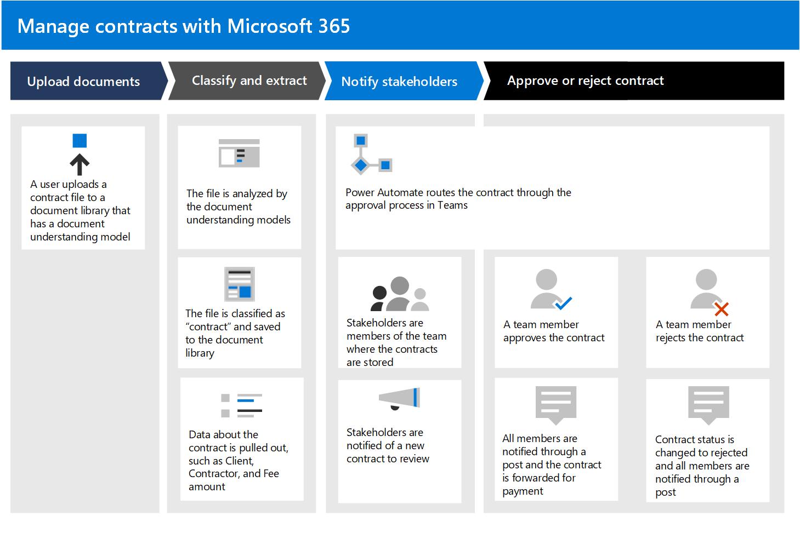

# Contracten beheren met een Microsoft 365 oplossing

In dit artikel wordt beschreven hoe u een oplossing voor contractbeheer voor uw organisatie kunt maken met SharePoint Syntex en onderdelen van Microsoft 365. Het biedt u een kader om u te helpen bij het plannen en maken van een oplossing die past bij uw unieke zakelijke behoeften. Zelfs als deze oplossing niet past bij uw bedrijfsbehoeften als geheel, kunnen delen ervan worden overgenomen in uw planning om een aangepaste oplossing voor contractbeheer te maken.

## Het zakelijke probleem identificeren

De eerste stap bij het plannen van uw contractbeheersysteem is het begrijpen van het probleem dat u probeert op te lossen. Voor deze oplossing moeten vier belangrijke problemen worden opgelost:

- **Identificeer contracten**. Uw organisatie werkt met veel documenten, zoals facturen, contracten, werkafschriften, en dergelijke.  Sommige zijn digitale activa die via e-mail worden verzonden, en sommige zijn papieren activa die via traditionele e-mail worden verzonden. U hebt een manier nodig om alle klantcontracten van alle andere documenten te identificeren en vervolgens als zodanig te classificeren.

- **Volg de geschiedenis van contractgoedkeuringen.** Uw organisatie heeft een betrouwbare manier nodig om te bepalen of contracten zijn goedgekeurd of geweigerd en of de betaling is verwerkt. 

- **Site voor het beheren van goedkeuringen van contracten.** Uw organisatie moet een samenwerkingssite instellen waarin alle vereiste belanghebbenden eenvoudig contracten kunnen bekijken. Belanghebbenden moeten indien nodig het hele contract kunnen bekijken, maar het is vooral belangrijk om verschillende belangrijke velden uit elk contract te zien (bijvoorbeeld klantnaam, PO-nummer en totale kosten). Belanghebbenden moeten inkomende contracten eenvoudig kunnen goedkeuren of afwijzen.

- **Route beoordeelde contracten**. Goedgekeurde en geweigerde contracten moeten worden gerouteerd via een specifieke werkstroom. Goedgekeurde contracten moeten worden doorgeleid naar een toepassing van derden voor betalingsverwerking. Geweigerde contracten moeten worden gerouteerd voor extra controle.

## Overzicht van de oplossing

  

Deze richtlijn voor contractbeheeroplossing bevat vier onderdelen van Microsoft 365:

- **Microsoft SharePoint Syntex:** maak modellen om uw contractbestanden te identificeren en te classificeren en vervolgens de juiste gegevens eruit te halen.

- **Microsoft SharePoint:** Gebruik de opmaak die beschikbaar is in moderne SharePoint om contracten in een bedrijfsvriendelijke indeling te presenteren.

- **Microsoft Teams:** Gebruik de functionaliteit van een Teams kanaal en bijbehorende tabbladen om uw belanghebbenden in staat te stellen contracten te bekijken en te beheren.

- **Power Automate**: Gebruik stromen om contracten te begeleiden bij het goedkeuringsproces en vervolgens bij een aanvraag van derden om te betalen.

### Hoe het allemaal werkt

  

1. Documenten worden geüpload naar een SharePoint documentbibliotheek. Een SharePoint syntex-documentkennismodel is toegepast op de documentbibliotheek. Het controleert elk bestand om te zien of er een overeenkomst is met een 'contract'-inhoudstype dat is getraind om te zoeken. Als er een overeenkomst wordt gevonden, wordt het bestand als een 'contract' classificeert en wordt het inhoudstype voor het document bijgewerkt.

2. Het model haalt ook specifieke gegevens op uit elk contractbestand dat belanghebbenden willen zien, zoals de *klant,* de *contractant* en het *bedrag van de kosten.*

    De volgende pagina is een voorbeeld van een contract dat het model is opgeleid om te identificeren.

      

3. In Microsoft Teams zijn alle belanghebbenden lid van een beveiligd Teams kanaal waarin alle contracten in de documentbibliotheek zichtbaar zijn voor goedkeuring of afwijzing. Door de Teams gebruiken, worden alle belanghebbenden op de hoogte gesteld wanneer nieuwe contracten moeten worden gecontroleerd.
 
4. Met Power Automate worden contracten verplaatst via het goedkeuringsproces in het Teams kanaal. Wanneer een lid een contract goedkeurt, wordt de contractstatus gewijzigd in goedkeuren, worden alle leden via een Teams-post op de hoogte gesteld en wordt er een regelitem gemaakt om aan te geven dat het contract gereed is voor uitbetaling. Dit proces kan worden uitgebreid om rechtstreeks te schrijven naar een financiële toepassing van derden voor betaling.

5.  Wanneer een lid een contract weigert, wordt de status gewijzigd in geweigerd en worden alle leden op de hoogte gesteld via Teams bericht.

6. Het eindresultaat van deze oplossing is een geautomatiseerd bedrijfsproces voor uw organisatie. Werknemers kunnen eenvoudig de aangepaste tegelweergave in Teams om de goedkeuringswerkstroom van uw documenten te starten en te controleren. 

     

## De oplossing maken

In de volgende secties wordt in detail beschreven hoe u de oplossing voor contractbeheer configureert. Het is onderverdeeld in drie stappen:

- [Stap 1. Gebruik SharePoint Syntex om contractbestanden te identificeren en gegevens op te halen](solution-manage-contracts-step1.md)
- [Stap 2. Gebruik Microsoft Teams om uw contractbeheerkanaal te maken](solution-manage-contracts-step2.md)
- [Stap 3. Gebruik Power Automate om uw stroom te maken om uw contracten te verwerken](solution-manage-contracts-step3.md)
