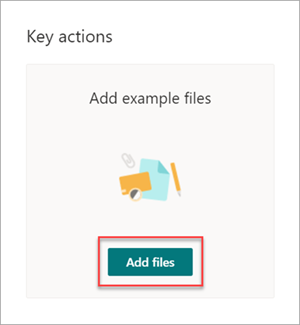
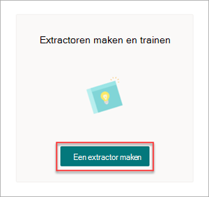
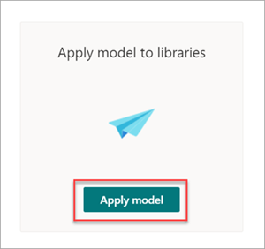

# Stap 1.Step 1. Gebruik SharePoint Syntex om contractbestanden te identificeren en gegevens op te halenUse SharePoint Syntex to identify contract files and extract data

Uw organisatie heeft een manier nodig om alle contractdocumenten te identificeren en te classificeren van de vele bestanden die u ontvangt.Your organization needs a way to identify and classify all contract documents from the many files you receive. U wilt ook snel verschillende belangrijke elementen kunnen bekijken in elk van de geïdentificeerde contractbestanden (bijvoorbeeld *Client,* *Contractant* en *Kostenbedrag).*You also want to be able to quickly view several key elements in each of the contract files identified (for example, *Client*, *Contractor*, and *Fee amount*). U kunt dit doen door een document [SharePoint Syntex](index.md) te maken en toe te passen op een documentbibliotheek.You can do this by using [SharePoint Syntex](index.md) to create a document understanding model and applying it to a document library.

## Overzicht van het procesOverview of the process

[Documentkennis](document-understanding-overview.md) maakt gebruik van AI-modellen (Artificial Intelligence) om de classificatie van bestanden en de extractie van informatie te automatiseren.[Document understanding](document-understanding-overview.md) uses artificial intelligence (AI) models to automate classification of files and extraction of information. Documentkennismodellen zijn ook optimaal voor het extraheren van informatie uit ongestructureerde en semi-gestructureerde documenten waarin de informatie die u nodig hebt, niet is opgenomen in tabellen of formulieren, zoals contracten.Document understanding models are also optimal in extracting information from unstructured and semi-structured documents where the information you need isn't contained in tables or forms, such as contracts. 

Documentbegripmodellen gebruiken Optical Character Recognition- (OCR) technologie om pdf-bestanden, afbeeldingen en tiff-bestanden te scannen wanneer je een model traint met voorbeeldbestanden en wanneer je het model uitvoert op bestanden in een documentbibliotheek.Document understanding models use Optical Character Recognition (OCR) technology to scan PDFs, images, and TIFF files, both when you train a model with example files and when you run the model against files in a document library.

1. Eerst moet u ten minste vijf voorbeeldbestanden zoeken die u kunt gebruiken om het model te 'trainen' om te zoeken naar kenmerken die specifiek zijn voor het inhoudstype dat u wilt identificeren (een contract).First, you need to find at least five example files that you can use to "train" the model to search for characteristics that are specific to the content type you're trying to identify (a contract). 

2. Met SharePoint Syntex maakt u een nieuw documentkennismodel.Using SharePoint Syntex, create a new document understanding model. Als u uw voorbeeldbestanden gebruikt, moet u [een classificatie maken.](create-a-classifier.md)Using your example files, you need to [create a classifier](create-a-classifier.md). Door de classificatie te trainen met uw voorbeeldbestanden, leert u deze om te zoeken naar kenmerken die specifiek zijn voor wat u zou zien in de contracten van uw bedrijf.By training the classifier with your example files, you teach it to search for characteristics that are specific to what you would see in your company's contracts. Maak bijvoorbeeld [een 'uitleg'](create-a-classifier.md#create-an-explanation) waarin wordt gezocht naar specifieke tekenreeksen die in uw contracten staan, zoals *Serviceovereenkomst,* Overeenkomstsvoorwaarden en  *Compensatie.*For example, [create an "explanation"](create-a-classifier.md#create-an-explanation) that searches for specific strings that are in your contracts, such as *Service Agreement*, *Terms of Agreement*, and *Compensation*. U kunt zelfs uw uitleg trainen om te zoeken naar deze tekenreeksen in specifieke secties van het document of naast andere tekenreeksen.You can even train your explanation to look for these strings in specific sections of the document, or located next to other strings. Wanneer u denkt dat u uw classificatie hebt opgeleid met de informatie die het nodig heeft, kunt u uw model testen op een voorbeeldset met voorbeeldbestanden om te zien hoe efficiënt het is.When you think you have trained your classifier with the information it needs, you can test your model on a sample set of example files to see how efficient it is. Na het testen kunt u indien nodig wijzigingen aanbrengen in uw uitleg om ze efficiënter te maken.After testing, if needed you can choose to make changes to your explanations to make them more efficient. 

3. In uw model kunt u [een extractor](create-an-extractor.md) maken om specifieke gegevens uit elk contract te halen.In your model, you can [create an extractor](create-an-extractor.md) to pull out specific pieces of data from each contract. Voor elk contract is de informatie waar u zich het meest zorgen over maakt bijvoorbeeld wie de klant is, de naam van de contractant en de totale kosten.For example, for each contract, the information you're most concerned about is who the client is, the name of the contractor, and the total cost.

4. Nadat u het model hebt gemaakt, kunt u het toepassen [op een SharePoint documentbibliotheek.](apply-a-model.md)After you successfully create your model, [apply it to a SharePoint document library](apply-a-model.md). Wanneer u documenten uploadt naar de documentbibliotheek, wordt uw documentkennismodel uitgevoerd en worden alle bestanden die overeenkomen met het inhoudstype contracten dat u in uw model hebt gedefinieerd, identificeren en classificeren.As you upload documents to the document library, your document understanding model will run and will identify and classify all files that match the contracts content type you defined in your model. Alle bestanden die als contracten zijn geclassificeerd, worden weergegeven in een aangepaste bibliotheekweergave.All files that are classified as contracts will display in a custom library view. In de bestanden worden ook de waarden weergegeven van elk contract dat u hebt gedefinieerd in de extractor.The files will also display the values from each contract that you defined in your extractor.

   

5. Als u bewaar- of beveiligingsvereisten voor uw contracten hebt,  kunt u  uw model ook gebruiken om een bewaarlabel of een gevoeligheidslabel toe te passen waardoor uw contracten niet voor een bepaalde periode worden verwijderd of om te beperken wie toegang heeft tot de contracten.If you have retention or security requirements for your contracts, you can also use your model to apply a [retention label](apply-a-retention-label-to-a-model.md) or a [sensitivity label](apply-a-sensitivity-label-to-a-model.md) that will prevent your contracts from being deleted for a specified period of time or to restrict who can access the contracts.

## Stappen voor het maken en trainen van uw modelSteps to create and train your model

> [!NOTE]
> Voor deze stappen kunt u de voorbeeldbestanden gebruiken in de [opslagplaats Voor oplossingsactiva voor contractenbeheer.](https://github.com/pnp/syntex-samples/tree/main/scenario%20assets/Contracts%20Management)For these steps, you can use the example files in the [Contracts Management Solution Assets repository](https://github.com/pnp/syntex-samples/tree/main/scenario%20assets/Contracts%20Management). De voorbeelden in deze opslagplaats bevatten zowel de documentkennis van modelbestanden als de bestanden die worden gebruikt om het model te trainen.The examples in this repository contain both the document understanding model files and the files used to train the model.

### Een contractmodel makenCreate a Contract model

De eerste stap is het maken van uw contractmodel.The first step is to create your Contract model.

1. Selecteer in het Inhoudscentrum **Nieuw** en klik vervolgens **Maak een model**.From the content center, select **New**, and then **Create a model**.

2. Typ in **het deelvenster Nieuw documenttypemodel** in het veld **Naam** de naam van het model.On the **New document understanding model** pane, in the **Name** field, type the name of the model. Voor deze oplossing voor contractbeheer kunt u het modelContract een naam *geven.*For this contract management solution, you can name the model *Contract*.

4. Kies **Create**.Choose **Create**. Hiermee maa je een startpagina voor het model.This creates a home page for the model. 

    

### Uw model trainen om een type bestand te classificerenTrain your model to classify a type of file

#### Voorbeeldbestanden voor uw model toevoegenAdd example files for your model

U moet ten minste vijf voorbeeldbestanden toevoegen die contractdocumenten zijn en één voorbeeldbestand dat geen contractdocument is (bijvoorbeeld een werkoverzicht).You need to add at least five example files that are contract documents, and one example file that's not a contract document (for example, a statement of work). 

1. Selecteer op **de pagina > Contract** onder Belangrijke **acties**  >  **Voorbeeldbestanden** toevoegen de optie **Bestanden toevoegen.**On the **Models > Contract** page, under **Key actions** > **Add example files**, select **Add files**.

   

2. Open op **de pagina Voorbeeldbestanden selecteren** voor uw model de map Contract, selecteer bestanden die u wilt gebruiken en selecteer vervolgens **Toevoegen.**On the **Select example files for your model** page, open the Contract folder, select files you want to use, and then select **Add**. Als u daar geen voorbeeldbestanden hebt, selecteert **u Upload** om ze toe te voegen.If you don't have example files there, select **Upload** to add them.

#### De bestanden labelen als positieve of negatieve voorbeeldenLabel the files as positive or negative examples

1. Selecteer op **de pagina > Contract** onder Belangrijke **acties** Bestanden classificeren en  >  **training** uitvoeren de optie **Train classifier**.On the **Models > Contract** page, under **Key actions** > **Classify files and run training**, select **Train classifier**.

   

2. Op de pagina > **Contract > Contract classifier** ziet u in de viewer boven aan het eerste voorbeeldbestand tekst met de vraag of het bestand een voorbeeld is van het contractmodel dat u hebt gemaakt.On the **Models > Contract > Contract classifier** page, in the viewer on the top of the first example file, you'll see text asking if the file is an example of the Contract model you created. Als het om een positief voorbeeld gaat, selecteer je **Ja**.If it is a positive example, select **Yes**. Als het om een negatief voorbeeld gaat, selecteer je **Nee**.If it is a negative example, select **No**.

3. Selecteer in **de lijst Gelabelde** voorbeelden aan de linkerkant andere bestanden die u als voorbeelden wilt gebruiken en label ze.From the **Labeled examples** list on the left, select other files that you want to use as examples, and label them. 

     

#### Voeg ten minste één uitleg toe om de classificatie te trainenAdd at least one explanation to train the classifier 

1. Selecteer op **de pagina > contract > de pagina Contractclassifier** het **tabblad** Trein.On the **Models > Contract > Contract classifier** page, select the **Train** tab.

2. In de **sectie Getrainde** bestanden ziet u een lijst met de voorbeeldbestanden die u eerder hebt gelabeld.In the **Trained files** section, you'll see a list of the example files that you previously labeled. Selecteer een van de positieve bestanden in de lijst om deze weer te geven in de viewer.Select one of the positive files from the list to display it in the viewer.

3. Selecteer in **de sectie Uitleg** de optie **Nieuw** en vervolgens **Leeg.**In the **Explanations** section, select **New** and then **Blank**.

4. Op de pagina **Maak een uitleg**:On the **Create an explanation** page:

    a.a. Typ in **het** veld Naam de naam van de uitleg (zoals 'Overeenkomst').In the **Name** field, type the name of the explanation (such as "Agreement").

    b.b. Selecteer in **het veld Uitlegtype** de optie **Lijst Woordgroep** omdat u een tekenreeks toevoegt.In the **Explanation type** field, select **Phrase list**, because you add a text string.

    c.c. Typ in **de lijst Woordgroep** de tekenreeks (zoals 'OVEREENKOMST').In the **Phrase list** box, type the string (such as "AGREEMENT"). U kunt Case **sensitive selecteren** als de tekenreeks case-sensitive moet zijn.You can select **Case sensitive** if the string needs to be case-sensitive.

    d.d. Selecteer **Opslaan en trainen.**Select **Save and train**.

     

#### Test je model.Test your model

U kunt uw contractmodel testen op voorbeeldbestanden die u nog niet eerder hebt gezien.You can test your Contract model on example files it hasn’t seen before. Dit is optioneel, maar kan handig zijn.This is optional, but it can be a useful best practice.

1. Selecteer op **de pagina > Contract > contractclassifier** het **tabblad** Testen. Hiermee wordt het model uitgevoerd op uw voorbeeldbestanden zonder label.On the **Models > Contract > Contract classifier** page, select the **Test** tab. This runs the model on your unlabeled example files.

2. In de **lijst Testbestanden** worden uw voorbeeldbestanden weergegeven en wordt weergegeven of het model voorspelde dat ze positief of negatief waren.In the **Test Files** list, your example files display and shows if the model predicted them to be positive or negative. Gebruik deze informatie om de effectiviteit van je classificatie bij het identificeren van je documenten vast te stellen.Use this information to help determine the effectiveness of your classifier in identifying your documents.

     

3. Wanneer u klaar bent, **selecteert u Training afsluiten.**When done, select **Exit Training**.

### Een extractor maken en trainenCreate and train an extractor

1. Selecteer op **de pagina >** contract onder Belangrijke acties Extractoren maken en trainen de optie  >   **Extractor maken.**On the **Models > Contract** page, under **Key actions** > **Create and train extractors**, select **Create extractor**.

   

2. Typ in **het deelvenster Nieuwe entiteitsextractor** in het veld **Nieuwe** naam de naam van de extractor.On the **New entity extractor** panel, in the **New name** field, type the name of your extractor. Noem de client bijvoorbeeld *Client als* u de naam van de client uit elk contract wilt oppakken.For example, name it *Client* if you want to extract the name of the client from each contract.

3. Wanneer u klaar bent, selecteert u **Maken.**When you're done, select **Create**.

#### Label de entiteit die u wilt oppakkenLabel the entity you want to extract

Wanneer u de extractor maakt, wordt de extractorpagina geopend.When you create the extractor, the extractor page opens. Hier zie je een lijst met je voorbeeldbestanden, met het eerste bestand in de lijst die wordt weergegeven in de viewer.Here you see a list of your sample files, with the first file on the list displayed in the viewer.

 

De entiteit een label geven:To label the entity:

1. Selecteer in de viewer de gegevens die je wilt ophalen uit de bestanden.From the viewer, select the data that you want to extract from the files. Als u bijvoorbeeld de client wilt extraheren, markeert u de clientwaarde in het eerste bestand (in dit voorbeeld *Best For You Organics)* en selecteert u **Opslaan.**For example, if you want to extract the *Client*, you highlight the client value in the first file (in this example, *Best For You Organics*), and then select **Save**. U ziet de waardeweergave van het bestand in de lijst **Gelabelde** voorbeelden, onder de **kolom** Label.You'll see the value display from the file in the **Labeled examples** list, under the **Label** column.

2. Selecteer **Volgende bestand** om het volgende bestand in de lijst in de viewer automatisch op te geven en te openen.Select **Next file** to autosave and open the next file in the list in the viewer. Of selecteer **Opslaan** en selecteer vervolgens een ander bestand in de **lijst Gelabelde** voorbeelden.Or select **Save**, and then select another file from the **Labeled examples** list.

3. Herhaal in de viewer stap 1 en 2 en herhaal dit totdat u het label in alle bestanden hebt opgeslagen.In the viewer, repeat steps 1 and 2, then repeat until you saved the label in all the files.

Nadat u de bestanden hebt gelabeld, wordt er een meldingsbanner weergegeven met de mededeling dat u naar de training moet gaan.After you've labeled the files, a notification banner displays informing you to move to training. U kunt ervoor kiezen om meer documenten te labelen of door te gaan naar de training.You can choose to label more documents or advance to training.

#### Voeg een uitleg toeAdd an explanation

U kunt een uitleg maken waarin een hint wordt gegeven over de entiteitsindeling zelf en variaties in de voorbeeldbestanden.You can create an explanation that provides a hint about the entity format itself and variations it might have in the example files. Een datumwaarde kan bijvoorbeeld in veel verschillende indelingen zijn, zoals:For example, a date value can be in many different formats, such as:

- 10/14/201910/14/2019
- 14 oktober 2019October 14, 2019
- Maandag 14 oktober 2019Monday, October 14, 2019

Als u de begindatum *van het contract wilt identificeren,* kunt u een patroonverklaring maken.To help identify the *Contract Start Date*, you can create a pattern explanation.

1. Selecteer in **de sectie Uitleg** de optie **Nieuw** en vervolgens **Leeg.**In the **Explanations** section, select **New** and then **Blank**.

2. Op de pagina **Maak een uitleg**:On the **Create an explanation** page:

    a.a. Typ in **het** veld Naam de naam van de uitleg (zoals *Datum).*In the **Name** field, type the name of the explanation (such as *Date*).

    b.b. Selecteer in **het veld Uitlegtype** **de optie Patroonlijst**.In the **Explanation type** field, select **Pattern list**.

    c.c. Geef in **het** veld Waarde de datumvariatie op zoals deze worden weergegeven in de voorbeeldbestanden.In the **Value** field, provide the date variation as they appear in the sample files. Als je bijvoorbeeld datumnotaties hebt die worden weergegeven als 0/00/0000, geef je de variaties op die worden weergegeven in je documenten, zoals:For example, if you have date formats that appear as 0/00/0000, you enter any variations that appear in your documents, such as:

    - 0/0/00000/0/0000
    - 0/00/00000/00/0000
    - 00/0/000000/0/0000
    - 00/00/000000/00/0000

4. Selecteer **Opslaan en trainen.**Select **Save and train**.

#### Test uw model opnieuwTest your model again

U kunt uw contractmodel testen op voorbeeldbestanden die u nog niet eerder hebt gezien.You can test your Contract model on example files it hasn’t seen before. Dit is optioneel, maar kan handig zijn.This is optional, but it can be a useful best practice.

1. Selecteer op **de pagina > Contract > contractclassifier** het **tabblad** Testen. Hiermee wordt het model uitgevoerd op uw voorbeeldbestanden zonder label.On the **Models > Contract > Contract classifier** page, select the **Test** tab. This runs the model on your unlabeled example files.

2. In de **lijst Testbestanden** worden uw voorbeeldbestanden weergegeven en wordt weergegeven of het model de gegevens kan oppakken die u nodig hebt.In the **Test files** list, your example files display and shows if the model is able to extract the information you need. Gebruik deze informatie om de effectiviteit van je classificatie bij het identificeren van je documenten vast te stellen.Use this information to help determine the effectiveness of your classifier in identifying your documents.

3. Wanneer u klaar bent, **selecteert u Training afsluiten.**When done, select **Exit Training**.

### Uw model toepassen op een documentbibliotheekApply your model to a document library

Als u uw model wilt toepassen op een SharePoint documentbibliotheek:To apply your model to a SharePoint document library:

1. Selecteer op **de pagina > Contract** onder Sleutelacties Model toepassen op   >  **bibliotheken** de optie Model **toepassen.**On the **Models > Contract** page, under **Key actions** > **Apply model to libraries**, select **Apply model**.

   

2. Selecteer in **het deelvenster Contract** toevoegen de SharePoint site met de documentbibliotheek waarin u het model wilt toepassen.On the **Add Contract** panel, select the SharePoint site that contains the document library that you want to apply the model to. Als de site niet in de lijst wordt weergegeven, gebruikt u het zoekvak om de site te vinden.If the site does not show in the list, use the search box to find it. Kies **Toevoegen**.Select **Add**.

    > [!NOTE]
    > U moet beschikken over de machtiging *Lijst beheren* of *Machtiging voor bewerken* voor de documentbibliotheek waarop u het model toepast.You must have *Manage List* permissions or *Edit* rights to the document library you are applying the model to.

3. Nadat u de site hebt geselecteerd, selecteert u de documentbibliotheek waarop u het model wilt toepassen.After you select the site, select the document library to which you want to apply the model.

4. Omdat het model is gekoppeld aan een inhoudstype, wordt het inhoudstype en de weergave ervan toegevoegd wanneer u dit op de bibliotheek toevoegt, met de labels die u hebt geëxtraheerd en die als kolommen worden weergegeven.Because the model is associated to a content type, when you apply it to the library it will add the content type and its view with the labels you extracted showing as columns. Deze weergave is standaard de standaardweergave van de bibliotheek, maar u kunt er  desgewenst voor kiezen deze weergave niet de standaardweergave te laten zijn door Geavanceerde instellingen te selecteren en het selectievakje Deze nieuwe weergave als standaard instellen uit **te** sluiten.This view is the library's default view by default, but you can optionally choose to have it not be the default view by selecting **Advanced settings** and clearing the **Set this new view as default** check box.

5. Selecteer **Toevoegen** om het model toe te passen op de bibliotheek.Select **Add** to apply the model to the library.

6. Op de **pagina > contract** ziet u in de sectie Bibliotheken met dit **model** de URL naar de SharePoint site.On the **Models > Contract** page, in the **Libraries with this model** section, you'll see the URL to the SharePoint site listed.

    

7. Onder **Instellingen**  >  **Bibliotheekinstellingen:**Under **Settings** > **Library settings**:

   - Voeg een kolom met de naam **Status** toe en **selecteer Keuze** als kolomtype.Add a column named **Status** and select **Choice** as the column type.
   - Pas de **waarden In revisie,** **Goedgekeurd** en **Geweigerd** toe.Apply the **In review**, **Approved**, and **Rejected** values.

Nadat u het model hebt toegepast op de documentbibliotheek, kunt u beginnen met het uploaden van documenten naar de site en de resultaten bekijken.After you apply the model to the document library, you can begin uploading documents to the site and see the results.

## Volgende stapNext step

[Stap 2. Gebruik Microsoft Teams om uw contractbeheerkanaal te makenStep 2. Use Microsoft Teams to create your contract management channel](solution-manage-contracts-step2.md)