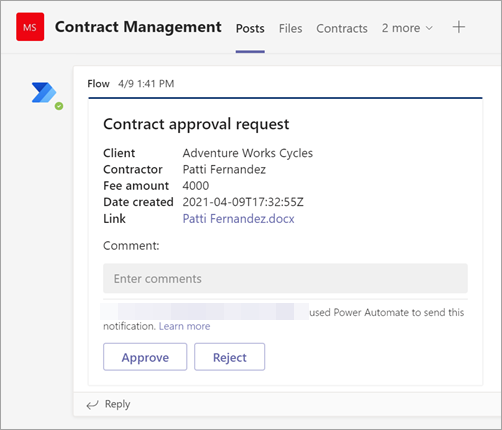

# <a name="step-3-use-power-automate-to-create-your-flow-to-process-your-contracts"></a>Stap 3. Gebruik Power Automate om uw stroom te maken om uw contracten te verwerken

U hebt uw contractbeheerkanaal gemaakt en uw documentbibliotheek SharePoint toegevoegd. De volgende stap is het maken van een Power Automate om uw contracten te verwerken die door SharePoint Syntex-model worden geïdentificeerd en classificeert. U kunt deze stap doen door [een Power Automate te maken in uw SharePoint documentbibliotheek.](https://support.microsoft.com/office/create-a-flow-for-a-list-or-library-in-sharepoint-or-onedrive-a9c3e03b-0654-46af-a254-20252e580d01)

Voor uw oplossing voor contractenbeheer wilt u een Power Automate maken om de volgende acties uit te voeren:

-  Nadat een contract is geclassificeerd door uw SharePoint Syntex-model, wijzigt u de contractstatus **in In review.**
- Het contract wordt vervolgens beoordeeld en wordt goedgekeurd of geweigerd.
- Voor goedgekeurde contracten worden de contractgegevens geplaatst op een tabblad voor betalingsverwerking.
- Voor geweigerde contracten wordt het team op de hoogte gesteld voor verdere analyse. 

In het volgende diagram ziet u de Power Automate voor de oplossing voor contractbeheer.


## <a name="prepare-your-contract-for-review"></a>Uw contract voorbereiden voor controle

Wanneer een contract wordt geïdentificeerd en geclassificeerd door uw SharePoint Syntex-documentkennismodel, verandert de Power Automate de status eerst in 'In review'.


Nadat u het bestand hebt uitchecken, wijzigt u de statuswaarde in 'Ter controle'.


De volgende stap is het maken van een adaptieve kaart waarin wordt aangegeven dat het contract wacht op revisie en deze post naar het kanaal Contractbeheer.




De volgende code is de JSON die voor deze stap in de Power Automate wordt gebruikt.

```JSON
{
"$schema": "http://adaptivecards.io/schemas/adaptive-card.json",
"type": "AdaptiveCard",
"version": "1.0",
"body": [
    {
    "type": "TextBlock",
    "text": "Contract approval request",
    "size": "large",
    "weight": "bolder",
     "wrap": true
    },
        {
            "type": "Container",
            "items": [
                {
                    "type": "FactSet",
                    "spacing": "Large",
                    "facts": [
                        {
                            "title": "Client",
                            "value": "@{triggerOutputs()?['body/Client']}"
                        },
                        {
                            "title": "Contractor",
                            "value": "@{triggerOutputs()?['body/Contractor']}"
                        },
                        {
                            "title": "Fee amount",
                            "value": "@{triggerOutputs()?['body/FeeAmount']}"
                        },
                        {
                            "title": "Date created",
                            "value": "@{triggerOutputs()?['body/Modified']} "
                        },
                        {
                            "title": "Link",
                            "value": "[@{triggerOutputs()?['body/{FilenameWithExtension}']}](@{triggerOutputs()?['body/{Link}']})"
                        }
                    ]
                }
            ]
         },
    {
    "type": "TextBlock",
    "text": "Comment:"
    },
        {
            "type": "Input.Text",
            "placeholder": "Enter comments",
            "id": "acComments"
        }
],
"actions": [
    {
    "type": "Action.Submit",
    "title": "Approve",
    "data": {
        "x": "Approve"
    }
    },
    {
    "type": "Action.Submit",
    "title": "Reject",
    "data": {
        "x": "Reject"
    }
    }
]
}
```


## <a name="conditional"></a>Voorwaardelijk

In uw stroom moet u vervolgens een voorwaarde maken waarin uw contract wordt goedgekeurd of geweigerd.


## <a name="if-the-contract-is-approved"></a>Als het contract is goedgekeurd

Wanneer een contract is goedgekeurd, treden de volgende dingen op:

- Op het **tabblad** Contracten wordt de status op de contractkaart gewijzigd in **Goedgekeurd.**

   

- In uw stroom wordt de status gewijzigd in 'Goedgekeurd'.

   

- In deze oplossing worden de contractgegevens  toegevoegd aan het tabblad Voor uitbetaling, zodat de uitbetalingen kunnen worden beheerd. Dit proces kan worden uitgebreid zodat de stroom de contracten voor betaling kan indienen door een financiële toepassing van derden (bijvoorbeeld Dynamics CRM).

   

- In de stroom maakt u het volgende item om goedgekeurde contracten te verplaatsen naar **het tabblad Voor uitbetaling.**

   

- Een adaptieve kaart waarin wordt aangegeven dat het contract is goedgekeurd, wordt gemaakt en gepost op het kanaal Contractbeheer.

   

   


   De volgende code is de JSON die voor deze stap in de Power Automate wordt gebruikt.

```JSON
{ 
    "type": "AdaptiveCard",
    "body": [
        {
            "type": "Container",
            "style": "emphasis",
            "items": [
                {
                    "type": "ColumnSet",
                    "columns": [
                        {
                            "type": "Column",
                            "items": [
                                {
                                    "type": "TextBlock",
                                    "size": "Large",
                                    "weight": "Bolder",
                                    "text": "CONTRACT APPROVED"
                                }
                            ],
                            "width": "stretch"
                        }
                    ]
                }
            ],
            "bleed": true
        },
        {
            "type": "Container",
            "items": [
                {
                    "type": "FactSet",
                    "spacing": "Large",
                    "facts": [
                        {
                            "title": "Client",
                            "value": "@{triggerOutputs()?['body/Client']}"
                        },
                        {
                            "title": "Contractor",
                            "value": "@{triggerOutputs()?['body/Contractor']}"
                        },
                        {
                            "title": "Fee amount",
                            "value": "@{triggerOutputs()?['body/FeeAmount']}"
                        },
                        {
                            "title": "Approval by",
                            "value": "@{body('Post_an_Adaptive_Card_to_a_Teams_channel_and_wait_for_a_response')?['responder']['displayName']}"
                        },
                        {
                            "title": "Approved date",
                            "value": "@{body('Post_an_Adaptive_Card_to_a_Teams_channel_and_wait_for_a_response')?['responseTime']}"
                        },
                        {
                            "title": "Approval comment",
                            "value": "@{body('Post_an_Adaptive_Card_to_a_Teams_channel_and_wait_for_a_response')?['data']['acComments']}"
                        },
                        {
                            "title": " ",
                            "value": " "
                        },
                        {
                            "title": "Status",
                            "value": "Ready for payout"
                        }
                    ]
                }
            ]
        }
    ],
    "$schema": "http://adaptivecards.io/schemas/adaptive-card.json",
    "version": "1.2",
    "fallbackText": "This card requires Adaptive Cards v1.2 support to be rendered properly."
}
```

## <a name="if-the-contract-is-rejected"></a>Als het contract wordt geweigerd

Wanneer een contract is geweigerd, treden de volgende dingen op:

- Op het **tabblad** Contracten wordt de status op de contractkaart gewijzigd in **Geweigerd.**

   

- In uw stroom bekijkt u het contractbestand, wijzigt u de status in **Geweigerd** en controleert u het bestand opnieuw.

   

- In uw stroom maakt u een adaptieve kaart waarin wordt aangegeven dat het contract is geweigerd.

   

De volgende code is de JSON die voor deze stap in de Power Automate wordt gebruikt.

```JSON
{ 
    "type": "AdaptiveCard",
    "body": [
        {
            "type": "Container",
            "style": "attention",
            "items": [
                {
                    "type": "ColumnSet",
                    "columns": [
                        {
                            "type": "Column",
                            "items": [
                                {
                                    "type": "TextBlock",
                                    "size": "Large",
                                    "weight": "Bolder",
                                    "text": "CONTRACT REJECTED"
                                }
                            ],
                            "width": "stretch"
                        }
                    ]
                }
            ],
            "bleed": true
        },
        {
            "type": "Container",
            "items": [
                {
                    "type": "FactSet",
                    "spacing": "Large",
                    "facts": [
                        {
                            "title": "Client",
                            "value": "@{triggerOutputs()?['body/Client']}"
                        },
                        {
                            "title": "Contractor",
                            "value": "@{triggerOutputs()?['body/Contractor']}"
                        },
                        {
                            "title": "Fee amount",
                            "value": "@{triggerOutputs()?['body/FeeAmount']}"
                        },
                        {
                            "title": "Rejected by",
                            "value": "@{body('Post_an_Adaptive_Card_to_a_Teams_channel_and_wait_for_a_response')?['responder']['displayName']}"
                        },
                        {
                            "title": "Rejected date",
                            "value": "@{body('Post_an_Adaptive_Card_to_a_Teams_channel_and_wait_for_a_response')?['responseTime']}"
                        },
                        {
                            "title": "Comment",
                            "value": "@{body('Post_an_Adaptive_Card_to_a_Teams_channel_and_wait_for_a_response')?['data']['acComments']}"
                        },
                        {
                            "title": " ",
                            "value": " "
                        },
                        {
                            "title": "Status",
                            "value": "Needs review"
                        }
                    ]
                }
            ]
        }
    ],
    "$schema": "http://adaptivecards.io/schemas/adaptive-card.json",
    "version": "1.2",
    "fallbackText": "This card requires Adaptive Cards v1.2 support to be rendered properly."
}
```

- De kaart wordt gepost in het kanaal Contractbeheer.

   