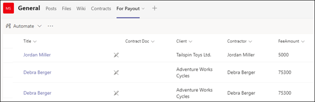
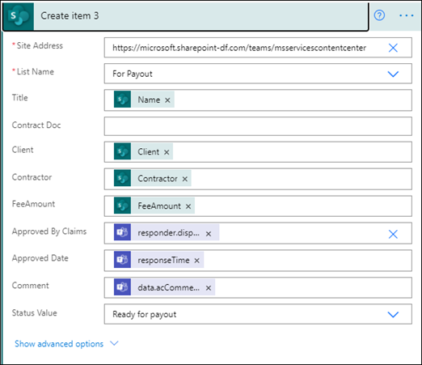

# <a name="step-3-use-power-automate-to-create-your-flow-to-process-your-contracts"></a><span data-ttu-id="dc2fa-104">Stap 3.</span><span class="sxs-lookup"><span data-stu-id="dc2fa-104">Step 3.</span></span> <span data-ttu-id="dc2fa-105">Gebruik Power Automate om uw stroom te maken om uw contracten te verwerken</span><span class="sxs-lookup"><span data-stu-id="dc2fa-105">Use Power Automate to create your flow to process your contracts</span></span>

<span data-ttu-id="dc2fa-106">U hebt uw contractbeheerkanaal gemaakt en uw documentbibliotheek SharePoint toegevoegd.</span><span class="sxs-lookup"><span data-stu-id="dc2fa-106">You've created your Contract Management channel and have attached your SharePoint document library.</span></span> <span data-ttu-id="dc2fa-107">De volgende stap is het maken van een Power Automate stroom voor het verwerken van uw contracten die door SharePoint Syntex model worden geïdentificeerd en classificeert.</span><span class="sxs-lookup"><span data-stu-id="dc2fa-107">The next step is to create a Power Automate flow to process your contracts that your SharePoint Syntex model identifies and classifies.</span></span> <span data-ttu-id="dc2fa-108">U kunt deze stap doen door [een Power Automate te maken in uw SharePoint documentbibliotheek.](https://support.microsoft.com/office/create-a-flow-for-a-list-or-library-in-sharepoint-or-onedrive-a9c3e03b-0654-46af-a254-20252e580d01)</span><span class="sxs-lookup"><span data-stu-id="dc2fa-108">You can do this step by [creating a Power Automate flow in your SharePoint document library](https://support.microsoft.com/office/create-a-flow-for-a-list-or-library-in-sharepoint-or-onedrive-a9c3e03b-0654-46af-a254-20252e580d01).</span></span>

<span data-ttu-id="dc2fa-109">Voor uw oplossing voor contractenbeheer wilt u een Power Automate maken om de volgende acties uit te voeren:</span><span class="sxs-lookup"><span data-stu-id="dc2fa-109">For your contracts management solution, you want to create a Power Automate flow to do the following actions:</span></span>

-  <span data-ttu-id="dc2fa-110">Nadat een contract is geclassificeerd door uw SharePoint Syntex model, wijzigt u de contractstatus **in In review.**</span><span class="sxs-lookup"><span data-stu-id="dc2fa-110">After a contract has been classified by your SharePoint Syntex model, change the contract status to **In review**.</span></span>
- <span data-ttu-id="dc2fa-111">Het contract wordt vervolgens beoordeeld en wordt goedgekeurd of geweigerd.</span><span class="sxs-lookup"><span data-stu-id="dc2fa-111">The contract is then reviewed and is either approved or rejected.</span></span>
- <span data-ttu-id="dc2fa-112">Voor goedgekeurde contracten worden de contractgegevens geplaatst op een tabblad voor betalingsverwerking.</span><span class="sxs-lookup"><span data-stu-id="dc2fa-112">For approved contracts, the contract information is posted to a tab for payment processing.</span></span>
- <span data-ttu-id="dc2fa-113">Voor geweigerde contracten wordt het team op de hoogte gesteld voor verdere analyse.</span><span class="sxs-lookup"><span data-stu-id="dc2fa-113">For rejected contracts, the team is notified for further analysis.</span></span> 

<span data-ttu-id="dc2fa-114">In het volgende diagram ziet u de Power Automate voor de oplossing voor contractbeheer.</span><span class="sxs-lookup"><span data-stu-id="dc2fa-114">The following diagram shows the Power Automate flow for the contract management solution.</span></span>


## <a name="prepare-your-contract-for-review"></a><span data-ttu-id="dc2fa-116">Uw contract voorbereiden voor controle</span><span class="sxs-lookup"><span data-stu-id="dc2fa-116">Prepare your contract for review</span></span>

<span data-ttu-id="dc2fa-117">Wanneer een contract wordt geïdentificeerd en geclassificeerd door uw SharePoint Syntex document-inzichtsmodel, wordt de status Power Automate de status eerst gewijzigd **in In revisie.**</span><span class="sxs-lookup"><span data-stu-id="dc2fa-117">When a contract is identified and classified by your SharePoint Syntex document understanding model, the Power Automate flow will first change the status to **In review**.</span></span>


<span data-ttu-id="dc2fa-119">Nadat u het bestand hebt uitchecken, wijzigt u de statuswaarde **in In revisie.**</span><span class="sxs-lookup"><span data-stu-id="dc2fa-119">After checking out the file, change the status value to **In review**.</span></span>


<span data-ttu-id="dc2fa-121">De volgende stap is het maken van een adaptieve kaart waarin wordt aangegeven dat het contract wacht op revisie en deze post naar het kanaal Contractbeheer.</span><span class="sxs-lookup"><span data-stu-id="dc2fa-121">The next step is to create an adaptive card stating that the contract is waiting for review and posting it to the Contract Management channel.</span></span>


<span data-ttu-id="dc2fa-124">De volgende code is de JSON die voor deze stap in de Power Automate wordt gebruikt.</span><span class="sxs-lookup"><span data-stu-id="dc2fa-124">The following code is the JSON used for this step in the Power Automate flow.</span></span>

```JSON
{
"$schema": "http://adaptivecards.io/schemas/adaptive-card.json",
"type": "AdaptiveCard",
"version": "1.0",
"body": [
    {
    "type": "TextBlock",
    "text": "Contract approval request",
    "size": "large",
    "weight": "bolder",
     "wrap": true
    },
        {
            "type": "Container",
            "items": [
                {
                    "type": "FactSet",
                    "spacing": "Large",
                    "facts": [
                        {
                            "title": "Client",
                            "value": "@{triggerOutputs()?['body/Client']}"
                        },
                        {
                            "title": "Contractor",
                            "value": "@{triggerOutputs()?['body/Contractor']}"
                        },
                        {
                            "title": "Fee amount",
                            "value": "@{triggerOutputs()?['body/FeeAmount']}"
                        },
                        {
                            "title": "Date created",
                            "value": "@{triggerOutputs()?['body/Modified']} "
                        },
                        {
                            "title": "Link",
                            "value": "[@{triggerOutputs()?['body/{FilenameWithExtension}']}](@{triggerOutputs()?['body/{Link}']})"
                        }
                    ]
                }
            ]
         },
    {
    "type": "TextBlock",
    "text": "Comment:"
    },
        {
            "type": "Input.Text",
            "placeholder": "Enter comments",
            "id": "acComments"
        }
],
"actions": [
    {
    "type": "Action.Submit",
    "title": "Approve",
    "data": {
        "x": "Approve"
    }
    },
    {
    "type": "Action.Submit",
    "title": "Reject",
    "data": {
        "x": "Reject"
    }
    }
]
}
```


## <a name="conditional-context"></a><span data-ttu-id="dc2fa-125">Voorwaardelijke context</span><span class="sxs-lookup"><span data-stu-id="dc2fa-125">Conditional context</span></span>

<span data-ttu-id="dc2fa-126">In uw stroom moet u vervolgens een voorwaarde maken waarin uw contract wordt [goedgekeurd of](#if-the-contract-is-approved) [geweigerd.](#if-the-contract-is-rejected)</span><span class="sxs-lookup"><span data-stu-id="dc2fa-126">In your flow, next you need to create a condition in which your contract will be either  [approved](#if-the-contract-is-approved) or [rejected](#if-the-contract-is-rejected).</span></span>


## <a name="if-the-contract-is-approved"></a><span data-ttu-id="dc2fa-128">Als het contract is goedgekeurd</span><span class="sxs-lookup"><span data-stu-id="dc2fa-128">If the contract is approved</span></span>

<span data-ttu-id="dc2fa-129">Wanneer een contract is goedgekeurd, treden de volgende dingen op:</span><span class="sxs-lookup"><span data-stu-id="dc2fa-129">When a contract has been approved, the following things occur:</span></span>

- <span data-ttu-id="dc2fa-130">Op het **tabblad** Contracten wordt de status op de contractkaart gewijzigd in **Goedgekeurd.**</span><span class="sxs-lookup"><span data-stu-id="dc2fa-130">On the **Contracts** tab, the status in the contract card will change to **Approved**.</span></span>

   

- <span data-ttu-id="dc2fa-132">In uw stroom wordt de status gewijzigd in **Goedgekeurd.**</span><span class="sxs-lookup"><span data-stu-id="dc2fa-132">In your flow, the status is changed to **Approved**.</span></span>

   

- <span data-ttu-id="dc2fa-134">In deze oplossing worden de contractgegevens  toegevoegd aan het tabblad Voor uitbetaling, zodat de uitbetalingen kunnen worden beheerd.</span><span class="sxs-lookup"><span data-stu-id="dc2fa-134">In this solution, the contract data will be added to the **For Payout** tab so that the payouts can be managed.</span></span> <span data-ttu-id="dc2fa-135">Dit proces kan worden uitgebreid zodat de stroom de contracten voor betaling kan indienen door een financiële toepassing van derden (bijvoorbeeld Dynamics CRM).</span><span class="sxs-lookup"><span data-stu-id="dc2fa-135">This process can be extended to allow the flow to submit the contracts for payment by a third-party financial application (for example, Dynamics CRM).</span></span>

   

- <span data-ttu-id="dc2fa-137">In de stroom maakt u het volgende item om goedgekeurde contracten te verplaatsen naar **het tabblad Voor uitbetaling.**</span><span class="sxs-lookup"><span data-stu-id="dc2fa-137">In the flow, you create the following item to move approved contracts to the **For Payout** tab.</span></span>

   

    <span data-ttu-id="dc2fa-139">Gebruik de waarden in de volgende tabel om de expressies te verkrijgen voor de Teams de benodigde gegevens.</span><span class="sxs-lookup"><span data-stu-id="dc2fa-139">To get the expressions for the information needed from the Teams card, use the values shown in the following table.</span></span>
 
    |<span data-ttu-id="dc2fa-140">Naam</span><span class="sxs-lookup"><span data-stu-id="dc2fa-140">Name</span></span>     |<span data-ttu-id="dc2fa-141">Expression</span><span class="sxs-lookup"><span data-stu-id="dc2fa-141">Expression</span></span> |
    |---------|-----------|
    | <span data-ttu-id="dc2fa-142">Goedkeuringstoestand</span><span class="sxs-lookup"><span data-stu-id="dc2fa-142">Approval state</span></span>  | <span data-ttu-id="dc2fa-143">body('Post_an_Adaptive_Card_to_a_Teams_channel_and_wait_for_a_response')? ['submitActionId']</span><span class="sxs-lookup"><span data-stu-id="dc2fa-143">body('Post_an_Adaptive_Card_to_a_Teams_channel_and_wait_for_a_response')?['submitActionId']</span></span>         |
    | <span data-ttu-id="dc2fa-144">Goedgekeurd door</span><span class="sxs-lookup"><span data-stu-id="dc2fa-144">Approved by</span></span>     | <span data-ttu-id="dc2fa-145">body('Post_an_Adaptive_Card_to_a_Teams_channel_and_wait_for_a_response')? ['responder'] ['displayName']</span><span class="sxs-lookup"><span data-stu-id="dc2fa-145">body('Post_an_Adaptive_Card_to_a_Teams_channel_and_wait_for_a_response')?['responder']['displayName']</span></span>        |
    | <span data-ttu-id="dc2fa-146">Goedkeuringsdatum</span><span class="sxs-lookup"><span data-stu-id="dc2fa-146">Approval date</span></span>     | <span data-ttu-id="dc2fa-147">body('Post_an_Adaptive_Card_to_a_Teams_channel_and_wait_for_a_response')? ['responseTime']</span><span class="sxs-lookup"><span data-stu-id="dc2fa-147">body('Post_an_Adaptive_Card_to_a_Teams_channel_and_wait_for_a_response')?['responseTime']</span></span>         |
    | <span data-ttu-id="dc2fa-148">Opmerking</span><span class="sxs-lookup"><span data-stu-id="dc2fa-148">Comment</span></span>     | <span data-ttu-id="dc2fa-149">body('Post_an_Adaptive_Card_to_a_Teams_channel_and_wait_for_a_response')? ['gegevens'] ['acComments']</span><span class="sxs-lookup"><span data-stu-id="dc2fa-149">body('Post_an_Adaptive_Card_to_a_Teams_channel_and_wait_for_a_response')?['data']['acComments']</span></span>         |
    
    <span data-ttu-id="dc2fa-150">In het volgende voorbeeld ziet u hoe u het formulevak gebruikt in Power Automate om een expressie te schrijven.</span><span class="sxs-lookup"><span data-stu-id="dc2fa-150">The following example shows how to use the formula box in Power Automate to write an expression.</span></span>

       

- <span data-ttu-id="dc2fa-152">Een adaptieve kaart waarin wordt aangegeven dat het contract is goedgekeurd, wordt gemaakt en gepost op het kanaal Contractbeheer.</span><span class="sxs-lookup"><span data-stu-id="dc2fa-152">An adaptive card stating that the contract has been approved is created and posted to the Contract Management channel.</span></span>

   

   


   <span data-ttu-id="dc2fa-155">De volgende code is de JSON die voor deze stap in de Power Automate wordt gebruikt.</span><span class="sxs-lookup"><span data-stu-id="dc2fa-155">The following code is the JSON used for this step in the Power Automate flow.</span></span>

```JSON
{ 
    "type": "AdaptiveCard",
    "body": [
        {
            "type": "Container",
            "style": "emphasis",
            "items": [
                {
                    "type": "ColumnSet",
                    "columns": [
                        {
                            "type": "Column",
                            "items": [
                                {
                                    "type": "TextBlock",
                                    "size": "Large",
                                    "weight": "Bolder",
                                    "text": "CONTRACT APPROVED"
                                }
                            ],
                            "width": "stretch"
                        }
                    ]
                }
            ],
            "bleed": true
        },
        {
            "type": "Container",
            "items": [
                {
                    "type": "FactSet",
                    "spacing": "Large",
                    "facts": [
                        {
                            "title": "Client",
                            "value": "@{triggerOutputs()?['body/Client']}"
                        },
                        {
                            "title": "Contractor",
                            "value": "@{triggerOutputs()?['body/Contractor']}"
                        },
                        {
                            "title": "Fee amount",
                            "value": "@{triggerOutputs()?['body/FeeAmount']}"
                        },
                        {
                            "title": "Approval by",
                            "value": "@{body('Post_an_Adaptive_Card_to_a_Teams_channel_and_wait_for_a_response')?['responder']['displayName']}"
                        },
                        {
                            "title": "Approved date",
                            "value": "@{body('Post_an_Adaptive_Card_to_a_Teams_channel_and_wait_for_a_response')?['responseTime']}"
                        },
                        {
                            "title": "Approval comment",
                            "value": "@{body('Post_an_Adaptive_Card_to_a_Teams_channel_and_wait_for_a_response')?['data']['acComments']}"
                        },
                        {
                            "title": " ",
                            "value": " "
                        },
                        {
                            "title": "Status",
                            "value": "Ready for payout"
                        }
                    ]
                }
            ]
        }
    ],
    "$schema": "http://adaptivecards.io/schemas/adaptive-card.json",
    "version": "1.2",
    "fallbackText": "This card requires Adaptive Cards v1.2 support to be rendered properly."
}
```

## <a name="if-the-contract-is-rejected"></a><span data-ttu-id="dc2fa-156">Als het contract wordt geweigerd</span><span class="sxs-lookup"><span data-stu-id="dc2fa-156">If the contract is rejected</span></span>

<span data-ttu-id="dc2fa-157">Wanneer een contract is geweigerd, treden de volgende dingen op:</span><span class="sxs-lookup"><span data-stu-id="dc2fa-157">When a contract has been rejected, the following things occur:</span></span>

- <span data-ttu-id="dc2fa-158">Op het **tabblad** Contracten wordt de status op de contractkaart gewijzigd in **Geweigerd.**</span><span class="sxs-lookup"><span data-stu-id="dc2fa-158">On the **Contracts** tab, the status in the contract card will change to **Rejected**.</span></span>

   

- <span data-ttu-id="dc2fa-160">In uw stroom bekijkt u het contractbestand, wijzigt u de status in **Geweigerd** en controleert u het bestand opnieuw.</span><span class="sxs-lookup"><span data-stu-id="dc2fa-160">In your flow, you check out the contract file, change the status to **Rejected**, and then check the file back in.</span></span>

   

- <span data-ttu-id="dc2fa-162">In uw stroom maakt u een adaptieve kaart waarin wordt aangegeven dat het contract is geweigerd.</span><span class="sxs-lookup"><span data-stu-id="dc2fa-162">In your flow, you create an adaptive card stating that the contract has been rejected.</span></span>

   

<span data-ttu-id="dc2fa-164">De volgende code is de JSON die voor deze stap in de Power Automate wordt gebruikt.</span><span class="sxs-lookup"><span data-stu-id="dc2fa-164">The following code is the JSON used for this step in the Power Automate flow.</span></span>

```JSON
{ 
    "type": "AdaptiveCard",
    "body": [
        {
            "type": "Container",
            "style": "attention",
            "items": [
                {
                    "type": "ColumnSet",
                    "columns": [
                        {
                            "type": "Column",
                            "items": [
                                {
                                    "type": "TextBlock",
                                    "size": "Large",
                                    "weight": "Bolder",
                                    "text": "CONTRACT REJECTED"
                                }
                            ],
                            "width": "stretch"
                        }
                    ]
                }
            ],
            "bleed": true
        },
        {
            "type": "Container",
            "items": [
                {
                    "type": "FactSet",
                    "spacing": "Large",
                    "facts": [
                        {
                            "title": "Client",
                            "value": "@{triggerOutputs()?['body/Client']}"
                        },
                        {
                            "title": "Contractor",
                            "value": "@{triggerOutputs()?['body/Contractor']}"
                        },
                        {
                            "title": "Fee amount",
                            "value": "@{triggerOutputs()?['body/FeeAmount']}"
                        },
                        {
                            "title": "Rejected by",
                            "value": "@{body('Post_an_Adaptive_Card_to_a_Teams_channel_and_wait_for_a_response')?['responder']['displayName']}"
                        },
                        {
                            "title": "Rejected date",
                            "value": "@{body('Post_an_Adaptive_Card_to_a_Teams_channel_and_wait_for_a_response')?['responseTime']}"
                        },
                        {
                            "title": "Comment",
                            "value": "@{body('Post_an_Adaptive_Card_to_a_Teams_channel_and_wait_for_a_response')?['data']['acComments']}"
                        },
                        {
                            "title": " ",
                            "value": " "
                        },
                        {
                            "title": "Status",
                            "value": "Needs review"
                        }
                    ]
                }
            ]
        }
    ],
    "$schema": "http://adaptivecards.io/schemas/adaptive-card.json",
    "version": "1.2",
    "fallbackText": "This card requires Adaptive Cards v1.2 support to be rendered properly."
}
```

- <span data-ttu-id="dc2fa-165">De kaart wordt gepost in het kanaal Contractbeheer.</span><span class="sxs-lookup"><span data-stu-id="dc2fa-165">The card is posted in the Contract Management channel.</span></span>

   