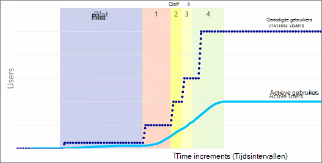

# Het plannen van uw portal launch roll-out plan in SharePoint Online

Een portal is een SharePoint site op uw intranet met veel sitekijkers die inhoud op de site gebruiken. Grote organisaties kunnen verschillende portals hebben. Bijvoorbeeld een bedrijfsportal en een HR-portal. Portals hebben meestal relatief weinig personen die de site en de inhoud ervan maken en maken. De meeste bezoekers van de portal lezen en gebruiken alleen de inhoud.

In dit artikel wordt beschreven hoe u uw implementatie- en implementatieplan kunt plannen voor SharePoint Online. Het biedt ook benaderingen om te volgen, omdat traditionele belastingstests niet zijn toegestaan op SharePoint Online. SharePoint Online is een cloudservice en de laadmogelijkheden, de status en de totale belastingsbalans in de service worden beheerd door Microsoft.

Als u wilt helpen bij het maken van een succesvolle portal, volgt u de basisprincipes, procedures en aanbevelingen die worden beschreven in het [maken,](/sharepoint/portal-health) starten en onderhouden van een gezonde portal 

De implementatiebenadering is hieronder gemarkeerd.

## Portal Launch Scheduler

Gebruik de planning voor het starten van portals om uw portal in geplande fasen vrij te geven aan gebruikers in uw organisatie. Meer informatie: 

  [Portal Launch Scheduler](https://docs.microsoft.com/microsoft-365/enterprise/portallaunchscheduler)

## Overzicht van capaciteitsplanning in SharePoint Online
Om de capaciteit efficiënt te kunnen gebruiken en onverwachte groei aan te kunnen, hebben we in elke farm automatisering die bepaalde gebruiksscenario's bij houdt. Hoewel de exacte groei onvoorspelbaar is voor elke tenant in een farm, is de samengevoegde som van aanvragen voorspelbaar in de tijd. Door de groeitrends in SharePoint Online te identificeren, kunnen we toekomstige uitbreiding plannen. Voor meer informatie over [capaciteitsplanning en laadtests SharePoint Online.](capacity-planning-and-load-testing-sharepoint-online.md)

Een belangrijk onderdeel van een geslaagde lancering is de 'wave' of 'phased roll-out' benadering die hieronder wordt beschreven. 

## Kan ik de test laden SharePoint Online?
SharePoint Online is een gedeelde omgeving met meerdere tenants die is gebalanceerd in verschillende farms en de schaal wordt regelmatig aangepast. Laad het testen van een omgeving, zoals SharePoint Online, waarvan de schaal continu verandert, niet alleen onverwachte resultaten oplevert, maar het is niet toegestaan. 

Meer informatie: [Capaciteitsplanning en belasting testen SharePoint Online](capacity-planning-and-load-testing-sharepoint-online.md)

## Pagina's optimaliseren op basis van aanbevolen richtlijnen
Pagina's van een on-Premises implementatie mogen niet gewoon worden verplaatst naar SharePoint Online zonder ze te controleren op basis van aanbevolen richtlijnen voor SharePoint Online. De beste methode is om elke startpagina altijd te optimaliseren voor een site of portal in SharePoint, omdat dit de plaats is waar de meeste gebruikers in uw organisatie toegang krijgen als uitgangspunt voor uw site(en).

Er moet rekening worden gehouden met enkele basisfactoren:
- On-Premises implementaties kunnen gebruikmaken van traditionele caches aan de serverzijde, zoals objectcache, uitvoercache en blobcache. Met de verschillen in de topologie in de cloud zijn deze opties niet per se beschikbaar, omdat ze door de grote schaalverschillen minder haalbaar zijn.
- Pagina's/functies/aanpassingen die worden gebruikt voor cloudverbruik, moeten worden geoptimaliseerd voor hogere latentie en de gedistribueerde locaties van gebruikers, zodat gebruikers in verschillende gebieden of regio's een consistentere ervaring hebben. Cloud biedt optimalisaties zoals Content Delivery Networks (CDN) om te optimaliseren voor een gedistribueerde gebruikersbasis en voor moderne SharePoint wordt het laatst bekende goede (LKG) gebruikt door onze out-of-the-box (OOTB) webonderdelen.

### Wat moet u doen:
 - Voor alle sitepagina's in SharePoint Online gebruikt u het hulpprogramma Paginadiagnose, dat een Chromium is die helpt bij het analyseren en verstrekken van richtlijnen. Dit kan worden gebruikt door site-eigenaren, editors, beheerders en ontwikkelaars, omdat het is ontworpen om een beginpunt te zijn voor analyse en optimalisatie.
 - Ontwikkelaars moeten ook ontwikkelhulpmiddelen gebruiken, zoals het hulpprogramma voor het ontwikkelaarsprogramma voor F12-browser en Ctrl-F12 in de browser op moderne pagina's. [Fiddler](https://www.telerik.com/download/fiddler) kan ook worden gebruikt om het formaat van de pagina te controleren (hoe groot de pagina is in megabytes) van de pagina en het aantal oproepen en elementen dat van invloed is op de totale paginabelasting. 

Deze sectie was een korte samenvatting voor het optimaliseren van pagina's.  Zie: Een gezonde  [portal maken, starten](/sharepoint/portal-health)en onderhouden voor meer informatie.

## Een wave/gefaseerd implementatie-aanpak volgen
Met de traditionele big bang-methode voor sitelanceringen kan niet worden geverifieerd dat aanpassingen, externe bronnen, services of processen op de juiste schaal zijn getest. Deze benadering betekent niet dat het maanden duurt voordat de app wordt gelanceerd, maar het wordt aangeraden om ten minste enkele dagen te starten, afhankelijk van de grootte van uw organisatie. Het volgen van een wave roll-outplan biedt u daarom de mogelijkheid om problemen te onderbreken en op te lossen voordat u verdergaat met de volgende fase, zodat het potentiële aantal gebruikers dat door eventuele problemen wordt beïnvloed, wordt verlaagd. SharePoint als een service uw capaciteit schaalt op basis van gebruik en voorspeld gebruik en hoewel we u niet nodig hebben om ons op de hoogte te stellen van uw lancering, moet u de richtlijnen volgen om succes te garanderen.
  
Zoals wordt weergegeven in de volgende afbeelding, is het aantal gebruikers dat wordt uitgenodigd vaak aanzienlijk hoger dan het aantal gebruikers dat de site daadwerkelijk gebruikt. In deze afbeelding ziet u een strategie voor het uitrollen van een release. Met deze methode kunt u manieren identificeren om de SharePoint te verbeteren voordat de meeste gebruikers deze zien.
  

  
In de testfase is het goed om feedback te krijgen van gebruikers die de organisatie vertrouwt en weet dat ze betrokken zijn. Op deze manier kunt u meten hoe het systeem wordt gebruikt en hoe het werkt.
  
Verzamel tijdens elk van de golven feedback van gebruikers over de functies en de prestaties tijdens elke implementatiegolf. Het verzamelen van feedback heeft het voordeel dat het systeem langzaam wordt doorgevoerd en verbeteringen worden aangebracht naarmate het systeem meer wordt gebruikt. Hierdoor kunnen we ook reageren op de toegenomen belasting wanneer de site wordt uitgerold naar meer gebruikers en in combinatie met het volgen van de richtlijnen voor pagina-optimalisatie zorgt u voor een positieve ervaring voor uw gebruikers.

### Wat moet u doen:
- Bepaal de timing van elke fase en zorg ervoor dat u een kans voor onvoorziene/pauze hebt, mocht u wijzigingen moeten aanbrengen voordat u doorgaat
- Plan uw eerste groep gebruikers die u wilt inschakelen, om ervoor te zorgen dat u de feedback ontvangt die u nodig hebt om verder te gaan.  Selecteer waar mogelijk een actieve groep gebruikers die tijdig feedback geeft
- Probeer tijdens het plannen van elke golf te beginnen met een kleine gebruikersbasis (minder dan 5000 gebruikers). Verhoog de groepsgrootte terwijl u verdergaat met elke golf. Door een gespreide benadering te maken, kunt u zo nodig gemakkelijker pauzemogelijkheden bieden.