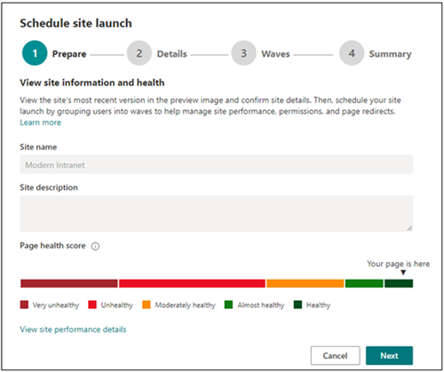

# <a name="launch-your-portal-using-the-sharepoint-portal-launch-scheduler"></a>Uw portal starten met de SharePoint portal launch scheduler

Een portal is een SharePoint communicatiesite op uw intranet die veel verkeer heeft: een site die in de loop van enkele weken tussen de 10.000 en meer dan 100.000 kijkers heeft. Gebruik de planning voor het starten van portals om uw portal te starten om ervoor te zorgen dat gebruikers een soepele weergaveervaring hebben bij het openen van uw nieuwe portal SharePoint portal.
<br>
<br>
De planning voor het starten van portals is ontworpen om u te helpen een gefaseerd implementatieaanpak te volgen door gebruikers in golven te batchen en de URL-omleiding voor de nieuwe portal te beheren. Tijdens de lancering van elke golf kunt u feedback van gebruikers verzamelen, de prestaties van de portal controleren en de start onderbreken om problemen op te lossen voordat u verdergaat met de volgende golf. Meer informatie over het [plannen van een portallancering in SharePoint.](/microsoft-365/Enterprise/Planportallaunchroll-out?view=o365-worldwide) 

**Er zijn twee soorten omleiding:**

- **Bidirectioneel:** een nieuwe moderne portal SharePoint om een bestaande SharePoint of moderne portal te vervangen
- **Omleiden naar een tijdelijke pagina:** start een nieuwe moderne SharePoint portal zonder bestaande SharePoint portal

Sitemachtigingen moeten afzonderlijk van golven zijn ingesteld als onderdeel van de start. Als u bijvoorbeeld een portal voor de hele organisatie uitwijst, kunt u machtigingen instellen voor 'Iedereen behalve externe gebruikers'. Scheid vervolgens uw gebruikers in golven met behulp van beveiligingsgroepen. Als u een beveiligingsgroep toevoegt aan een golf, krijgt die beveiligingsgroep geen toegang tot de site. 


> [!NOTE]
> - Deze functie is toegankelijk via het **Instellingen-paneel** op de startpagina van SharePoint-communicatiesites voor klanten met gerichte release vanaf mei 2021 en is beschikbaar voor alle klanten in juli 2021
> - De PowerShell-versie van dit hulpprogramma is vandaag beschikbaar
> - Deze functie kan alleen worden gebruikt op moderne SharePoint communicatiesites
> - U moet de machtigingen van de site-eigenaar voor de site hebben om de start van een portal aan te passen en te plannen
> - Lanceringen moeten ten minste zeven dagen van tevoren zijn gepland en elke golf kan één tot zeven dagen duren
> - Het vereiste aantal golven wordt automatisch bepaald door het verwachte aantal gebruikers 
> - Voordat u een portalstart wilt plannen, moet het hulpprogramma [Paginadiagnose voor](https://aka.ms/perftool) SharePoint worden uitgevoerd om te controleren of de startpagina van de site gezond is
> - Aan het einde van de start hebben alle gebruikers met machtigingen voor de site toegang tot de nieuwe site
> - Als uw organisatie [Viva Connections](https://docs.microsoft.com/SharePoint/viva-connections)gebruikt, kunnen gebruikers het pictogram van uw organisatie zien op de app-balk van Microsoft Teams, maar wanneer het pictogram is geselecteerd, kunnen gebruikers pas toegang krijgen tot de portal nadat hun golf is gestart.
> - Deze functie is niet beschikbaar voor Office 365 Duitsland, Office 365 beheerd door 21Vianet (China) of Microsoft 365 amerikaanse overheidsplannen

### <a name="understand-the-differences-between-portal-launch-scheduler-options"></a>De verschillen tussen de opties voor het starten van portals begrijpen:

Voorheen konden portallanceringen alleen worden gepland via SharePoint PowerShell. U hebt nu twee opties om u te helpen bij het plannen en beheren van de lancering van uw portal. Meer informatie over de belangrijkste verschillen tussen beide hulpprogramma's:

**SharePoint PowerShell-versie:**

- Beheerdersreferenties zijn vereist voor het gebruik [SharePoint PowerShell](https://docs.microsoft.com/powershell/sharepoint/sharepoint-online/introduction-sharepoint-online-management-shell?view=sharepoint-ps) 
- Minimumvereiste van één golf 
- Start plannen op basis van de tijdzone Coordinated Universal Time (UTC)

**In-productversie:**

- Referenties van site-eigenaar zijn vereist 
- Minimumvereiste van twee golven
- Start plannen op basis van de lokale tijdzone van de portal, zoals aangegeven in de regionale instellingen


## <a name="get-started-using-the-portal-launch-scheduler"></a>Aan de slag met de planning voor het starten van portals

1.  Voordat u het hulpprogramma Voor het starten van portals gebruikt, voegt u alle gebruikers toe die toegang tot deze [site](https://support.microsoft.com/office/share-a-site-958771a8-d041-4eb8-b51c-afea2eae3658) nodig hebben via **sitemachtigingen** als site-eigenaar, sitelid of bezoeker.

2.  Begin vervolgens met het plannen van de lancering van uw portal door op twee manieren toegang te krijgen tot de startschema voor portals:

    **Optie 1:** De eerste paar keer dat u wijzigingen bewerkt en opnieuw uitwerkt op uw startpagina - of tot aan startpagina versie 3.0 - wordt u gevraagd het hulpprogramma Voor het starten van portals te gebruiken. Selecteer **Start plannen om** door te gaan met plannen. Of selecteer **Opnieuw publiceren om** de paginabewerkingen opnieuw te publiceren zonder de start te plannen.
    
    
    
    **Optie 2:** Op elk moment kunt u naar de startpagina  van de communicatiesite SharePoint navigeren, Instellingen selecteren en vervolgens sitelancering plannen om de lancering van uw portal te plannen. 
    
    

3.  Bevestig vervolgens de statusscore van de portal en verbeter de portal indien nodig met het hulpprogramma Paginadiagnose voor SharePoint totdat uw portal een gezonde **score** ontvangt. [](https://aka.ms/perftool) Selecteer vervolgens **Volgende**.

    
       
    > [!NOTE] 
    > De naam en beschrijving van de site kunnen niet worden bewerkt vanuit de planning voor het starten van portals en kunnen **in** plaats daarvan worden gewijzigd door Instellingen en vervolgens **Site-informatie** op de startpagina te selecteren.
 
4.  Selecteer het **aantal verwachte gebruikers** in de vervolgkeuzekeuze. Deze afbeelding geeft het aantal gebruikers aan dat waarschijnlijk toegang tot de site nodig heeft. De planning voor het starten van portals bepaalt automatisch het ideale aantal golven, afhankelijk van de verwachte gebruikers zoals deze:
    
    - Minder dan 10.000 gebruikers: twee golven
    - 10.000 tot 30.000 gebruikers: Drie golven 
    - 30.000 tot 100.000 gebruikers: Vijf golven
    - Meer dan 100.000 gebruikers: Vijf golven en neem contact op met uw Microsoft via de stappen die worden weergegeven in de sectie Portal starten met meer dan 100.000 gebruikers. 

5.  Bepaal vervolgens het **type omleiding dat nodig** is:

    Optie 1: Gebruikers verzenden naar een bestaande SharePoint pagina **(bidirectioneel) :** Gebruik deze optie bij het starten van een nieuwe moderne SharePoint-portal om een bestaande SharePoint vervangen. Gebruikers in actieve golven worden omgeleid naar de nieuwe site, ongeacht of ze naar de oude of nieuwe site gaan. Gebruikers in een niet-gestarte golf die toegang proberen te krijgen tot de nieuwe site, worden teruggeleid naar de oude site totdat hun golf wordt gestart.
    
    > [!NOTE] 
    > Wanneer u de optie bidirectioneel gebruikt, moet de persoon die de lancering plant ook machtigingen van de site-eigenaar hebben voor de andere SharePoint portal.
       
    **Optie 2: Gebruikers** verzenden naar een automatisch gegenereerde tijdelijke pagina (tijdelijke paginaomleiding) - Gebruik een tijdelijke paginaomleiding moet worden gebruikt wanneer er geen bestaande SharePoint portal bestaat. Gebruikers worden doorgestuurd naar een nieuwe moderne SharePoint portal en als een gebruiker in een golf zit die niet is gestart, worden ze omgeleid naar een tijdelijke pagina.
    
    **Optie 3: Gebruikers** naar een externe pagina verzenden: geef een externe URL op voor een tijdelijke landingspagina totdat de golf van de gebruiker wordt gestart.
    
6.  Verbreed uw publiek in golven. Voeg maximaal 20 beveiligingsgroepen per golf toe. Golfdetails kunnen tot het begin van elke golf worden bewerkt. Elke golf kan minimaal één dag (24 uur) en ten minste zeven dagen duren. Dit biedt SharePoint en uw technische omgeving de mogelijkheid om te acclimeren en te schalen naar het grote aantal sitegebruikers. Bij het plannen van een start via de gebruikersinterface is de tijdzone gebaseerd op de regionale instellingen van de site. 

    >[!NOTE] 
    > - De planning voor het starten van portals wordt automatisch standaard ingesteld op minimaal 2 golven. De PowerShell-versie van dit hulpprogramma biedt echter 1 golf.
    >  - Microsoft 365 groepen worden niet ondersteund door deze versie van de planning voor het starten van portals.

7. Bepaal wie de site direct moet bekijken en voer de gegevens in in **het veld Gebruikers die zijn vrijgesteld van golven.** Deze gebruikers worden uitgesloten van golven en worden niet omgeleid vóór, tijdens of na de lancering.

    >[!NOTE]
    > Maximaal 50 afzonderlijke gebruikers of beveiligingsgroepen kunnen maximaal worden toegevoegd. Gebruik beveiligingsgroepen wanneer u meer dan 50 personen nodig hebt om toegang te krijgen tot de portal voordat de golven beginnen te starten. 

8.  Bevestig de details van de portallancering en selecteer **Planning.** Nadat de start is gepland, moeten wijzigingen in de startpagina van de portal SharePoint een gezond diagnostisch resultaat ontvangen voordat de portal wordt geopend.

### <a name="launch-a-portal-with-over-100k-users"></a>Een portal starten met meer dan 100.000 gebruikers

Als u van plan bent een portal met meer dan 100.000 gebruikers te starten, dient u een ondersteuningsaanvraag in volgens de onderstaande stappen. Zorg ervoor dat u alle gevraagde informatie op moet nemen.

**Volg deze stappen:**
1. Ga naar https://admin.microsoft.com
2. Controleer of u de preview van het nieuwe beheercentrum gebruikt
3. Selecteer ondersteuning in het linkernavigatiedeelvenster **en** selecteer vervolgens **Nieuwe serviceaanvraag**

   Hiermee wordt het deelvenster **Hulp nodig?** aan de rechterkant van het scherm geactiveerd.

4. Voor **Kort beschrijven van uw probleem,** typt u 'Launch SharePoint Portal with 100k users'</br>
5. Selecteer vervolgens **Contact opnemen met ondersteuning**
6. Voer **onder Beschrijving**'Start SharePoint Portal met 100.000 gebruikers' in
7. Vul de resterende gegevens in en selecteer contact **met mij opnemen**
8. Nadat het ticket is gemaakt, moet u de ondersteuningsagent de volgende informatie geven:
   - Portal-URL's 
   - Aantal verwachte gebruikers
   - Geschatte beginplanning

## <a name="make-changes-to-a-scheduled-portal-launch"></a>Wijzigingen aanbrengen in een geplande portallancering

Startdetails kunnen worden bewerkt voor elke golf omhoog tot de datum van de lancering van de golf. 

1.  Als u de details van de portallancering wilt bewerken, **gaat u naar Instellingen** en **selecteert u Site starten plannen.**
2.  Selecteer vervolgens **Bewerken.**
3.  Wanneer u klaar bent met het bewerken, selecteert u **Bijwerken.**


## <a name="delete-a-scheduled-portal-launch"></a>Een geplande portallancering verwijderen

Lanceringen die zijn gepland met het hulpprogramma Voor het starten van portals, kunnen op elk moment worden geannuleerd of verwijderd, zelfs als sommige golven al zijn gestart.

1.  Als u de start van uw portal wilt annuleren, gaat u naar **Instellingen** en **Start van de site plannen**.

2.  Selecteer vervolgens **Verwijderen en** selecteer nogmaals Verwijderen wanneer u het bericht hieronder ziet. 

    


## <a name="use-the-powershell-portal-launch-scheduler"></a>De startplanning voor PowerShell Portal gebruiken

De SharePoint portal launch scheduler tool was oorspronkelijk alleen beschikbaar via [SharePoint PowerShell](https://docs.microsoft.com/powershell/sharepoint/sharepoint-online/introduction-sharepoint-online-management-shell?view=sharepoint-ps) en wordt nog steeds ondersteund via PowerShell voor klanten die deze methode willen gebruiken. Dezelfde notities aan het begin van dit artikel zijn van toepassing op beide versies van de planning voor het starten van portals. 

>[!NOTE]
> U hebt beheerdersmachtigingen nodig om powershell SharePoint gebruiken.
> Details voor het starten van portals voor lanceringen die in PowerShell zijn gemaakt, worden weergegeven en kunnen worden beheerd in het nieuwe hulpprogramma voor het starten van portals in SharePoint.


### <a name="app-setup-and-connecting-to-sharepoint-online"></a>App-installatie en verbinding maken met SharePoint Online
1. [Download de nieuwste SharePoint Online Management Shell](https://go.microsoft.com/fwlink/p/?LinkId=255251).

    > [!NOTE]
    > Als u een vorige versie van de SharePoint Online Management Shell hebt geïnstalleerd, gaat u naar Programma's toevoegen of verwijderen en verwijdert u 'SharePoint Online Management Shell'. <br>Selecteer op de pagina Downloadcentrum uw taal en klik vervolgens op de knop Downloaden. U wordt gevraagd om te kiezen tussen het downloaden van een x64- en x86-.msi bestand. Download het x64-bestand als u de 64-bits versie van Windows of het x86-bestand gebruikt als u de 32-bits versie gebruikt. Als u het niet weet, zie [Welke versie van Windows besturingssysteem gebruik ik?](https://support.microsoft.com/help/13443/windows-which-operating-system). Voer het bestand na het downloaden uit en volg de stappen in de wizard Instellen.

2. Verbinding maken als SharePoint globale beheerder of beheerder [SharePoint in](/sharepoint/sharepoint-admin-role) Microsoft 365. Zie Aan de slag [met SharePoint Online Management Shell voor meer informatie.](/powershell/sharepoint/sharepoint-online/connect-sharepoint-online)


### <a name="view-any-existing-portal-launch-setups"></a>Bestaande installatie voor het starten van portals weergeven

Als u wilt zien of er bestaande configuraties voor het starten van portals zijn:

   ```PowerShell
   Get-SPOPortalLaunchWaves -LaunchSiteUrl <object> -DisplayFormat <object>
   ```

### <a name="schedule-a-portal-launch-on-the-site"></a>Een portallancering op de site plannen

Het aantal benodigde golven is afhankelijk van de verwachte startgrootte. 
- Minder dan 10.000 gebruikers: Één golf
- 10.000 tot 30.000 gebruikers: Drie golven 
- 30.000 tot 100.000 gebruikers: Vijf golven
- Meer dan 100.000 gebruikers: Vijf golven en neem contact op met uw Microsoft-accountteam

#### <a name="steps-for-bidirectional-redirection"></a>Stappen voor bidirectionele omleiding

Bidirectionele omleiding omvat het starten van een nieuwe moderne SharePoint Online-portal om een bestaande SharePoint of moderne portal te vervangen. Gebruikers in actieve golven worden omgeleid naar de nieuwe site, ongeacht of ze naar de oude of nieuwe site gaan. Gebruikers in een niet-gestarte golf die toegang proberen te krijgen tot de nieuwe site, worden teruggeleid naar de oude site totdat hun golf wordt gestart. 

We ondersteunen alleen omleiding tussen de standaard startpagina op de oude site en de standaard startpagina op de nieuwe site. Als u beheerders of eigenaren hebt die toegang nodig hebben tot de oude en nieuwe sites zonder dat deze worden omgeleid, moet u ervoor zorgen dat deze worden weergegeven met de `WaveOverrideUsers` parameter.

Als u gebruikers wilt migreren van een bestaande SharePoint site naar een nieuwe SharePoint site op een gefaseerd manier:

1. Voer de volgende opdracht uit om portallancerings golven aan te wijzen.
   
   ```PowerShell
   New-SPOPortalLaunchWaves -LaunchSiteUrl <object> -RedirectionType Bidirectional -RedirectUrl <string> -ExpectedNumberOfUsers <object> -WaveOverrideUsers <object> -Waves <object>
   ```

   Voorbeeld:

   ```PowerShell
   New-SPOPortalLaunchWaves -LaunchSiteUrl "https://contoso.sharepoint.com/teams/newsite" -RedirectionType Bidirectional -RedirectUrl "https://contoso.sharepoint.com/teams/oldsite" -ExpectedNumberOfUsers 10kTo30kUsers -WaveOverrideUsers "admin@contoso.com" -Waves ' 
   [{Name:"Wave 1", Groups:["Viewers 1"], LaunchDateUtc:"2020/10/14"}, 
   {Name:"Wave 2", Groups:["Viewers 2"], LaunchDateUtc:"2020/10/15"}, 
   {Name:"Wave 3", Groups:["Viewers 3"], LaunchDateUtc:"2020/10/16"}]'
   ```

2. Volledige validatie. Het kan 5-10 minuten duren voordat de omleiding de configuratie van de service heeft voltooid. 

#### <a name="steps-for-redirection-to-temporary-page"></a>Stappen voor omleiding naar tijdelijke pagina

Tijdelijke paginaomleiding moet worden gebruikt wanneer er geen bestaande SharePoint portal bestaat. Gebruikers worden op een gefaseerd manier doorgestuurd naar SharePoint nieuwe moderne onlineportal. Als een gebruiker in een golf zit die niet is gestart, wordt deze omgeleid naar een tijdelijke pagina (elke URL). 

1. Voer de volgende opdracht uit om portallancerings golven aan te wijzen.
   
   ```PowerShell
   New-SPOPortalLaunchWaves -LaunchSiteUrl <object> -RedirectionType ToTemporaryPage -RedirectUrl <string> -ExpectedNumberOfUsers <object> -WaveOverrideUsers <object> -Waves <object>
   ```

   Voorbeeld:

   ```PowerShell
   New-SPOPortalLaunchWaves -LaunchSiteUrl "https://contoso.sharepoint.com/teams/newsite" -RedirectionType ToTemporaryPage -RedirectUrl "https://portal.contoso.com/UnderConstruction.aspx" -ExpectedNumberOfUsers 10kTo30kUsers -WaveOverrideUsers "admin@contoso.com" -Waves ' 
   [{Name:"Wave 1", Groups:["Viewers 1"], LaunchDateUtc:"2020/10/14"}, 
   {Name:"Wave 2", Groups:["Viewers 2"], LaunchDateUtc:"2020/10/15"}, 
   {Name:"Wave 3", Groups:["Viewers 3"], LaunchDateUtc:"2020/10/16"}]'
   ```

2. Volledige validatie. Het kan 5-10 minuten duren voordat de omleiding de configuratie van de service heeft voltooid. 

### <a name="pause-or-restart-a-portal-launch-on-the-site"></a>Een portal starten op de site onderbreken of opnieuw starten

1. Voer de volgende opdracht uit om de voortgang van een portal te onderbreken en tijdelijk te voorkomen dat toekomstige golfprogressie optreedt:

   ```PowerShell
   Set-SPOPortalLaunchWaves -Status Pause - LaunchSiteUrl <object>
   ```

2. Valideer dat alle gebruikers worden omgeleid naar de oude site. 

3. Voer de volgende opdracht uit als u een portallancering wilt starten die is onderbroken:

   ```PowerShell
   Set-SPOPortalLaunchWaves -Status Restart - LaunchSiteUrl <object>
   ```
   
4. Controleer of de omleiding nu is hersteld. 

### <a name="delete-a-portal-launch-on-the-site"></a>Een portallancering op de site verwijderen

1. Voer de volgende opdracht uit om een portalstart gepland of in uitvoering voor een site te verwijderen.

   ```PowerShell
   Remove-SPOPortalLaunchWaves -LaunchSiteUrl <object>
   ```

2. Valideer dat er geen omleiding voor alle gebruikers gebeurt.

## <a name="learn-more"></a>Meer informatie

[Het plannen van uw portal launch roll-out plan in SharePoint Online](./planportallaunchroll-out.md)

[Uw communicatiesite plannen](https://support.microsoft.com/office/plan-your-sharepoint-communication-site-35d9adfe-d5cc-462f-a63a-bae7f2529182)
