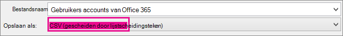

# <a name="add-several-users-at-the-same-time-to-microsoft-365---admin-help"></a><span data-ttu-id="42cbe-105">Meerdere gebruikers tegelijk toevoegen aan Microsoft 365-Help voor beheerders</span><span class="sxs-lookup"><span data-stu-id="42cbe-105">Add several users at the same time to Microsoft 365 - Admin Help</span></span>

<span data-ttu-id="42cbe-106">Elke medewerker van uw team moet een gebruikersaccount hebben voordat ze zich kunnen aanmelden en toegang krijgen tot Microsoft 365-Services, zoals e-mail en Office.</span><span class="sxs-lookup"><span data-stu-id="42cbe-106">Each person on your team needs a user account before they can sign in and access Microsoft 365 services, such as email and Office.</span></span> <span data-ttu-id="42cbe-107">Als u veel medewerkers hebt, kunt u hun accounts allemaal tegelijk toevoegen vanuit een Excel-spreadsheet of een ander bestand dat is opgeslagen in CSV-indeling.</span><span class="sxs-lookup"><span data-stu-id="42cbe-107">If you have a lot of people, you can add their accounts all at once from an Excel spreadsheet or other file saved in CSV format.</span></span> [<span data-ttu-id="42cbe-108">Weet u niet precies wat een CSV-indeling is?</span><span class="sxs-lookup"><span data-stu-id="42cbe-108">Not sure what CSV format is?</span></span>](add-several-users-at-the-same-time.md#__toc316652088)
  
> [!NOTE] 
> <span data-ttu-id="42cbe-109">Als u het nieuwe Microsoft 365-beheercentrum niet gebruikt, kunt u dit inschakelen door de wisselknop **Probeer het nieuwe beheercentrum** bovenaan de startpagina te selecteren.</span><span class="sxs-lookup"><span data-stu-id="42cbe-109">If you're not using the new Microsoft 365 admin center, you can turn it on by selecting the **Try the new admin center** toggle located at the top of the Home page.</span></span>

## <a name="add-multiple-users-in-the-microsoft-365-admin-center"></a><span data-ttu-id="42cbe-110">Meerdere gebruikers toevoegen in het Microsoft 365-Beheercentrum</span><span class="sxs-lookup"><span data-stu-id="42cbe-110">Add multiple users in the Microsoft 365 admin center</span></span>

1. <span data-ttu-id="42cbe-111">Meld u aan bij Microsoft 365 met uw werk- of schoolaccount.</span><span class="sxs-lookup"><span data-stu-id="42cbe-111">Sign in to Microsoft 365 with your work or school account.</span></span> 
    
2. <span data-ttu-id="42cbe-112">Kies **Gebruikers** \> **Actieve gebruikers** in het beheercentrum.</span><span class="sxs-lookup"><span data-stu-id="42cbe-112">In the admin center, choose **Users** \> **Active users**.</span></span>

3. <span data-ttu-id="42cbe-113">Selecteer **meerdere gebruikers toevoegen**.</span><span class="sxs-lookup"><span data-stu-id="42cbe-113">Select **Add multiple users**.</span></span>

4. <span data-ttu-id="42cbe-114">In het paneel **Meerder gebruikers importeren** kunt u eventueel een voorbeeld van een CSV-bestand met of zonder voorbeeldgegevens downloaden.</span><span class="sxs-lookup"><span data-stu-id="42cbe-114">On the **Import multiple users** panel, you can optionally download a sample CSV file with or without sample data filled in.</span></span> 
    
    <span data-ttu-id="42cbe-115">De kolomkoppen in uw spreadsheet moeten **exact dezelfde kolomkoppen** bevatten als voorbeeld één (gebruikersnaam, voornaam, enzovoort).</span><span class="sxs-lookup"><span data-stu-id="42cbe-115">Your spreadsheet needs to include the **exact same column headings** as the sample one (User Name, First Name, and so on).</span></span> <span data-ttu-id="42cbe-116">Als u de sjabloon gebruikt, opent u deze in een hulpmiddel voor tekstbewerking, zoals Kladblok, en kunt u overwegen om alle gegevens in rij 1 te laten staan en alleen gegevens in rij 2 en lager in te voeren.</span><span class="sxs-lookup"><span data-stu-id="42cbe-116">If you use the template, open it in a text editing tool, like Notepad, and consider leaving all the data in row 1 alone, and only entering data in rows 2 and below.</span></span> 
    
    <span data-ttu-id="42cbe-117">De spreadsheet dient voor elke gebruiker ook waarden te bevatten voor de gebruikersnaam (zoals jimmy@contoso.com) en een weergavenaam (zoals Jimmy de Graaf).</span><span class="sxs-lookup"><span data-stu-id="42cbe-117">Your spreadsheet also needs to include values for the user name (like bob@contoso.com) and a display name (like Bob Kelly) for each user.</span></span> 
    
  ```
  User Name,First Name,Last Name,Display Name,Job Title,Department,Office Number,Office Phone,Mobile Phone,Fax,Address,City,State or Province,ZIP or Postal Code,Country or Region
  chris@contoso.com,Chris,Green,Chris Green,IT Manager,Information Technology,123451,123-555-1211,123-555-6641,123-555-6700,1 Microsoft way,Redmond,Wa,98052,United States
  ben@contoso.com,Ben,Andrews,Ben Andrews,IT Manager,Information Technology,123452,123-555-1212,123-555-6642,123-555-6700,1 Microsoft way,Redmond,Wa,98052,United States
  david@contoso.com,David,Longmuir,David Longmuir,IT Manager,Information Technology,123453,123-555-1213,123-555-6643,123-555-6700,1 Microsoft way,Redmond,Wa,98052,United States
  cynthia@contoso.com,Cynthia,Carey,Cynthia Carey,IT Manager,Information Technology,123454,123-555-1214,123-555-6644,123-555-6700,1 Microsoft way,Redmond,Wa,98052,United States
  melissa@contoso.com,Melissa,MacBeth,Melissa MacBeth,IT Manager,Information Technology,123455,123-555-1215,123-555-6645,123-555-6700,1 Microsoft way,Redmond,Wa,98052,United States
  
  ```

5. <span data-ttu-id="42cbe-118">Voer een bestandspad in het vak in of kies **Bladeren** om naar de locatie van het CSV-bestand te gaan. Kies vervolgens **Controleren**.</span><span class="sxs-lookup"><span data-stu-id="42cbe-118">Enter a file path into the box, or choose **Browse** to browse to the CSV file location, then choose **Verify**.</span></span>
  
    <span data-ttu-id="42cbe-p104">Als er problemen met het bestand zijn, worden deze in het paneel weergegeven. U kunt ook een logboekbestand downloaden.</span><span class="sxs-lookup"><span data-stu-id="42cbe-p104">If there are problems with the file, the problem is displayed in the panel. You can also download a log file.</span></span>
    
5. <span data-ttu-id="42cbe-121">In het dialoogvenster **Gebruikersopties instellen** kunt u de aanmeldingsstatus instellen en de productlicentie kiezen die aan alle gebruikers wordt toegewezen.</span><span class="sxs-lookup"><span data-stu-id="42cbe-121">On the **Set user options** dialog you can set the sign-in status and choose the product license that will be assigned to all users.</span></span> 
    
6. <span data-ttu-id="42cbe-122">In het dialoogvenster **Resultaat weergeven** kunt u de resultaten laten verzenden naar uzelf of naar andere gebruikers (wachtwoorden in platte tekst) en kunt u zien hoeveel gebruikers zijn gemaakt en of u meer licenties dient aan te schaffen voor enkele nieuwe gebruikers.</span><span class="sxs-lookup"><span data-stu-id="42cbe-122">On the **View your result** dialog you can choose to send the results to either yourself or other users (passwords will be in plain text) and you can see how many users were created, and if you need to purchase more licenses to assign to some of the new users.</span></span> 

## <a name="next-steps"></a><span data-ttu-id="42cbe-123">Volgende stappen</span><span class="sxs-lookup"><span data-stu-id="42cbe-123">Next steps</span></span>
<span data-ttu-id="42cbe-124"><a name="bk_preview"> </a></span><span class="sxs-lookup"><span data-stu-id="42cbe-124"><a name="bk_preview"> </a></span></span>

- <span data-ttu-id="42cbe-125">Nu deze personen accounts hebben, moeten ze [Microsoft 365 of Office 2016 op een PC of Mac downloaden en installeren of opnieuw installeren](https://support.office.com/article/4414eaaf-0478-48be-9c42-23adc4716658).</span><span class="sxs-lookup"><span data-stu-id="42cbe-125">Now that these people have accounts, they need to [Download and install or reinstall Microsoft 365 or Office 2016 on a PC or Mac](https://support.office.com/article/4414eaaf-0478-48be-9c42-23adc4716658).</span></span> <span data-ttu-id="42cbe-126">Elke medewerker van uw team kan Microsoft 365 installeren op maximaal 5 Pc's of Macs.</span><span class="sxs-lookup"><span data-stu-id="42cbe-126">Each person on your team can install Microsoft 365 on up to 5 PCs or Macs.</span></span> 
    
- <span data-ttu-id="42cbe-127">Iedereen kan ook [Office-apps en E-mail instellen op een mobiel apparaat met een](https://support.office.com/article/7dabb6cb-0046-40b6-81fe-767e0b1f014f) maximum van 5 Tablets en 5 telefoons, zoals iPhones, IPads en Android-telefoons en-tablets.</span><span class="sxs-lookup"><span data-stu-id="42cbe-127">Each person can also [Set up Office apps and email on a mobile device](https://support.office.com/article/7dabb6cb-0046-40b6-81fe-767e0b1f014f) on up to 5 tablets and 5 phones, such as iPhones, iPads, and Android phones and tablets.</span></span> <span data-ttu-id="42cbe-128">Op deze manier kunnen ze Office-bestanden vanaf elke locatie bewerken.</span><span class="sxs-lookup"><span data-stu-id="42cbe-128">This way they can edit Office files from anywhere.</span></span> 
    
    <span data-ttu-id="42cbe-129">Zie [Microsoft 365 voor bedrijven instellen](https://support.office.com/article/6a3a29a0-e616-4713-99d1-15eda62d04fa) voor een end-to-end-lijst van de instellingsstappen.</span><span class="sxs-lookup"><span data-stu-id="42cbe-129">See [Set up Microsoft 365 for business](https://support.office.com/article/6a3a29a0-e616-4713-99d1-15eda62d04fa) for an end-to-end list of the setup steps.</span></span> 
    
## <a name="more-information-about-how-to-add-users-to-microsoft-365"></a><span data-ttu-id="42cbe-130">Meer informatie over het toevoegen van gebruikers aan Microsoft 365</span><span class="sxs-lookup"><span data-stu-id="42cbe-130">More information about how to add users to Microsoft 365</span></span>
<span data-ttu-id="42cbe-131"><a name="bk_preview"> </a></span><span class="sxs-lookup"><span data-stu-id="42cbe-131"><a name="bk_preview"> </a></span></span>

### <a name="not-sure-what-csv-format-is"></a><span data-ttu-id="42cbe-132">Weet u niet precies wat een CSV-indeling is?</span><span class="sxs-lookup"><span data-stu-id="42cbe-132">Not sure what CSV format is?</span></span>
<span data-ttu-id="42cbe-133"><a name="__toc316652088"> </a></span><span class="sxs-lookup"><span data-stu-id="42cbe-133"><a name="__toc316652088"> </a></span></span>

<span data-ttu-id="42cbe-p107">Een CSV-bestand is een bestand met door komma's gescheiden waarden. U kunt een bestand zoals dit maken of bewerken met elke teksteditor of elk spreadsheetprogramma, zoals Excel.</span><span class="sxs-lookup"><span data-stu-id="42cbe-p107">A CSV file is a file with comma separated values. You can create or edit a file like this with any text editor or spreadsheet program, such as Excel.</span></span>
  
<span data-ttu-id="42cbe-136">U kunt [Dit voorbeeldwerkblad](https://www.microsoft.com/download/details.aspx?id=45485) als uitgangspunt downloaden.</span><span class="sxs-lookup"><span data-stu-id="42cbe-136">You can download [this sample spreadsheet](https://www.microsoft.com/download/details.aspx?id=45485) as a starting point.</span></span> <span data-ttu-id="42cbe-137">Houd er rekening mee dat in Microsoft 365 kolomkoppen in de eerste rij zijn vereist, dus vervang deze niet door iets anders.</span><span class="sxs-lookup"><span data-stu-id="42cbe-137">Remember that Microsoft 365 requires column headings in the first row so don't replace them with something else.</span></span> 
  
<span data-ttu-id="42cbe-138">Sla het bestand op onder een nieuwe naam en geef de CSV-indeling op.</span><span class="sxs-lookup"><span data-stu-id="42cbe-138">Save the file with a new name, and specify CSV format.</span></span>
  

  
<span data-ttu-id="42cbe-p109">Wanneer u het bestand opslaat, krijgt u waarschijnlijk een melding dat sommige functies in uw werkmap verloren gaan als u het bestand opslaat in een CSV-indeling. Dit is geen probleem. Klik op **Ja** om door te gaan.</span><span class="sxs-lookup"><span data-stu-id="42cbe-p109">When you save the file, you'll probably get a prompt that some features in your workbook will be lost if you save the file in CSV format. This is okay. Click **Yes** to continue.</span></span> 
  

  
### <a name="tips-for-formatting-your-spreadsheet"></a><span data-ttu-id="42cbe-144">Tips voor het opmaken van uw spreadsheet</span><span class="sxs-lookup"><span data-stu-id="42cbe-144">Tips for formatting your spreadsheet</span></span>
<span data-ttu-id="42cbe-145"><a name="__toc314595848"> </a></span><span class="sxs-lookup"><span data-stu-id="42cbe-145"><a name="__toc314595848"> </a></span></span>

- <span data-ttu-id="42cbe-146">**Heb ik dezelfde kolomkoppen nodig als in de voorbeeldspreadsheet?**</span><span class="sxs-lookup"><span data-stu-id="42cbe-146">**Do I need the same column headings as in the sample spreadsheet?**</span></span> <span data-ttu-id="42cbe-147">Ja.</span><span class="sxs-lookup"><span data-stu-id="42cbe-147">Yes.</span></span> <span data-ttu-id="42cbe-148">De voorbeeldspreadsheet bevat kolomkoppen in de eerste rij.</span><span class="sxs-lookup"><span data-stu-id="42cbe-148">The sample spreadsheet contains column headings in the first row.</span></span> <span data-ttu-id="42cbe-149">Deze koppen zijn vereist.</span><span class="sxs-lookup"><span data-stu-id="42cbe-149">These headings are required.</span></span> <span data-ttu-id="42cbe-150">Voor elke gebruiker die u wilt toevoegen aan Microsoft 365, maakt u een rij onder de kop.</span><span class="sxs-lookup"><span data-stu-id="42cbe-150">For each user you want to add to Microsoft 365, create a row under the heading.</span></span> <span data-ttu-id="42cbe-151">Als u een kolomkoppen toevoegt, wijzigt of verwijdert, is het mogelijk dat Microsoft 365 geen gebruikers kan maken van de gegevens in het bestand.</span><span class="sxs-lookup"><span data-stu-id="42cbe-151">If you add, change, or delete any of the column headings, Microsoft 365 might not be able to create users from the information in the file.</span></span> 
    
- <span data-ttu-id="42cbe-p111">**Wat moet ik doen als ik niet alle benodigde gebruikersgegevens heb?** De gebruikersnaam en weergavenaam zijn vereist en u kunt zonder deze gegevens geen nieuwe gebruiker toevoegen. Als u een deel van de andere gegevens niet hebt, zoals een faxnummer, kunt u een spatie plus een komma gebruiken om aan te geven dat het veld leeg moet blijven.</span><span class="sxs-lookup"><span data-stu-id="42cbe-p111">**What if I don't have all the information required for each user?** The user name and display name are required, and you cannot add a new user without this information. If you don't have some of the other information, such as the fax, you can use a space plus a comma to indicate that the field should remain blank.</span></span> 
    
- <span data-ttu-id="42cbe-155">**Hoe klein of groot kan het spreadsheet zijn?**</span><span class="sxs-lookup"><span data-stu-id="42cbe-155">**How small or large can the spreadsheet be?**</span></span> <span data-ttu-id="42cbe-156">De spreadsheet moet minimaal twee rijen hebben.</span><span class="sxs-lookup"><span data-stu-id="42cbe-156">The spreadsheet must have at least two rows.</span></span> <span data-ttu-id="42cbe-157">One is for the column headings (the user data column label) and one for the user.</span><span class="sxs-lookup"><span data-stu-id="42cbe-157">One is for the column headings (the user data column label) and one for the user.</span></span> <span data-ttu-id="42cbe-158">You cannot have more than 251 rows.</span><span class="sxs-lookup"><span data-stu-id="42cbe-158">You cannot have more than 251 rows.</span></span> <span data-ttu-id="42cbe-159">If you need to import more than 250 users, you can create more than one spreadsheet.</span><span class="sxs-lookup"><span data-stu-id="42cbe-159">If you need to import more than 250 users, you can create more than one spreadsheet.</span></span> 
    
- <span data-ttu-id="42cbe-160">**Welke talen kan ik gebruiken?**</span><span class="sxs-lookup"><span data-stu-id="42cbe-160">**What languages can I use?**</span></span> <span data-ttu-id="42cbe-161">Wanneer u een spreadsheet maakt, kunt u kolomlabels van gebruikersgegevens in elke taal of tekens invoeren, maar u moet de volgorde van de etiketten niet wijzigen, zoals in het voorbeeld wordt weergegeven.</span><span class="sxs-lookup"><span data-stu-id="42cbe-161">When you create your spreadsheet, you can enter user data column labels in any language or characters, but you must not change the order of the labels, as shown in the sample.</span></span> <span data-ttu-id="42cbe-162">You can then make entries into the fields, using any language or characters, and save your file in a Unicode or UTF-8 format.</span><span class="sxs-lookup"><span data-stu-id="42cbe-162">You can then make entries into the fields, using any language or characters, and save your file in a Unicode or UTF-8 format.</span></span> 
    
- <span data-ttu-id="42cbe-p114">**Wat moet ik doen als ik gebruikers toevoeg uit andere landen of regio's?** Maak een aparte spreadsheet voor elk gebied. U moet de wizard Gebruikers bulksgewijs toevoegen doorlopen voor elke spreadsheet en één locatie opgeven voor alle gebruikers in het bestand waarmee u werkt.</span><span class="sxs-lookup"><span data-stu-id="42cbe-p114">**What if I'm adding users from different countries or regions?** Create a separate spreadsheet for each area. You'll need to step through the Bulk add users wizard which each spreadsheet, giving a single location of all users included in the file that you're working with.</span></span> 
    
- <span data-ttu-id="42cbe-p115">**Geldt er een beperking voor het aantal tekens dat ik kan gebruiken?** In de volgende tabel staan de kolomlabels voor gebruikersgegevens en het maximum aantal tekens voor elk label in de voorbeeldspreadsheet.</span><span class="sxs-lookup"><span data-stu-id="42cbe-p115">**Is there a limit to the number of characters I can use?** The following table shows the user data column labels and the maximum character length for each in the sample spreadsheet.</span></span> 
    
|<span data-ttu-id="42cbe-168">**Kolomlabel met gebruikersgegevens**</span><span class="sxs-lookup"><span data-stu-id="42cbe-168">**User data column label**</span></span>|<span data-ttu-id="42cbe-169">**Maximum aantal tekens**</span><span class="sxs-lookup"><span data-stu-id="42cbe-169">**Maximum character length**</span></span>|
|:-----|:-----|
|<span data-ttu-id="42cbe-170">Gebruikersnaam (verplicht)</span><span class="sxs-lookup"><span data-stu-id="42cbe-170">User Name (Required)</span></span>  <br/> |<span data-ttu-id="42cbe-171">79, inclusief het apenstaartje (@), in de name@domain opmaken. \<extension\> ..</span><span class="sxs-lookup"><span data-stu-id="42cbe-171">79 including the at sign (@), in the format name@domain.\<extension\>.</span></span> <span data-ttu-id="42cbe-172">De alias van de gebruiker mag niet langer zijn dan 50 tekens, en de domeinnaam mag niet langer zijn dan 48 tekens.</span><span class="sxs-lookup"><span data-stu-id="42cbe-172">The user's alias cannot exceed 50 characters, and the domain name cannot exceed 48 characters.</span></span>  <br/> |
|<span data-ttu-id="42cbe-173">Voornaam</span><span class="sxs-lookup"><span data-stu-id="42cbe-173">First Name</span></span>  <br/> |<span data-ttu-id="42cbe-174">64</span><span class="sxs-lookup"><span data-stu-id="42cbe-174">64</span></span>  <br/> |
|<span data-ttu-id="42cbe-175">Achternaam</span><span class="sxs-lookup"><span data-stu-id="42cbe-175">Last Name</span></span>  <br/> |<span data-ttu-id="42cbe-176">64</span><span class="sxs-lookup"><span data-stu-id="42cbe-176">64</span></span>  <br/> |
|<span data-ttu-id="42cbe-177">Weergavenaam (verplicht)</span><span class="sxs-lookup"><span data-stu-id="42cbe-177">Display Name (required)</span></span>  <br/> |<span data-ttu-id="42cbe-178">256</span><span class="sxs-lookup"><span data-stu-id="42cbe-178">256</span></span>  <br/> |
|<span data-ttu-id="42cbe-179">Functie</span><span class="sxs-lookup"><span data-stu-id="42cbe-179">Job Title</span></span>  <br/> |<span data-ttu-id="42cbe-180">64</span><span class="sxs-lookup"><span data-stu-id="42cbe-180">64</span></span>  <br/> |
|<span data-ttu-id="42cbe-181">Afdeling</span><span class="sxs-lookup"><span data-stu-id="42cbe-181">Department</span></span>  <br/> |<span data-ttu-id="42cbe-182">64</span><span class="sxs-lookup"><span data-stu-id="42cbe-182">64</span></span>  <br/> |
|<span data-ttu-id="42cbe-183">Toestelnummer</span><span class="sxs-lookup"><span data-stu-id="42cbe-183">Office Number</span></span>  <br/> |<span data-ttu-id="42cbe-184">128</span><span class="sxs-lookup"><span data-stu-id="42cbe-184">128</span></span>  <br/> |
|<span data-ttu-id="42cbe-185">Zakelijk nummer</span><span class="sxs-lookup"><span data-stu-id="42cbe-185">Office Phone</span></span>  <br/> |<span data-ttu-id="42cbe-186">64</span><span class="sxs-lookup"><span data-stu-id="42cbe-186">64</span></span>  <br/> |
|<span data-ttu-id="42cbe-187">Mobiel nummer</span><span class="sxs-lookup"><span data-stu-id="42cbe-187">Mobile Phone</span></span>  <br/> |<span data-ttu-id="42cbe-188">64</span><span class="sxs-lookup"><span data-stu-id="42cbe-188">64</span></span>  <br/> |
|<span data-ttu-id="42cbe-189">Fax</span><span class="sxs-lookup"><span data-stu-id="42cbe-189">Fax</span></span>  <br/> |<span data-ttu-id="42cbe-190">64</span><span class="sxs-lookup"><span data-stu-id="42cbe-190">64</span></span>  <br/> |
|<span data-ttu-id="42cbe-191">Adres</span><span class="sxs-lookup"><span data-stu-id="42cbe-191">Address</span></span>  <br/> |<span data-ttu-id="42cbe-192">1023</span><span class="sxs-lookup"><span data-stu-id="42cbe-192">1023</span></span>  <br/> |
|<span data-ttu-id="42cbe-193">Plaats</span><span class="sxs-lookup"><span data-stu-id="42cbe-193">City</span></span>  <br/> |<span data-ttu-id="42cbe-194">128</span><span class="sxs-lookup"><span data-stu-id="42cbe-194">128</span></span>  <br/> |
|<span data-ttu-id="42cbe-195">Provincie</span><span class="sxs-lookup"><span data-stu-id="42cbe-195">State or Province</span></span>  <br/> |<span data-ttu-id="42cbe-196">128</span><span class="sxs-lookup"><span data-stu-id="42cbe-196">128</span></span>  <br/> |
|<span data-ttu-id="42cbe-197">Postcode</span><span class="sxs-lookup"><span data-stu-id="42cbe-197">ZIP or Postal Code</span></span>  <br/> |<span data-ttu-id="42cbe-198">40</span><span class="sxs-lookup"><span data-stu-id="42cbe-198">40</span></span>  <br/> |
|<span data-ttu-id="42cbe-199">Land of regio</span><span class="sxs-lookup"><span data-stu-id="42cbe-199">Country or Region</span></span>  <br/> |<span data-ttu-id="42cbe-200">128</span><span class="sxs-lookup"><span data-stu-id="42cbe-200">128</span></span>  <br/> |
   
### <a name="still-having-problems-when-adding-users-to-microsoft-365"></a><span data-ttu-id="42cbe-201">Nog steeds problemen bij het toevoegen van gebruikers aan Microsoft 365?</span><span class="sxs-lookup"><span data-stu-id="42cbe-201">Still having problems when adding users to Microsoft 365?</span></span>

- <span data-ttu-id="42cbe-p117">**Controleer goed of de spreadsheet juist is ingedeeld.** Controleer of de kolomkoppen overeenkomen met de koppen in het voorbeeldbestand. Controleer of u de regels volgt voor het aantal tekens en of de velden met komma's zijn gescheiden.</span><span class="sxs-lookup"><span data-stu-id="42cbe-p117">**Double-check that the spreadsheet is formatted correctly.** Check the column headings to make sure they match the headings in the sample file. Make sure you're following the rules for character lengths and that each field is separated by a comma.</span></span> 
    
- <span data-ttu-id="42cbe-205">**Als u de nieuwe gebruikers niet meteen ziet in Microsoft 365, wacht u enkele minuten.**</span><span class="sxs-lookup"><span data-stu-id="42cbe-205">**If you don't see the new users in Microsoft 365 right away, wait a few minutes.**</span></span> <span data-ttu-id="42cbe-206">Het kan even duren voordat wijzigingen worden doorgevoerd in alle services in Microsoft 365.</span><span class="sxs-lookup"><span data-stu-id="42cbe-206">It can take a little while for changes to go across all the services in Microsoft 365.</span></span> 
    
## <a name="related-articles"></a><span data-ttu-id="42cbe-207">Verwante artikelen</span><span class="sxs-lookup"><span data-stu-id="42cbe-207">Related articles</span></span>

[<span data-ttu-id="42cbe-208">Gebruikers afzonderlijk of bulksgewijs toevoegen aan Microsoft 365</span><span class="sxs-lookup"><span data-stu-id="42cbe-208">Add users individually or in bulk to Microsoft 365</span></span>](https://docs.microsoft.com/office365/admin/add-users/add-users)


