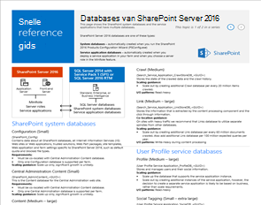
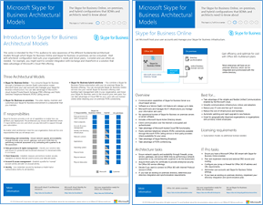
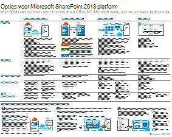
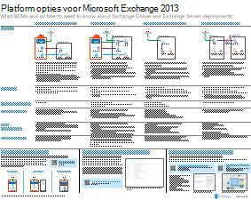
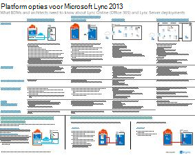
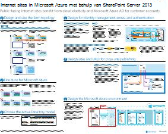
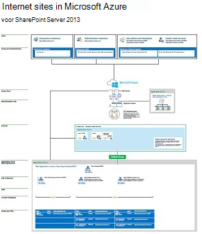

# Architectuurmodellen voor SharePoint, Exchange, Skype voor Bedrijven en LyncArchitectural models for SharePoint, Exchange, Skype for Business, and Lync

In de IT-posters in dit artikel worden de architectuurmodellen en implementatieopties voor SharePoint, Exchange, Skype voor Bedrijven en Lync beschreven.The IT posters in this article describe the architectural models and deployment options for SharePoint, Exchange, Skype for Business, and Lync. Ze bieden ook ontwerpinformatie voor het implementeren van SharePoint in Microsoft Azure.They also provide design information for deploying SharePoint in Microsoft Azure.
  
Met Microsoft 365 kunt u vertrouwde samenwerkings- en communicatieservices leveren via de cloud.By using Microsoft 365, you can provide familiar collaboration and communication services through the cloud. Op enkele uitzonderingen na blijft de gebruikerservaring hetzelfde, ongeacht of u een on-premises implementatie onderhoudt of Microsoft 365.With a few exceptions, the user experience remains the same whether you're maintaining an on-premises deployment or using Microsoft 365. 

Deze geïntegreerde gebruikerservaring compliceert de beslissing waar u elke werkbelasting moet plaatsen.This unified user experience complicates the decision of where to place each workload. Er worden ook vragen gesteld:It also raises questions:
  
- Hoe kiest u een platform voor afzonderlijke werkbelastingen?How do you choose a platform for individual workloads?
    
- Is het zinvol om een service on-premises te houden?Does it make sense to keep any service on-premises?
    
- In welk scenario is een hybride implementatie geschikt?In what scenario is a hybrid deployment appropriate?
    
- Hoe past Azure in de afbeelding?How does Azure fit into the picture?
    
- Welke configuraties van Office serverwerkbelastingen worden door Azure ondersteund?What configurations of Office server workloads does Azure support?
    
> [!TIP]
> De meeste posters in dit artikel zijn beschikbaar in meerdere talen.Most posters in this article are available in multiple languages. Beschikbare talen zijn Chinees, Engels, Frans, Duits, Italiaans, Japans, Koreaans, Portugees, Russisch en Spaans.Available languages include Chinese, English, French, German, Italian, Japanese, Korean, Portuguese, Russian, and Spanish. Als u een poster in een van deze talen wilt downloaden, selecteert u onder de miniatuurafbeelding van de poster de optie **Meer talen.**To download a poster in one of these languages, under the poster thumbnail image, select **More languages**.
  
Laat ons weten wat u denkt!Let us know what you think! Stuur ons e-mail [cloudadopt@microsoft.com.](mailto:cloudadopt@microsoft.com)Send us email at [cloudadopt@microsoft.com](mailto:cloudadopt@microsoft.com). 
  
Gebruik de volgende koppelingen om de posters te downloaden die u nodig hebt:Use the following links to get the posters you need:
  
- **Architectuurmodellen:** Gebruik deze bronnen om uw ideale platform en configuratie voor SharePoint 2016 en Skype voor Bedrijven 2015 te bepalen.**Architectural models**: Use these resources to determine your ideal platform and configuration for SharePoint 2016 and Skype for Business 2015.
    
  - [Architectuurmodellen SharePoint Microsoft 2016Microsoft SharePoint 2016 architectural models](architectural-models-for-sharepoint-exchange-skype-for-business-and-lync.md#SP2016_ArchModel)
    
  - [SharePoint Server 2016-databasesSharePoint Server 2016 databases](architectural-models-for-sharepoint-exchange-skype-for-business-and-lync.md#SP2016_Databases)
    
  - [Architectuurmodellen van Microsoft Skype voor Bedrijven 2015Microsoft Skype for Business 2015 architectural models](architectural-models-for-sharepoint-exchange-skype-for-business-and-lync.md#SfB2015_ArchModel)
    
- **Platform:** Gebruik deze bronnen om uw ideale platform en configuratie voor SharePoint 2013, Exchange 2013 en Lync 2013 te bepalen.**Platform**: Use these resources to determine your ideal platform and configuration for SharePoint 2013, Exchange 2013, and Lync 2013.
    
  - [SharePoint 2013-platformoptiesSharePoint 2013 platform options](architectural-models-for-sharepoint-exchange-skype-for-business-and-lync.md#SP2013_Options)
    
  - [Exchange 2013-platformoptiesExchange 2013 platform options](architectural-models-for-sharepoint-exchange-skype-for-business-and-lync.md#Exch2013_options)
    
  - [Opties voor lync 2013-platformLync 2013 platform options](architectural-models-for-sharepoint-exchange-skype-for-business-and-lync.md#Lync2013_Options)
    
- **SharePoint Server 2013 in Azure:** Gebruik deze IT-posters voor het ontwerpen en configureren van SharePoint Server 2013-werkbelastingen in Azure-infrastructuurservices.**SharePoint Server 2013 in Azure**: Use these IT posters to design and configure SharePoint Server 2013 workloads in Azure infrastructure services.
    
  - [Internetsites in Azure met SharePoint Server 2013Internet sites in Azure using SharePoint Server 2013](architectural-models-for-sharepoint-exchange-skype-for-business-and-lync.md#Azure_sharepoint2013)
    
  - [Ontwerpvoorbeeld: Internetsites in Azure voor SharePoint 2013Design sample: Internet sites in Azure for SharePoint 2013](architectural-models-for-sharepoint-exchange-skype-for-business-and-lync.md#DesignSampleInternetSites)
    
  - [SharePoint herstel na noodherstel naar AzureSharePoint disaster recovery to Azure](architectural-models-for-sharepoint-exchange-skype-for-business-and-lync.md#sharepoint_recovery_Azure)
    
## Posters voor architectuurmodellenArchitectural models posters

De IT-posters voor SharePoint 2016 en Skype voor Bedrijven 2015 bieden een manier om implementatiemethoden te vergelijken in een eenvoudig af te drukken indeling.The IT posters for SharePoint 2016 and Skype for Business 2015 provide a way to compare deployment methods in an easy-to-print format. In de posters worden alle configuratie- of platformopties weergegeven.The posters list all configuration or platform options. Ze bevatten de volgende informatie voor elke optie:They provide the following information for each option:
  
- **Overzicht:** Een korte samenvatting van het platform, inclusief een conceptueel diagram.**Overview**: A brief summary of the platform, including a conceptual diagram.
    
- **Het beste voor**: Veelvoorkomende scenario's die bij uitstek geschikt zijn voor het platform.**Best for**: Common scenarios that are ideally suited for the platform.
    
- **Licentievereisten:** De licenties die u nodig hebt voor implementatie.**License requirements**: The licenses you need for deployment.
    
- **Architectuurtaken:** de beslissingen die u als architect moet nemen.**Architecture tasks**: The decisions you need to make as an architect.
    
- **IT-professionele taken of verantwoordelijkheden:** de dagelijkse verantwoordelijkheden die uw IT-personeel moet plannen.**IT pro tasks or responsibilities**: The daily responsibilities that your IT staff needs to plan for.
    

### Microsoft SharePoint Server architectuurmodellen van 2016Microsoft SharePoint Server 2016 Architectural Models

|ItemItem|BeschrijvingDescription|
|---|---|
|[          ](https://www.microsoft.com/download/details.aspx?id=52650)[          ](https://www.microsoft.com/download/details.aspx?id=52650)   [PDF](https://download.microsoft.com/download/4/F/A/4FA0F94B-EE2F-41DB-A047-D9864FEF41E9/SharePoint2016ArchitecturalModels.pdf) \| [Visio](https://download.microsoft.com/download/4/F/A/4FA0F94B-EE2F-41DB-A047-D9864FEF41E9/SharePoint2016ArchitecturalModels.vsdx) \| [Meer talen](https://www.microsoft.com/download/details.aspx?id=52650)[PDF](https://download.microsoft.com/download/4/F/A/4FA0F94B-EE2F-41DB-A047-D9864FEF41E9/SharePoint2016ArchitecturalModels.pdf)  \| [Visio](https://download.microsoft.com/download/4/F/A/4FA0F94B-EE2F-41DB-A047-D9864FEF41E9/SharePoint2016ArchitecturalModels.vsdx)  \| [More languages](https://www.microsoft.com/download/details.aspx?id=52650)|Deze IT-poster beschrijft de SharePoint Online, Azure en SharePoint on-premises configuraties die zakelijke besluitvormers en oplossingen moeten kennen.This IT poster describes the SharePoint Online, Azure, and SharePoint on-premises configurations that business decision makers and solutions architects need to know about.    - **SharePoint Online (SaaS)**: Gebruik SharePoint een SaaS-abonnementsmodel (Software as a Service).- **SharePoint Online (SaaS)**: Consume SharePoint through a software as a service (SaaS) subscription model.   - **SharePoint hybride:** Verplaats uw SharePoint sites en apps in uw eigen tempo naar de cloud.- **SharePoint hybrid**: Move your SharePoint sites and apps to the cloud at your own pace.   - **SharePoint in Azure (IaaS)**: Breid uw on-premises omgeving uit naar Azure en implementeer SharePoint 2016-servers daar.- **SharePoint in Azure (IaaS)**: Extend your on-premises environment into Azure, and deploy SharePoint 2016 servers there. (Dit model wordt aanbevolen voor omgevingen met hoge beschikbaarheid of noodherstel en dev/testomgevingen.)(This model is recommended for high availability or disaster recovery environments and dev/test environments.)   - **SharePoint on-premises:** uw omgeving plannen, implementeren SharePoint, onderhouden en aanpassen in een datacenter dat u onderhoudt.- **SharePoint on-premises**: Plan, deploy, maintain, and customize your SharePoint environment in a datacenter that you maintain.|
   

### SharePoint Server 2016-databasesSharePoint Server 2016 Databases

|ItemItem|BeschrijvingDescription|
|---|---|
|   [PDF](https://download.microsoft.com/download/D/5/D/D5DC1121-8BC5-4953-834F-1B5BB03EB691/DBrefguideSPS2016_tabloid.pdf) \| [Visio](https://download.microsoft.com/download/D/5/D/D5DC1121-8BC5-4953-834F-1B5BB03EB691/DBrefguideSPS2016_tabloid.vsdx) \| [Meer talen](https://www.microsoft.com/download/details.aspx?id=55041)[PDF](https://download.microsoft.com/download/D/5/D/D5DC1121-8BC5-4953-834F-1B5BB03EB691/DBrefguideSPS2016_tabloid.pdf)  \| [Visio](https://download.microsoft.com/download/D/5/D/D5DC1121-8BC5-4953-834F-1B5BB03EB691/DBrefguideSPS2016_tabloid.vsdx)  \| [More languages](https://www.microsoft.com/download/details.aspx?id=55041)|Deze IT-poster is een beknopt overzicht van SharePoint Server 2016-databases.This IT poster is a quick reference for SharePoint Server 2016 databases. U ziet details voor elke database:You'll see details for each database:    - Grootte- Size   - Richtlijnen voor schaalvergroting- Scaling guidance   - I/O-patronen- I/O patterns   - Vereisten- Requirements     Op de eerste pagina ziet u SharePoint systeemdatabases en de servicetoepassingen met meerdere databases.The first page shows the SharePoint system databases and the service applications that have multiple databases. Op de tweede pagina ziet u alle servicetoepassingen met afzonderlijke databases.The second page shows all of the service applications that have single databases.     Zie Databasetypen en beschrijvingen [in SharePoint Server 2016 voor meer informatie.](/SharePoint/technical-reference/database-types-and-descriptions)For more information, see [Database types and descriptions in SharePoint Server 2016](/SharePoint/technical-reference/database-types-and-descriptions).|
   

### Architectuurmodellen van Microsoft Skype voor Bedrijven 2015Microsoft Skype for Business 2015 Architectural Models

|ItemItem|BeschrijvingDescription|
|---|---|
|   [PDF](https://download.microsoft.com/download/7/7/4/7741262C-A60D-41F7-863B-99BF5964FBFE/Skype%20for%20Business%20Architectural%20Models.pdf) \| [Visio](https://download.microsoft.com/download/7/7/4/7741262C-A60D-41F7-863B-99BF5964FBFE/Skype%20for%20Business%20Architectural%20Models.vsd) \| [Meer talen](https://www.microsoft.com/download/details.aspx?id=55022)[PDF](https://download.microsoft.com/download/7/7/4/7741262C-A60D-41F7-863B-99BF5964FBFE/Skype%20for%20Business%20Architectural%20Models.pdf)  \| [Visio](https://download.microsoft.com/download/7/7/4/7741262C-A60D-41F7-863B-99BF5964FBFE/Skype%20for%20Business%20Architectural%20Models.vsd)  \| [More languages](https://www.microsoft.com/download/details.aspx?id=55022)|Deze poster beschrijft Skype voor Bedrijven Online, on-premises, hybride en cloud private branch exchange (PBX).This poster describes Skype for Business Online, on-premises, hybrid, and cloud private branch exchange (PBX). Ook wordt de integratie beschreven met Exchange en SharePoint configuraties die zakelijke besluitvormers en oplossingen die architecten moeten kennen.It also describes integration with Exchange and SharePoint configurations that business decision makers and solutions architects need to know about.    De poster is bedoeld voor IT-professionals om het bewustzijn te vergroten van de fundamentele architectuurmodellen waarmee Skype voor Bedrijven Online en Skype voor Bedrijven on-premises kunnen worden gebruikt.The poster is intended for IT pros to raise awareness of the fundamental architectural models through which Skype for Business Online and Skype for Business on-premises can be consumed.   Begin met de configuratie die het beste past bij de behoeften en plannen van uw organisatie.Start with the configuration that best suits your organization's needs and plans. Overweeg en gebruik zo nodig andere configuraties.Consider and use other configurations as needed. U kunt bijvoorbeeld overwegen om te integreren met Exchange en SharePoint of een oplossing die gebruik maakt van het Microsoft Cloud PBX-aanbod.For example, you might want to consider integration with Exchange and SharePoint or a solution that takes advantage of the Microsoft cloud PBX offering.|
   
## Posters met platformoptiesPlatform options posters

De IT-posters voor SharePoint 2013, Exchange 2013 en Lync 2013 bieden een manier om de implementatiemethoden in één oogopslag te vergelijken.The IT posters for SharePoint 2013, Exchange 2013, and Lync 2013 provide a way to compare the deployment methods at a glance. Elke poster bevat alle configuraties of platformopties.Each poster lists all of the configurations or platform options. De optie bevat de volgende informatie voor elke optie:It provides the following information for each option:
  
- **Overzicht:** Een korte samenvatting van het platform, inclusief een conceptueel diagram.**Overview**: A brief summary of the platform, including a conceptual diagram.
    
- **Het beste voor**: Veelvoorkomende scenario's die bij uitstek geschikt zijn voor het platform.**Best for**: Common scenarios that are ideally suited for the platform.
    
- **Licentievereisten:** De licenties die u nodig hebt voor implementatie.**License requirements**: The licenses you need for deployment.
    
- **Architectuurtaken:** de beslissingen die u als architect moet nemen.**Architecture tasks**: The decisions you need to make as an architect.
    
- **IT-professionele taken of verantwoordelijkheden:** de dagelijkse verantwoordelijkheden die uw IT-personeel moet plannen.**IT pro tasks or responsibilities**: The daily responsibilities that your IT staff needs to plan for.
    

## SharePoint 2013 PlatformoptiesSharePoint 2013 Platform Options

|ItemItem|BeschrijvingDescription|
|---|---|
|   [PDF](https://go.microsoft.com/fwlink/p/?LinkId=324594) \| [Visio](https://go.microsoft.com/fwlink/p/?LinkId=324593) \| [Meer talen](https://www.microsoft.com/download/details.aspx?id=40332)[PDF](https://go.microsoft.com/fwlink/p/?LinkId=324594)  \| [Visio](https://go.microsoft.com/fwlink/p/?LinkId=324593)  \| [More languages](https://www.microsoft.com/download/details.aspx?id=40332)|Voor zakelijke besluitvormers en architecten worden op deze poster de platformopties voor SharePoint 2013, SharePoint in Microsoft 365, on-premises hybride met Microsoft 365-, Azure- en on-premises implementaties alleen.For business decision makers and architects, this poster shows the platform options for SharePoint 2013, SharePoint in Microsoft 365, on-premises hybrid with Microsoft 365, Azure, and on-premises-only deployments. Het bevat een overzicht van elke architectuur, aanbevelingen, licentievereisten en lijsten met taken van architect en IT-professional voor elk platform.It includes an overview of each architecture, recommendations, license requirements, and lists of architect and IT pro tasks for each platform. In de poster worden verschillende SharePoint oplossingen in Azure belicht.The poster highlights several SharePoint solutions on Azure.|
   

## Exchange 2013 PlatformoptiesExchange 2013 Platform Options

|ItemItem|BeschrijvingDescription|
|---|---|
|[          ](https://www.microsoft.com/download/details.aspx?id=42676)[          ](https://www.microsoft.com/download/details.aspx?id=42676)   [PDF](https://go.microsoft.com/fwlink/p/?LinkID=398740) \| [Visio](https://go.microsoft.com/fwlink/p/?LinkID=398742) \| [Meer talen](https://www.microsoft.com/download/details.aspx?id=42676)[PDF](https://go.microsoft.com/fwlink/p/?LinkID=398740)  \| [Visio](https://go.microsoft.com/fwlink/p/?LinkID=398742)  \| [More languages](https://www.microsoft.com/download/details.aspx?id=42676)|Voor zakelijke besluitvormers en architecten worden in deze poster de platformopties voor Exchange 2013 beschreven.For business decision makers and architects, this poster describes the platform options for Exchange 2013. Klanten kunnen kiezen uit Exchange Online met Microsoft 365, hybride Exchange, Exchange Server on-premises en gehoste Exchange.Customers can choose from Exchange Online with Microsoft 365, hybrid Exchange, Exchange Server on-premises, and hosted Exchange. In de poster wordt elke architectonische optie be detaild, inclusief de ideale scenario's voor elk, de licentievereisten en it-verantwoordelijkheden.The poster details each architectural option, including the ideal scenarios for each, the license requirements, and IT pro responsibilities.|
   

## Platformopties voor Lync 2013Lync 2013 Platform Options

|ItemItem|BeschrijvingDescription|
|---|---|
|[          ](https://www.microsoft.com/download/details.aspx?id=41677)[          ](https://www.microsoft.com/download/details.aspx?id=41677)   [PDF](https://go.microsoft.com/fwlink/p/?LinkID=391837) \| [Visio](https://go.microsoft.com/fwlink/p/?LinkID=391839) \| [Meer talen](https://www.microsoft.com/download/details.aspx?id=41677)[PDF](https://go.microsoft.com/fwlink/p/?LinkID=391837)  \| [Visio](https://go.microsoft.com/fwlink/p/?LinkID=391839)  \| [More languages](https://www.microsoft.com/download/details.aspx?id=41677)|Voor zakelijke besluitvormers en architecten worden in deze poster de platformopties voor Lync 2013 beschreven.For business decision makers and architects, this poster describes the platform options for Lync 2013. Klanten kunnen kiezen uit Lync Online met Microsoft 365, hybride Lync Server on-premises en gehoste Lync.Customers can choose from Lync Online with Microsoft 365, hybrid Lync, Lync Server on-premises, and hosted Lync. De IT-poster geeft elke architectuuroptie weer, inclusief de ideale scenario's voor elk, de licentievereisten en it-verantwoordelijkheden.The IT poster details each architectural option, including the ideal scenarios for each, the license requirements, and IT pro responsibilities.|
   

## SharePoint in Azure-oplossingenpostersSharePoint in Azure solutions posters

De IT-posters voor SharePoint in Azure tonen Azure-oplossingen die gebruikmaken van SharePoint Server 2013.The IT posters for SharePoint in Azure show Azure-based solutions that use SharePoint Server 2013.
  

### Internetsites in Microsoft Azure Met SharePoint Server 2013Internet Sites in Microsoft Azure Using SharePoint Server 2013

|ItemItem|BeschrijvingDescription|
|---|---|
|[          ](https://www.microsoft.com/download/details.aspx?id=41992)[          ](https://www.microsoft.com/download/details.aspx?id=41992)   [PDF](https://go.microsoft.com/fwlink/p/?LinkId=392552) \| [Visio](https://go.microsoft.com/fwlink/p/?LinkId=392551) \| [Meer talen](https://www.microsoft.com/download/details.aspx?id=41992)[PDF](https://go.microsoft.com/fwlink/p/?LinkId=392552)  \| [Visio](https://go.microsoft.com/fwlink/p/?LinkId=392551)  \| [More languages](https://www.microsoft.com/download/details.aspx?id=41992)|Deze poster bevat een overzicht van belangrijke ontwerpactiviteiten en aanbevolen architectuur voor internetsites in Azure.This poster outlines key design activities and recommended architecture for internet-facing sites in Azure.     Zie de volgende artikelen voor meer informatie:For more information, see the following articles:     - [Internetsites in Azure met SharePoint Server 2013](internet-sites-in-microsoft-azure-using-sharepoint-server-2013.md)- [Internet sites in Azure using SharePoint Server 2013](internet-sites-in-microsoft-azure-using-sharepoint-server-2013.md)   - [Azure-architecturen voor SharePoint 2013](microsoft-azure-architectures-for-sharepoint-2013.md)- [Azure architectures for SharePoint 2013](microsoft-azure-architectures-for-sharepoint-2013.md)|
   

### Internetsites in Azure voor SharePoint 2013Internet sites in Azure for SharePoint 2013

|ItemItem|BeschrijvingDescription|
|---|---|
|[          ](https://www.microsoft.com/download/details.aspx?id=41991)[          ](https://www.microsoft.com/download/details.aspx?id=41991)   [PDF](https://go.microsoft.com/fwlink/p/?LinkId=392549) \| [Visio](https://go.microsoft.com/fwlink/p/?LinkId=392548) \| [Meer talen](https://www.microsoft.com/download/details.aspx?id=41991)[PDF](https://go.microsoft.com/fwlink/p/?LinkId=392549)  \| [Visio](https://go.microsoft.com/fwlink/p/?LinkId=392548)  \| [More languages](https://www.microsoft.com/download/details.aspx?id=41991)|Gebruik dit ontwerpvoorbeeld als uitgangspunt voor uw eigen architectuur van een internetsite in Azure met SharePoint Server 2013.Use this design sample as a starting point for your own architecture of an internet-facing site in Azure using SharePoint Server 2013.    Zie de volgende artikelen voor meer informatie:For more information, see the following articles:     - [Internetsites in Azure met SharePoint Server 2013](internet-sites-in-microsoft-azure-using-sharepoint-server-2013.md)- [Internet sites in Azure using SharePoint Server 2013](internet-sites-in-microsoft-azure-using-sharepoint-server-2013.md)   - [Azure-architecturen voor SharePoint 2013](microsoft-azure-architectures-for-sharepoint-2013.md)- [Azure architectures for SharePoint 2013](microsoft-azure-architectures-for-sharepoint-2013.md)|
   

### SharePoint Herstel na nood Microsoft AzureSharePoint Disaster Recovery to Microsoft Azure

|ItemItem|BeschrijvingDescription|
|---|---|
|[          ](https://www.microsoft.com/download/details.aspx?id=41993)[          ](https://www.microsoft.com/download/details.aspx?id=41993)   [PDF](https://go.microsoft.com/fwlink/p/?LinkId=392555) \| [Visio](https://go.microsoft.com/fwlink/p/?LinkId=392554) \| [Meer talen](https://www.microsoft.com/download/details.aspx?id=41993)[PDF](https://go.microsoft.com/fwlink/p/?LinkId=392555)  \| [Visio](https://go.microsoft.com/fwlink/p/?LinkId=392554)  \| [More languages](https://www.microsoft.com/download/details.aspx?id=41993)|Deze IT-poster toont architectuurprincipes voor een omgeving voor noodherstel in Azure.This IT poster shows architecture principles for a disaster recovery environment in Azure.    Zie de volgende artikelen voor meer informatie:For more information, see the following articles:     - [SharePoint Herstel van server 2013-ramp in Azure](sharepoint-server-2013-disaster-recovery-in-microsoft-azure.md)- [SharePoint Server 2013 disaster recovery in Azure](sharepoint-server-2013-disaster-recovery-in-microsoft-azure.md)   - [Azure-architecturen voor SharePoint 2013](microsoft-azure-architectures-for-sharepoint-2013.md)- [Azure architectures for SharePoint 2013](microsoft-azure-architectures-for-sharepoint-2013.md)|
   
## Zie ookSee also

- [Microsoft 365-oplossings- en -architectuurcentrumMicrosoft 365 solution and architecture center](../solutions/index.yml)
  
- [Modellen voor Microsoft-cloudarchitectuurMicrosoft cloud architecture models](../solutions/cloud-architecture-models.md)
  
- [Microsoft 365 testlaboratoriumhandleidingenMicrosoft 365 test lab guides](m365-enterprise-test-lab-guides.md)
  
- [Hybride oplossingenHybrid solutions](hybrid-solutions.md)