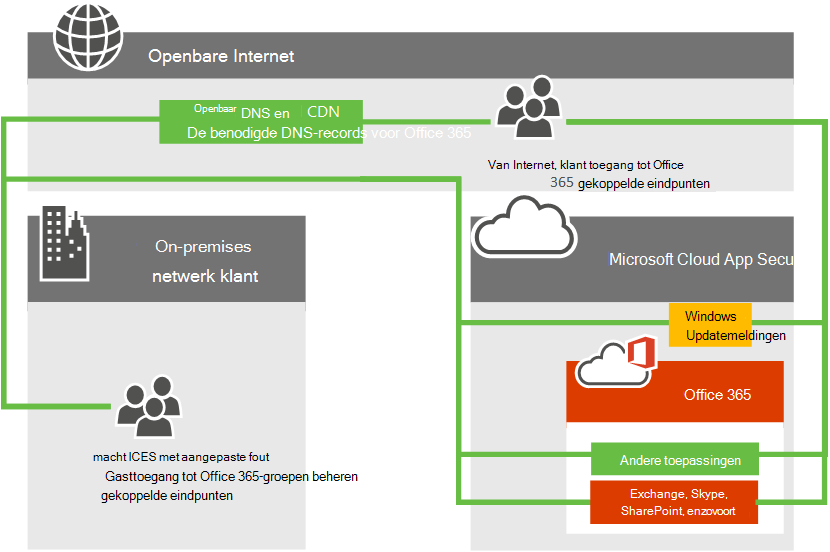
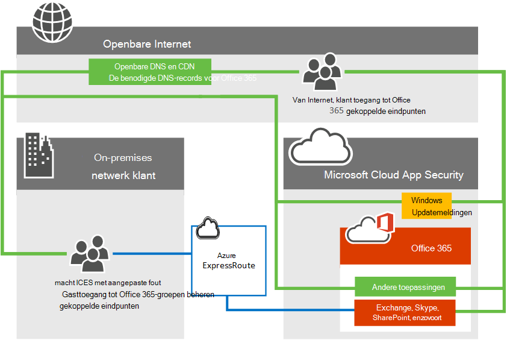

# Azure ExpressRoute voor Office 365Azure ExpressRoute for Office 365

*Dit artikel is van toepassing op Microsoft 365 Enterprise en Office 365 Enterprise.**This article applies to both Microsoft 365 Enterprise and Office 365 Enterprise.*

Lees hoe Azure ExpressRoute wordt gebruikt met Office 365 en hoe u het netwerkimplementatie project moet plannen dat moet worden uitgevoerd als u Azure ExpressRoute implementeert voor gebruik met Office 365.Learn how Azure ExpressRoute is used with Office 365 and how to plan the network implementation project that will be required if you are deploying Azure ExpressRoute for use with Office 365. Infrastructuur en platform services die worden uitgevoerd in azure, hebben vaak voordeel door de netwerkarchitectuur en de Prestatieoverwegingen te adresseren.Infrastructure and platform services running in Azure will often benefit by addressing network architecture and performance considerations. We raden ExpressRoute voor Azure in deze gevallen aan.We recommend ExpressRoute for Azure in these cases. Software als service aanbiedingen zoals Office 365 en Dynamics 365 zijn gebouwd om veilig en betrouwbaar via internet toegankelijk te zijn.Software as a Service offerings like Office 365 and Dynamics 365 have been built to be accessed securely and reliably via the Internet. U kunt meer lezen over Internet prestaties en beveiliging en wanneer u in het artikel Azure ExpressRoute voor Office 365 in het artikel de [netwerkverbinding van office 365 Opoordeelt](assessing-network-connectivity.md).You can read about Internet performance and security and when you might consider Azure ExpressRoute for Office 365 in the article [Assessing Office 365 network connectivity](assessing-network-connectivity.md).

> [!NOTE]
> Microsoft Authorization is vereist voor het gebruik van ExpressRoute voor Office 365.Microsoft authorization is required to use ExpressRoute for Office 365. Microsoft beoordeelt elke klantaanvraag en verstuurt ExpressRoute voor Office 365 gebruik wanneer de wettelijke vereisten van de klant directe verbinding vereisen.Microsoft reviews every customer request and authorizes ExpressRoute for Office 365 usage when a customer's regulatory requirement mandates direct connectivity. Als u dergelijke vereisten hebt, dient u het tekstfragment en de webkoppeling naar de verordening te geven die u vertolkt om te betekenen dat directe verbinding is vereist in het [ExpressRoute voor Office 365 aanvraagformulier](https://aka.ms/O365ERReview) om een beoordeling van Microsoft te starten.If you have such requirements, please provide the text excerpt and web link to the regulation which you interpret to mean that direct connectivity is required in the [ExpressRoute for Office 365 Request Form](https://aka.ms/O365ERReview) to begin a Microsoft review. Niet-geautoriseerde abonnementen bij het maken van routefilters voor Office 365 wordt een [foutbericht](https://support.microsoft.com/kb/3181709)weergegeven.Unauthorized subscriptions trying to create route filters for Office 365 will receive an [error message](https://support.microsoft.com/kb/3181709).

U kunt nu een directe netwerkverbinding met Office 365 toevoegen voor het geselecteerde netwerkverkeer van Office 365.You can now add a direct network connection to Office 365 for selected Office 365 network traffic. Azure ExpressRoute biedt een directe verbinding, voorspelbare prestaties en levert een uptime-SLA van 99,95% voor de Microsoft-netwerkonderdelen.Azure ExpressRoute offers a direct connection, predictable performance, and comes with an uptime SLA of 99.95% for the Microsoft networking components. U hebt nog steeds een internetverbinding nodig voor services die niet worden ondersteund via Azure ExpressRoute.You'll still require an internet connection for services that aren't supported over Azure ExpressRoute.

## Planning van Azure ExpressRoute voor Office 365Planning Azure ExpressRoute for Office 365

Naast internetverbinding kunt u ook kiezen voor het routeren van een subset van het netwerkverkeer van Office 365 via een directe verbinding die voorspelbaar en een 99,95% uptime-overeenkomst biedt voor de Microsoft-netwerkonderdelen.In addition to internet connectivity, you may choose to route a subset of their Office 365 network traffic over a direct connection that offers predictability and a 99.95% uptime SLA for the Microsoft networking components. Azure ExpressRoute biedt u de speciale netwerkverbinding met Office 365 en andere Microsoft-cloudservices.Azure ExpressRoute provides you with this dedicated network connection to Office 365 and other Microsoft cloud services.

Ongeacht of u een bestaand MPLS WAN hebt, kan ExpressRoute op drie manieren worden toegevoegd aan de netwerkarchitectuur. via een ondersteunde provider van de Cloud Exchange-Exchange, een Ethernet Point-to-Point-verbindingsprovider of via een MPLS-verbindingsprovider.Regardless of whether you have an existing MPLS WAN, ExpressRoute can be added to your network architecture in one of three ways; through a supported cloud exchange co-location provider, an Ethernet point-to-point connection provider, or through an MPLS connection provider. Kijk welke [providers beschikbaar zijn in uw regio](https://azure.microsoft.com/documentation/articles/expressroute-locations/).See what [providers are available in your region](https://azure.microsoft.com/documentation/articles/expressroute-locations/). De direct ExpressRoute-verbinding zorgt voor connectiviteit met de toepassingen die worden beschreven in [welke Office 365-Services zijn opgenomen?](azure-expressroute.md#BKMK_WhatDoIGet) hieronder.The direct ExpressRoute connection will enable connectivity to the applications outlined in [What Office 365 services are included?](azure-expressroute.md#BKMK_WhatDoIGet) below. Netwerkverkeer voor alle overige toepassingen en services gaat verder met het internet.Network traffic for all other applications and services will continue to traverse the internet.

In dit voorbeeld ziet u het volgende netwerkdiagram op hoog niveau met een typische Office 365-klant die verbinding maakt met de datacenters van Microsoft via internet voor toegang tot alle Microsoft-toepassingen, zoals Office 365, Windows Update en TechNet.Consider the following high level network diagram which shows a typical Office 365 customer connecting to Microsoft's datacenters over the internet for access to all Microsoft applications such as Office 365, Windows Update, and TechNet. Klanten gebruiken een vergelijkbaar netwerkpad, ongeacht of ze verbinding maken vanaf een on-premises netwerk of via een onafhankelijke internetverbinding.Customers use a similar network path regardless of whether they're connecting from an on-premises network or from an independent internet connection.

Bekijk nu de bijgewerkte grafiek met een klant van Office 365 die de Internet-en ExpressRoute gebruiken om verbinding te maken met Office 365.Now look at the updated diagram which depicts an Office 365 customer who uses both the internet and ExpressRoute to connect to Office 365. In sommige verbindingen, zoals openbare DNS en netwerkknooppunten voor de levering, is de openbare internetverbinding nog steeds vereist.Notice that some connections such as Public DNS and Content Delivery Network nodes still require the public internet connection. U zult ook merken dat de gebruikers van de klant die zich niet bevinden in hun verbonden gebouw van ExpressRoute, verbinding maken via internet.Also notice the customer's users who are not located in their ExpressRoute connected building are connecting over the Internet.

Wilt u nog meer weten?Still want more information? Meer informatie over het [beheren van uw netwerkverkeer met Azure ExpressRoute voor office 365](https://support.office.com/article/e1da26c6-2d39-4379-af6f-4da213218408) en informatie over het [configureren van Azure ExpressRoute voor Office 365](https://azure.microsoft.com/documentation/articles/expressroute-faqs/).Learn how to [manage your network traffic with Azure ExpressRoute for Office 365](https://support.office.com/article/e1da26c6-2d39-4379-af6f-4da213218408) and learn how to [configure Azure ExpressRoute for Office 365](https://azure.microsoft.com/documentation/articles/expressroute-faqs/). We hebben ook een 10 onderdeel [van Azure ExpressRoute voor Office 365-training](https://channel9.msdn.com/series/aer) reeks in kanaal 9 opgenomen, zodat u de concepten uitgebreider kunt uitleggen.We've also recorded a 10 part [Azure ExpressRoute for Office 365 Training](https://channel9.msdn.com/series/aer) series on Channel 9 to help explain the concepts more thoroughly.

## Welke Office 365-Services zijn opgenomen?What Office 365 services are included?

In de volgende tabel vindt u de Office 365-services die worden ondersteund via ExpressRoute.The following table lists the Office 365 services that are supported over ExpressRoute. Zie het [artikel Office 365-eindpunten](https://aka.ms/o365endpoints) voor informatie over de netwerkaanvragen voor deze toepassingen, internetconnectiviteit vereist.Please review the [Office 365 endpoints article](https://aka.ms/o365endpoints) to understand which network requests for these applications require internet connectivity.

|**Inbegrepen toepassingen****Applications included**|
|:-----|
|Exchange Online1Exchange Online1   Exchange Online Protection1Exchange Online Protection1   Delve1Delve1   |
|Skype voor bedrijven online1Skype for Business Online1   Microsoft teams 1Microsoft Teams 1   |
|SharePoint Online1SharePoint Online1   OneDrive voor bedrijven1OneDrive for Business1   Project online1Project Online1   |
|Portal en gedeelde1Portal and shared1   Azure Active Directory (Azure AD) 1Azure Active Directory (Azure AD) 1   Azure AD Connect1Azure AD Connect1   Office1Office1   |

1 voor elk van deze toepassingen gelden verbindings vereisten voor internetverbindingen die niet worden ondersteund via ExpressRoute, zie het [artikel Office 365-eindpunten](https://aka.ms/o365endpoints) voor meer informatie.1 Each of these applications have internet connectivity requirements not supported over ExpressRoute, see the [Office 365 endpoints article](https://aka.ms/o365endpoints) for more information.

De services die niet zijn opgenomen in ExpressRoute voor Office 365 zijn Microsoft 365-apps for Enterprise Client downloads, on-premises Identity provider Sign-in en de Office 365-service (beheerd door 21 ViaNet) in China.The services that aren't included with ExpressRoute for Office 365 are Microsoft 365 Apps for enterprise client downloads, On-premises Identity Provider Sign-In, and Office 365 (operated by 21 Vianet) service in China.

## ExpressRoute voor Office 365 implementerenImplementing ExpressRoute for Office 365

Voor de implementatie van ExpressRoute is de betrokkenheid van netwerk-en toepassings eigenaren vereist en moet de planning van de nieuwe [netwerk routerings architectuur](https://support.office.com/article/e1da26c6-2d39-4379-af6f-4da213218408), de bandbreedtevereisten, waar de beveiliging wordt geïmplementeerd, hoge beschikbaarheid, enzovoort.Implementing ExpressRoute requires the involvement of network and application owners and requires careful planning to determine the new [network routing architecture](https://support.office.com/article/e1da26c6-2d39-4379-af6f-4da213218408), bandwidth requirements, where security will be implemented, high availability, and so on. Als u ExpressRoute wilt implementeren, moet u het volgende doen:To implement ExpressRoute, you'll need to:

1. Volledig inzicht in de benodigde ExpressRoute voldoet aan de planning van Office 365-verbindingen.Fully understand the need ExpressRoute satisfies in your Office 365 connectivity planning. Meer informatie over de toepassingen die gebruikmaken van Internet-of ExpressRoute en de behoeften van uw netwerk, beveiliging en hoge beschikbaarheid plannen in de context van het gebruik van Internet-en ExpressRoute voor Office 365-verkeer.Understand what applications will use the internet or ExpressRoute and fully plan your network capacity, security, and high availability needs in the context of using both the internet and ExpressRoute for Office 365 traffic.

2. De ontwaarde en peering locaties voor Internet-en ExpressRoute-verkeer1bepalen.Determine the egress and peering locations for both internet and ExpressRoute traffic1.

3. De vereiste capaciteit bepalen op de Internet-en ExpressRoute-verbindingen.Determine the capacity required on the internet and ExpressRoute connections.

4. Zorg voor een plan voor de implementatie van de beveiliging en van andere standaard perimeter besturingselementen1.Have a plan in place for implementing security and other standard perimeter controls1.

5. U hebt een geldig Microsoft Azure-account om u aan te melden bij ExpressRoute.Have a valid Microsoft Azure account to subscribe to ExpressRoute.

6. Selecteer een verbindings model en een [erkend provider](https://azure.microsoft.com/documentation/articles/expressroute-locations/).Select a connectivity model and an [approved provider](https://azure.microsoft.com/documentation/articles/expressroute-locations/). Houd er rekening mee dat klanten meerdere verbindings modellen of partners kunnen selecteren en de partner niet hoeft te zijn als uw bestaande netwerkprovider.Keep in mind, customers can select multiple connectivity models or partners and the partner doesn't need to be the same as your existing network provider.

7. Implementatie valideren voordat verkeer naar ExpressRoute wordt geleid.Validate deployment prior to directing traffic to ExpressRoute.

8. [Implementeer QoS](https://support.office.com/article/ExpressRoute-and-QoS-in-Skype-for-Business-Online-20c654da-30ee-4e4f-a764-8b7d8844431d) optioneel en evalueer de regionale expansie.Optionally [implement QoS](https://support.office.com/article/ExpressRoute-and-QoS-in-Skype-for-Business-Online-20c654da-30ee-4e4f-a764-8b7d8844431d) and evaluate regional expansion.

1 belangrijke Prestatieoverwegingen.1 Important performance considerations. Dit kan drastische gevolgen hebben voor de latentie, wat essentieel is voor toepassingen zoals Skype voor bedrijven.Decisions here can dramatically impact latency which is a critical for applications such as Skype for Business.

Gebruik voor Aanvullende naslaginformatie onze [routerings gids](https://support.office.com/article/Routing-with-ExpressRoute-for-Office-365-e1da26c6-2d39-4379-af6f-4da213218408) naast de [documentatie van ExpressRoute](https://azure.microsoft.com/documentation/articles/expressroute-introduction/).For additional references, use our [routing guide](https://support.office.com/article/Routing-with-ExpressRoute-for-Office-365-e1da26c6-2d39-4379-af6f-4da213218408) in addition to the [ExpressRoute documentation](https://azure.microsoft.com/documentation/articles/expressroute-introduction/).

Voor de aankoop van ExpressRoute voor Office 365 moet u met een of meer [goedgekeurde providers](https://azure.microsoft.com/documentation/articles/expressroute-locations/) samenwerken met een ExpressRoute Premium-abonnement.To purchase ExpressRoute for Office 365, you'll need to work with one or more [approved providers](https://azure.microsoft.com/documentation/articles/expressroute-locations/) to provision the desired number and size circuits with an ExpressRoute Premium subscription. U kunt geen extra licenties kopen in Office 365.There are no additional licenses to purchase from Office 365.

Met deze korte koppeling kunt u teruggaan: [https://aka.ms/expressrouteoffice365](https://aka.ms/expressrouteoffice365)Here's a short link you can use to come back: [https://aka.ms/expressrouteoffice365](https://aka.ms/expressrouteoffice365)

Klaar om u aan te melden voor [ExpressRoute voor Office 365](https://aka.ms/ert)?Ready to sign-up for [ExpressRoute for Office 365](https://aka.ms/ert)?

## Verwante onderwerpenRelated Topics

[Een beoordeling van de netwerkverbinding van Office 365Assessing Office 365 network connectivity](assessing-network-connectivity.md)

[ExpressRoute voor Office 365-connectiviteit beherenManaging ExpressRoute for Office 365 connectivity](managing-expressroute-for-connectivity.md)

[Routeren met ExpressRoute voor Office 365Routing with ExpressRoute for Office 365](routing-with-expressroute.md)

[Netwerk planning met ExpressRoute voor Office 365Network planning with ExpressRoute for Office 365](network-planning-with-expressroute.md)

[ExpressRoute voor Office 365 implementerenImplementing ExpressRoute for Office 365](implementing-expressroute.md)

[Het gebruik van BGP-community's in ExpressRoute voor Office 365-scenario'sUsing BGP communities in ExpressRoute for Office 365 scenarios](bgp-communities-in-expressroute.md)

[Media kwaliteit en prestaties van de netwerkverbinding in Skype voor bedrijven onlineMedia Quality and Network Connectivity Performance in Skype for Business Online](https://support.office.com/article/5fe3e01b-34cf-44e0-b897-b0b2a83f0917)

[Prestaties afstemmen van Office 365 met basislijnen en prestatie geschiedenisOffice 365 performance tuning using baselines and performance history](performance-tuning-using-baselines-and-history.md)

[Prestatieproblemen met het plannen van Office 365Performance troubleshooting plan for Office 365](performance-troubleshooting-plan.md)

[URL's en IP-adresbereiken voor Office 365Office 365 URLs and IP address ranges](urls-and-ip-address-ranges.md)

[Office 365 netwerk en prestaties optimaliserenOffice 365 network and performance tuning](network-planning-and-performance.md)

## Zie ookSee also

[Overzicht van Microsoft 365 EnterpriseMicrosoft 365 Enterprise overview](microsoft-365-overview.md)
