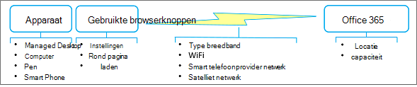

# Best practices voor het gebruik van Office 365 op een traag netwerk

Zou het niet leuk zijn als uw internetverbinding altijd snel en nooit naar beneden was? Misschien komt die dag. Maar in de tussentijd zijn er praktische dingen die u kunt doen om te werken rond een onhandig netwerk en nog steeds uw dagelijkse werk gedaan te krijgen. Hoewel Office 365 een cloudservice is, biedt office ook veel manieren om offline met uw inhoud te werken en uw wijzigingen soepel gesynchroniseerd te houden. Bovendien is het soms efficiënter om offline met inhoud te werken, alleen omdat toepassingen sneller worden uitgevoerd en de gebruikersinterface sneller reageert. Het punt is dit: Office 365 biedt u het beste van twee werelden. U kunt hier als eerste van profiteren. 
  
> [!TIP]
> Wilt u zien hoe traag (of snel) uw netwerkverbinding is? Probeer de [OOKLA Speed-test](https://www.speedtest.net/) of de [Netwerksnelheidstest-app.](https://www.windowsphone.com/store/app/network-speed-test/9b9ae06b-2961-41ef-987d-b09567cffe70) 

## Waarom is mijn netwerk zo traag?

Hoewel u zelf geen controle hebt over de netwerkprestaties, helpt het om te begrijpen wat er achter de schermen gebeurt. Internet is enorm complex, maar er zijn een paar concepten die u kunnen helpen de situatie veel beter te begrijpen. Als u de best practices in dit artikel volgt, kunt u prestatieproblemen oplossen en frustraties verminderen.
  
**Belangrijke factoren die van invloed zijn op de netwerkprestaties**

  
 **Bandbreedte en latentie** De twee belangrijkste meetresultaten van het netwerk zijn bandbreedte en latentie: 
  
- Bandbreedte is de doorvoersnelheid die wordt gemeten in bits per seconde. Groter is beter. Bandbreedte is als een waterleiding. Hoe groter de pijp, hoe meer water u er doorheen kunt 'zetten'.

- Latentie is de tijd die nodig is om inhoud van een server of service naar uw apparaat te halen en wordt gemeten in milliseconden. Sneller is beter. Latentie kan worden veroorzaakt door een aantal factoren, zoals lage bandbreedte, een beperkte verbinding of overdrachtstijd.

 **Veelvoorkomende problemen** Naast bandbreedte en latentie zijn andere problemen van invloed op de netwerkprestaties en zijn ze vaak onvoorspelbaar. Netwerkprestaties kunnen variëren op basis van het tijdstip van de dag of uw fysieke locatie. Het netwerk kan worden vastgepiekt wanneer bepaalde gebeurtenissen plaatsvinden die het gebruik van internet, zoals een natuurramp of een grote openbare gebeurtenis, een piek geven. De grootte en complexiteit van de pagina die wordt geladen en het aantal en de grootte van de bestanden die worden overgebracht, hebben direct invloed op de prestaties. Een WiFi-verbinding kan tijdelijk worden afgebroken: u peilt bijvoorbeeld een grote vergadering van duizenden door iedereen te vragen tegelijkertijd te tweeten. 
  
 **Aandachtspunten voor een satellietnetwerk** Een satellietnetwerk is handig als een terrestrisch netwerk niet haalbaar is, zoals het achterland, een kruisschip of een extern wetenschappelijk gebied. Deze netwerken zijn afhankelijk van satellietbeelden die zich in een geosynchrone baan bevinden, 22.000 kilometer boven de evenaar. Een transmissie reist echter ongeveer 90.000 mijl en een satellietnetwerk heeft dus een tragere latentie (500 ms of meer) dan een terrestrisch netwerk (20 tot 50 ms). Onder de beste omstandigheden ziet u deze latentie mogelijk niet, maar voor het downloaden van grote bestanden, het streamen van video's en het spelen van games zult u dat waarschijnlijk wel doen. Een ander probleem is 'regen vervagen' waarbij zware weersomstandigheden, zoals onweersbuien en sneeuwstormen, de satelliettransmissie tijdelijk kunnen onderbreken.
  
## Weet u zeker dat dit het netwerk is?

Wanneer u prestatieproblemen hebt, moet u er eerst voor zorgen dat uw apparaat niet de hoofdoorzaak van het probleem is. Er zijn twee dingen die u kunt doen die een grote verbetering kunnen maken:
  
- Zorg ervoor dat uw apparaat goed werkt en dat er geen malware op uw computer is.

- Koop indien mogelijk meer geheugen. Het toevoegen van geheugen is de eenvoudigste en vaak meest effectieve manier om de prestaties op uw apparaat te verbeteren. Het is vooral handig bij het werken met grote bestanden en video's.

Zie Windows Performance and [ maintenance and ](https://windows.microsoft.com/windows/performance-maintenance-help#performance-maintenance-help) Tips to improve PC performance in [Windows 10](https://support.microsoft.com/en-za/help/4002019/windows-10-improve-pc-performance)voor meer informatie.

## Best practices voor het gebruik van uw browser

Uw browser is uw gateway naar Office 365, dus deze kan van invloed zijn op de prestaties, met name met de tijd die nodig is om een pagina te laden en hoe vaak u naar de Office 365-service gaat.
  
 **Browsers in het algemeen**
  
Hier zijn enkele suggesties voor browsers in het algemeen:
  
- Schakel browser-invoegtoepassingen uit die van invloed kunnen zijn op de prestaties of die u niet echt nodig hebt.

- Vergroot de cachegrootte voor uw tijdelijke internetbestanden.

- Nadat u zich hebt aangemeld bij uw werk- of schoolaccount, houdt u het browservenster de hele dag geopend. U kunt andere tabbladen en vensters openen zonder u opnieuw aan te melden. Als u zich wilt aanmelden bij een ander account, gebruikt u Privé browsen. 

- Wanneer elke pagina is gedownload en geopend, houdt u deze geopend met behulp van tabbladen. U kunt eenvoudig navigeren tussen tabbladen en de pagina later op de dag gebruiken. Vernieuw een pagina alleen als u de meest recente gegevens op die pagina nodig hebt.

- Als het te lang duurt om een pagina te openen, stopt u het downloaden van de pagina (druk op Esc) en vernieuwt u de pagina (druk op F5). 

-  Verminder indien mogelijk retouren naar Office 365. In plaats van door lijsten of bibliotheken te pappen, kunt u bijvoorbeeld zoeken gebruiken om bestanden in een grote bibliotheek te zoeken en te filteren in een lijst om rechtstreeks bij de gezochte resultaten te komen. U kunt ook weergaven maken die de laadtijd van pagina's minimaliseren. Zie Grote lijsten en bibliotheken beheren [in Office 365](https://support.office.com/article/b4038448-ec0e-49b7-b853-679d3d8fb784#BKMK_PAGES)voor meer informatie.

- Als de videoprestaties slecht zijn, kunt u de video mogelijk downloaden en bekijken op uw apparaat. Er is mogelijk een downloadkoppeling beschikbaar of u kunt met de rechtermuisknop op de videokoppeling klikken en **Doel opslaan als selecteren.**

 **Browserspecifieke**
  
Hier zijn enkele suggesties voor uw specifieke browser:
  
- **Internet Explorer** Upgrade naar Internet Explorer versie 11 of hoger voor aanzienlijke prestatieverbeteringen ten opzichte van eerdere versies. Zie Probleemoplossingshandleiding [voor Internet Explorer voor meer informatie.](https://support.microsoft.com/help/2437121/troubleshooting-guide-for-internet-explorer-when-you-access-office-365)

- **FireFox** Zie Firefox werkt traag of werkt niet meer voor [meer informatie.](https://support.mozilla.org/products/firefox/fix-problems/slowness-or-hanging)

- **Safari** Zie [Apple - Safari voor meer informatie.](https://www.apple.com/safari/)

- **Chrome** Zie Chrome Help voor [meer informatie.](https://support.google.com/chrome/?hl=en)
  
## Best practices voor het gebruik van Outlook en Outlook Web App

Het lezen, schrijven en organiseren van e-mail is een belangrijk onderdeel van de dag van iedereen. Zowel Outlook als Outlook Web App (OWA) bieden offlineondersteuning. Het gebruik van een e-mail-app op uw smartphone is een ander nuttig alternatief. Gebruik de volgende opties die het beste aansluiten bij uw behoeften:
  
- Upgrade naar de nieuwste versie van Outlook voor aanzienlijke prestatieverbeteringen ten opzichte van eerdere versies. 

-  Met Outlook Web App kunt u offlineberichten, contactpersonen en agendagebeurtenissen maken die worden geüpload wanneer OWA vervolgens verbinding kan maken met Office 365. Zie Outlook Web App offline gebruiken voor meer informatie over het instellen en gebruiken van OWA in de [offlinemodus.](https://support.office.com/article/3214839c-0604-4162-8a97-6856b4c27b36)

- Met Outlook kunt u werken in de modus met cache, waarin waar mogelijk automatisch verbinding wordt gemaakt. U kunt outlook uw hele postvak laten downloaden, of slechts een deel ervan. Zie Exchange-modus met [cache](https://support.office.com/article/7885af08-9a60-4ec3-850a-e221c1ed0c1c) inschakelen en [offline werken in Outlook voor meer informatie.](https://support.office.com/article/f3a1251c-6dd5-4208-aef9-7c8c9522d633)

- Outlook biedt ook een offlinemodus. Als u dit wilt gebruiken, moet u eerst de modus met cache instellen, zodat gegevens van uw account naar uw computer worden gekopieerd. In de offlinemodus probeert Outlook verbinding te maken met de instellingen voor verzenden en ontvangen, of wanneer u deze handmatig online laat werken. Zie Offline werken [om](https://support.office.com/article/827fe51f-5609-4062-82b4-3578057f9282)kosten voor gegevensverbinding te voorkomen, Instellingen voor verzenden en ontvangen wijzigen wanneer u [offline](https://support.office.com/article/f681ec10-cb14-40cb-8709-1909a13c304a)werkt en Overschakelen van offline naar online voor meer [informatie.](https://support.office.com/article/2460e4a8-16c7-47fc-b204-b1549275aac9)

- Als u een smartphone hebt, kunt u deze gebruiken om uw e-mail en agenda over het netwerk van uw telefoonprovider te sturen.

> [!NOTE]
> Hier zijn enkele richtlijnen voor het gebruik van Outlook of OWA. Als schijfruimte geen probleem is op uw apparaat, beschikt Outlook over een volledige set functies en werkt deze mogelijk het beste voor u. Als schijfruimte een probleem is op uw apparaat, kunt u OWA gebruiken dat een subset met functies heeft, maar ook het beste werkt in een onlinesituatie. Natuurlijk kunt u deze gebruiken omdat ze goed samenwerken.
  
## Best practices voor het gebruik van OneDrive voor Bedrijven

OneDrive voor Bedrijven is ontworpen om online en offline met uw bestanden te werken. Wanneer u deze hebt ingesteld, vindt synchronisatie van wijzigingen automatisch en betrouwbaar plaats, waar en wanneer u ze maakt. Als het netwerk traag is, kunt u met de offlineversie van de bestanden werken.
  
De synchronisatie-app voor OneDrive voor Bedrijven wordt geleverd met een SharePoint Online- en Office 365 Business-abonnement, of u kunt de synchronisatie-app voor OneDrive voor Bedrijven gratis downloaden.  Deze app is ook sneller dan met de **opdrachten Openen in Explorer** of **Uploaden.** Zie Uw computer instellen voor het synchroniseren van uw [OneDrive voor Bedrijven-bestanden in Office 365](https://support.office.com/article/23e1f12b-d896-4cb1-a238-f91d19827a16)voor meer informatie.
  
Hier zijn enkele aanvullende richtlijnen voor het gebruik van de synchronisatie-app voor OneDrive voor Bedrijven:
  
- Als u een grote bibliotheek voor de eerste keer synchroniseert, start u de synchronisatie tijdens de uit-uren, bijvoorbeeld 's nachts.

- U kunt de functie Synchronisatie van een bibliotheek stoppen met de [oneDrive voor Bedrijven-app](https://support.office.com/article/a7e41f1f-3a98-4ca7-9443-f10250688330) gebruiken om de synchronisatie van updates tijdelijk te stoppen. Gebruik deze functie echter voor korte perioden, zoals een paar uur tegelijk, om te voorkomen dat er grote hoeveelheden updates in de wachtrij staan en om het risico op samenvoegconflicten te minimaliseren als meerdere personen aan hetzelfde document werken.
  
## Best practices voor het gebruik van OneNote

Elke SharePoint-teamsite heeft een ingebouwd OneNote-notitieblok en u kunt eenvoudig uw eigen notitieblok maken. OneNote is een uitstekende manier om tijdige informatie te verzamelen die u elke dag nodig hebt om taken uit te voeren. Veel teams gebruiken OneNote bijvoorbeeld als verzamelpunt voor wekelijkse vergaderingen, projectnotities, ideeën, plannen en statusrapporten. U kunt deze ongelijksoortige informatie netjes ordenen met behulp van pagina's, secties en tabbladen.
  
Het mooie van OneNote is dat u toegang hebt tot de inhoud vanaf vrijwel elk apparaat, of u nu een desktopcomputer, laptop, tablet of smartphone gebruikt. En u hoeft zich geen zorgen te maken over het opslaan of synchroniseren, omdat OneNote dit voor u doet.
  
Zie Microsoft OneNote voor [meer informatie.](https://office.microsoft.com/onenote)

## Best practices voor het gebruik van Skype voor Bedrijven en Lync Online

Hieronder volgen algemene richtlijnen voor het gebruik van Skype voor Bedrijven of Lync Online wanneer uw netwerk traag is:

- Gebruik chatberichten wanneer u maar kunt, omdat dit goed werkt op een traag netwerk.

- Vermijd telefoongesprekken via een VPN-verbinding (Virtual Private Network) of RAS-verbindingen (Remote Access Service).

- Zorg ervoor dat uw audioapparaat is goedgekeurd. Zie Telefoons en apparaten die zijn gekwalificeerd [voor Microsoft Lync voor meer informatie.](/skypeforbusiness/lync-cert/ip-phones)

- Wanneer u PowerPoint gebruikt in een onlinepresentatie, verkleint u de grootte en complexiteit van de dia's. Zie Tips voor het verbeteren van [de prestaties van uw presentatie voor meer informatie.](https://support.office.com/article/34c82835-5f23-4bf0-98cc-72235bbd2949)

- Videoprestaties zijn erg afhankelijk van de netwerkprestaties. Vermijd het gebruik van video als uw netwerk traag is.

Zie Slechte audio- of [videokwaliteit in Lync Online](https://support.microsoft.com/kb/2386655)of hoe u verbindingsproblemen in Skype voor Bedrijven kunt oplossen voor [meer informatie.](https://support.office.com/article/troubleshoot-connection-issues-in-skype-for-business-ca302828-783f-425c-bbe2-356348583771)
  
## Best practices voor het gebruik van SharePoint-lijsten

Als u offline met lijstgegevens werkt om gegevens te 'scrubn', te analyseren of te rapporteren, kunt u de impact van een traag netwerk minimaliseren. U kunt de meeste lijsten lezen en schrijven vanuit Microsoft Access 2019 en Microsoft Access 2016 door er een koppeling naar te maken. U kunt ook een lijst exporteren naar een Excel-tabel, waarmee een eenweggegevensverbinding wordt gemaakt tussen de Excel-tabel en de lijst. Lees hoe u [offline kunt werken met tabellen die zijn gekoppeld aan SharePoint-lijsten.](https://support.office.com/article/work-offline-with-tables-that-are-linked-to-sharepoint-lists-5d66594a-6176-4a25-a198-320f13ccf41e)
  
Zie de sectie 'Meer informatie over het beheren van grote lijsten' in Grote lijsten en [bibliotheken beheren in Office 365](https://support.office.com/article/b4038448-ec0e-49b7-b853-679d3d8fb784)voor meer informatie.
  
## Best practices voor het aanpassen van webpagina's

Wanneer u een webpagina aan te passen, kunt u per ongeluk slechte prestaties met de pagina veroorzaken. Een aantal factoren kan van invloed zijn, zoals de complexiteit en grootte van de pagina, het aantal webonderdelen dat wordt toegevoegd, het aantal lijst- of bibliotheekitems dat in eerste instantie wordt weergegeven en de manier waarop u de pagina codeert.
  
Zie Prestaties van [SharePoint Online afstemmen voor meer informatie.](tune-sharepoint-online-performance.md)
  
## Best practices voor het gebruik van Project Online

Met de volgende richtlijnen kunt u de netwerkprestaties verbeteren.
  
- Project Online en SharePoint Online vereisen synchronisatie, wat veel tijd kan kosten. Als uw projectteams een lage omzet hebben, schakelt u Project Site-synchronisatie uit om de prestaties van Project Publiceren en Projectdetailpagina's te verbeteren. Beperk Active Directory-synchronisatie tot groepen resources die het systeem daadwerkelijk moeten gebruiken en controleer eventuele machtigingsproblemen na de synchronisatie van grote groepen.

- Als uw organisatie projectsites gebruikt, maakt u deze op aanvraag in plaats van automatisch. Dit versnelt de eerste publicatieervaring en voorkomt het maken van overbodige sites en inhoud.

- ProjectDetailpagina's (PDP) kunnen een herberekening van het hele project activeren en werkstroomacties starten, die beide prestatie-intensieve bewerkingen kunnen zijn. Als u wilt voorkomen dat twee bijwerkprocessen tegelijk worden triggeren op hetzelfde PDP, moet u voorkomen dat de agendavelden (Begindatum, Einddatum, Statusdatum en Huidige datum) en de niet-geplande velden (projectnaam, beschrijving en eigenaar) worden bijgewerkt.

- Verminder het aantal webonderdelen en aangepaste velden dat op elke PDP wordt weergegeven. Maak een speciale PDP met de enige velden die moeten worden bijgewerkt om de belasting te verbeteren en tijd te besparen.

- Wanneer u OData gebruikt voor rapportage, beperkt u de hoeveelheid gegevens die u tijdens runtime query's uitvoert met behulp van filteren op de server.

Zie Project [Online-prestaties afstemmen](https://support.office.com/article/12ba0ebd-c616-42e5-b9b6-cad570e8409c)voor meer informatie.
  
## Wat is de beste manier om problemen te melden?

Microsoft verbetert voortdurend de algehele prestaties van Office 365 door het netwerk te bewaken, bandbreedte en latentie te meten, de laadtijd van pagina's te verbeteren, schijf-I/O te verminderen, pagina's opnieuw te ontwerpen voor minimale downloadstrategie, hardware toe te voegen aan datacenters en meer datacenters toe te voegen. Zie Office [365-servicestatus](view-service-health.md)controleren voor meer informatie over het controleren van uw huidige status en rapportageproblemen.
  
## Zie ook

[Network planning and performance tuning for Office 365](network-planning-and-performance.md)
  
[Beginselen voor Office 365-netwerkverbinding](microsoft-365-network-connectivity-principles.md)
  
[Office 365-eindpunten beheren](https://support.office.com/article/99cab9d4-ef59-4207-9f2b-3728eb46bf9a)
  
[Veelgestelde vragen over Office 365-eindpunten](https://support.office.com/article/d4088321-1c89-4b96-9c99-54c75cae2e6d)
